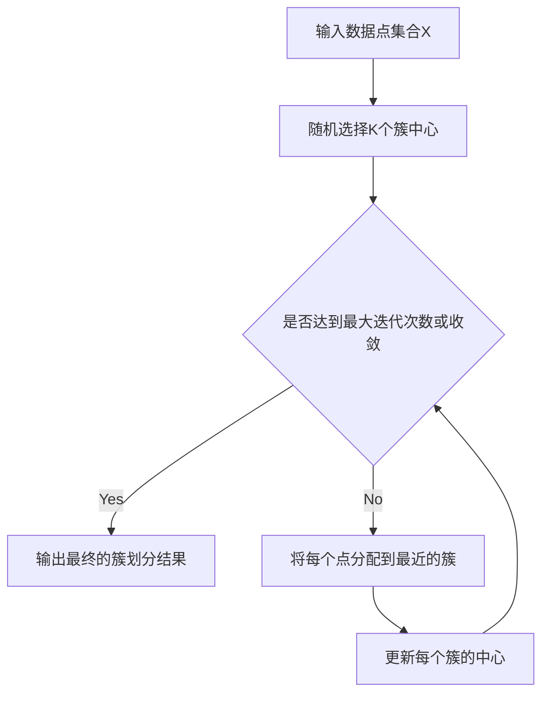

# 无监督学习 (Unsupervised Learning) 原理与代码实例讲解

## 1.背景介绍
### 1.1 什么是无监督学习
无监督学习是机器学习的一个重要分支,它不同于有监督学习,不需要人工标注的训练数据,而是通过对未标记数据的学习来发现数据本身的内在结构和规律。无监督学习的目标是在没有标签或最少人工干预的情况下,学习数据的有用表示。
### 1.2 无监督学习的应用场景
无监督学习在很多领域都有广泛应用,例如:
- 客户细分:根据客户的购买行为、人口统计学特征等将客户分成不同的群组
- 异常检测:检测数据中的异常点或离群点,用于欺诈检测、设备故障诊断等
- 降维与可视化:将高维数据映射到低维空间以便于可视化和分析
- 推荐系统:通过挖掘用户行为模式给出个性化推荐
- 语义分析:从大量文本数据中提取主题、情感等语义信息

### 1.3 无监督学习的挑战
尽管无监督学习具有广阔的应用前景,但它也面临着一些挑战:
- 缺乏明确的学习目标,难以评估模型性能
- 对数据质量和数据预处理要求较高
- 计算复杂度高,训练时间长
- 结果的可解释性不强

## 2.核心概念与联系
### 2.1 聚类 (Clustering)
聚类是无监督学习最常见的任务之一。它将相似的数据点归为一组,不同组的数据点之间差异较大。常见的聚类算法包括:
- K-means
- 层次聚类
- DBSCAN
- GMM

### 2.2 降维 (Dimensionality Reduction) 
降维旨在减少数据的特征数量,同时保留数据的主要特征。常用的降维方法有:
- PCA
- t-SNE
- AutoEncoder

### 2.3 矩阵分解 (Matrix Factorization)
矩阵分解将大型矩阵分解为若干个小矩阵的乘积,在推荐系统、话题模型等领域应用广泛。代表性的算法包括:
- NMF (非负矩阵分解)
- SVD (奇异值分解)

### 2.4 生成式模型 (Generative Models)
生成式模型学习数据的分布,并能够生成与训练数据类似的新样本。常见的生成式模型有:
- GAN (生成对抗网络)
- VAE (变分自编码器)

## 3.核心算法原理具体操作步骤
接下来以K-means聚类算法为例,详细讲解其原理和实现步骤。

### 3.1 K-means聚类算法原理
K-means通过迭代优化的方式将数据点划分为K个簇。其目标是最小化每个点到其所属簇中心的距离平方和,公式如下:

$$J = \sum_{i=1}^{K} \sum_{x \in C_i} ||x - \mu_i||^2$$

其中$\mu_i$是第$i$个簇的中心,$C_i$是属于第$i$个簇的所有数据点。

### 3.2 K-means聚类算法步骤
1. 随机选择K个点作为初始的簇中心
2. 重复下面步骤直到收敛:
   a. 对每个点,计算它到各个簇中心的距离,并将其分配到距离最近的簇
   b. 对每个簇,重新计算簇中心(即属于该簇的所有点的均值)
3. 输出最终的簇划分结果

### 3.3 K-means聚类算法的Mermaid流程图


## 4.数学模型和公式详细讲解举例说明
### 4.1 目标函数
K-means的目标是最小化所有点到其所属簇中心的距离平方和:

$$J = \sum_{i=1}^{K} \sum_{x \in C_i} ||x - \mu_i||^2$$

其中$\mu_i = \frac{1}{|C_i|} \sum_{x \in C_i} x$是第$i$个簇的中心。

### 4.2 优化过程
K-means通过交替进行两个步骤来优化上述目标函数:
1. 固定簇中心$\mu_i$,优化簇划分$C_i$:
   
   $$C_i = \{x_p : ||x_p - \mu_i||^2 \leq ||x_p - \mu_j||^2, \forall j \neq i\}$$
   
   即每个点被分配到距离最近的簇。
   
2. 固定簇划分$C_i$,优化簇中心$\mu_i$:

   $$\mu_i = \frac{1}{|C_i|} \sum_{x \in C_i} x$$
   
   即每个簇的中心更新为簇内所有点的均值。
   
通过不断迭代上述两个步骤,K-means最终将收敛到一个局部最优解。

### 4.3 举例说明
假设我们有一个二维数据集如下:

```
X = [[1, 2], [1.5, 1.8], [5, 8], [8, 8], [1, 0.6], [9, 11]]
```

令$K=2$,随机初始化两个簇中心:

```
mu = [[1.0, 1.5], [7.0, 9.0]]
```

在第一次迭代中,每个点被分配到最近的簇:

```
C1 = [[1, 2], [1.5, 1.8], [1, 0.6]]
C2 = [[5, 8], [8, 8], [9, 11]]
```

然后更新簇中心:

```
mu1 = [1.17, 1.47]
mu2 = [7.33, 9.0]
```

重复上述过程直到簇划分不再改变。最终我们得到两个簇,一个对应左下角的点,一个对应右上角的点。

## 5.项目实践：代码实例和详细解释说明
下面用Python实现K-means聚类算法:

```python
import numpy as np

class KMeans:
    def __init__(self, n_clusters=2, max_iter=300):
        self.n_clusters = n_clusters
        self.max_iter = max_iter
        self.centroids = None
        
    def fit(self, X):
        # 随机选择初始簇中心
        idx = np.random.choice(X.shape[0], self.n_clusters, replace=False)
        self.centroids = X[idx]
        
        for _ in range(self.max_iter):
            # 将每个点分配到最近的簇
            labels = self._assign_labels(X)
            
            # 更新簇中心
            old_centroids = self.centroids
            self.centroids = self._update_centroids(X, labels)
            
            # 如果簇中心不再改变,则停止迭代
            if np.all(old_centroids == self.centroids):
                break
        
        return self
        
    def _assign_labels(self, X):
        # 计算每个点到簇中心的距离
        distances = self._calc_distances(X)
        
        # 将每个点分配到距离最近的簇
        return np.argmin(distances, axis=1) 
    
    def _calc_distances(self, X):
        # 计算每个点到簇中心的欧氏距离
        return np.sqrt(((X[:, np.newaxis] - self.centroids) ** 2).sum(axis=2))
    
    def _update_centroids(self, X, labels):
        # 更新每个簇的中心为簇内所有点的均值
        return np.array([X[labels == i].mean(axis=0) for i in range(self.n_clusters)])
    
    def predict(self, X):
        # 预测新数据点的簇标签
        distances = self._calc_distances(X)
        return np.argmin(distances, axis=1)
```

上述代码实现了K-means聚类的主要步骤:
1. 通过`fit`方法对训练数据进行聚类,其中:
   - `_assign_labels`将每个点分配到最近的簇
   - `_update_centroids`更新每个簇的中心
   - 迭代执行上述两个步骤直到收敛或达到最大迭代次数
2. 通过`predict`方法对新数据点进行簇标签预测

使用该算法对示例数据进行聚类:

```python
X = np.array([[1, 2], [1.5, 1.8], [5, 8], [8, 8], [1, 0.6], [9, 11]])

kmeans = KMeans(n_clusters=2)
kmeans.fit(X)

print(kmeans.centroids)
# [[1.17 1.47]
#  [7.33 9.  ]]

print(kmeans.predict([[0, 0], [12, 3]]))  
# [0 1]
```

可以看到,K-means正确地将数据划分为两个簇,并能够对新数据点进行预测。

## 6.实际应用场景
无监督学习在工业界有非常广泛的应用,下面列举几个典型场景:

### 6.1 客户细分
电商平台通过对用户的购买记录、浏览历史等行为数据进行聚类分析,将用户划分为不同的群组,如"潮妈群体"、"学生党"、"白领精英"等,从而实现精准营销。

### 6.2 故障检测
制造业可以使用异常检测算法及时发现设备故障。通过对设备传感器数据进行建模,一旦发现数据偏离正常工作状态,就可以预警潜在的故障。

### 6.3 话题挖掘
通过主题模型(如LDA)可以从海量文本数据中自动提取话题。例如通过对新闻网站的文章进行话题分析,可以发现当下热点事件;对社交媒体的评论进行情感分析,可以洞察用户情绪。

### 6.4 药物发现
制药公司利用聚类等无监督学习方法对海量分子进行筛选,发现新的药物作用靶点和先导化合物,加速新药研发进程。

## 7.工具和资源推荐
### 7.1 数据集
- [UCI机器学习库](http://archive.ics.uci.edu/ml/index.php):包含大量用于聚类、异常检测等任务的标准数据集
- [Kaggle](https://www.kaggle.com/datasets):数据科学竞赛平台,有很多高质量的真实数据集
- [OpenML](https://www.openml.org/):一个用于机器学习的协作平台,有数以千计的数据集

### 7.2 开源库
- [Scikit-learn](https://scikit-learn.org/):功能全面的Python机器学习库,包含了大部分主流的无监督学习算法
- [TensorFlow](https://www.tensorflow.org/)和[PyTorch](https://pytorch.org/):两个流行的深度学习框架,提供了强大的无监督特征学习模型
- [Spark MLlib](http://spark.apache.org/mllib/):基于Spark的分布式机器学习库,支持可扩展的聚类、降维等算法

### 7.3 教程与课程
- [Andrew Ng的机器学习课程](https://www.coursera.org/learn/machine-learning):经典的机器学习入门课,有无监督学习章节
- [CS294-158 深度无监督学习](https://sites.google.com/view/berkeley-cs294-158-sp20/home):伯克利大学关于无监督深度学习的课程
- [Scikit-learn官方用户指南](https://scikit-learn.org/stable/user_guide.html):Scikit-learn文档,包含大量无监督学习算法的示例与讲解

## 8.总结：未来发展趋势与挑战
无监督学习作为一个研究热点,近年来取得了长足的进步。展望未来,其发展趋势和面临的挑战主要有:

### 8.1 更大规模的数据与模型
随着数据量的爆炸式增长,传统的无监督学习算法在计算效率上遇到瓶颈。因此,亟需研发能够处理海量数据的分布式、在线学习算法。同时,更深更复杂的生成模型(如GAN、VAE等)将得到更广泛的应用。

### 8.2 终身学习与迁移学习
现有的无监督学习方法多数是一次性的,缺乏持续学习的能力。未来需要探索如何在模型不断学习新知识的同时,保持对旧知识的记忆,实现稳定的增量学习。此外,迁移学习有望提高无监督学习的样本效率