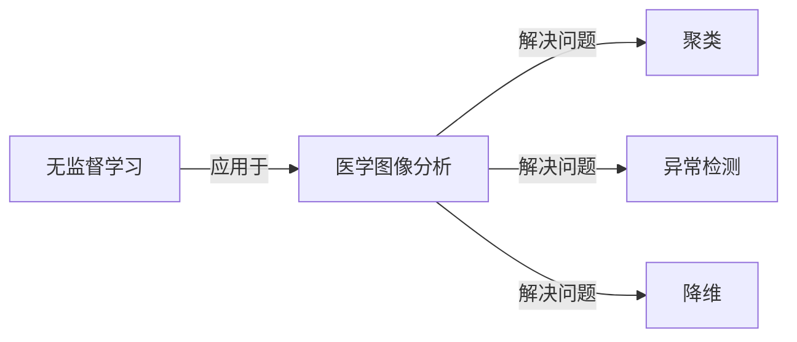

## 1.背景介绍

在过去的十年中，人工智能和机器学习已经在许多领域取得了显著的进步。特别是在医学图像分析领域，无监督学习已经成为一种重要的技术，帮助我们理解和解释复杂的医学图像数据。本文将详细介绍无监督学习在医学图像分析中的应用，并分享一些实际的案例。

## 2.核心概念与联系

无监督学习是一种机器学习方法，它能够在没有标签的数据中找到隐藏的模式和结构。在医学图像分析中，无监督学习可以用于解决如聚类、异常检测、降维等问题。



## 3.核心算法原理具体操作步骤

无监督学习的核心算法包括K-means聚类、主成分分析（PCA）等。在医学图像分析中，这些算法可以用于图像分割、特征提取等任务。

### 3.1 K-means聚类

K-means是一种基于距离的聚类算法，它的目标是将数据点分配到K个聚类中，使得每个数据点到其所在聚类的质心的距离之和最小。

### 3.2 主成分分析（PCA）

PCA是一种降维技术，它的目标是找到数据的主要特征，并将数据投影到这些特征上，以减少数据的维数。

## 4.数学模型和公式详细讲解举例说明

### 4.1 K-means聚类

K-means聚类的目标函数可以用以下公式表示：

$$
J = \sum_{i=1}^{n}\sum_{j=1}^{k}w_{ij}||x_i - \mu_j||^2
$$

其中，$x_i$是数据点，$\mu_j$是第j个聚类的质心，$w_{ij}$是一个二进制指示器，如果数据点$x_i$属于聚类$j$，则$w_{ij}=1$，否则$w_{ij}=0$。

### 4.2 主成分分析（PCA）

PCA的目标是找到一个线性变换$W$，使得变换后的数据的方差最大。这可以通过求解以下优化问题来实现：

$$
\max_W \; Tr(W^T X^T X W) \quad s.t. \quad W^T W = I
$$

其中，$X$是数据矩阵，$Tr$表示矩阵的迹（即对角线元素的和），$I$是单位矩阵。

## 5.项目实践：代码实例和详细解释说明

以下是一个使用K-means聚类进行医学图像分割的Python代码示例：

```python
from sklearn.cluster import KMeans
from skimage.io import imread

# 读取医学图像
image = imread('medical_image.png')

# 将图像数据转换为二维数组
data = image.reshape((-1, 1))

# 使用K-means聚类进行图像分割
kmeans = KMeans(n_clusters=3, random_state=0).fit(data)

# 将聚类结果转换回原始图像的形状
segmented_image = kmeans.labels_.reshape(image.shape)
```

在这个示例中，我们首先读取医学图像，然后将图像数据转换为二维数组，以便我们可以使用K-means聚类。然后，我们使用K-means聚类对数据进行聚类，最后，我们将聚类结果转换回原始图像的形状，得到分割后的图像。

## 6.实际应用场景

无监督学习在医学图像分析中有许多实际应用，例如：

- **图像分割**：无监督学习可以用于将医学图像分割成不同的区域，这对于识别和定位病变区域非常有用。
- **异常检测**：无监督学习可以用于检测医学图像中的异常，这对于早期发现疾病非常重要。
- **特征提取**：无监督学习可以用于从医学图像中提取有用的特征，这对于疾病诊断和预测非常有帮助。

## 7.工具和资源推荐

以下是一些在进行医学图像分析时可能会用到的工具和资源：

- **Scikit-learn**：这是一个强大的Python机器学习库，提供了许多无监督学习算法的实现，如K-means聚类、PCA等。
- **SimpleITK**：这是一个用于处理医学图像的库，提供了许多图像处理和分析的功能。
- **Radiopaedia**：这是一个在线的放射学资源，提供了许多医学图像数据集，可以用于实践和学习。

## 8.总结：未来发展趋势与挑战

虽然无监督学习在医学图像分析中已经取得了一些进展，但仍然面临许多挑战，例如如何处理高维数据、如何解释模型的结果等。然而，随着技术的发展，我们有理由相信无监督学习将在未来的医学图像分析中发挥更大的作用。

## 9.附录：常见问题与解答

**Q: 无监督学习和有监督学习有什么区别？**

A: 无监督学习是在没有标签的数据中找到隐藏的模式和结构，而有监督学习是在有标签的数据中学习一个模型，使得模型的预测结果尽可能接近真实的标签。

**Q: 在医学图像分析中，无监督学习有什么优势？**

A: 无监督学习的一个主要优势是它不需要标签数据，这在医学图像分析中非常重要，因为获取医学图像的标签通常需要专业的医生，而这是一项既耗时又昂贵的任务。

作者：禅与计算机程序设计艺术 / Zen and the Art of Computer Programming