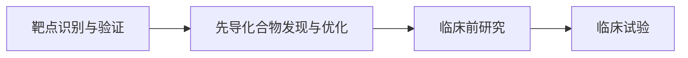

# 无监督学习在药物发现中的应用与案例分享

## 1. 背景介绍
### 1.1 药物发现的挑战
#### 1.1.1 研发周期长、成本高
#### 1.1.2 新药筛选难度大
#### 1.1.3 临床试验失败率高
### 1.2 人工智能在药物发现中的应用前景
#### 1.2.1 加速药物筛选和优化
#### 1.2.2 预测药物性质和毒性
#### 1.2.3 设计新颖药物分子结构
### 1.3 无监督学习的优势
#### 1.3.1 不需要标注数据
#### 1.3.2 发现数据内在模式和结构
#### 1.3.3 适用于高维复杂数据

## 2. 核心概念与联系
### 2.1 无监督学习
#### 2.1.1 定义和原理
#### 2.1.2 常见算法(聚类、降维、关联、异常检测)
### 2.2 药物发现流程
#### 2.2.1 靶点识别与验证
#### 2.2.2 先导化合物发现与优化
#### 2.2.3 临床前研究和临床试验
### 2.3 分子表示和相似性
#### 2.3.1 化学指纹与分子描述符
#### 2.3.2 分子相似性度量方法
### 2.4 无监督学习在药物发现各环节的应用
#### 2.4.1 靶点聚类与亚型划分
#### 2.4.2 先导化合物聚类与骨架发现
#### 2.4.3 药物毒性与副作用模式挖掘



## 3. 核心算法原理与操作步骤
### 3.1 基于化学指纹的层次聚类
#### 3.1.1 化学指纹计算
#### 3.1.2 距离矩阵计算
#### 3.1.3 层次聚类算法(如UPGMA)
### 3.2 基于自组织映射(SOM)的药物可视化
#### 3.2.1 SOM网络结构与训练
#### 3.2.2 药物分子映射到SOM平面
#### 3.2.3 SOM图谱分析与解释
### 3.3 基于自编码器的药物表示学习
#### 3.3.1 自编码器结构与损失函数
#### 3.3.2 分子SMILES/指纹作为输入
#### 3.3.3 潜在表示提取与可视化

## 4. 数学模型与公式详解
### 4.1 层次聚类的Cophenetic相关系数
$$c = \frac{\sum_{i<j}(x(i,j)-\bar{x})(t(i,j)-\bar{t})}{\sqrt{\sum_{i<j}(x(i,j)-\bar{x})^2\sum_{i<j}(t(i,j)-\bar{t})^2}}$$
其中$x(i,j)$为第$i$个样本与第$j$个样本的距离，$t(i,j)$为对应的树状图中两个样本的距离。
### 4.2 SOM的邻域函数与学习率
高斯邻域函数：$h_{c,i}(t)=\alpha(t)\cdot exp(-\frac{\|r_c-r_i\|^2}{2\sigma^2(t)})$
其中$\alpha(t)$为学习率，$\sigma(t)$为邻域半径，$r_c$和$r_i$分别为获胜节点和节点$i$的位置矢量。
### 4.3 变分自编码器(VAE)的损失函数
$$\mathcal{L}(\theta,\phi) = -E_{z\sim q_\phi(z|x)}[\log p_\theta(x|z)] + D_{KL}(q_\phi(z|x)\|p(z))$$
其中$\theta$和$\phi$分别为解码器和编码器的参数，$p(z)$为先验分布，通常取标准正态分布$\mathcal{N}(0,I)$。

## 5. 项目实践：代码实例与详解
### 5.1 基于RDKit的化学指纹计算与层次聚类
```python
from rdkit import Chem
from rdkit.Chem import AllChem
from scipy.cluster.hierarchy import linkage, dendrogram

# 读取分子SMILES列表
with open('molecules.smi') as f:
    smiles_list = [line.strip() for line in f]

# 计算Morgan指纹
fps = []
for smi in smiles_list:
    mol = Chem.MolFromSmiles(smi)
    fp = AllChem.GetMorganFingerprintAsBitVect(mol, 2, nBits=1024)
    fps.append(fp)

# 层次聚类
Z = linkage(fps, method='average')

# 绘制树状图
dendrogram(Z)
```
### 5.2 使用Keras实现分子自编码器
```python
import numpy as np
from keras.models import Model
from keras.layers import Input, Dense, Lambda
from keras import backend as K

# 加载分子指纹数据
data = np.loadtxt('fingerprints.txt')

# VAE编码器
input_dim = data.shape[1]
latent_dim = 64
inputs = Input(shape=(input_dim,))
h = Dense(128, activation='relu')(inputs)
z_mean = Dense(latent_dim)(h)
z_log_var = Dense(latent_dim)(h)

def sampling(args):
    z_mean, z_log_var = args
    epsilon = K.random_normal(shape=(K.shape(z_mean)[0], latent_dim))
    return z_mean + K.exp(0.5 * z_log_var) * epsilon

z = Lambda(sampling)([z_mean, z_log_var])
encoder = Model(inputs, [z_mean, z_log_var, z])

# VAE解码器  
latent_inputs = Input(shape=(latent_dim,))
h_decoded = Dense(128, activation='relu')(latent_inputs)
outputs = Dense(input_dim, activation='sigmoid')(h_decoded)
decoder = Model(latent_inputs, outputs)

# VAE模型
vae = Model(inputs, decoder(encoder(inputs)[2]))

def vae_loss(x, x_decoded_mean):
    xent_loss = K.sum(K.binary_crossentropy(x, x_decoded_mean), axis=-1)
    kl_loss = - 0.5 * K.sum(1 + z_log_var - K.square(z_mean) - K.exp(z_log_var), axis=-1)
    return xent_loss + kl_loss

vae.compile(optimizer='adam', loss=vae_loss)
vae.fit(data, data, epochs=100, batch_size=32)
```

## 6. 实际应用场景
### 6.1 新药物虚拟筛选
利用无监督学习对化合物库进行聚类，选择具有代表性的骨架结构进行优先筛选，提高筛选效率。
### 6.2 药物重定位
利用药物分子的表示学习，发现已上市药物在其他适应症上的潜在应用。
### 6.3 先导化合物优化
在先导化合物的基础上，利用生成模型(如VAE、GAN)设计和优化新颖化合物，改善药物性质。
### 6.4 药物安全性评估
对已有药物的副作用数据进行模式挖掘，预测候选药物的潜在毒性，指导临床前研究。

## 7. 工具和资源推荐
### 7.1 化学信息学工具包
- RDKit：开源的化学信息学Python库，支持分子操作、指纹计算等。
- OpenBabel：多语言的化学工具箱，支持格式转换、化学指纹等。
- CDK：Java版的化学开发工具包，功能丰富。
### 7.2 机器学习平台
- scikit-learn：Python机器学习库，包含多种无监督学习算法。
- Keras：基于TensorFlow/Theano的深度学习高级API，易用性好。
- PyTorch：动态建图的深度学习框架，在研究领域应用广泛。
### 7.3 公开数据集
- ChEMBL：欧洲生物信息研究所维护的药物生物活性数据库。
- PubChem：美国国立卫生研究院的公共分子数据库。
- ZINC：免费的商业化可得化合物数据库。

## 8. 总结：未来发展趋势与挑战
### 8.1 趋势
- 多模态数据的整合分析，如结合化学结构、生物活性、基因表达等数据。
- 图神经网络等新型深度学习模型在药物发现中的应用。  
- 从头药物设计(de novo drug design)的进一步发展。
### 8.2 挑战
- 数据质量问题，如噪声、偏差、缺失等。
- 模型的可解释性有待提高。
- 计算成本问题，尤其是在大规模筛选中。
- 药物合成可行性的考量。

## 9. 附录：常见问题与解答
### 9.1 无监督学习能否取代传统的药物发现流程？
答：无监督学习是对传统方法的补充和加速，而非替代。药物发现仍需要专家知识和实验验证。
### 9.2 如何选择合适的分子表示方法？
答：可根据任务需求、计算成本、可解释性等因素权衡。通常可以尝试多种表示方法，基准测试效果。
### 9.3 对于小数据量的问题，无监督学习是否有效？ 
答：尽管大数据有助于无监督学习，但一些技术如迁移学习可用于小数据问题。数据增强也是一种思路。

作者：禅与计算机程序设计艺术 / Zen and the Art of Computer Programming