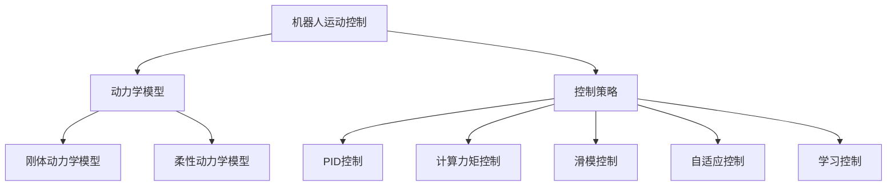

# 机器人的运动控制策略和动力学模型

## 1.背景介绍

### 1.1 机器人技术的重要性

在当今科技飞速发展的时代,机器人技术已经渗透到我们生活和工作的方方面面。无论是工业制造、医疗保健、航空航天,还是家庭服务,机器人都扮演着越来越重要的角色。机器人技术的发展不仅提高了生产效率和精度,还能执行一些危险或繁重的任务,大大减轻了人类的工作强度。

### 1.2 机器人运动控制的挑战

然而,要实现机器人的高效、精准运动,并非一蹴而就。机器人运动控制涉及多个复杂的技术领域,包括动力学建模、轨迹规划、运动控制算法等。其中,动力学模型是描述机器人运动规律的数学基础,而运动控制策略则决定了机器人如何按照预定的轨迹运动。这两个方面的研究对于机器人的性能至关重要。

## 2.核心概念与联系

### 2.1 机器人动力学模型

机器人动力学模型描述了机器人各个关节运动时的动力学特性,包括位置、速度、加速度、力和力矩之间的关系。常用的动力学模型有:

1. **刚体动力学模型**:忽略机器人结构的弹性变形,将其视为刚体。
2. **柔性动力学模型**:考虑机器人结构的弹性变形影响。

动力学模型的建立通常采用拉格朗日方程、牛顿-欧拉方程或者虚功原理等方法。

### 2.2 运动控制策略

运动控制策略指导机器人按照预定的轨迹运动,主要包括以下几种:

1. **PID控制**: 根据当前位置偏差、速度偏差和积分偏差,计算控制量。
2. **计算力矩控制**: 利用动力学模型计算所需的关节力矩。
3. **滑模控制**: 通过切换控制律使系统状态趋近并保持在滑模面上。
4. **自适应控制**: 在线识别系统参数,自适应调整控制器参数。
5. **学习控制**: 通过机器学习算法优化控制策略。

动力学模型和控制策略密切相关,准确的动力学模型有助于提高控制精度,而高效的控制策略也能弥补动力学模型的不确定性。



## 3.核心算法原理具体操作步骤

### 3.1 刚体动力学模型

对于刚体动力学模型,我们通常采用**Newton-Euler方法**或**Lagrange方法**。以Newton-Euler方法为例,具体步骤如下:

1. **定义坐标系和符号约定**

   - 建立惯性坐标系和各关节坐标系
   - 定义各关节角度、角速度、角加速度等变量

2. **前向递推计算**

   - 从基座开始,利用各关节角度计算每个连杆的位置、速度和加速度

3. **后向递推计算**

   - 从末端连杆开始,利用Newton-Euler方程计算每个连杆所需的力和力矩
   - 递推到基座,得到各关节的驱动力矩

该算法的时间复杂度为$O(n)$,其中$n$为机器人关节数。

### 3.2 计算力矩控制

计算力矩控制的核心思想是利用动力学模型计算所需的关节驱动力矩,从而实现期望的运动。具体步骤如下:

1. **获取期望轨迹**

   - 根据任务需求,规划期望的关节角度、速度、加速度等轨迹

2. **计算所需力矩**

   - 利用动力学模型,计算实现期望轨迹所需的关节驱动力矩

3. **控制执行**

   - 向各个关节施加计算得到的驱动力矩,实现期望运动

该方法需要精确的动力学模型参数,否则会产生较大的控制偏差。

### 3.3 滑模控制

滑模控制是一种强健的非线性控制方法,能够有效抵御参数不确定性和外部扰动。其基本思路是:

1. **设计滑模面**

   - 滑模面是一个期望的运动状态,定义为期望状态与实际状态的组合

2. **设计切换控制律**

   - 切换控制律使系统状态趋近并保持在滑模面上

3. **等效控制**

   - 在滑模面上,等效控制律保证系统沿滑模面运动

滑模控制的优点是对参数变化和外部干扰具有强鲁棒性,缺点是存在抖振问题。

## 4.数学模型和公式详细讲解举例说明

### 4.1 刚体动力学模型

对于$n$自由度的刚体机器人,利用拉格朗日方程可以得到其动力学方程:

$$
\boldsymbol{M}(\boldsymbol{q})\ddot{\boldsymbol{q}}+\boldsymbol{C}(\boldsymbol{q},\dot{\boldsymbol{q}})\dot{\boldsymbol{q}}+\boldsymbol{G}(\boldsymbol{q})=\boldsymbol{\tau}
$$

其中:

- $\boldsymbol{q}$是$n\times 1$的关节角度向量
- $\boldsymbol{M}(\boldsymbol{q})$是$n\times n$的惯性矩阵
- $\boldsymbol{C}(\boldsymbol{q},\dot{\boldsymbol{q}})$是$n\times n$的科里奥力和离心力矩阵
- $\boldsymbol{G}(\boldsymbol{q})$是$n\times 1$的重力矩阵
- $\boldsymbol{\tau}$是$n\times 1$的关节驱动力矩向量

该模型考虑了惯性力、科里奥力、离心力和重力等因素,是描述刚体机器人运动的基础。

### 4.2 PID控制器

对于单自由度的关节,PID控制器的输出为:

$$
u(t)=K_p e(t)+K_i\int_0^t e(\tau)d\tau+K_d\dot{e}(t)
$$

其中:

- $u(t)$是控制输出
- $e(t)=q_d(t)-q(t)$是期望位置与实际位置的偏差
- $K_p$、$K_i$、$K_d$分别是比例、积分、微分系数

PID控制器通过对偏差的比例、积分和微分作用,产生控制量抵消偏差。

### 4.3 计算力矩控制

对于$n$自由度的机器人,计算力矩控制的输出为:

$$
\boldsymbol{\tau}=\boldsymbol{M}(\boldsymbol{q})\ddot{\boldsymbol{q}}_d+\boldsymbol{C}(\boldsymbol{q},\dot{\boldsymbol{q}})\dot{\boldsymbol{q}}_d+\boldsymbol{G}(\boldsymbol{q})
$$

其中$\ddot{\boldsymbol{q}}_d$、$\dot{\boldsymbol{q}}_d$、$\boldsymbol{q}_d$分别是期望的关节加速度、速度和位置。

这种方法直接利用动力学模型计算所需的驱动力矩,能够精确控制机器人的运动。

### 4.4 滑模控制

对于单自由度的关节,滑模控制的切换面可定义为:

$$
s=\dot{e}+\lambda e
$$

其中$\lambda$是正的设计参数,用于平衡响应速度和抗扰性能。

切换控制律可设计为:

$$
u=-k\operatorname{sat}(s/\phi)
$$

其中$k$和$\phi$是正的设计参数,决定了控制输出的幅值和切换特性。

当$s=0$时,等效控制律为:

$$
u_{eq}=\ddot{q}_d+\lambda\dot{e}
$$

滑模控制能够在有限时间内将系统状态驱动到切换面附近,并利用切换控制律保持在切换面上。

## 5.项目实践:代码实例和详细解释说明

以下是一个双关节机械臂的Matlab仿真示例,包括动力学模型建立、PID控制和计算力矩控制。

### 5.1 机器人参数定义

```matlab
% 机器人参数
m1 = 1; % 连杆1质量
m2 = 1; % 连杆2质量
l1 = 1; % 连杆1长度 
l2 = 1; % 连杆2长度
lc1 = 0.5; % 连杆1质心距离
lc2 = 0.5; % 连杆2质心距离
I1 = 0.083; % 连杆1绕质心的转动惯量
I2 = 0.33; % 连杆2绕质心的转动惯量
g = 9.8; % 重力加速度
```

### 5.2 动力学模型函数

```matlab
function [M,C,G] = dynamics(q1,q2,dq1,dq2)
% 动力学模型函数

M11 = m1*lc1^2 + m2*(l1^2 + lc2^2 + 2*l1*lc2*cos(q2)) + I1 + I2;
M12 = m2*(lc2^2 + l1*lc2*cos(q2)) + I2;
M21 = M12;
M22 = m2*lc2^2 + I2;
M = [M11 M12; M21 M22];

C1 = -m2*l1*lc2*sin(q2)*(2*dq1*dq2 + dq2^2);
C2 = m2*l1*lc2*sin(q2)*dq1^2;
C = [C1; C2];

G1 = (m1*lc1 + m2*l1)*g*cos(q1) + m2*lc2*g*cos(q1+q2);
G2 = m2*lc2*g*cos(q1+q2);
G = [G1; G2];
end
```

该函数根据Newton-Euler方法计算双关节机械臂的动力学模型参数。

### 5.3 PID控制器

```matlab
function [tau1,tau2] = pid_control(q1,q2,dq1,dq2,q1d,q2d,dq1d,dq2d)
% PID控制器

Kp = [200 100]; % 比例系数
Kd = [20 10]; % 微分系数
Ki = [0 0]; % 积分系数被设为0

e1 = q1d - q1; % 位置偏差
e2 = q2d - q2;
de1 = dq1d - dq1; % 速度偏差
de2 = dq2d - dq2;

tau1 = Kp(1)*e1 + Kd(1)*de1 + Ki(1)*sum(e1); 
tau2 = Kp(2)*e2 + Kd(2)*de2 + Ki(2)*sum(e2);
end
```

该PID控制器根据位置和速度偏差计算关节驱动力矩。

### 5.4 计算力矩控制

```matlab
function [tau1,tau2] = computed_torque(q1,q2,dq1,dq2,ddq1d,ddq2d)
% 计算力矩控制

[M,C,G] = dynamics(q1,q2,dq1,dq2); % 获取动力学模型参数

tau1 = M(1,1)*ddq1d + M(1,2)*ddq2d + C(1) + G(1);
tau2 = M(2,1)*ddq1d + M(2,2)*ddq2d + C(2) + G(2);
end
```

该函数利用动力学模型计算实现期望加速度所需的关节驱动力矩。

### 5.5 仿真运行

```matlab
tspan = 0:0.01:5; % 仿真时间范围
q10 = 0; q20 = pi/2; % 初始关节角度
dq10 = 0; dq20 = 0; % 初始关节速度

% 期望轨迹
q1d = @(t) cos(t);
q2d = @(t) sin(0.5*t);
dq1d = @(t) -sin(t);
dq2d = @(t) 0.5*cos(0.5*t);
ddq1d = @(t) -cos(t);
ddq2d = @(t) -0.25*sin(0.5*t);

% PID控制
[t1,q1