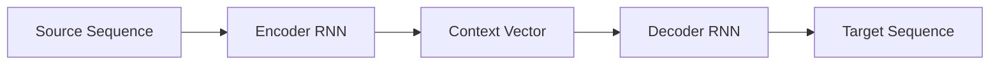
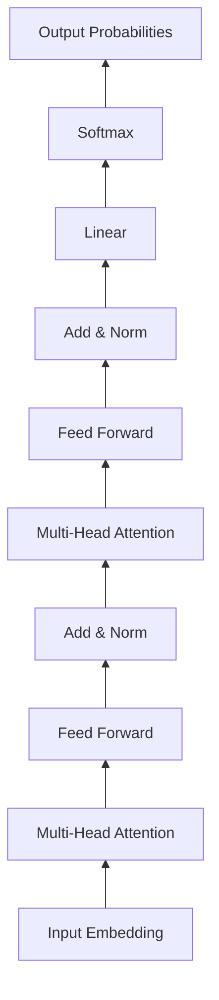

# 机器翻译在社交媒体中的应用:打破语言隔阂的AI力量

## 1. 背景介绍

### 1.1 社交媒体的全球化趋势

在当今互联网时代,社交媒体已经成为人们日常生活中不可或缺的一部分。Facebook、Twitter、Instagram等国际主流社交平台连接着全球数十亿用户,促进了跨国界的信息交流和文化交融。然而,语言障碍仍然是阻碍社交媒体进一步全球化发展的一大挑战。

### 1.2 机器翻译技术的发展

近年来,以深度学习为代表的人工智能技术取得了长足进步,尤其是在自然语言处理领域,机器翻译的效果已经达到了前所未有的水平。传统的基于规则和统计的机器翻译方法已经被神经网络机器翻译(NMT)所取代,翻译质量和速度都得到了大幅提升。

### 1.3 机器翻译在社交媒体中的应用前景

机器翻译与社交媒体的结合,有望打破语言隔阂,实现全球用户无障碍沟通的愿景。通过在社交平台中集成先进的机器翻译技术,可以自动将用户生成的内容(如帖子、评论、私信等)翻译成多种语言,让不同国家和地区的用户都能够无障碍地理解彼此,极大拓展社交网络的覆盖面和影响力。本文将重点探讨机器翻译在社交媒体领域的应用现状、关键技术、实践案例以及未来的发展方向。

## 2. 核心概念与联系

### 2.1 机器翻译的定义与分类

机器翻译(Machine Translation, MT)是利用计算机将一种自然语言(源语言)转换成另一种自然语言(目标语言)的过程,其目标是让机器像人一样理解语言的含义并进行翻译。按照技术原理,机器翻译主要分为三类:基于规则的机器翻译(RBMT)、统计机器翻译(SMT)和神经网络机器翻译(NMT)。

### 2.2 社交媒体的特点与机器翻译需求

社交媒体区别于传统媒体的最大特点在于其用户生成内容(User Generated Content, UGC)的属性,即绝大部分内容是由普通用户自发创作并分享的。这些UGC通常具有口语化、非正式、新词频出等特点,对机器翻译系统提出了更高的要求,需要算法能够准确理解社交媒体语境下的各种词汇和表达方式。

### 2.3 机器翻译与社交媒体的融合

将机器翻译引入社交媒体,可以从多个层面来实现。最常见的是将机器翻译API集成到社交媒体的内容发布和展示环节,对用户提交的文本内容进行实时翻译。同时,机器翻译还可以与社交媒体的推荐系统相结合,根据用户的语言偏好,定制个性化的跨语言内容推送策略。

## 3. 核心算法原理与具体操作步骤

### 3.1 传统机器翻译算法

#### 3.1.1 基于规则的机器翻译(RBMT)

RBMT主要依靠语言学家定义的一套语法规则和词典来进行翻译,如词性分析、语法结构转换、词汇替换等。其优点是对语言结构有很强的可解释性,适合语法差异较大的语言对。但 RBMT 泛化能力差,难以处理语言的多样性和歧义性。

#### 3.1.2 统计机器翻译(SMT) 

SMT 通过从大规模双语语料中统计学习翻译知识,包括语言模型(衡量译文流畅性)和翻译模型(刻画原文和译文的对应关系),再使用解码器搜索产生最优译文。其代表模型有基于词的 IBM 模型、基于短语的翻译模型等。SMT 的优点是可以更好地利用数据,提高译文流畅度,但仍然难以捕捉语言的深层语义。

### 3.2 神经网络机器翻译(NMT)

NMT 是当前机器翻译的主流技术,其核心思想是采用神经网络来建模端到端的翻译过程。NMT 在编码侧使用循环神经网络(RNN)或卷积神经网络(CNN)学习源语言句子的分布式表示,在解码侧使用另一个 RNN 根据源语言表示和已生成的译文预测下一个目标语言单词。整个模型端到端训练,联合优化。

#### 3.2.1 序列到序列模型(Seq2Seq)

将源语言看作一个序列,目标语言看作另一个序列,翻译即为序列到序列的转换。Seq2Seq 模型由编码器(Encoder)和解码器(Decoder)组成,如下图所示:

编码器逐个读取源语言单词,输出一个定长的上下文向量(Context Vector)表示整个句子。解码器根据该向量生成目标语言序列。

#### 3.2.2 注意力机制(Attention Mechanism)

传统 Seq2Seq 模型的 Context Vector 是静态的,难以编码整个句子的信息。注意力机制允许解码器在生成每个单词时,都能重新聚焦到源语言的不同部分,动态地选择更相关的信息用于当前预测。常见的有 Bahdanau Attention 和 Luong Attention。

#### 3.2.3 Transformer 模型

Transformer 是一种完全基于注意力机制的 NMT 模型,抛弃了 RNN 结构,通过 Self-Attention 和 Multi-Head Attention 建模单词之间的依赖关系。其并行计算能力强,训练速度快,成为了当前 NMT 的 SOTA 模型。Transformer 的结构如下:

### 3.3 NMT 模型的训练流程

#### 3.3.1 数据准备

收集大规模的高质量双语平行语料,对源语言和目标语言分别进行分词、大小写归一、清洗等预处理。构建词表,将单词映射为索引。

#### 3.3.2 模型构建

根据具体的 NMT 结构(如 Seq2Seq+Attention、Transformer 等),搭建编码器和解码器网络。主要包括 Embedding 层,RNN/CNN/Self-Attention 层,Softmax 层等。

#### 3.3.3 训练

采用监督学习,将双语语料输入模型,计算损失函数(一般为交叉熵),并使用优化器(如 Adam)进行梯度下降,更新模型参数。为防止过拟合,可使用 Dropout、L2 正则化等策略。

#### 3.3.4 推理

对于给定的源语言句子,使用训练好的模型进行翻译。具体地,将句子输入编码器,得到表示向量,再用解码器自回归地生成目标语言单词,直到预测出句子结束符。可采用 Beam Search 等策略增强解码质量。

## 4. 数学模型和公式详细讲解举例说明

### 4.1 Seq2Seq 模型的数学描述

设源语言句子为 $\mathbf{x}=(x_1,\dots,x_m)$,目标语言句子为 $\mathbf{y}=(y_1,\dots,y_n)$,Seq2Seq 模型的目标是最大化如下条件概率:

$$P(\mathbf{y}|\mathbf{x}) = \prod_{i=1}^n P(y_i|\mathbf{y}_{<i},\mathbf{c})$$

其中 $\mathbf{y}_{<i}$ 表示已生成的前 $i-1$ 个目标语言单词,$\mathbf{c}$ 为编码器输出的上下文向量。

编码器将输入单词 $x_i$ 通过 Embedding 层映射为实值向量 $\mathbf{e}_i$,再输入 RNN 单元(如 LSTM、GRU)进行编码:

$$\mathbf{h}_i=f_{\text{enc}}(\mathbf{e}_i,\mathbf{h}_{i-1})$$

最后一个隐状态 $\mathbf{h}_m$ 即为上下文向量 $\mathbf{c}$。

解码器在 $t$ 时刻的隐状态为:

$$\mathbf{s}_t=f_{\text{dec}}(\mathbf{d}_{t-1},\mathbf{s}_{t-1},\mathbf{c})$$

其中 $\mathbf{d}_{t-1}$ 为 $t-1$ 时刻生成的单词的 Embedding。解码器根据 $\mathbf{s}_t$ 和 $\mathbf{c}$ 计算目标语言单词的概率分布:

$$P(y_t|\mathbf{y}_{<t},\mathbf{c}) = \text{softmax}(g(\mathbf{s}_t,\mathbf{c}))$$

其中 $g$ 为线性变换函数。

### 4.2 注意力机制的数学描述

以 Bahdanau Attention 为例,在解码器的 $t$ 时刻,注意力向量 $\mathbf{a}_t$ 的计算过程为:

首先计算解码器隐状态 $\mathbf{s}_{t-1}$ 与编码器各时刻隐状态 $\mathbf{h}_i$ 的相似度得分:

$$e_{ti} = \mathbf{v}_a^\top \tanh(\mathbf{W}_a[\mathbf{s}_{t-1};\mathbf{h}_i])$$

然后对相似度得分做 Softmax 归一化,得到注意力权重:

$$\alpha_{ti} = \frac{\exp(e_{ti})}{\sum_{j=1}^m \exp(e_{tj})}$$

最后将编码器隐状态按权重求和,得到注意力向量:

$$\mathbf{a}_t = \sum_{i=1}^m \alpha_{ti}\mathbf{h}_i$$

解码器在预测时将 $\mathbf{a}_t$ 作为额外的信息来生成 $t$ 时刻的隐状态。

### 4.3 Transformer 模型的数学描述

Transformer 的编码器和解码器都由多个相同的层堆叠而成,每一层包含两个子层:Multi-Head Self-Attention 和 Position-wise Feed-Forward Network。

对于输入的词嵌入序列 $\mathbf{X} \in \mathbb{R}^{n \times d}$,Self-Attention 首先计算 Query、Key、Value 矩阵:

$$\mathbf{Q} = \mathbf{X} \mathbf{W}^Q,\quad \mathbf{K} = \mathbf{X} \mathbf{W}^K,\quad \mathbf{V} = \mathbf{X} \mathbf{W}^V$$

然后计算 Attention Scores 矩阵:

$$\mathbf{A} = \text{softmax}\left(\frac{\mathbf{Q}\mathbf{K}^\top}{\sqrt{d_k}}\right)$$

最后将 Scores 矩阵与 Value 矩阵相乘并变换,得到 Attention 输出:

$$\text{Attention}(\mathbf{Q},\mathbf{K},\mathbf{V}) = \mathbf{A} \mathbf{V} \mathbf{W}^O$$

Multi-Head Attention 即为并行执行多个不同参数的 Self-Attention,并将结果拼接:

$$\text{MultiHead}(\mathbf{Q},\mathbf{K},\mathbf{V}) = \text{Concat}(\text{head}_1,\dots,\text{head}_h)\mathbf{W}^O$$

其中 $\text{head}_i = \text{Attention}(\mathbf{Q}\mathbf{W}_i^Q,\mathbf{K}\mathbf{W}_i^K,\mathbf{V}\mathbf{W}_i^V)$。

Feed-Forward Network 包含两层线性变换和 ReLU 激活:

$$\text{FFN}(\mathbf{x}) = \max(0,\mathbf{x} \mathbf{W}_1+\mathbf{b}_1)\mathbf{W}_2+\mathbf{b}_2$$

此外,Transformer 还引入了位置编码(Positional Encoding)来引入序列的位置信息,残差连接和 Layer Normalization 来促进模型训练。

## 5. 项目实践:代码实例和详细解释说明

下面以 PyT