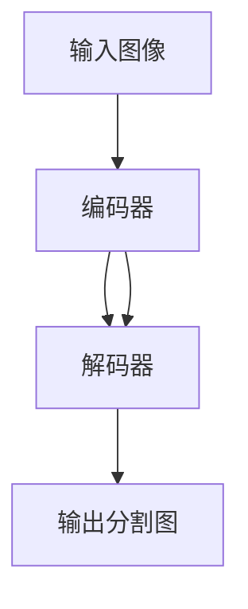

# 机器视觉 (Computer Vision)

## 1.背景介绍

机器视觉(Computer Vision)是人工智能(AI)的一个重要分支,旨在让计算机像人类一样"看"和理解这个世界。它涉及计算机科学、数学、物理学等多个领域,是一个高度跨学科的研究方向。机器视觉的目标是通过算法和模型,让计算机能够从图像或视频中提取、分析和理解有用的信息,进而完成各种视觉任务,如目标检测、图像分类、语义分割等。

机器视觉的研究可以追溯到20世纪60年代,但直到近十几年,随着深度学习的兴起,机器视觉才取得了突破性的进展。如今,机器视觉已广泛应用于自动驾驶、医学影像分析、安防监控、工业质检等诸多领域,极大地提升了生产力,改变了人们的生活。然而,机器视觉仍面临着诸多挑战,如小样本学习、域适应、鲁棒性等,亟需研究者们持续探索。

### 1.1 机器视觉的发展历程

#### 1.1.1 早期探索阶段(20世纪60-90年代)
- Roberts算子(1963)提出,开启边缘检测研究
- Marr视觉计算理论(1982)奠定了机器视觉的理论基础
- 主要以人工设计特征为主,如SIFT(1999)、HOG(2005)等

#### 1.1.2 深度学习崛起(2012至今)
- AlexNet(2012)在ImageNet大规模视觉识别挑战赛(ILSVRC)上大幅刷新纪录
- 深度卷积神经网络(DCNN)成为机器视觉的主流范式
- 涌现出一系列里程碑式工作,如VGGNet(2014)、ResNet(2015)、YOLO(2015)等

### 1.2 机器视觉的主要任务

#### 1.2.1 图像分类(Image Classification) 
对整张图片进行类别预测,如判断一张图片中是猫还是狗。

#### 1.2.2 目标检测(Object Detection)
在图像中定位并识别出多个目标,如检测图像中的行人、车辆等。

#### 1.2.3 语义分割(Semantic Segmentation)  
对图像的每个像素进行类别标注,如将图像分割为天空、建筑、道路等不同区域。

#### 1.2.4 实例分割(Instance Segmentation)
在语义分割的基础上,进一步区分不同的个体实例,如区分图像中的不同人、不同车辆等。

## 2.核心概念与联系

### 2.1 卷积神经网络(Convolutional Neural Network, CNN)

CNN是机器视觉的核心,它通过卷积、池化等操作,能够自动学习到图像中的层次化特征表示。典型的CNN由卷积层(Convolutional Layer)、池化层(Pooling Layer)、全连接层(Fully Connected Layer)组成。

#### 2.1.1 卷积层
通过卷积核在图像上滑动,提取局部特征。可形式化表示为:
$$
\mathbf{F}_{i,j}=\sum_m\sum_n\mathbf{I}_{i+m,j+n}\mathbf{K}_{m,n}
$$

#### 2.1.2 池化层
对卷积特征图进行下采样,增加感受野,提高鲁棒性。常见的有最大池化(Max Pooling)和平均池化(Average Pooling)。

#### 2.1.3 全连接层
将卷积特征图展平为向量,进行分类或回归预测。

### 2.2 目标检测算法

目标检测是机器视觉的重要任务之一,主要分为两阶段检测器(如R-CNN系列)和单阶段检测器(如YOLO、SSD)。

#### 2.2.1 两阶段检测器
先通过区域建议网络(Region Proposal Network, RPN)产生候选区域,再对候选区域进行分类和回归。以Faster R-CNN为例:


#### 2.2.2 单阶段检测器 
无需候选区域,直接在特征图上进行密集预测。以YOLO为例:


### 2.3 语义分割算法

语义分割旨在对图像的每个像素进行类别标注,按照是否使用编码器-解码器结构,可分为FCN系列和Encoder-Decoder系列。

#### 2.3.1 FCN系列
全卷积网络(Fully Convolutional Network, FCN)移除了全连接层,使用反卷积(Deconvolution)对特征图进行上采样,恢复到输入分辨率。

#### 2.3.2 Encoder-Decoder系列
编码器负责提取特征,解码器负责恢复空间分辨率。以U-Net为例:



## 3.核心算法原理具体操作步骤

以目标检测中的YOLO算法为例,详细介绍其原理和步骤。

### 3.1 网络结构
YOLO使用单个卷积神经网络实现端到端的目标检测,网络主要由卷积层和池化层组成,最后通过全卷积层输出检测结果。

### 3.2 输入图像划分
将输入图像划分为S×S个网格,每个网格负责检测落在该网格中的目标。

### 3.3 边框预测
每个网格预测B个边框,每个边框包含5个值:(x,y,w,h,confidence),分别表示边框中心坐标、宽高和置信度。置信度反映了边框中包含目标的可能性。

### 3.4 类别预测  
每个网格预测C个类别概率,表示该网格所属目标的类别。

### 3.5 损失函数
YOLO的损失函数由三部分组成:坐标误差、置信度误差和类别概率误差。
$$
\lambda_{coord}\sum_{i=0}^{S^2}\sum_{j=0}^B\mathbb{1}_{ij}^{obj}[(x_i-\hat{x}_i)^2+(y_i-\hat{y}_i)^2] \\
+\lambda_{coord}\sum_{i=0}^{S^2}\sum_{j=0}^B\mathbb{1}_{ij}^{obj}[(\sqrt{w_i}-\sqrt{\hat{w}_i})^2+(\sqrt{h_i}-\sqrt{\hat{h}_i})^2] \\ 
+\sum_{i=0}^{S^2}\sum_{j=0}^B\mathbb{1}_{ij}^{obj}(C_i-\hat{C}_i)^2 \\
+\lambda_{noobj}\sum_{i=0}^{S^2}\sum_{j=0}^B\mathbb{1}_{ij}^{noobj}(C_i-\hat{C}_i)^2 \\
+\sum_{i=0}^{S^2}\mathbb{1}_i^{obj}\sum_{c\in{classes}}(p_i(c)-\hat{p}_i(c))^2
$$

### 3.6 后处理
对网络输出的边框进行阈值过滤和非极大值抑制(Non-Maximum Suppression, NMS),得到最终的检测结果。

## 4.数学模型和公式详细讲解举例说明

以卷积操作为例,详细说明其数学模型。

卷积操作是CNN的核心,通过卷积核在输入特征图上滑动,提取局部特征。设输入特征图为$\mathbf{I}$,卷积核为$\mathbf{K}$,卷积结果为$\mathbf{F}$,则卷积操作可表示为:

$$
\mathbf{F}_{i,j}=\sum_m\sum_n\mathbf{I}_{i+m,j+n}\mathbf{K}_{m,n}
$$

其中,$i,j$为输出特征图上的坐标,$m,n$为卷积核的坐标。

举例说明,假设输入特征图$\mathbf{I}$和卷积核$\mathbf{K}$分别为:

$$
\mathbf{I}=
\begin{bmatrix}
1 & 2 & 3 \\
4 & 5 & 6 \\
7 & 8 & 9
\end{bmatrix},
\mathbf{K}=
\begin{bmatrix}
1 & 0 \\
0 & 1
\end{bmatrix}
$$

则卷积结果$\mathbf{F}$为:

$$
\mathbf{F}=
\begin{bmatrix}
1\times1+2\times0+4\times0+5\times1 & 2\times1+3\times0+5\times0+6\times1 \\
4\times1+5\times0+7\times0+8\times1 & 5\times1+6\times0+8\times0+9\times1
\end{bmatrix}
=
\begin{bmatrix}
6 & 8 \\
12 & 14
\end{bmatrix}
$$

可见,卷积操作可以提取输入特征图的局部特征,使网络能够学习到图像的层次化表示。

## 5.项目实践：代码实例和详细解释说明

以PyTorch实现MNIST手写数字识别为例,介绍机器视觉的项目实践。

```python
import torch
import torch.nn as nn
import torch.optim as optim
from torchvision import datasets, transforms

# 定义超参数
BATCH_SIZE = 64
EPOCHS = 10
DEVICE = torch.device("cuda" if torch.cuda.is_available() else "cpu")

# 数据预处理
transform = transforms.Compose([
    transforms.ToTensor(),
    transforms.Normalize((0.1307,), (0.3081,))
])

# 加载MNIST数据集
train_dataset = datasets.MNIST('./data', train=True, download=True, transform=transform)
test_dataset = datasets.MNIST('./data', train=False, transform=transform)
train_loader = torch.utils.data.DataLoader(train_dataset, batch_size=BATCH_SIZE, shuffle=True)
test_loader = torch.utils.data.DataLoader(test_dataset, batch_size=BATCH_SIZE, shuffle=False)

# 定义卷积神经网络
class Net(nn.Module):
    def __init__(self):
        super(Net, self).__init__()
        self.conv1 = nn.Conv2d(1, 32, 3, 1)
        self.conv2 = nn.Conv2d(32, 64, 3, 1)
        self.dropout1 = nn.Dropout2d(0.25)
        self.dropout2 = nn.Dropout2d(0.5)
        self.fc1 = nn.Linear(9216, 128)
        self.fc2 = nn.Linear(128, 10)

    def forward(self, x):
        x = self.conv1(x)
        x = nn.functional.relu(x)
        x = self.conv2(x)
        x = nn.functional.relu(x)
        x = nn.functional.max_pool2d(x, 2)
        x = self.dropout1(x)
        x = torch.flatten(x, 1)
        x = self.fc1(x)
        x = nn.functional.relu(x)
        x = self.dropout2(x)
        x = self.fc2(x)
        output = nn.functional.log_softmax(x, dim=1)
        return output

# 初始化模型
model = Net().to(DEVICE)
optimizer = optim.Adam(model.parameters())

# 定义训练函数
def train(model, device, train_loader, optimizer, epoch):
    model.train()
    for batch_idx, (data, target) in enumerate(train_loader):
        data, target = data.to(device), target.to(device)
        optimizer.zero_grad()
        output = model(data)
        loss = nn.functional.nll_loss(output, target)
        loss.backward()
        optimizer.step()
        if batch_idx % 100 == 0:
            print('Train Epoch: {} [{}/{} ({:.0f}%)]\tLoss: {:.6f}'.format(
                epoch, batch_idx * len(data), len(train_loader.dataset),
                100. * batch_idx / len(train_loader), loss.item()))

# 定义测试函数  
def test(model, device, test_loader):
    model.eval()
    test_loss = 0
    correct = 0
    with torch.no_grad():
        for data, target in test_loader:
            data, target = data.to(device), target.to(device)
            output = model(data)
            test_loss += nn.functional.nll_loss(output, target, reduction='sum').item()
            pred = output.argmax(dim=1, keepdim=True)
            correct += pred.eq(target.view_as(pred)).sum().item()

    test_loss /= len(test_loader.dataset)
    accuracy = correct / len(test_loader.dataset)

    print('\nTest set: Average loss: {:.4f}, Accuracy: {}/{} ({:.2f}%)\n'.format(
        test_loss, correct, len(test_loader.dataset), 100. * accuracy))
    
    return