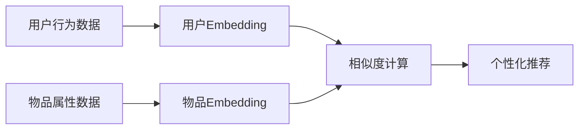

# 构建基于向量的推荐系统：提供个性化用户体验

## 1.背景介绍

在当今数字时代,个性化推荐已成为各大互联网平台的标配。从电商网站到视频网站,从社交媒体到新闻资讯,推荐系统无处不在,它们为用户提供量身定制的内容和服务,大大提升了用户体验。而基于向量的推荐系统是其中最为先进和有效的技术之一。

### 1.1 推荐系统概述

推荐系统是一种信息过滤系统,它可以学习用户的喜好,并主动向用户推荐其可能感兴趣的内容。推荐系统主要分为以下三类:

- 基于协同过滤的推荐系统
- 基于内容的推荐系统  
- 混合推荐系统

### 1.2 向量化推荐的优势

基于向量的推荐属于混合推荐的一种,它融合了协同过滤和基于内容的推荐的优点,克服了它们各自的局限性。与传统的推荐方法相比,基于向量的推荐具有以下优势:

- 更精准:通过对用户和物品进行向量化表示,可以更准确地刻画它们的特征,捕捉它们之间的相似性。
- 更高效:向量运算速度快,可以实时计算用户与海量物品之间的相似度,适合大规模的推荐场景。
- 更灵活:向量表示可以方便地融合多种信息,如用户画像、物品属性、上下文信息等,从而实现更加个性化的推荐。

### 1.3 应用场景

基于向量的推荐可以应用于多个领域,例如:

- 电商平台:为用户推荐相关商品
- 视频网站:为用户推荐感兴趣的视频
- 社交网络:为用户推荐可能认识的人、感兴趣的帖子
- 新闻APP:为用户推荐相关新闻资讯

## 2.核心概念与联系

要理解基于向量的推荐系统,需要掌握以下几个核心概念:

### 2.1 Embedding 嵌入

Embedding 是一种将离散变量映射为连续向量表示的技术。在推荐系统中,我们可以为每个用户和物品学习一个 Embedding 向量,用它们的向量相似度来表示用户对物品的喜好程度。

### 2.2 用户 Embedding 和物品 Embedding

- 用户 Embedding:通过用户的历史行为数据(如浏览、点击、购买等),学习得到用户的向量表示,刻画用户的兴趣特征。
- 物品 Embedding:通过物品的属性信息(如标题、类别、标签等)和用户行为数据,学习得到物品的向量表示,刻画物品的语义特征。

### 2.3 相似度计算

有了用户和物品的 Embedding 向量后,我们就可以通过向量相似度来估计用户对物品的喜好程度。常见的相似度计算方法有:

- 内积(Inner Product):用户向量与物品向量的内积值越大,相似度越高。
- 余弦相似度(Cosine Similarity):计算用户向量与物品向量夹角的余弦值,余弦值越大,相似度越高。

### 2.4 核心联系

基于向量的推荐的核心思想是:

1. 学习 Embedding:通过机器学习算法,学习用户和物品的 Embedding 向量。
2. 计算相似度:通过用户和物品的 Embedding 向量,计算它们之间的相似度。 
3. 生成推荐:根据相似度的高低,为用户推荐最相关的物品。

其核心联系可用下图表示:



## 3.核心算法原理具体操作步骤

基于向量的推荐系统的核心是 Embedding 学习算法,主要有以下两大类:

### 3.1 基于矩阵分解的 Embedding 学习

基于矩阵分解的 Embedding 学习将推荐问题建模为一个矩阵分解问题。其基本步骤如下:

1. 构建用户-物品交互矩阵 $R$,矩阵元素 $r_{ui}$ 表示用户 $u$ 对物品 $i$ 的喜好程度。

2. 将矩阵 $R$ 分解为用户 Embedding 矩阵 $P$ 和物品 Embedding 矩阵 $Q$,即:

$$R \approx P \times Q^T$$

其中,$P$ 的每一行是一个用户的 Embedding 向量,$Q$ 的每一行是一个物品的 Embedding 向量。

3. 通过最小化矩阵 $R$ 与 $P \times Q^T$ 的误差,学习 $P$ 和 $Q$ 的参数,得到用户和物品的 Embedding 向量。

常见的矩阵分解算法有:

- SVD(Singular Value Decomposition):奇异值分解
- PMF(Probabilistic Matrix Factorization):概率矩阵分解
- NMF(Non-negative Matrix Factorization):非负矩阵分解

### 3.2 基于神经网络的 Embedding 学习

基于神经网络的 Embedding 学习利用深度学习模型来学习 Embedding 向量。其基本步骤如下:

1. 构建训练样本:将用户-物品交互数据转化为模型的输入和输出。常见的做法是将一次交互(如一次点击)作为一个正样本,随机采样一些没有交互的用户-物品对作为负样本。

2. 搭建神经网络:设计一个多层神经网络,输入是用户 ID 和物品 ID,中间层对用户和物品 ID 做 Embedding 映射,输出层预测用户对物品的喜好程度。

3. 训练模型:通过反向传播算法优化神经网络的参数,使其能够准确预测用户的喜好。

4. 提取 Embedding:训练完成后,中间层的 Embedding 参数即为用户和物品的 Embedding 向量。

常见的基于神经网络的 Embedding 学习算法有:

- Word2Vec:原本用于学习词向量,也可用于学习用户和物品的 Embedding。
- DeepWalk:通过随机游走在用户-物品交互图上生成序列,再用 Word2Vec 学习 Embedding。
- Node2Vec:DeepWalk 的改进版,通过有偏的随机游走策略生成更优的序列。

## 4.数学模型和公式详细讲解举例说明

下面我们以矩阵分解算法 PMF 为例,详细讲解其数学模型和公式。

### 4.1 概率矩阵分解(PMF)

PMF 是一种基于概率的矩阵分解算法,它假设用户对物品的评分服从高斯分布。其主要思想是:

1. 假设用户 Embedding 向量 $p_u$ 和物品 Embedding 向量 $q_i$ 都服从均值为 0、协方差为 $\sigma^2$ 的高斯分布,即:

$$p_u \sim N(0,\sigma^2I)$$
$$q_i \sim N(0,\sigma^2I)$$

2. 假设用户 $u$ 对物品 $i$ 的评分 $r_{ui}$ 服从均值为 $p_u^Tq_i$、方差为 $\sigma^2$ 的高斯分布,即:

$$r_{ui} \sim N(p_u^Tq_i,\sigma^2)$$

3. 最大化对数似然函数,求解最优的 $p_u$ 和 $q_i$。对数似然函数为:

$$\ln p(R|P,Q,\sigma^2) = \sum_{u,i \in R} \ln N(r_{ui}|p_u^Tq_i,\sigma^2) - \lambda(||P||_2^2 + ||Q||_2^2)$$

其中,$R$ 为用户-物品交互矩阵,$P$ 和 $Q$ 分别为用户和物品的 Embedding 矩阵,$\lambda$ 为正则化系数。

### 4.2 求解算法

PMF 的求解可以通过梯度下降法实现。其主要步骤为:

1. 初始化 $P$ 和 $Q$ 的参数。

2. 计算损失函数:

$$L = \sum_{u,i \in R} (r_{ui} - p_u^Tq_i)^2 + \lambda(||P||_2^2 + ||Q||_2^2)$$

3. 计算梯度:

$$\frac{\partial L}{\partial p_u} = -2\sum_{i \in R_u} (r_{ui} - p_u^Tq_i)q_i + 2\lambda p_u$$
$$\frac{\partial L}{\partial q_i} = -2\sum_{u \in R_i} (r_{ui} - p_u^Tq_i)p_u + 2\lambda q_i$$

其中,$R_u$ 和 $R_i$ 分别表示用户 $u$ 和物品 $i$ 有过交互的物品和用户集合。

4. 更新参数:

$$p_u \leftarrow p_u - \eta \frac{\partial L}{\partial p_u}$$
$$q_i \leftarrow q_i - \eta \frac{\partial L}{\partial q_i}$$

其中,$\eta$ 为学习率。

5. 重复步骤 2-4,直到损失函数收敛。

### 4.3 举例说明

假设我们有 3 个用户和 4 个物品,用户-物品交互矩阵 $R$ 为:

$$R = \begin{bmatrix}
5 & ? & 3 & ?\\
4 & ? & ? & 2\\  
? & 3 & 4 & 3
\end{bmatrix}$$

其中,? 表示缺失值,即用户没有对该物品评分。

我们希望通过 PMF 学习用户和物品的 Embedding 向量,并预测缺失的评分值。假设 Embedding 维度为 2,则我们需要学习:

- 用户 Embedding 矩阵 $P \in \mathbb{R}^{3 \times 2}$
- 物品 Embedding 矩阵 $Q \in \mathbb{R}^{4 \times 2}$

通过梯度下降法优化 $P$ 和 $Q$,最终得到用户和物品的 Embedding 向量,例如:

$$P = \begin{bmatrix}
0.2 & 1.5\\
1.1 & 0.8\\
0.5 & 1.2  
\end{bmatrix}$$

$$Q = \begin{bmatrix}
1.2 & 0.3\\
0.9 & 1.4\\
0.6 & 1.1\\
1.5 & 0.7
\end{bmatrix}$$

有了 $P$ 和 $Q$ 后,我们就可以预测缺失的评分值了。例如,用户 1 对物品 2 的评分预测值为:

$$\hat{r}_{12} = p_1^Tq_2 = [0.2, 1.5] \cdot [0.9, 1.4]^T = 2.28$$

同理可以预测其他缺失的评分值。最后,我们可以根据预测的评分值为每个用户推荐评分最高的物品。

## 5.项目实践：代码实例和详细解释说明

下面我们用 Python 实现一个简单的基于 PMF 的推荐系统。

### 5.1 数据准备

首先,我们生成一个随机的用户-物品交互矩阵,并将其中一些元素设为缺失值:

```python
import numpy as np

# 生成随机的用户-物品交互矩阵
n_users, n_items = 500, 1000
R = np.random.rand(n_users, n_items) * 5

# 随机设置30%的元素为缺失值
mask = np.random.rand(n_users, n_items) < 0.3
R[mask] = 0
```

### 5.2 模型实现

接下来,我们实现 PMF 模型:

```python
class PMF:
    
    def __init__(self, n_users, n_items, n_factors=20, lr=0.01, reg=0.01):
        self.n_users = n_users
        self.n_items = n_items
        self.n_factors = n_factors
        self.lr = lr
        self.reg = reg
        
        # 初始化用户和物品的Embedding矩阵
        self.user_embeddings = np.random.normal(size=(n_users, n_factors))
        self.item_embeddings = np.random.normal(size=(n_items, n_factors))
        
    def fit(self, R, epochs=10):
        # 训练模型
        for epoch in range(epochs):
            for u in range(self.n_users):
                for i in range(self.n_items):
                    if R[u, i] > 0:
                        # 计算预测值
                        r_