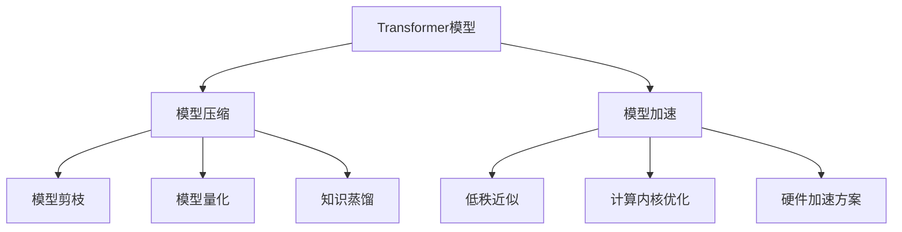

# 构建高效Transformer:模型压缩和加速技术

## 1.背景介绍
### 1.1 Transformer模型的发展历程
#### 1.1.1 Transformer模型的诞生
#### 1.1.2 Transformer模型的广泛应用 
#### 1.1.3 Transformer模型面临的挑战
### 1.2 模型压缩和加速技术的重要性
#### 1.2.1 降低模型存储和计算成本
#### 1.2.2 提升模型推理速度
#### 1.2.3 促进Transformer模型的实际应用

## 2.核心概念与联系
### 2.1 Transformer模型的核心结构
#### 2.1.1 Self-Attention机制
#### 2.1.2 Multi-Head Attention
#### 2.1.3 Feed-Forward Network
### 2.2 模型压缩技术概述  
#### 2.2.1 模型剪枝(Pruning)
#### 2.2.2 量化(Quantization) 
#### 2.2.3 知识蒸馏(Knowledge Distillation)
### 2.3 模型加速技术概述
#### 2.3.1 低秩近似(Low-Rank Approximation)
#### 2.3.2 计算内核优化
#### 2.3.3 硬件加速方案

## 3.核心算法原理具体操作步骤
### 3.1 Transformer模型剪枝算法
#### 3.1.1 基于重要性的剪枝
#### 3.1.2 基于规则的剪枝
#### 3.1.3 基于搜索的自动剪枝
### 3.2 Transformer模型量化算法  
#### 3.2.1 Post-Training量化
#### 3.2.2 Quantization-Aware Training
#### 3.2.3 混合精度量化
### 3.3 Transformer模型知识蒸馏算法
#### 3.3.1 Response-Based蒸馏
#### 3.3.2 Feature-Based蒸馏 
#### 3.3.3 Relation-Based蒸馏

## 4.数学模型和公式详细讲解举例说明
### 4.1 Self-Attention的数学表示
#### 4.1.1 Scaled Dot-Product Attention
$Attention(Q,K,V) = softmax(\frac{QK^T}{\sqrt{d_k}})V$
#### 4.1.2 Multi-Head Attention
$MultiHead(Q,K,V) = Concat(head_1,...,head_h)W^O$
### 4.2 模型剪枝的数学描述
#### 4.2.1 $L_0$正则化剪枝
$L(w) = L_0(w) + \lambda \Vert w \Vert_0$
#### 4.2.2 $L_1$正则化剪枝  
$L(w) = L_0(w) + \lambda \Vert w \Vert_1$
### 4.3 模型量化的数学分析
#### 4.3.1 线性量化
$r = S(q-Z)$
#### 4.3.2 对数量化
$r = S\mu^{-(q-Z)}$

## 5.项目实践：代码实例和详细解释说明
### 5.1 使用PyTorch实现Transformer模型剪枝
#### 5.1.1 定义Transformer模型结构
#### 5.1.2 实现基于重要性的剪枝算法
#### 5.1.3 微调剪枝后的模型
### 5.2 使用TensorFlow实现Transformer模型量化
#### 5.2.1 定义量化感知的Transformer模型
#### 5.2.2 训练量化感知的Transformer模型
#### 5.2.3 导出量化后的模型  
### 5.3 使用PaddlePaddle实现Transformer模型知识蒸馏
#### 5.3.1 构建Teacher模型和Student模型
#### 5.3.2 定义蒸馏损失函数
#### 5.3.3 训练Student模型

## 6.实际应用场景
### 6.1 自然语言处理领域
#### 6.1.1 机器翻译中的应用
#### 6.1.2 文本分类中的应用
#### 6.1.3 问答系统中的应用  
### 6.2 计算机视觉领域
#### 6.2.1 图像分类中的应用
#### 6.2.2 目标检测中的应用
#### 6.2.3 图像分割中的应用
### 6.3 语音识别领域 
#### 6.3.1 声学模型中的应用
#### 6.3.2 语言模型中的应用
#### 6.3.3 端到端语音识别中的应用

## 7.工具和资源推荐
### 7.1 模型压缩工具集
#### 7.1.1 TensorFlow Model Optimization Toolkit
#### 7.1.2 PaddleSlim
#### 7.1.3 NCCL-Pruner
### 7.2 模型加速工具集
#### 7.2.1 英伟达TensorRT
#### 7.2.2 华为昇腾CANN
#### 7.2.3 寒武纪MLU
### 7.3 开源Transformer模型库
#### 7.3.1 HuggingFace Transformers
#### 7.3.2 FairSeq
#### 7.3.3 OpenNMT

## 8.总结：未来发展趋势与挑战 
### 8.1 自适应压缩和加速技术
#### 8.1.1 基于强化学习的自适应压缩
#### 8.1.2 基于神经架构搜索的自适应加速
#### 8.1.3 软硬件协同优化
### 8.2 新型Transformer结构的探索
#### 8.2.1 Transformer-XL
#### 8.2.2 Reformer
#### 8.2.3 Performer
### 8.3 模型压缩和加速技术的标准化
#### 8.3.1 压缩和加速API的标准化
#### 8.3.2 压缩模型的互操作性
#### 8.3.3 压缩和加速效果的评估标准

## 9.附录：常见问题与解答
### 9.1 如何权衡模型性能和效率？
### 9.2 不同的压缩和加速技术是否可以组合使用？ 
### 9.3 如何评估压缩和加速后模型的性能？

Transformer模型压缩和加速技术已成为当前深度学习领域的研究热点。模型压缩技术通过减少模型参数量和计算量,在保持模型性能的同时降低存储和计算成本。常见的模型压缩技术包括模型剪枝、量化和知识蒸馏。模型剪枝通过去除冗余和不重要的连接,获得结构更加紧凑的模型。模型量化将模型权重从浮点数转换为定点数,降低模型存储空间和计算复杂度。知识蒸馏利用教师模型的知识来指导学生模型的学习,获得更加轻量化的模型。

模型加速技术致力于提升模型推理速度,减少模型部署时延。低秩近似通过将矩阵分解为低秩矩阵之积,降低矩阵乘法的计算复杂度。计算内核优化对Transformer中的关键操作如Self-Attention进行加速,充分利用硬件资源。此外,英伟达TensorRT、华为昇腾CANN等硬件加速方案也被广泛应用于Transformer模型的加速部署。

在实践中,PyTorch、TensorFlow、PaddlePaddle等主流深度学习框架均提供了完善的模型压缩和加速工具。开发者可以根据实际需求选择合适的压缩和加速技术,并利用相应的工具进行实现。在自然语言处理、计算机视觉、语音识别等领域,压缩加速后的Transformer模型已经得到了广泛应用,极大地促进了相关技术的落地。

展望未来,自适应压缩和加速技术有望进一步提升Transformer模型的性能和效率。新型Transformer结构的探索也将带来更多的可能性。此外,压缩和加速技术的标准化也是一个重要的发展方向,有利于推动相关技术的成熟和普及。

总之,Transformer模型压缩和加速技术是一个充满活力和挑战的研究方向。通过技术创新和产学研协作,我们有望构建出更加高效、智能的Transformer模型,推动人工智能技术的进一步发展。

作者：禅与计算机程序设计艺术 / Zen and the Art of Computer Programming