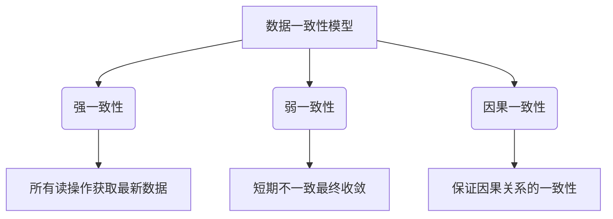
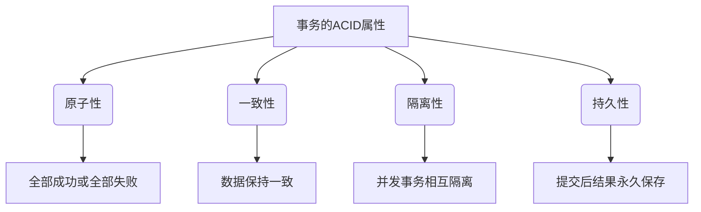
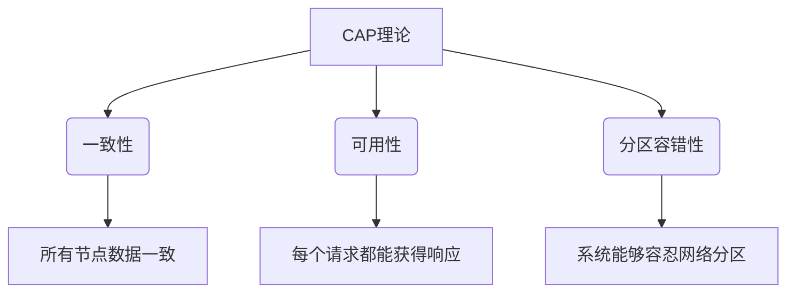
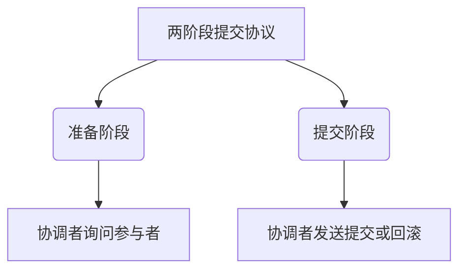
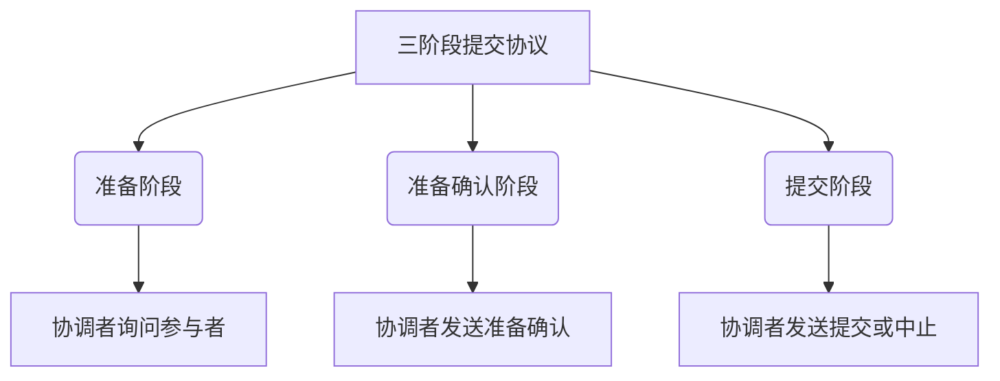
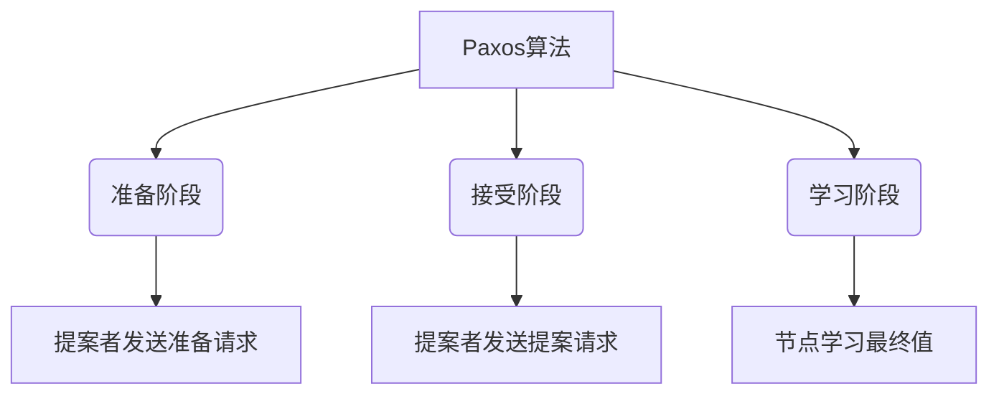
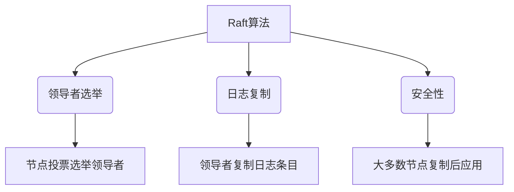

# 架构设计中的数据一致性和事务管理

## 1.背景介绍

在现代分布式系统中,数据一致性和事务管理是确保系统可靠性和数据完整性的关键因素。随着系统规模和复杂性的不断增加,传统的单体架构已经无法满足高并发、高可用性和可扩展性的需求。分布式系统通过将应用程序拆分为多个服务或微服务来实现横向扩展,但同时也带来了数据一致性和事务管理的挑战。

### 1.1 数据一致性的重要性

数据一致性是指在分布式环境中,多个副本或节点之间的数据保持一致的状态。如果数据不一致,可能会导致数据损坏、不正确的计算结果或者不一致的用户体验。例如,在电子商务系统中,如果库存数据不一致,可能会导致超卖或者缺货的情况。因此,确保数据一致性对于任何依赖数据的关键业务系统都是至关重要的。

### 1.2 事务管理的作用

事务管理是保证数据一致性的重要手段。事务是一系列操作的逻辑单元,它们要么全部成功执行,要么全部回滚,从而确保数据的原子性、一致性、隔离性和持久性(ACID)。在分布式系统中,事务管理面临着更大的挑战,因为需要在多个节点或服务之间协调和管理事务。

## 2.核心概念与联系

### 2.1 数据一致性模型

数据一致性模型定义了分布式系统中数据副本之间的一致性级别。常见的数据一致性模型包括:

1. **强一致性(Strict Consistency)**: 所有读操作都能获取到最新写入的数据,这是最严格的一致性模型,但也是最难实现的。
2. **弱一致性(Eventual Consistency)**: 允许数据在一段时间内处于不一致状态,但最终会收敛到一致状态。这种模型更易于实现,但需要应用程序能够容忍短期的不一致性。
3. **因果一致性(Causal Consistency)**: 确保所有因果相关的操作都按照正确的顺序执行,从而保证因果关系的一致性。



### 2.2 事务的ACID属性

事务管理的核心目标是确保事务具有ACID属性:

1. **原子性(Atomicity)**: 事务中的所有操作要么全部成功,要么全部失败,不存在部分成功的情况。
2. **一致性(Consistency)**: 事务执行前后,数据必须保持一致性。
3. **隔离性(Isolation)**: 并发执行的事务之间相互隔离,不会相互影响。
4. **持久性(Durability)**: 一旦事务提交,其结果就会永久保存在系统中。



### 2.3 CAP理论

在分布式系统中,CAP理论阐述了一致性(Consistency)、可用性(Availability)和分区容错性(Partition Tolerance)之间的权衡关系。根据CAP理论,一个分布式系统最多只能同时满足其中两个特性。这对于设计分布式系统的数据一致性和事务管理策略具有重要影响。



## 3.核心算法原理具体操作步骤

### 3.1 两阶段提交协议(2PC)

两阶段提交协议(Two-Phase Commit, 2PC)是一种经典的分布式事务协调算法,用于确保分布式事务的原子性。它包括以下步骤:

1. **准备阶段(Prepare Phase)**: 协调者(Coordinator)向所有参与者(Participants)发送准备请求,询问是否可以执行事务。
2. **提交阶段(Commit Phase)**: 如果所有参与者都回复"可以",协调者就向所有参与者发送提交请求;否则,发送回滚请求。



2PC能够保证事务的原子性,但存在以下缺点:

- 单点故障: 协调者宕机可能导致整个事务阻塞。
- 同步阻塞: 在准备阶段,所有参与者都需要阻塞等待协调者的指令。
- 数据不一致窗口: 在准备阶段和提交阶段之间存在数据不一致的时间窗口。

### 3.2 三阶段提交协议(3PC)

三阶段提交协议(Three-Phase Commit, 3PC)是2PC的改进版本,旨在解决2PC中的单点故障问题。它包括以下步骤:

1. **准备阶段(Prepare Phase)**: 与2PC相同。
2. **准备确认阶段(Prepare-Confirm Phase)**: 如果协调者收到所有参与者的"可以"响应,就向所有参与者发送"准备确认"请求。
3. **提交阶段(Commit Phase)**: 如果协调者收到所有参与者的"准备确认"响应,就向所有参与者发送"提交"请求;否则,发送"中止"请求。



3PC能够解决2PC中的单点故障问题,但引入了额外的网络开销和延迟。

### 3.3 Paxos算法

Paxos算法是一种分布式一致性算法,用于在无可靠中心组件的情况下,在多个节点之间达成一致。它通常用于实现分布式系统中的数据一致性和领导者选举。Paxos算法的核心思想是通过多轮投票来达成一致,具体步骤如下:

1. **准备(Prepare)**: 一个节点被选为提案者(Proposer),向其他节点发送准备请求,询问是否可以发起新的提案。
2. **接受(Accept)**: 如果大多数节点回复"可以",提案者就发送提案请求,包含提案值。
3. **学习(Learn)**: 如果大多数节点接受了提案,提案值就被选定为最终值,所有节点都会学习到这个值。



Paxos算法能够在存在节点故障和网络分区的情况下达成一致,但算法本身较为复杂,实现和理解都有一定难度。

### 3.4 Raft算法

Raft算法是另一种分布式一致性算法,相比Paxos算法更易于理解和实现。它通过领导者选举和日志复制来实现数据一致性,具体步骤如下:

1. **领导者选举(Leader Election)**: 节点通过投票选举出一个领导者。
2. **日志复制(Log Replication)**: 领导者将日志条目复制到其他节点。
3. **安全性(Safety)**: 只有当日志条目被大多数节点复制后,才能被应用到状态机。



Raft算法相对于Paxos更易于理解和实现,因此在实际系统中得到了广泛应用,如Apache ZooKeeper、etcd和Consul等。

## 4.数学模型和公式详细讲解举例说明

### 4.1 CAP理论的数学模型

CAP理论可以用一个简单的数学模型来表示:

$$
C + A + P \leq 2
$$

其中,C表示一致性(Consistency),A表示可用性(Availability),P表示分区容错性(Partition Tolerance)。这个不等式表明,在分布式系统中,最多只能同时满足其中两个特性。

例如,如果系统需要满足一致性(C=1)和分区容错性(P=1),那么它就无法提供完全的可用性(A=0)。在发生网络分区时,为了保证一致性,系统必须停止对分区节点的读写操作,从而牺牲了可用性。

另一个例子是,如果系统需要满足可用性(A=1)和分区容错性(P=1),那么它就只能提供最终一致性(C=0),即允许数据在短时间内处于不一致状态,但最终会收敛到一致状态。

### 4.2 两阶段提交协议的正确性证明

两阶段提交协议的正确性可以通过数学归纳法来证明。假设有n个参与者,我们需要证明以下两个性质:

1. **一致性(Consistency)**: 要么所有参与者都提交,要么所有参与者都回滚。
2. **等价性(Equivalence)**: 如果协调者发送了提交请求,那么所有参与者最终都会提交;如果协调者发送了回滚请求,那么所有参与者最终都会回滚。

**证明**:

基础步骤(n=1):当只有一个参与者时,协调者的决定就是最终决定,性质自然成立。

归纳步骤:假设对于n-1个参与者,两个性质都成立。现在考虑n个参与者的情况。

- 如果协调者发送了提交请求,那么在准备阶段,所有n个参与者都回复了"可以"。根据归纳假设,剩下的n-1个参与者最终都会提交。因此,所有n个参与者最终都会提交,等价性性质成立。
- 如果协调者发送了回滚请求,那么至少有一个参与者在准备阶段回复了"不可以"。根据归纳假设,剩下的n-1个参与者最终都会回滚。因此,所有n个参与者最终都会回滚,一致性性质成立。

通过数学归纳法,我们证明了两阶段提交协议的正确性。

## 5.项目实践:代码实例和详细解释说明

### 5.1 使用Spring Cloud实现分布式事务

Spring Cloud是一个基于Spring Boot的云原生应用程序开发工具集,它提供了多种组件来简化分布式系统的构建。其中,Spring Cloud Alibaba Seata是一个用于实现分布式事务的解决方案。

下面是一个使用Seata实现分布式事务的示例:

1. 引入Seata依赖:

```xml
<dependency>
    <groupId>com.alibaba.cloud</groupId>
    <artifactId>spring-cloud-starter-alibaba-seata</artifactId>
    <version>2.2.6.RELEASE</version>
</dependency>
```

2. 配置Seata:

```yaml
seata:
  enabled: true
  application-id: ${spring.application.name}
  tx-service-group: my_test_tx_group
  config:
    type: nacos
    nacos:
      server-addr: localhost:8848
      group: SEATA_GROUP
      namespace: ""
  registry:
    type: nacos
    nacos:
      application: seata-server
      server-addr: localhost:8848
      namespace: ""
```

3. 在服务中使用`@GlobalTransactional`注解标记分布式事务:

```java
@Service
public class OrderService {

    @Autowired
    private OrderRepository orderRepository;

    @Autowired
    private ProductService productService