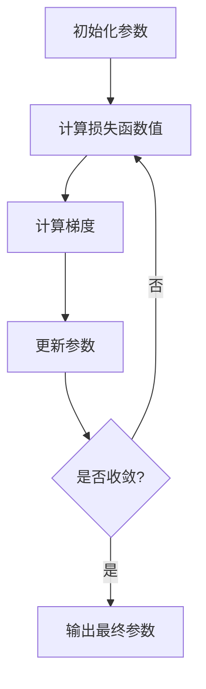

# 梯度下降Gradient Descent原理与代码实例讲解

## 1.背景介绍

在机器学习和深度学习领域中,优化算法扮演着至关重要的角色。它们用于调整模型的参数,使模型能够从训练数据中学习,并最小化损失函数或代价函数。梯度下降(Gradient Descent)是最常用和最基本的优化算法之一,广泛应用于线性回归、逻辑回归、神经网络等各种机器学习模型中。

梯度下降算法的基本思想是沿着目标函数的负梯度方向更新参数,从而逐步找到目标函数的最小值。它利用了微积分中的导数概念,通过计算目标函数关于参数的偏导数(梯度),确定参数更新的方向和步长。这种迭代式的参数更新过程持续进行,直到达到收敛条件或者满足预设的停止标准。

## 2.核心概念与联系

### 2.1 损失函数(Loss Function)

在监督学习中,我们需要定义一个损失函数或代价函数,用于衡量模型预测值与真实值之间的差距。常见的损失函数包括均方误差(Mean Squared Error, MSE)、交叉熵损失(Cross-Entropy Loss)等。梯度下降算法的目标就是最小化这个损失函数。

### 2.2 梯度(Gradient)

梯度是一个向量,它包含了目标函数关于每个参数的偏导数。梯度指向目标函数增长最快的方向,因此我们需要沿着梯度的反方向更新参数,以最快速度降低损失函数的值。

### 2.3 学习率(Learning Rate)

学习率决定了参数在梯度方向上的更新步长。一个较大的学习率可以加快收敛速度,但也可能导致无法收敛或发散。一个较小的学习率则可以保证收敛,但收敛速度会变慢。合理设置学习率对于梯度下降算法的性能至关重要。

### 2.4 局部最小值(Local Minima)

由于损失函数通常是非凸的,因此可能存在多个局部最小值。梯度下降算法可能会陷入局部最小值而无法找到全局最小值。为了避免这种情况,我们可以尝试不同的初始化参数、调整学习率、添加动量项等策略。

## 3.核心算法原理具体操作步骤

梯度下降算法的核心步骤如下:

1. 初始化模型参数,通常使用小的随机值。
2. 计算当前参数下的损失函数值。
3. 计算损失函数关于每个参数的梯度。
4. 使用学习率和梯度更新每个参数:

$$
\theta_i := \theta_i - \alpha \frac{\partial J(\theta)}{\partial \theta_i}
$$

其中 $\theta_i$ 是第 i 个参数, $\alpha$ 是学习率, $J(\theta)$ 是损失函数。

5. 重复步骤 2-4,直到达到收敛条件或满足停止标准。

梯度下降算法的流程图如下所示:



## 4.数学模型和公式详细讲解举例说明

### 4.1 线性回归中的梯度下降

考虑线性回归模型:

$$
y = \theta_0 + \theta_1 x
$$

其中 $\theta_0$ 和 $\theta_1$ 是需要学习的参数。我们定义均方误差(MSE)为损失函数:

$$
J(\theta_0, \theta_1) = \frac{1}{2m} \sum_{i=1}^m (h_\theta(x^{(i)}) - y^{(i)})^2
$$

其中 $m$ 是训练样本数量, $h_\theta(x^{(i)})$ 是模型对第 i 个样本的预测值, $y^{(i)}$ 是第 i 个样本的真实值。

我们可以计算损失函数关于 $\theta_0$ 和 $\theta_1$ 的偏导数:

$$
\begin{aligned}
\frac{\partial J(\theta_0, \theta_1)}{\partial \theta_0} &= \frac{1}{m} \sum_{i=1}^m (h_\theta(x^{(i)}) - y^{(i)}) \\
\frac{\partial J(\theta_0, \theta_1)}{\partial \theta_1} &= \frac{1}{m} \sum_{i=1}^m (h_\theta(x^{(i)}) - y^{(i)}) x^{(i)}
\end{aligned}
$$

然后使用梯度下降算法更新参数:

$$
\begin{aligned}
\theta_0 &:= \theta_0 - \alpha \frac{1}{m} \sum_{i=1}^m (h_\theta(x^{(i)}) - y^{(i)}) \\
\theta_1 &:= \theta_1 - \alpha \frac{1}{m} \sum_{i=1}^m (h_\theta(x^{(i)}) - y^{(i)}) x^{(i)}
\end{aligned}
$$

其中 $\alpha$ 是学习率。

### 4.2 逻辑回归中的梯度下降

在二分类问题中,我们可以使用逻辑回归模型:

$$
h_\theta(x) = \sigma(\theta^T x) = \frac{1}{1 + e^{-\theta^T x}}
$$

其中 $\sigma(z)$ 是 Sigmoid 函数, $\theta$ 是需要学习的参数向量。

我们定义交叉熵损失函数:

$$
J(\theta) = -\frac{1}{m} \sum_{i=1}^m \big[y^{(i)} \log(h_\theta(x^{(i)})) + (1 - y^{(i)}) \log(1 - h_\theta(x^{(i)}))\big]
$$

其中 $y^{(i)} \in \{0, 1\}$ 是第 i 个样本的真实标签。

我们可以计算损失函数关于 $\theta$ 的梯度:

$$
\frac{\partial J(\theta)}{\partial \theta} = \frac{1}{m} \sum_{i=1}^m (h_\theta(x^{(i)}) - y^{(i)}) x^{(i)}
$$

然后使用梯度下降算法更新参数:

$$
\theta := \theta - \alpha \frac{1}{m} \sum_{i=1}^m (h_\theta(x^{(i)}) - y^{(i)}) x^{(i)}
$$

## 5.项目实践：代码实例和详细解释说明

以下是使用 Python 和 NumPy 库实现线性回归的梯度下降算法的示例代码:

```python
import numpy as np

# 生成模拟数据
X = np.array([[1, 1], [1, 2], [1, 3], [1, 4], [1, 5]])
y = np.dot(X, np.array([2, 3])) + np.random.randn(5) # y = 2 + 3x + 噪声

# 初始化参数
theta = np.random.randn(2)

# 超参数设置
alpha = 0.01 # 学习率
iterations = 1000 # 迭代次数

# 梯度下降
for i in range(iterations):
    y_pred = np.dot(X, theta) # 预测值
    error = y_pred - y # 误差
    grad = np.dot(X.T, error) / X.shape[0] # 梯度
    theta = theta - alpha * grad # 更新参数

print(f"最终参数: theta = {theta}")
```

代码解释:

1. 首先生成模拟数据 `X` 和 `y`。`X` 是一个 5x2 的矩阵,每一行代表一个样本,包含两个特征值。`y` 是一个长度为 5 的向量,代表每个样本的真实值。
2. 初始化参数 `theta` 为一个长度为 2 的随机向量。
3. 设置超参数:学习率 `alpha` 和最大迭代次数 `iterations`。
4. 进入梯度下降循环:
   - 计算当前参数下的预测值 `y_pred`。
   - 计算预测值与真实值之间的误差 `error`。
   - 计算损失函数关于参数的梯度 `grad`。
   - 使用梯度和学习率更新参数 `theta`。
5. 循环结束后,输出最终的参数值 `theta`。

在这个示例中,我们使用线性回归模型 `y = theta[0] + theta[1] * x` 来拟合数据。梯度下降算法通过不断迭代更新参数 `theta`,最终找到最小化损失函数的参数值。

## 6.实际应用场景

梯度下降算法在实际应用中有着广泛的用途,包括但不限于以下几个方面:

1. **线性回归**: 用于预测连续型目标变量,如房价预测、销量预测等。
2. **逻辑回归**: 用于二分类问题,如垃圾邮件分类、疾病诊断等。
3. **神经网络**: 训练深度神经网络模型,如计算机视觉、自然语言处理等领域。
4. **推荐系统**: 协同过滤算法中的矩阵分解技术使用梯度下降优化。
5. **结构化预测**: 如图像分割、机器翻译等任务中使用结构化预测模型时,需要使用梯度下降进行优化。

梯度下降算法的优点是简单易懂、计算效率高、易于实现。但它也存在一些缺陷,如可能陷入局部最小值、收敛速度慢等。因此,在实际应用中,我们通常会使用梯度下降算法的变体,如随机梯度下降(Stochastic Gradient Descent)、小批量梯度下降(Mini-Batch Gradient Descent)、动量梯度下降(Momentum Gradient Descent)等,以提高算法的性能和收敛速度。

## 7.工具和资源推荐

### 7.1 Python 库

- **NumPy**: 提供了高性能的数值计算和线性代数运算功能,是实现梯度下降算法的基础。
- **scikit-learn**: 包含了线性回归、逻辑回归等经典机器学习模型,并提供了梯度下降优化器。
- **TensorFlow** 和 **PyTorch**: 两个流行的深度学习框架,内置了自动微分功能,可以方便地计算梯度并使用梯度下降优化神经网络模型。

### 7.2 在线资源

- **Andrew Ng 机器学习课程**: 这是一门经典的机器学习课程,详细介绍了梯度下降算法的原理和应用。(https://www.coursera.org/learn/machine-learning)
- **梯度下降算法可视化**: 一个交互式的网页,可视化梯度下降算法在不同情况下的表现。(https://www.cs.toronto.edu/~hinton/csc321/notes/lec6tutorial.pdf)
- **梯度下降算法博客**: 一些优秀的技术博客,深入探讨梯度下降算法的各种变体和优化技巧。

## 8.总结:未来发展趋势与挑战

梯度下降算法虽然简单而有效,但它也面临一些挑战和局限性:

1. **局部最小值问题**: 梯度下降算法可能会陷入局部最小值,无法找到全局最优解。
2. **收敛速度慢**: 在高维空间和复杂目标函数情况下,梯度下降算法的收敛速度往往较慢。
3. **超参数选择**: 学习率等超参数的选择对算法性能影响很大,但没有通用的选择方法。
4. **大规模数据集**: 对于大规模数据集,需要使用随机梯度下降等变体,但可能会引入额外的噪声和不稳定性。

为了解决这些挑战,研究人员提出了许多改进的优化算法,如动量梯度下降、RMSProp、Adam 等。这些算法在保留梯度下降简单性的同时,提高了收敛速度和稳定性。

另一个重要的发展方向是自动微分技术的广泛应用。自动微分可以高效地计算复杂函数的梯度,为梯度下降算法在深度学习等领域的应用提供了强大的支持。

未来,随着机器学习和深度学习在更多领域的应用,优化算法的研究和改进将持续进行,以满足更高效、更准确、更鲁棒的需求。梯度下降算法作为最基础的优化算法,将继续在这一过程中扮演重要角色。

## 9.附录:常见问题与解答

### 9.1 如何选择合适的学习率?

选