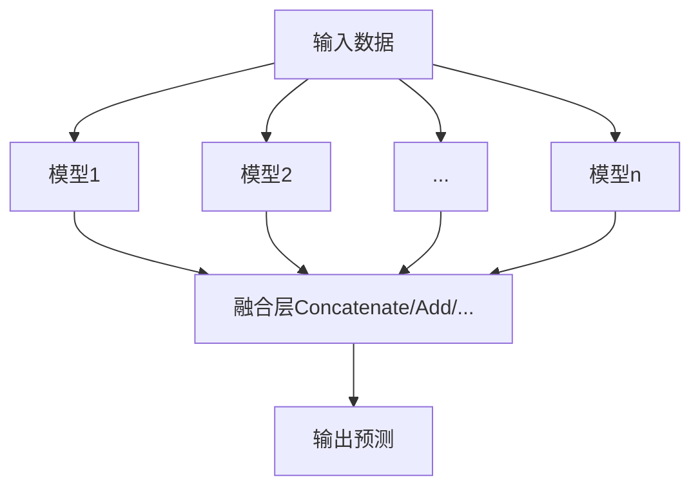

# 模型融合的"炼金术"：调参技巧与最佳实践

## 1. 背景介绍
### 1.1 模型融合的定义与意义
模型融合(Model Ensemble)是将多个模型的预测结果进行组合,从而提高整体预测性能的一种机器学习技术。通过融合不同模型的预测,可以减少单个模型的偏差和方差,提高模型的泛化能力和鲁棒性。
### 1.2 模型融合的发展历程
模型融合技术最早可以追溯到20世纪90年代的Bagging和Boosting等集成学习算法。近年来,随着深度学习的兴起,模型融合在各种挑战赛中大放异彩,成为夺冠的"秘密武器"。从图像分类到自然语言处理,从推荐系统到时间序列预测,模型融合几乎无处不在。
### 1.3 模型融合面临的挑战
尽管模型融合取得了巨大成功,但在实践中仍然面临诸多挑战:
- 如何选择合适的基础模型进行融合?
- 不同模型之间的权重如何分配?
- 如何平衡融合模型的复杂度和性能提升?
- 面对海量数据和超大规模模型,如何高效地进行融合?

本文将深入探讨模型融合的原理、方法和实践,揭示其中的"炼金术",助你掌握这一利器。

## 2. 核心概念与联系
### 2.1 偏差-方差权衡
偏差(Bias)和方差(Variance)是机器学习中的两个核心概念。偏差指模型的预测值与真实值之间的差异,反映了模型本身的拟合能力;方差指模型对不同训练数据的敏感程度,反映了模型的稳定性。
理想的模型应该同时具有低偏差和低方差,但现实中往往难以两全其美。单个模型容易陷入"高偏差"(欠拟合)或"高方差"(过拟合)的窘境。而模型融合正是通过组合多个模型的预测,在偏差和方差之间取得平衡。
### 2.2 集成学习范式 
集成学习(Ensemble Learning)是构建模型融合的重要范式。常见的集成学习方法包括:
- Bagging(Bootstrap Aggregating):从训练集中重复采样,构建多个基础模型,然后对其预测结果进行平均或投票。代表算法有随机森林(Random Forest)。
- Boosting:通过迭代训练多个弱学习器,每次根据上一轮的误差调整样本权重,最终将所有弱学习器的预测加权求和。代表算法有AdaBoost和GBDT。
- Stacking:将多个基础模型的预测结果作为新的特征,训练一个高层次的元模型(Meta-model)进行最终预测。
### 2.3 深度学习中的模型融合
近年来,模型融合在深度学习中得到广泛应用。一些典型做法包括:
- 多次训练:使用不同的随机种子、超参数、数据增强方式等,训练多个同构的深度模型,然后对其预测结果进行融合。
- 多模态融合:将图像、文本、语音等不同模态的数据输入到各自的深度模型中,然后在中间层或输出层进行特征融合。
- 知识蒸馏:用一个大型复杂的教师模型(Teacher Model)去指导一个小型简单的学生模型(Student Model),将知识从教师模型"蒸馏"到学生模型。

下图展示了深度学习中几种常见的模型融合架构:



## 3. 核心算法原理与操作步骤
### 3.1 加权平均融合
加权平均是最简单直观的融合方式。假设有$m$个基础模型,第$i$个模型对样本$x$的预测值为$f_i(x)$,对应的权重为$w_i$,则融合后的预测值为:

$$\hat{y} = \sum_{i=1}^{m} w_i \cdot f_i(x), \quad s.t. \sum_{i=1}^{m} w_i = 1$$

权重$w_i$可以是事先设定的固定值,也可以通过另一个机器学习模型来学习。

加权平均融合的主要步骤如下:
1. 训练$m$个基础模型$f_1, f_2, ..., f_m$;
2. 确定每个模型的权重$w_1, w_2, ..., w_m$;
3. 对每个样本$x$,计算各个模型的预测值$f_1(x), f_2(x), ..., f_m(x)$;
4. 根据公式计算加权平均,得到最终的预测值$\hat{y}$。

### 3.2 Stacking融合
Stacking是一种基于元学习的融合方法。它将$m$个基础模型的预测结果$f_1(x), f_2(x), ..., f_m(x)$作为新的特征向量,训练一个元模型$g$来学习如何组合这些预测值,从而得到最终预测$\hat{y} = g(f_1(x), f_2(x), ..., f_m(x))$。

Stacking融合的主要步骤如下:
1. 将数据划分为$k$折,每次用$k-1$折训练基础模型,剩下1折预测得到元特征;
2. 重复步骤1直到所有样本都有了元特征;
3. 用基础模型对全量数据训练并预测,将预测结果作为测试集的元特征;
4. 用步骤2得到的元特征训练元模型,用步骤3得到的元特征预测。

相比加权平均,Stacking能够学习到更复杂的模型组合方式,但也引入了额外的计算开销。

## 4. 数学模型与公式详解
### 4.1 Bagging的数学原理
Bagging通过自助采样(Bootstrap)从训练集中重复抽取$n$个样本(有放回),构建$m$个基础模型。每个基础模型$f_i$是从一个随机数据集$D_i$上训练得到的。

假设基础模型的预测服从均值为$\mu$,方差为$\sigma^2$的独立同分布,则Bagging的预测均值与方差为:

$$E(\hat{y}) = \frac{1}{m} \sum_{i=1}^{m} f_i(x) = \mu$$

$$Var(\hat{y}) = \frac{1}{m^2} \sum_{i=1}^{m} Var(f_i(x)) = \frac{\sigma^2}{m}$$

可见,Bagging通过投票或平均$m$个基础模型的预测,使得整体方差降低为原来的$\frac{1}{m}$,从而提高了模型的稳定性。

### 4.2 Boosting的数学原理
Boosting通过迭代训练一系列弱学习器$f_t(x)$,并赋予权重$\alpha_t$,最终的预测结果为加权求和:

$$\hat{y} = \sum_{t=1}^{T} \alpha_t f_t(x)$$

其中$\alpha_t$和$f_t(x)$通过最小化指数损失函数得到:

$$L(y, \hat{y}) = E_{x \sim D}[e^{-y\hat{y}}]$$

Adaboost算法证明,每次迭代后的指数损失函数值为:

$$L_t \leq \sqrt{(1-\epsilon_t)\epsilon_t} L_{t-1}$$

其中$\epsilon_t$为第$t$个弱学习器在分布$D_t$上的分类误差。因此,只要每个弱学习器的误差率小于0.5,Boosting就能够不断减小训练误差,提高模型性能。

## 5. 项目实践:代码实例与详解
下面以Sklearn为例,展示加权平均融合和Stacking融合的Python实现。

### 5.1 加权平均融合
```python
from sklearn.datasets import make_blobs
from sklearn.model_selection import train_test_split
from sklearn.svm import SVC
from sklearn.tree import DecisionTreeClassifier
from sklearn.ensemble import RandomForestClassifier
from sklearn.metrics import accuracy_score

# 生成随机数据
X, y = make_blobs(n_samples=10000, centers=2, random_state=42)
X_train, X_test, y_train, y_test = train_test_split(X, y, test_size=0.2, random_state=42)

# 定义基础模型
model1 = SVC(kernel='rbf', probability=True)
model2 = DecisionTreeClassifier(max_depth=10)  
model3 = RandomForestClassifier(n_estimators=100)

# 训练基础模型
model1.fit(X_train, y_train)
model2.fit(X_train, y_train)
model3.fit(X_train, y_train)

# 加权平均融合
weights = [0.3, 0.3, 0.4] # 权重可调
pred1 = model1.predict_proba(X_test)[:, 1]
pred2 = model2.predict_proba(X_test)[:, 1]  
pred3 = model3.predict_proba(X_test)[:, 1]
weighted_pred = weights[0]*pred1 + weights[1]*pred2 + weights[2]*pred3
weighted_pred = (weighted_pred > 0.5).astype(int)

print(f'Weighted Averaging Accuracy: {accuracy_score(y_test, weighted_pred)}')
```

### 5.2 Stacking融合
```python
from sklearn.datasets import make_blobs
from sklearn.model_selection import KFold
from sklearn.svm import SVC
from sklearn.tree import DecisionTreeClassifier  
from sklearn.ensemble import RandomForestClassifier
from sklearn.linear_model import LogisticRegression
from sklearn.metrics import accuracy_score

# 生成随机数据
X, y = make_blobs(n_samples=10000, centers=2, random_state=42)

# 定义基础模型 
models = [SVC(kernel='rbf', probability=True),
          DecisionTreeClassifier(max_depth=10),
          RandomForestClassifier(n_estimators=100)]

# 定义元模型
meta_model = LogisticRegression()

# 划分为5折交叉验证
kf = KFold(n_splits=5, shuffle=True, random_state=42)
meta_features = np.zeros((len(X), len(models)))

for i, (train_idx, val_idx) in enumerate(kf.split(X)):
    X_train, y_train = X[train_idx], y[train_idx]
    X_val, y_val = X[val_idx], y[val_idx]
    
    # 训练基础模型并生成元特征
    for j, model in enumerate(models):
        model.fit(X_train, y_train)
        pred = model.predict_proba(X_val)[:, 1]
        meta_features[val_idx, j] = pred
        
# 训练元模型
meta_model.fit(meta_features, y)

# 在全量数据上重新训练基础模型
test_meta_features = np.zeros((len(X), len(models)))
for i, model in enumerate(models):
    model.fit(X, y)
    pred = model.predict_proba(X)[:, 1]
    test_meta_features[:, i] = pred
    
# 元模型预测
meta_pred = meta_model.predict(test_meta_features)

print(f'Stacking Accuracy: {accuracy_score(y, meta_pred)}')
```

以上代码展示了如何使用Sklearn搭建加权平均融合和Stacking融合的模型。实践中,可以根据具体任务和数据集,选择合适的基础模型和融合策略。

## 6. 实际应用场景
模型融合几乎可以用于机器学习的所有领域。下面列举几个具体的应用案例:

### 6.1 计算机视觉
在图像分类、目标检测、语义分割等任务中,模型融合被广泛采用。常见的做法包括:
- 使用不同的主干网络(如ResNet、Inception等)训练多个模型,然后对其预测结果进行融合。
- 将同一张图像以不同的尺度、比例、角度等进行变换,输入到模型中预测,然后对预测结果进行融合。
- 融合2D网络和3D网络的预测结果,以提高视频识别的准确率。

### 6.2 自然语言处理
在文本分类、序列标注、机器翻译、阅读理解等任务中,模型融合技术也不可或缺。一些常用的策略有:
- 融合基于CNN、RNN、Transformer等不同结构的模型。
- 在预训练语言模型(如BERT、GPT等)的基础上,针对下游任务进行微调,然后进行模型融合。
- 将文本特征与其他模态(如语音、图像)的特征进行融合,实现多模态理解。

### 6.3 推荐系统