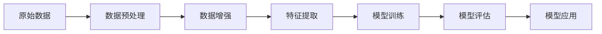

# 模式识别中的数据增强技术

## 1. 背景介绍

### 1.1 模式识别概述

模式识别是人工智能和机器学习领域的一个重要分支,其目标是通过计算机程序自动识别、分类和理解输入数据中的模式或规律。模式识别广泛应用于计算机视觉、语音识别、自然语言处理等领域,对于智能系统的构建具有重要意义。

### 1.2 数据增强的必要性

在模式识别任务中,训练数据的质量和数量对模型性能有着决定性的影响。然而,现实中高质量的标注数据往往难以获取,收集和标注大规模数据集需要大量的人力物力。数据增强技术通过对已有数据进行变换和组合,在不改变数据本质的情况下生成新的训练样本,从而扩充训练集、提高模型的泛化能力,在数据匮乏的情况下显得尤为重要。

### 1.3 数据增强的优势

数据增强具有以下优势:

1. 扩充训练数据,缓解数据不足问题
2. 提高模型泛化能力,增强模型鲁棒性
3. 减轻过拟合风险,改善模型性能
4. 数据收集成本低,操作灵活方便

## 2. 核心概念与联系

### 2.1 数据增强的定义

数据增强(Data Augmentation)是指在不改变数据语义信息的前提下,通过对原始数据进行一系列变换操作,人工合成新的训练样本,从而扩充训练集的一种方法。其本质是在特征空间中,利用先验知识对数据分布进行改变,生成与原始数据具有一定差异但仍然保持语义一致的新样本。

### 2.2 数据增强与迁移学习、少样本学习的关系

数据增强与迁移学习、少样本学习有着密切联系,它们都是应对训练数据不足问题的有效手段。

- 迁移学习利用源领域的知识来辅助目标领域的学习,减少对目标领域标注数据的需求。
- 少样本学习旨在利用少量样本快速学习新的概念,如何高效利用手中有限的数据是其核心问题。
- 数据增强通过数据变换生成新样本,直接从数据层面扩充训练集。

在实践中,这三种技术常常结合使用,以达到优化模型性能的目的。例如,利用迁移学习得到一个初步模型,再使用数据增强扩充数据进行微调。

### 2.3 数据增强在模式识别流程中的位置

下图展示了数据增强在模式识别流程中的位置:



数据增强一般在数据预处理之后、特征提取之前进行。原始数据经过预处理(如去噪、归一化等)后,利用数据增强生成新的训练样本,再提取特征送入模型训练。测试阶段则直接使用原始的测试集而不做数据增强。

## 3. 核心算法原理与具体操作步骤

### 3.1 基于几何变换的数据增强

几何变换是最常见的数据增强方式,主要包括:

- 平移:沿水平或垂直方向移动图像
- 旋转:按照指定角度旋转图像
- 缩放:按比例缩小或放大图像
- 翻转:水平/垂直翻转图像
- 裁剪:随机裁剪图像的局部区域

几何变换的步骤如下:

1. 设定变换参数,如平移距离、旋转角度、缩放比例等
2. 构建变换矩阵,将变换参数转化为矩阵形式 
3. 对图像中的每个像素坐标应用变换矩阵,得到变换后的坐标
4. 根据变换后的坐标对图像进行重采样,得到变换后的图像

### 3.2 基于颜色变换的数据增强

颜色变换通过调整图像的色彩来生成新样本,常见方法有:

- 亮度调整:改变图像整体亮度
- 对比度调整:改变图像明暗对比度
- 饱和度调整:改变图像色彩鲜艳程度
- 色相调整:改变图像色调
- 颜色抖动:对像素的颜色值添加随机扰动
- PCA抖动:沿RGB通道的主成分方向添加扰动

颜色变换的一般步骤为:

1. 将图像从RGB空间转换到HSV、LAB等颜色空间
2. 对相应通道的值进行调整,如加减常数、乘除系数等
3. 将调整后的图像转换回RGB空间

### 3.3 基于随机擦除的数据增强

随机擦除(Random Erasing)是一种模拟遮挡的数据增强方法。其思想是随机在图像中"擦除"一块矩形区域,用随机值或图像均值填充,模拟真实场景中的遮挡情况。随机擦除可以提高模型对遮挡的鲁棒性。

其具体步骤为:

1. 随机选择图像中的一个矩形区域
2. 用随机值或图像均值填充该区域
3. 重复多次,每次独立进行

### 3.4 基于混合的数据增强

基于混合的数据增强利用多个样本的组合来合成新样本,代表方法有:

- Mixup:按照一定比例对两个样本的特征和标签进行线性组合
- Cutmix:从一个样本中随机裁剪一个区域,粘贴到另一个样本对应位置,标签按面积比例组合
- Cutout:随机将图像中的某些区域"剪除",置为0值或随机值,类似随机擦除

以Mixup为例,其数学表达式为:

$$\tilde{x} = \lambda x_i + (1-\lambda)x_j$$
$$\tilde{y} = \lambda y_i + (1-\lambda)y_j$$

其中$x_i$和$x_j$是两个原始样本,$y_i$和$y_j$是它们的one-hot标签,$\lambda$是混合比例系数,通常从Beta分布中采样。混合后得到新样本$\tilde{x}$和$\tilde{y}$用于训练。

## 4. 数学模型和公式详细讲解举例说明

本节以图像平移变换为例,详细推导其数学模型。

### 4.1 平移变换的数学模型

设原图像上的一个像素坐标为$(x,y)$,平移变换后的坐标为$(x',y')$,平移量为$(tx,ty)$,则有:

$$x' = x + tx$$
$$y' = y + ty$$

用矩阵形式表示为:

$$
\begin{bmatrix}
x' \\
y' \\
1
\end{bmatrix}
=
\begin{bmatrix}
1 & 0 & tx \\
0 & 1 & ty \\
0 & 0 & 1  
\end{bmatrix}
\begin{bmatrix}
x \\
y \\
1
\end{bmatrix}
$$

其中:

$$
T =
\begin{bmatrix}
1 & 0 & tx \\
0 & 1 & ty \\
0 & 0 & 1  
\end{bmatrix}
$$

称为平移变换矩阵。

### 4.2 平移变换的代码实现

以Python和OpenCV为例,实现图像平移变换的代码如下:

```python
import cv2
import numpy as np

# 读取图像
img = cv2.imread('test.jpg')
rows, cols = img.shape[:2]

# 设置平移量
tx, ty = 100, 50

# 构建平移矩阵
M = np.float32([[1, 0, tx], [0, 1, ty]])

# 进行平移变换
dst = cv2.warpAffine(img, M, (cols, rows))

# 显示结果
cv2.imshow('original', img)
cv2.imshow('translation', dst)
cv2.waitKey(0)
```

这里使用了OpenCV的`warpAffine`函数进行平移变换,其中`M`是根据公式构建的平移矩阵。

### 4.3 其他几何变换的数学模型

除平移变换外,其他几何变换的数学模型如下:

旋转变换:

$$
R =
\begin{bmatrix}
\cos\theta & -\sin\theta & 0 \\
\sin\theta & \cos\theta  & 0 \\
0          & 0           & 1
\end{bmatrix}
$$

其中$\theta$为旋转角度。

缩放变换:

$$
S =
\begin{bmatrix}
s_x & 0   & 0 \\
0   & s_y & 0 \\
0   & 0   & 1  
\end{bmatrix}
$$

其中$s_x$和$s_y$分别为水平和垂直方向的缩放因子。

翻转变换:

水平翻转:
$$
F_x =
\begin{bmatrix}
-1 & 0 & w-1 \\
0  & 1 & 0   \\
0  & 0 & 1
\end{bmatrix}
$$

垂直翻转:
$$
F_y =
\begin{bmatrix}
1 & 0  & 0   \\
0 & -1 & h-1 \\
0 & 0  & 1
\end{bmatrix}
$$

其中$w$和$h$分别为图像宽度和高度。

## 5. 项目实践:代码实例和详细解释说明

下面给出一个使用PyTorch实现Mixup数据增强的完整代码示例:

```python
import torch
import numpy as np

def mixup_data(x, y, alpha=1.0):
    '''Mixup数据增强
    
    Args:
        x: 输入特征,tensor
        y: 输入标签,tensor
        alpha: Beta分布的参数,取值越大生成的新样本越接近原样本
        
    Returns:
        mixed_x: 混合后的特征
        mixed_y: 混合后的标签
    '''
    if alpha > 0:
        lam = np.random.beta(alpha, alpha)
    else:
        lam = 1
    
    batch_size = x.size()[0]
    index = torch.randperm(batch_size)
    
    mixed_x = lam * x + (1 - lam) * x[index, :]
    mixed_y = lam * y + (1 - lam) * y[index]
    return mixed_x, mixed_y

class MixupDataset(torch.utils.data.Dataset):
    '''带Mixup增强的数据集
    
    Args:
        dataset: 原始数据集
        alpha: Mixup的参数
    '''
    def __init__(self, dataset, alpha):
        self.dataset = dataset
        self.alpha = alpha
        
    def __getitem__(self, index):
        x, y = self.dataset[index]
        mixed_x, mixed_y = mixup_data(x, y, self.alpha)
        return mixed_x, mixed_y
    
    def __len__(self):
        return len(self.dataset)
```

代码说明:

- `mixup_data`函数实现了Mixup增强的核心逻辑,输入两个样本的特征和标签,输出混合后的特征和标签。
- `lam`是混合比例,从Beta(alpha, alpha)分布中采样得到。`alpha`是Beta分布的参数,控制混合后样本与原样本的接近程度。
- `index`是一个随机排列,用于确定每个样本的混合对象。
- 特征`x`和标签`y`分别按照`lam`和`1-lam`的比例进行线性组合,得到混合后的`mixed_x`和`mixed_y`。
- `MixupDataset`是一个带Mixup增强的数据集封装,继承自`torch.utils.data.Dataset`。
- 在`__getitem__`方法中,对原始数据集采样得到的每个样本都进行Mixup增强。
- 使用时,只需将原始数据集传入`MixupDataset`,就可以方便地得到一个带Mixup增强的新数据集。

使用示例:

```python
from torchvision import datasets, transforms

# 原始数据集
train_data = datasets.CIFAR10(root='./data', train=True, download=True, transform=transforms.ToTensor())

# Mixup增强数据集
train_data_mixup = MixupDataset(train_data, alpha=1.0)

# 数据加载器  
train_loader_mixup = torch.utils.data.DataLoader(train_data_mixup, batch_size=128, shuffle=True)

# 训练代码
for x, y in train_loader_mixup:
    ...
```

以上就是使用PyTorch实现Mixup数据增强的完整示例,通过封装成`MixupDataset`,可以方便地将其应用到各种训练流程中。

## 6. 实际应用场景

数据增强在模