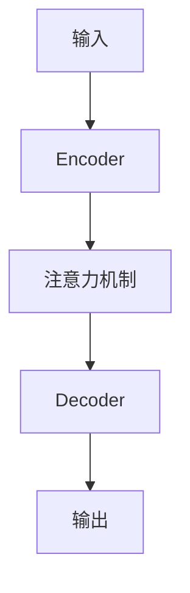

# 注意力机制可视化原理与代码实战案例讲解

## 1.背景介绍
### 1.1 注意力机制的起源与发展
#### 1.1.1 注意力机制的起源
#### 1.1.2 注意力机制在深度学习中的应用发展历程
#### 1.1.3 注意力机制为何能取得突破性进展

### 1.2 注意力机制的重要性
#### 1.2.1 注意力机制在自然语言处理中的重要地位
#### 1.2.2 注意力机制在计算机视觉中的广泛应用
#### 1.2.3 注意力机制对其他领域的影响

### 1.3 本文的主要内容与贡献
#### 1.3.1 本文的研究目的
#### 1.3.2 本文的主要内容
#### 1.3.3 本文的创新点与贡献

## 2.核心概念与联系
### 2.1 注意力机制的定义与分类
#### 2.1.1 注意力机制的定义
#### 2.1.2 注意力机制的分类
#### 2.1.3 不同类型注意力机制的特点与联系

### 2.2 注意力机制与其他机制的区别与联系
#### 2.2.1 注意力机制与RNN的区别与联系
#### 2.2.2 注意力机制与CNN的区别与联系
#### 2.2.3 注意力机制与Transformer的区别与联系

### 2.3 注意力机制的核心思想
#### 2.3.1 注意力分布的计算
#### 2.3.2 注意力权重的应用
#### 2.3.3 注意力机制的可解释性

### 2.4 注意力机制的可视化原理
#### 2.4.1 注意力可视化的重要性
#### 2.4.2 注意力可视化的基本原理
#### 2.4.3 常见的注意力可视化方法



## 3.核心算法原理具体操作步骤
### 3.1 Soft Attention
#### 3.1.1 Soft Attention的基本原理
#### 3.1.2 Soft Attention的计算过程
#### 3.1.3 Soft Attention的优缺点分析

### 3.2 Hard Attention
#### 3.2.1 Hard Attention的基本原理 
#### 3.2.2 Hard Attention的计算过程
#### 3.2.3 Hard Attention的优缺点分析

### 3.3 Self-Attention
#### 3.3.1 Self-Attention的基本原理
#### 3.3.2 Self-Attention的计算过程 
#### 3.3.3 Self-Attention的优缺点分析

### 3.4 Multi-Head Attention
#### 3.4.1 Multi-Head Attention的提出背景
#### 3.4.2 Multi-Head Attention的基本原理
#### 3.4.3 Multi-Head Attention的计算过程

## 4.数学模型和公式详细讲解举例说明
### 4.1 Soft Attention的数学模型
#### 4.1.1 Soft Attention的注意力权重计算公式
$$ \alpha_{ij} = \frac{exp(e_{ij})}{\sum_{k=1}^{T_x}exp(e_{ik})} $$
其中$e_{ij}$表示查询$q_i$和键值$k_j$的注意力得分。

#### 4.1.2 Soft Attention的上下文向量计算公式
$$ c_i = \sum_{j=1}^{T_x} \alpha_{ij}h_j $$
其中$h_j$表示编码器隐藏状态。

#### 4.1.3 Soft Attention的例子说明
假设有一个英语到法语的机器翻译任务,编码器输出为$h=[h_1,h_2,h_3]$,解码器当前隐藏状态为$s_t$。我们可以计算:

$$
e_t = [s_t^Th_1, s_t^Th_2, s_t^Th_3] \\
\alpha_t = softmax(e_t) \\
c_t = \alpha_t \cdot h
$$

最后将$c_t$作为解码器的附加输入。

### 4.2 Self-Attention的数学模型
#### 4.2.1 Self-Attention的注意力权重计算公式
$$ \alpha_{ij} = \frac{exp(e_{ij})}{\sum_{k=1}^{n}exp(e_{ik})} $$

$$ e_{ij} = \frac{(W_q x_i)^T(W_k x_j)}{\sqrt{d_k}} $$

其中$W_q$和$W_k$是可学习的权重矩阵,$d_k$是缩放因子。

#### 4.2.2 Self-Attention的输出计算公式
$$ z_i = \sum_{j=1}^n \alpha_{ij}(W_v x_j) $$
其中$W_v$也是可学习的权重矩阵。

#### 4.2.3 Self-Attention的例子说明
假设有一个句子"The animal didn't cross the street because it was too tired"。我们想知道"it"指代的是什么。

通过Self-Attention,模型可以学习到"it"和"animal"的注意力权重较大,从而判断出"it"指代的是"animal"。

### 4.3 Multi-Head Attention的数学模型
#### 4.3.1 Multi-Head Attention的并行计算公式
$$
\begin{aligned}
MultiHead(Q, K, V) &= Concat(head_1,...,head_h)W^O \\
head_i &= Attention(QW_i^Q, KW_i^K, VW_i^V)
\end{aligned}
$$

其中$W_i^Q, W_i^K, W_i^V, W^O$都是可学习的权重矩阵。

#### 4.3.2 Multi-Head Attention的优势
Multi-Head Attention允许模型在不同的表示子空间里计算注意力,捕捉更丰富的信息。不同的头可以关注不同的方面。

#### 4.3.3 Multi-Head Attention的例子说明
对于一个情感分析任务,一个注意力头可能关注情感词,另一个头可能关注否定词,再一个头可能关注程度副词。多个头综合起来可以更好地判断情感倾向。

## 5.项目实践：代码实例和详细解释说明
### 5.1 基于Soft Attention的图像字幕生成
#### 5.1.1 项目背景与目标
#### 5.1.2 数据集准备
#### 5.1.3 模型构建
##### 5.1.3.1 CNN Encoder
```python
class CNNEncoder(nn.Module):
    def __init__(self, embed_size):
        super(CNNEncoder, self).__init__()
        resnet = models.resnet152(pretrained=True)
        modules = list(resnet.children())[:-1] 
        self.resnet = nn.Sequential(*modules)
        self.embed = nn.Linear(resnet.fc.in_features, embed_size)
        
    def forward(self, images):
        features = self.resnet(images)
        features = features.view(features.size(0), -1)
        features = self.embed(features)
        return features
```

##### 5.1.3.2 RNN Decoder with Attention
```python
class RNNDecoder(nn.Module):
    def __init__(self, embed_size, hidden_size, vocab_size, num_layers=1):
        super(RNNDecoder, self).__init__()
        self.embed_size = embed_size
        self.hidden_size = hidden_size
        self.vocab_size = vocab_size
        
        self.embed = nn.Embedding(vocab_size, embed_size)
        self.lstm = nn.LSTM(embed_size, hidden_size, num_layers, batch_first=True)
        self.linear = nn.Linear(hidden_size, vocab_size)
        self.attn = nn.Linear(hidden_size, 1)
        
    def forward(self, features, captions):
        embeddings = self.embed(captions)
        embeddings = torch.cat((features.unsqueeze(1), embeddings), 1)
        hiddens, _ = self.lstm(embeddings)
        
        attn_weights = F.softmax(self.attn(hiddens), dim=1)
        context = attn_weights * hiddens
        context = context.sum(1)
        
        outputs = self.linear(context)
        return outputs
```

#### 5.1.4 训练与测试
#### 5.1.5 可视化分析

### 5.2 基于Self-Attention的文本分类
#### 5.2.1 项目背景与目标
#### 5.2.2 数据集准备
#### 5.2.3 模型构建
##### 5.2.3.1 Embedding Layer
```python
class Embedder(nn.Module):
    def __init__(self, vocab_size, d_model):
        super().__init__()
        self.embed = nn.Embedding(vocab_size, d_model)
    def forward(self, x):
        return self.embed(x)
```

##### 5.2.3.2 Self-Attention Layer
```python
class SelfAttention(nn.Module):
    def __init__(self, d_model, num_heads):
        super().__init__()
        self.d_model = d_model
        self.num_heads = num_heads
        self.head_dim = d_model // num_heads
        
        self.q = nn.Linear(d_model, d_model)
        self.k = nn.Linear(d_model, d_model)
        self.v = nn.Linear(d_model, d_model)
        
        self.out = nn.Linear(d_model, d_model)
        
    def forward(self, x):
        batch_size, seq_len, _ = x.size()
        
        q = self.q(x).view(batch_size, seq_len, self.num_heads, self.head_dim).transpose(1,2)
        k = self.k(x).view(batch_size, seq_len, self.num_heads, self.head_dim).transpose(1,2)
        v = self.v(x).view(batch_size, seq_len, self.num_heads, self.head_dim).transpose(1,2)
        
        attn_scores = torch.matmul(q, k.transpose(-2, -1)) / math.sqrt(self.head_dim)
        attn_probs = F.softmax(attn_scores, dim=-1)
        
        context = torch.matmul(attn_probs, v)
        context = context.transpose(1, 2).contiguous().view(batch_size, seq_len, self.d_model)
        
        return self.out(context)
```

#### 5.2.4 训练与测试
#### 5.2.5 可视化分析

## 6.实际应用场景
### 6.1 机器翻译
#### 6.1.1 注意力机制在机器翻译中的应用现状
#### 6.1.2 基于注意力机制的机器翻译系统架构
#### 6.1.3 注意力机制在机器翻译中的优势与挑战

### 6.2 图像字幕生成
#### 6.2.1 注意力机制在图像字幕生成中的应用现状
#### 6.2.2 基于注意力机制的图像字幕生成系统架构 
#### 6.2.3 注意力机制在图像字幕生成中的优势与挑战

### 6.3 语音识别
#### 6.3.1 注意力机制在语音识别中的应用现状
#### 6.3.2 基于注意力机制的语音识别系统架构
#### 6.3.3 注意力机制在语音识别中的优势与挑战

### 6.4 推荐系统
#### 6.4.1 注意力机制在推荐系统中的应用现状
#### 6.4.2 基于注意力机制的推荐系统架构
#### 6.4.3 注意力机制在推荐系统中的优势与挑战

## 7.工具和资源推荐
### 7.1 注意力机制的开源实现
#### 7.1.1 TensorFlow中的注意力机制实现
#### 7.1.2 PyTorch中的注意力机制实现
#### 7.1.3 其他深度学习框架中的注意力机制实现

### 7.2 注意力机制的可视化工具
#### 7.2.1 BertViz
#### 7.2.2 OpenAI的Activation Atlas
#### 7.2.3 其他注意力可视化工具

### 7.3 相关论文与资源
#### 7.3.1 注意力机制的经典论文
#### 7.3.2 注意力机制的综述论文
#### 7.3.3 注意力机制的教程与课程

## 8.总结：未来发展趋势与挑战
### 8.1 注意力机制的研究前沿
#### 8.1.1 注意力机制与知识图谱的结合
#### 8.1.2 注意力机制在多模态学习中的应用
#### 8.1.3 注意力机制的可解释性研究

### 8.2 注意力机制面临的挑战
#### 8.2.1 注意力机制的计算效率问题
#### 8.2.2 长距离依赖建模的困难
#### 8.2.3 注意力机制的过拟合问题

### 8.3 注意力机制的未来发展方向
#### 8.3.1 更高效的注意力机制变体
#### 8.3.2 注意力机制与符号推理的结合
#### 8.3.3 注意力机制在更广泛领域的应用探索

## 9.附录：常见问