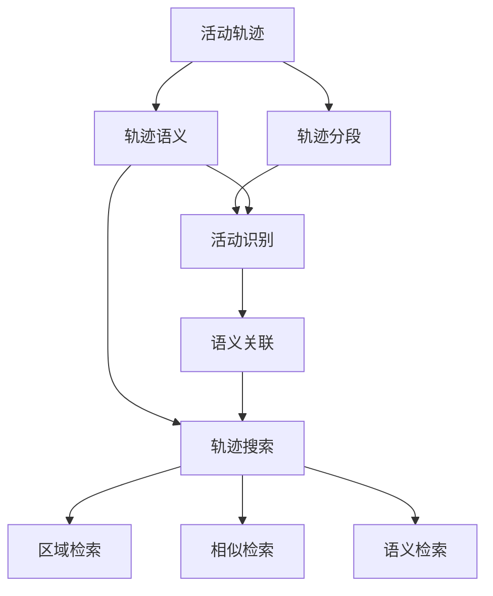

# 活动轨迹的语义表达与搜索技术研究

## 1. 背景介绍

### 1.1 活动轨迹数据的重要性

在当今数字化时代,人们的日常活动越来越多地被记录下来,形成了海量的活动轨迹数据。这些数据蕴含着丰富的个人行为模式和社会动态信息,对于理解人类活动、优化城市规划、提升服务质量等方面具有重要的价值。然而,如何有效地表达、组织和检索这些活动轨迹数据,是一个亟待解决的问题。

### 1.2 活动轨迹数据面临的挑战

活动轨迹数据通常具有以下特点:

1. 数据量大:随着定位设备的普及和传感器技术的发展,活动轨迹数据呈现爆炸式增长。
2. 数据异构:活动轨迹数据来源广泛,包括GPS、Wi-Fi、移动通信等多种形式,不同来源的数据格式和精度差异较大。
3. 语义缺失:原始的活动轨迹数据通常只包含时空坐标信息,缺乏对活动内容和语义的描述。
4. 隐私敏感:活动轨迹数据与个人隐私密切相关,如何在保护隐私的同时进行数据分析和挖掘是一大挑战。

### 1.3 研究目标和意义

本文旨在探索活动轨迹数据的语义表达与搜索技术,主要研究目标包括:

1. 提出一种富有语义信息的活动轨迹表示模型,能够刻画活动的时空特征、内容主题和关联关系。
2. 设计高效的活动轨迹索引和查询算法,支持灵活多样的检索需求,如区域检索、相似轨迹检索等。  
3. 构建面向活动轨迹的语义搜索系统原型,验证所提出方法的有效性和实用性。

本研究对于挖掘活动轨迹数据的价值、支撑智慧城市建设具有重要意义,同时也为其他时空数据管理领域提供了新的思路和参考。

## 2. 核心概念与联系

### 2.1 活动轨迹

活动轨迹是指人在移动过程中形成的一系列时空点的序列,记录了人的位置变化和活动历史。形式化地,一条活动轨迹可表示为$T=<p_1,p_2,...,p_n>$,其中$p_i=(l_i,t_i),i=1,2,...n$表示第$i$个时空点,$l_i$为空间位置坐标,$t_i$为对应的时间戳。

### 2.2 轨迹语义

轨迹语义是指与轨迹相关联的高层次语义信息,用于描述和解释轨迹所蕴含的活动内容、行为模式等。常见的轨迹语义包括:

- 活动类型:如工作、就餐、娱乐、购物等。
- 活动主题:如与"体育"、"音乐"等主题相关的活动。
- 活动关系:如两个活动在时间、空间、功能等方面的关联。

### 2.3 轨迹语义提取

轨迹语义提取是指从原始轨迹数据中发现和提炼语义信息的过程。主要任务包括:

- 轨迹分段:将完整轨迹划分为多个语义相关的子轨迹段。
- 活动识别:判断每个轨迹段所对应的活动类型。
- 语义关联:挖掘不同轨迹段之间的语义关系,构建语义网络。

常用的轨迹语义提取方法有基于规则的方法、基于概率模型的方法和基于深度学习的方法等。

### 2.4 轨迹搜索

轨迹搜索是指根据用户的信息需求,快速准确地从海量轨迹数据库中检索出相关的轨迹。常见的轨迹搜索类型有:

- 区域检索:查找经过指定区域的轨迹。
- 相似检索:查找与输入轨迹相似的轨迹。
- 语义检索:查找满足特定语义条件的轨迹,如"找出所有去过博物馆的轨迹"。

轨迹搜索的关键是设计高效的索引结构和相似度度量,以支持快速、可扩展的查询处理。

### 2.5 概念关系图

下图展示了活动轨迹语义表达与搜索中的核心概念及其关系:

## 3. 核心算法原理与操作步骤

### 3.1 轨迹语义表示模型

本文提出一种基于主题-活动-时空三元组(TAS)的轨迹语义表示模型。形式化地,给定一条轨迹$T=<p_1,p_2,...,p_n>$,其语义表示为一组三元组的集合:

$$S(T)=\{<topic_i,activity_i,<l_i,t_i>>\},i=1,2,...,m$$

其中,$topic_i$表示第$i$个活动的主题,$activity_i$表示具体的活动类型,$(l_i,t_i)$为活动发生的位置和时间。通过这种三元组的形式,可以灵活地刻画轨迹的语义内容,并支持丰富的语义关联分析。

### 3.2 轨迹语义提取算法

#### 3.2.1 轨迹分段算法

轨迹分段的目的是将轨迹划分为多个语义相关的子轨迹段。本文采用基于速度和方向变化的分段算法,主要步骤如下:

1. 计算轨迹中每两个连续点之间的速度和方向变化。
2. 根据速度和方向变化的阈值,识别出潜在的分段点。
3. 对潜在分段点进行合并和过滤,得到最终的分段结果。

#### 3.2.2 活动识别算法

活动识别的任务是判断每个轨迹段所对应的活动类型。本文采用基于隐马尔可夫模型(HMM)的活动识别算法,主要步骤如下:

1. 特征提取:对每个轨迹段提取时空特征和上下文