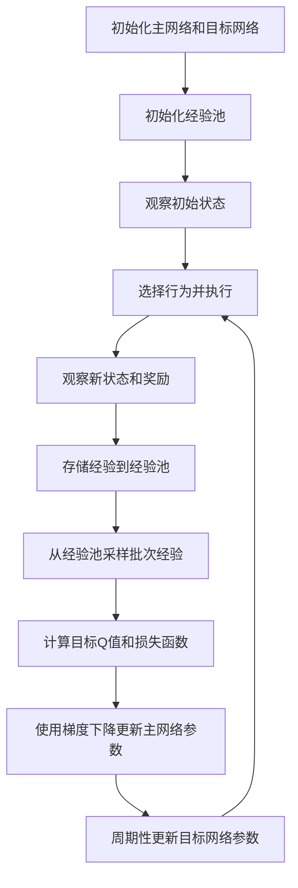

# 深度 Q 网络(DQN)原理与代码实战案例讲解

## 1.背景介绍

### 1.1 强化学习概述

强化学习(Reinforcement Learning)是机器学习的一个重要分支,它关注智能体(Agent)如何在一个不确定的环境中通过试错学习并作出一系列行为,以最大化预期的累积奖励。与监督学习和无监督学习不同,强化学习没有给定的输入/输出对样本,而是通过与环境的交互来学习。

强化学习的核心思想是利用价值函数(Value Function)来评估当前状态的好坏,并选择能够最大化未来预期奖励的行为。价值函数通常基于贝尔曼方程(Bellman Equation)进行更新和迭代,从而逐步逼近最优策略。

### 1.2 Q-Learning 算法

Q-Learning 是强化学习中最经典和最广泛使用的算法之一。它通过学习一个行为价值函数 Q(s, a),来评估在状态 s 下采取行为 a 的价值。Q-Learning 算法的核心思想是通过不断更新 Q 值表,逐步找到最优策略。

然而,传统的 Q-Learning 算法存在一些局限性:

1. 状态空间和行为空间过大时,维护 Q 值表变得不现实。
2. 对于连续状态和行为空间,无法使用查表的方式。
3. 无法处理视觉等高维输入数据。

为了解决这些问题,DeepMind 在 2015 年提出了深度 Q 网络(Deep Q-Network, DQN),将深度神经网络引入到 Q-Learning 算法中,从而能够处理高维输入数据,并通过函数逼近的方式来估计 Q 值,极大地扩展了强化学习的应用范围。

## 2.核心概念与联系

### 2.1 深度 Q 网络(DQN)概述

深度 Q 网络(DQN)是一种结合深度神经网络和 Q-Learning 的强化学习算法。它的核心思想是使用一个深度神经网络来近似 Q 函数,从而能够处理高维输入数据,如图像、视频等。

DQN 算法的主要步骤如下:

1. 使用一个深度神经网络作为 Q 函数的近似器,输入为当前状态,输出为每个可能行为对应的 Q 值。
2. 在每个时间步,选择 Q 值最大的行为作为下一步的行为。
3. 执行选择的行为,观察到新的状态和奖励。
4. 使用新的状态和奖励,根据贝尔曼方程计算目标 Q 值。
5. 使用目标 Q 值和网络输出的 Q 值计算损失函数。
6. 通过梯度下降法更新神经网络的参数,使网络输出的 Q 值逼近目标 Q 值。

### 2.2 经验回放(Experience Replay)

在传统的 Q-Learning 算法中,数据是按时间序列顺序处理的,这可能会导致相关性较高的数据被连续处理,从而影响学习效率。为了解决这个问题,DQN 引入了经验回放(Experience Replay)机制。

经验回放的核心思想是将智能体与环境的交互过程中获得的经验(状态、行为、奖励、新状态)存储在一个经验池(Replay Buffer)中。在训练过程中,从经验池中随机采样一批经验,用于神经网络的训练。这种方式能够打破数据的相关性,提高数据的利用效率。

### 2.3 目标网络(Target Network)

在 DQN 算法中,使用两个神经网络:

1. 主网络(Main Network):用于选择行为和生成 Q 值估计。
2. 目标网络(Target Network):用于计算目标 Q 值,以稳定训练过程。

目标网络的参数是主网络参数的复制,但在一定步长后才会更新。这种方式能够减小主网络参数更新带来的不稳定性,提高算法的收敛性能。

### 2.4 DQN 算法流程图

下面是 DQN 算法的整体流程图:



## 3.核心算法原理具体操作步骤

### 3.1 DQN 算法伪代码

下面是 DQN 算法的伪代码:

```python
初始化主网络 Q 和目标网络 Q_target 参数相同
初始化经验池 D
观察初始状态 s
for episode in range(num_episodes):
    while not done:
        使用 ε-贪婪策略从 Q(s) 选择行为 a
        执行行为 a，观察新状态 s'，获得奖励 r
        将 (s, a, r, s') 存储到经验池 D 中
        从 D 中随机采样一批经验 (s_j, a_j, r_j, s'_j)
        计算目标 Q 值 y_j = r_j + γ * max_a' Q_target(s'_j, a')
        计算损失函数 L = (y_j - Q(s_j, a_j))^2
        使用梯度下降法更新主网络 Q 的参数
        s = s'
    每 C 步复制主网络 Q 的参数到目标网络 Q_target
```

### 3.2 算法步骤详解

1. **初始化主网络和目标网络**

   初始化两个神经网络,主网络 Q 用于选择行为和生成 Q 值估计,目标网络 Q_target 用于计算目标 Q 值。初始时,两个网络的参数相同。

2. **初始化经验池**

   初始化一个经验池 D,用于存储智能体与环境的交互经验。

3. **观察初始状态**

   观察环境的初始状态 s。

4. **选择行为并执行**

   使用 ε-贪婪策略从主网络 Q(s) 中选择行为 a,并在环境中执行该行为。ε-贪婪策略意味着有一定概率随机选择行为,以探索新的状态。

5. **观察新状态和奖励**

   执行行为后,观察到新的状态 s' 和获得的奖励 r。

6. **存储经验到经验池**

   将 (s, a, r, s') 这个经验存储到经验池 D 中。

7. **从经验池采样批次经验**

   从经验池 D 中随机采样一批经验 (s_j, a_j, r_j, s'_j)。

8. **计算目标 Q 值和损失函数**

   使用目标网络 Q_target 计算目标 Q 值:

   $$y_j = r_j + \gamma \max_{a'} Q_\text{target}(s'_j, a')$$

   其中 $\gamma$ 是折现因子,用于平衡当前奖励和未来奖励的权重。

   计算主网络输出的 Q 值与目标 Q 值之间的均方差作为损失函数:

   $$L = \sum_j (y_j - Q(s_j, a_j))^2$$

9. **使用梯度下降更新主网络参数**

   使用梯度下降法,根据损失函数 L 的梯度更新主网络 Q 的参数。

10. **周期性更新目标网络参数**

    每隔一定步长 C,将主网络 Q 的参数复制到目标网络 Q_target,以保持目标网络的稳定性。

重复执行步骤 4-10,直到达到终止条件(如最大回合数或任务完成)。

## 4.数学模型和公式详细讲解举例说明

### 4.1 贝尔曼方程

贝尔曼方程是强化学习中的核心概念,用于描述价值函数与奖励和状态转移概率之间的关系。在 DQN 算法中,我们使用 Q 函数作为行为价值函数,它满足以下贝尔曼方程:

$$Q(s, a) = \mathbb{E}_{r, s'}\left[r + \gamma \max_{a'} Q(s', a')\right]$$

其中:

- $Q(s, a)$ 表示在状态 s 下执行行为 a 的行为价值函数。
- $r$ 表示执行行为 a 后获得的即时奖励。
- $s'$ 表示执行行为 a 后转移到的新状态。
- $\gamma$ 是折现因子,用于平衡当前奖励和未来奖励的权重,取值范围为 $[0, 1]$。
- $\max_{a'} Q(s', a')$ 表示在新状态 $s'$ 下选择最优行为所对应的最大 Q 值,代表了未来可获得的最大预期奖励。

贝尔曼方程描述了 Q 值是由当前奖励加上折现后的未来最大预期奖励组成。DQN 算法的目标就是找到一个近似函数,使其输出的 Q 值满足贝尔曼方程。

### 4.2 目标 Q 值计算

在 DQN 算法中,我们使用目标网络 Q_target 来计算目标 Q 值,以稳定训练过程。目标 Q 值的计算公式如下:

$$y_j = r_j + \gamma \max_{a'} Q_\text{target}(s'_j, a')$$

其中:

- $y_j$ 表示第 j 个样本的目标 Q 值。
- $r_j$ 表示第 j 个样本获得的即时奖励。
- $s'_j$ 表示第 j 个样本转移到的新状态。
- $\gamma$ 是折现因子。
- $\max_{a'} Q_\text{target}(s'_j, a')$ 表示在新状态 $s'_j$ 下,使用目标网络 Q_target 选择最优行为所对应的最大 Q 值。

目标 Q 值 $y_j$ 是根据贝尔曼方程计算得到的,它代表了第 j 个样本在执行最优策略时的真实 Q 值。在训练过程中,我们希望主网络 Q 的输出值逼近目标 Q 值,从而学习到最优的 Q 函数近似。

### 4.3 损失函数

为了使主网络 Q 的输出值逼近目标 Q 值,我们定义了均方差损失函数:

$$L = \sum_j (y_j - Q(s_j, a_j))^2$$

其中:

- $y_j$ 是第 j 个样本的目标 Q 值。
- $Q(s_j, a_j)$ 是主网络对于第 j 个样本状态 $s_j$ 和行为 $a_j$ 的 Q 值输出。

损失函数 L 衡量了主网络输出的 Q 值与目标 Q 值之间的差距。在训练过程中,我们使用梯度下降法来最小化这个损失函数,从而使主网络的输出值逼近目标 Q 值。

### 4.4 Q 值估计

在 DQN 算法中,我们使用一个深度神经网络来近似 Q 函数。神经网络的输入是当前状态 s,输出是每个可能行为对应的 Q 值:

$$Q(s, a_1), Q(s, a_2), \dots, Q(s, a_n)$$

其中 $n$ 是可能行为的数量。

在每个时间步,我们选择 Q 值最大的行为作为下一步的行为:

$$a^* = \arg\max_a Q(s, a)$$

通过不断更新神经网络的参数,使其输出的 Q 值逼近目标 Q 值,我们就可以逐步学习到最优的 Q 函数近似,从而找到最优策略。

## 5.项目实践:代码实例和详细解释说明

在这一部分,我们将使用 PyTorch 框架实现一个简单的 DQN 算法,并在 CartPole 环境中进行训练和测试。CartPole 是一个经典的强化学习环境,目标是通过向左或向右施加力,使杆子保持直立并使小车在轨道上平衡。

### 5.1 导入所需库

```python
import gym
import math
import random
import numpy as np
import matplotlib.pyplot as plt
from collections import namedtuple, deque
from itertools import count

import torch
import torch.nn as nn
import torch.optim as optim
import torch.nn.functional as F
```

### 5.2 定义 DQN 