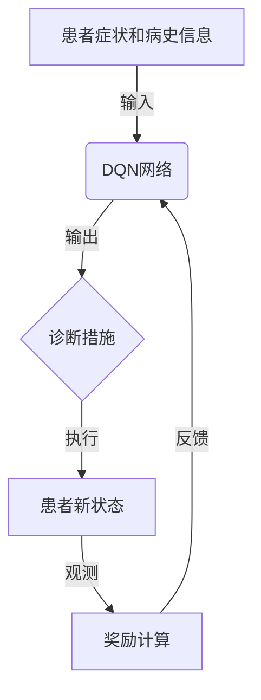

# 深度 Q-learning：在智能医疗诊断中的应用

## 1.背景介绍

### 1.1 医疗诊断的重要性与挑战

医疗诊断是医疗保健系统中至关重要的一个环节。准确及时的诊断不仅能够为患者提供适当的治疗方案,还能够降低医疗资源的浪费,提高医疗系统的效率。然而,医疗诊断过程存在着诸多挑战:

1. 疾病症状的复杂性和多样性
2. 医生的专业知识有限
3. 医疗资源分布不均等

传统的医疗诊断过程主要依赖于医生的经验和判断,这使得诊断的准确性和一致性受到影响。因此,需要开发智能化的医疗诊断系统,以提高诊断的质量和效率。

### 1.2 人工智能在医疗诊断中的应用

人工智能技术在医疗诊断领域展现出了巨大的潜力。通过机器学习和深度学习算法,智能系统能够从海量的医疗数据中学习和发现隐藏的模式,从而提高诊断的准确性。目前,人工智能已经在多个医疗领域取得了令人鼓舞的成就,如影像诊断、基因组学分析和药物开发等。

## 2.核心概念与联系

### 2.1 强化学习概述

强化学习(Reinforcement Learning)是机器学习的一个重要分支,它致力于开发能够通过与环境交互并获得反馈来学习的智能体。强化学习算法旨在找到一种策略,使得智能体在给定的环境中获得最大的累积奖励。

强化学习过程可以概括为以下几个要素:

- 环境(Environment)
- 状态(State)
- 动作(Action)
- 奖励(Reward)
- 策略(Policy)

强化学习算法通过不断尝试不同的动作,观察状态的变化并获得相应的奖励,从而学习到一个最优的策略。

### 2.2 Q-learning算法

Q-learning是强化学习中最著名和最广泛使用的算法之一。它属于无模型的强化学习算法,不需要事先了解环境的转移概率模型。Q-learning算法通过维护一个Q函数(Q-function),来估计在给定状态下采取某个动作所能获得的累积奖励。

Q函数的更新公式如下:

$$Q(s_t, a_t) \leftarrow Q(s_t, a_t) + \alpha \big[r_t + \gamma \max_a Q(s_{t+1}, a) - Q(s_t, a_t)\big]$$

其中:

- $s_t$表示时刻t的状态
- $a_t$表示时刻t采取的动作
- $r_t$表示时刻t获得的即时奖励
- $\alpha$是学习率
- $\gamma$是折现因子

通过不断更新Q函数,算法最终会收敛到一个最优的策略。

### 2.3 深度Q-网络(Deep Q-Network, DQN)

传统的Q-learning算法在处理大规模、高维的问题时会遇到维数灾难的挑战。深度Q-网络(DQN)则是将深度神经网络引入到Q-learning中,用于估计Q函数。

DQN的核心思想是使用一个深度神经网络来近似Q函数,其输入为当前状态,输出为在该状态下所有可能动作的Q值。通过训练该神经网络,DQN能够从原始的高维观测数据中自动提取有用的特征,从而更好地估计Q函数。

DQN算法的关键技术包括:

- 经验回放(Experience Replay)
- 目标网络(Target Network)
- 双重Q-learning

这些技术有助于提高DQN的训练稳定性和性能。

### 2.4 智能医疗诊断中的DQN应用

在智能医疗诊断任务中,可以将整个诊断过程建模为一个强化学习问题:

- 环境即患者的病情和症状
- 状态为患者的各项检查指标和病史信息
- 动作为医生可以采取的诊断措施,如开具新的检查项目、调整治疗方案等
- 奖励为正确诊断的分数

通过应用DQN算法,智能诊断系统可以学习到一个最优的诊断策略,从而提高诊断的准确性和效率。

该过程可以用以下流程图直观地表示:

通过不断地与患者交互、获取反馈,DQN网络可以持续优化诊断策略,最终达到高水平的诊断能力。

## 3.核心算法原理具体操作步骤

### 3.1 DQN算法流程

DQN算法的具体流程如下:

1. 初始化深度Q网络和目标Q网络,两个网络的权重参数相同。
2. 初始化经验回放池(Experience Replay Pool)。
3. 对于每个时间步:
    a. 根据当前状态$s_t$,通过深度Q网络选择动作$a_t$。
    b. 执行动作$a_t$,观测到新的状态$s_{t+1}$和即时奖励$r_t$。
    c. 将($s_t$, $a_t$, $r_t$, $s_{t+1}$)存入经验回放池。
    d. 从经验回放池中随机采样一个批次的转换($s_j$, $a_j$, $r_j$, $s_{j+1}$)。
    e. 计算目标Q值:
        $$y_j = r_j + \gamma \max_{a'} Q_{\text{target}}(s_{j+1}, a')$$
    f. 计算当前Q值:
        $$Q_{\text{current}}(s_j, a_j)$$
    g. 计算损失函数:
        $$L = \mathbb{E}\big[(y_j - Q_{\text{current}}(s_j, a_j))^2\big]$$
    h. 使用梯度下降算法更新深度Q网络的参数,最小化损失函数。
    i. 每隔一定步骤,将深度Q网络的权重复制到目标Q网络。
4. 重复步骤3,直到算法收敛。

### 3.2 关键技术详解

#### 3.2.1 经验回放(Experience Replay)

在传统的Q-learning算法中,样本数据是按顺序存储和使用的。这种方式存在两个主要问题:

1. 相邻的数据样本之间存在强烈的相关性,会导致训练过程的高方差。
2. 一旦环境发生变化,之前的数据就会过时失效。

经验回放技术的核心思想是将智能体与环境的互动过程存储在一个回放池中,并在训练时从中随机采样数据进行训练。这种方式能够打破数据样本之间的相关性,降低训练过程的方差。同时,回放池中存储的是历史经验,能够反映环境的长期状态分布,从而提高算法的稳定性和鲁棒性。

#### 3.2.2 目标网络(Target Network)

在DQN算法中,我们维护两个独立的Q网络:

- 深度Q网络(Current Network):用于选择动作并进行参数更新。
- 目标Q网络(Target Network):用于计算目标Q值,其参数是深度Q网络的复制。

目标Q网络的作用是提高训练的稳定性。如果直接使用深度Q网络来计算目标Q值,那么由于网络参数在不断更新,目标Q值也会随之变化,这会导致训练过程的不稳定。而目标Q网络的参数是固定的(每隔一定步骤才从深度Q网络复制一次),因此能够给出相对稳定的目标Q值,从而提高训练的稳定性和收敛性。

#### 3.2.3 双重Q-learning

传统的Q-learning算法在计算目标Q值时,会存在过估计的问题。这是因为目标Q值是通过取最大值计算的,而神经网络在估计Q值时往往会存在一定的偏差和噪声。

双重Q-learning算法的思想是维护两个独立的Q网络,分别用于选择动作和评估动作。具体来说,我们使用一个Q网络(深度Q网络)来选择动作,另一个Q网络(目标Q网络)来评估该动作的Q值。这种分离的方式能够减小过估计的影响,提高算法的性能。

双重Q-learning的目标Q值计算公式如下:

$$y_j = r_j + \gamma Q_{\text{target}}\big(s_{j+1}, \arg\max_a Q_{\text{current}}(s_{j+1}, a)\big)$$

其中,我们使用深度Q网络选择最优动作,但使用目标Q网络评估该动作的Q值。

## 4.数学模型和公式详细讲解举例说明

### 4.1 Q-learning更新公式

Q-learning算法的核心是通过不断更新Q函数,来逼近最优的状态-动作值函数。Q函数的更新公式如下:

$$Q(s_t, a_t) \leftarrow Q(s_t, a_t) + \alpha \big[r_t + \gamma \max_a Q(s_{t+1}, a) - Q(s_t, a_t)\big]$$

其中:

- $s_t$表示时刻t的状态
- $a_t$表示时刻t采取的动作
- $r_t$表示时刻t获得的即时奖励
- $\alpha$是学习率,控制了新信息对Q值更新的影响程度
- $\gamma$是折现因子,用于权衡即时奖励和未来奖励的重要性

让我们通过一个简单的例子来理解这个更新过程。

假设我们有一个简单的网格世界,智能体的目标是从起点到达终点。每一步行走都会获得-1的奖励,到达终点时获得+100的奖励。我们初始化Q函数为全0,学习率$\alpha=0.1$,折现因子$\gamma=0.9$。

在第一个时间步,智能体处于起点状态$s_0$,选择向右移动的动作$a_0$,获得即时奖励$r_0=-1$,进入新状态$s_1$。根据Q函数更新公式,我们有:

$$\begin{aligned}
Q(s_0, a_0) &\leftarrow Q(s_0, a_0) + \alpha \big[r_0 + \gamma \max_a Q(s_1, a) - Q(s_0, a_0)\big] \\
            &= 0 + 0.1 \big[-1 + 0.9 \max_a Q(s_1, a) - 0\big] \\
            &= -0.1 + 0.09 \max_a Q(s_1, a)
\end{aligned}$$

由于$Q(s_1, a)$初始化为0,因此$\max_a Q(s_1, a) = 0$,所以$Q(s_0, a_0) = -0.1$。

通过不断重复这个更新过程,Q函数会逐渐收敛到最优的状态-动作值函数,从而指导智能体采取最优的策略。

### 4.2 DQN损失函数

在DQN算法中,我们使用一个深度神经网络来近似Q函数。为了训练这个神经网络,我们需要定义一个损失函数,用于衡量网络输出的Q值与真实的Q值之间的差距。

DQN算法的损失函数定义如下:

$$L = \mathbb{E}\big[(y_j - Q(s_j, a_j; \theta))^2\big]$$

其中:

- $y_j$是目标Q值,根据下式计算:
    $$y_j = r_j + \gamma \max_{a'} Q(s_{j+1}, a'; \theta^-)$$
    这里$\theta^-$表示目标Q网络的参数,是固定的。
- $Q(s_j, a_j; \theta)$是当前深度Q网络在状态$s_j$下对动作$a_j$的Q值估计,其中$\theta$是网络的参数。
- $\mathbb{E}[\cdot]$表示对批次数据的期望,即对损失函数求均值。

在训练过程中,我们通过minimizing梯度下降算法来优化网络参数$\theta$,使得损失函数最小化,从而使网络输出的Q值逼近真实的Q值。

例如,假设我们有一个简单的医疗诊断任务,患者的状态由三个指标($x_1, x_2, x_3$)表示,动作空间包括两种诊断措施($a_1, a_2$)。我们可以使用一个三层的全连接神