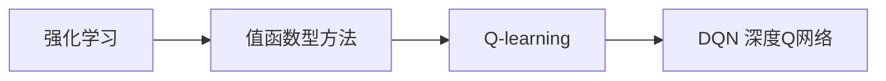

# 深度 Q-learning：在智能家居中的应用

## 1. 背景介绍
### 1.1 智能家居的兴起
随着物联网、人工智能等技术的快速发展,智能家居已经成为现实生活中不可或缺的一部分。智能家居通过互联网将家中的各种设备连接起来,实现设备的智能化和自动化,为人们的生活带来了极大的便利。
### 1.2 智能家居面临的挑战  
尽管智能家居为人们的生活带来了诸多益处,但仍面临一些亟待解决的问题和挑战:
- 设备协同工作:家中各种设备的协同工作是智能家居的关键,如何实现不同设备间的无缝衔接和联动控制是一大挑战。
- 个性化需求:不同用户对智能家居有不同的使用习惯和个性化需求,智能家居系统需要能够自适应学习并满足用户的个性化需求。
- 能耗优化:智能家居涉及众多电器设备,如何优化能源使用效率,实现节能减排也是一个值得关注的问题。
### 1.3 深度强化学习在智能家居中的应用前景
深度强化学习作为人工智能的前沿技术之一,为解决上述智能家居面临的挑战提供了新的思路。深度强化学习算法可以通过自主学习用户行为模式,不断优化智能家居的控制策略,在满足用户个性化需求的同时提高能源利用效率。将深度强化学习应用于智能家居具有广阔的应用前景。

## 2. 核心概念与联系
### 2.1 强化学习
强化学习(Reinforcement Learning)是机器学习的一个重要分支,它强调如何基于环境而行动,以取得最大化的预期利益。强化学习的目标是学习一个最优策略,使智能体在与环境的交互过程中获得最大的累积奖励。
### 2.2 Q-learning
Q-learning是一种值函数型的无模型强化学习方法。Q-learning算法通过学习动作值函数(Q函数)来选择最优动作。Q函数评估在某一状态下采取特定动作的长期回报,Q值越大意味着动作的长期回报越高。
### 2.3 深度Q网络(DQN)
深度Q网络(Deep Q-Network, DQN)将深度学习与Q-learning相结合,用深度神经网络逼近Q函数,将高维状态映射到对应动作的Q值。DQN克服了传统Q-learning难以处理高维状态空间的局限性,增强了强化学习的泛化和表示能力。
### 2.4 核心概念之间的关系
下图展示了强化学习、Q-learning和DQN之间的关系:


## 3. 核心算法原理与具体步骤
### 3.1 Q-learning算法原理
Q-learning的核心思想是学习一个动作值函数Q(s,a),表示在状态s下选择动作a的长期回报。Q函数的更新遵循贝尔曼方程:
$$Q(s,a) \leftarrow Q(s,a) + \alpha [r + \gamma \max_{a'}Q(s',a') - Q(s,a)]$$
其中,$\alpha$是学习率,$\gamma$是折扣因子,r是即时奖励,s'是采取动作a后转移到的新状态。
### 3.2 DQN算法原理
DQN算法使用深度神经网络来逼近Q函数,将状态作为网络的输入,输出各个动作的Q值。DQN的损失函数定义为:
$$L(\theta) = \mathbb{E}_{(s,a,r,s')\sim D}[(r + \gamma \max_{a'}Q(s',a';\theta^-) - Q(s,a;\theta))^2]$$
其中,$\theta$是Q网络的参数,$\theta^-$是目标网络的参数,D是经验回放池。DQN通过最小化损失函数来更新Q网络参数。
### 3.3 DQN算法的具体步骤
1. 初始化Q网络参数$\theta$和目标网络参数$\theta^-$
2. 初始化经验回放池D
3. for episode = 1 to M do
    1. 初始化初始状态s
    2. while s不是终止状态 do
        1. 根据$\epsilon$-贪婪策略选择动作a
        2. 执行动作a,观察奖励r和新状态s'
        3. 将转移样本(s,a,r,s')存入D
        4. 从D中随机采样一个batch的转移样本
        5. 计算目标值$y=r+\gamma \max_{a'}Q(s',a';\theta^-)$
        6. 最小化损失$L(\theta) = (y - Q(s,a;\theta))^2$,更新Q网络参数$\theta$
        7. 每C步同步目标网络参数$\theta^-=\theta$
        8. s = s'
    3. end while
4. end for

## 4. 数学模型和公式详细讲解
### 4.1 马尔可夫决策过程(MDP)
强化学习问题可以用马尔可夫决策过程(Markov Decision Process, MDP)来建模。MDP由一个五元组$(S,A,P,R,\gamma)$构成:
- 状态空间S:智能体所处的环境状态的集合
- 动作空间A:智能体可执行的动作的集合
- 转移概率P:状态转移的概率分布,$P(s'|s,a)$表示在状态s下执行动作a后转移到状态s'的概率
- 奖励函数R:智能体执行动作后获得的即时奖励,$R(s,a)$表示在状态s下执行动作a获得的即时奖励
- 折扣因子$\gamma$:未来奖励的折扣系数,取值范围[0,1]
MDP的目标是寻找一个最优策略$\pi^*$,使得智能体在MDP中获得的期望累积奖励最大化:
$$\pi^* = \arg\max_{\pi} \mathbb{E}[\sum_{t=0}^{\infty} \gamma^t R(s_t,a_t)]$$
### 4.2 贝尔曼方程
Q函数满足贝尔曼方程:
$$Q(s,a) = R(s,a) + \gamma \sum_{s' \in S} P(s'|s,a) \max_{a'} Q(s',a')$$
贝尔曼方程揭示了状态-动作值函数的递归性质,即当前状态-动作对的长期价值等于即时奖励加上下一状态的最大Q值的折扣。
### 4.3 时序差分(TD)学习
Q-learning算法基于时序差分(Temporal Difference, TD)学习,它使用TD误差来更新Q函数:
$$\delta_t = R(s_t,a_t) + \gamma \max_{a'} Q(s_{t+1},a') - Q(s_t,a_t)$$
TD误差表示了当前Q值估计和TD目标值之间的差异,Q-learning通过最小化TD误差来更新Q函数。
### 4.4 DQN的损失函数
DQN的损失函数可以看作是最小化TD误差的均方误差:
$$L(\theta) = \mathbb{E}_{(s,a,r,s')\sim D}[(r + \gamma \max_{a'}Q(s',a';\theta^-) - Q(s,a;\theta))^2]$$
其中,TD目标值$y=r+\gamma \max_{a'}Q(s',a';\theta^-)$由目标网络计算得到,而当前Q值$Q(s,a;\theta)$则由Q网络计算。最小化损失函数可以使Q网络的输出逼近TD目标值,从而学习到最优的Q函数。

## 5. 项目实践:代码实例与详细解释
下面给出了使用PyTorch实现DQN算法的核心代码,并对关键部分进行详细解释。
### 5.1 Q网络
```python
class QNetwork(nn.Module):
    def __init__(self, state_dim, action_dim, hidden_dim):
        super(QNetwork, self).__init__()
        self.fc1 = nn.Linear(state_dim, hidden_dim)
        self.fc2 = nn.Linear(hidden_dim, hidden_dim)
        self.fc3 = nn.Linear(hidden_dim, action_dim)
        
    def forward(self, state):
        x = F.relu(self.fc1(state))
        x = F.relu(self.fc2(x))
        return self.fc3(x)
```
Q网络使用了三层全连接神经网络,输入为状态,输出为各个动作的Q值。其中,state_dim为状态维度,action_dim为动作维度,hidden_dim为隐藏层维度。
### 5.2 经验回放池
```python
class ReplayBuffer:
    def __init__(self, capacity):
        self.capacity = capacity
        self.buffer = []
        self.position = 0
    
    def push(self, state, action, reward, next_state, done):
        if len(self.buffer) < self.capacity:
            self.buffer.append(None)
        self.buffer[self.position] = (state, action, reward, next_state, done)
        self.position = (self.position + 1) % self.capacity
    
    def sample(self, batch_size):
        batch = random.sample(self.buffer, batch_size)
        state, action, reward, next_state, done = zip(*batch)
        return state, action, reward, next_state, done
    
    def __len__(self):
        return len(self.buffer)
```
经验回放池用于存储智能体与环境交互得到的转移样本,capacity为回放池的容量。push方法将转移样本存入回放池,sample方法从回放池中随机采样一个batch的样本用于训练。
### 5.3 DQN智能体
```python
class DQNAgent:
    def __init__(self, state_dim, action_dim, hidden_dim, lr, gamma, epsilon, target_update):
        self.action_dim = action_dim
        self.q_network = QNetwork(state_dim, action_dim, hidden_dim)
        self.target_network = QNetwork(state_dim, action_dim, hidden_dim)
        self.optimizer = optim.Adam(self.q_network.parameters(), lr=lr)
        self.gamma = gamma
        self.epsilon = epsilon
        self.target_update = target_update
        self.count = 0
        
    def act(self, state):
        if np.random.rand() <= self.epsilon:
            return np.random.randint(self.action_dim)
        else:
            state = torch.FloatTensor(state).unsqueeze(0)
            q_values = self.q_network(state)
            action = q_values.argmax().item()
            return action
        
    def train(self, replay_buffer, batch_size):
        if len(replay_buffer) < batch_size:
            return
        
        state, action, reward, next_state, done = replay_buffer.sample(batch_size)
        
        state = torch.FloatTensor(np.array(state))
        action = torch.LongTensor(action)
        reward = torch.FloatTensor(reward)
        next_state = torch.FloatTensor(np.array(next_state))
        done = torch.FloatTensor(done)
        
        q_values = self.q_network(state)
        q_value = q_values.gather(1, action.unsqueeze(1)).squeeze(1)
        
        next_q_values = self.target_network(next_state)
        next_q_value = next_q_values.max(1)[0]
        expected_q_value = reward + self.gamma * next_q_value * (1 - done)
        
        loss = (q_value - expected_q_value.detach()).pow(2).mean()
        
        self.optimizer.zero_grad()
        loss.backward()
        self.optimizer.step()
        
        self.count += 1
        if self.count % self.target_update == 0:
            self.target_network.load_state_dict(self.q_network.state_dict())
```
DQNAgent封装了DQN算法的核心逻辑,包括Q网络、目标网络、优化器、$\epsilon$-贪婪策略、目标网络更新等。act方法根据当前状态选择动作,train方法从回放池中采样样本对Q网络进行训练,并定期同步目标网络的参数。
### 5.4 训练过程
```python
def train_dqn(env, agent, replay_buffer, num_episodes, batch_size):
    rewards = []
    for episode in range(num_episodes):
        state = env.reset()
        episode_reward = 0
        done = False
        while not done:
            action = agent.act(state)
            next_state, reward, done, _ = env.step(action)
            replay_buffer.push(state, action, reward, next_state, done)
            state = next_state
            episode_reward += reward
            agent.train(replay_buffer, batch_size)
        rewards.append(episode_reward)
        print(f"Episode {episode+1}: Reward = {episode_reward}")
    return rewards
```
训练函数train_dqn实现了DQN算法的训练过程。在每个episode中,智能体与环境进行交互,将转移样本存入回放池,并从回放池中采样样本对Q网络进行训练,不断提高智能体的决策能力。

## 6. 实际应用场景
DQN算法在智能家居领域有广泛的