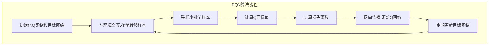

# 深度 Q-learning：在航空航天中的应用

## 1. 背景介绍

### 1.1 强化学习简介

强化学习(Reinforcement Learning, RL)是机器学习的一个重要分支,它关注智能体(Agent)如何在与环境(Environment)的交互过程中,通过试错学习和累积经验,自主获取最优策略(Policy),以最大化预期的长期回报(Reward)。与监督学习和无监督学习不同,强化学习没有给定的输入-输出示例数据集,智能体需要通过与环境的不断交互来学习。

强化学习的核心思想是"奖惩机制",即智能体根据当前状态采取行动,环境会对该行动给出反馈(奖励或惩罚),智能体据此调整策略,以期在后续行动中获得更大的累积奖励。这种学习方式类似于人类或动物的学习过程,通过不断试错、获取经验,逐步优化行为策略。

### 1.2 Q-learning算法

Q-learning是强化学习中最著名和最成功的算法之一,它属于无模型(Model-free)的临时差分(Temporal Difference, TD)学习方法。Q-learning的核心思想是估计一个行动价值函数(Action-Value Function),也称为Q函数,用于评估在某个状态下采取某个行动的价值。通过不断更新Q函数,智能体可以逐步找到最优策略。

Q-learning算法的优点是无需建立环境的显式模型,只需与环境交互即可学习,具有较强的通用性。但传统的Q-learning在处理大规模、高维状态空间时,往往会遇到"维数灾难"(Curse of Dimensionality)的问题,导致学习效率低下。

### 1.3 深度学习与深度强化学习

深度学习(Deep Learning)是机器学习的一个新的研究热点,它通过构建深层神经网络模型,有望解决传统机器学习方法遇到的"维数灾难"等问题。将深度学习与强化学习相结合,产生了深度强化学习(Deep Reinforcement Learning, DRL)这一新兴研究领域。

深度Q网络(Deep Q-Network, DQN)是深度强化学习的一个经典算法,它使用深层神经网络来逼近Q函数,克服了传统Q-learning在高维状态空间下的局限性。DQN算法在许多任务中表现出色,如Atari视频游戏、机器人控制等,推动了深度强化学习的发展。

## 2. 核心概念与联系

### 2.1 马尔可夫决策过程

马尔可夫决策过程(Markov Decision Process, MDP)是强化学习问题的数学形式化描述。一个MDP可以用一个五元组来表示:

$$\langle \mathcal{S}, \mathcal{A}, \mathcal{P}, \mathcal{R}, \gamma \rangle$$

其中:
- $\mathcal{S}$ 是有限的状态集合
- $\mathcal{A}$ 是有限的行动集合
- $\mathcal{P}$ 是状态转移概率函数,定义了在当前状态 $s$ 下执行行动 $a$ 后,转移到下一状态 $s'$ 的概率 $\mathcal{P}(s'|s,a)$
- $\mathcal{R}$ 是奖励函数,定义了在当前状态 $s$ 下执行行动 $a$ 后,获得的即时奖励 $\mathcal{R}(s,a)$
- $\gamma \in [0, 1)$ 是折现因子,用于权衡即时奖励和长期累积奖励的重要性

强化学习的目标是找到一个最优策略 $\pi^*$,使得在该策略指导下,智能体可以获得最大化的预期长期累积奖励。

### 2.2 Q-learning算法原理

Q-learning算法的核心是估计一个行动价值函数 $Q(s,a)$,表示在状态 $s$ 下执行行动 $a$,之后能获得的预期长期累积奖励。Q函数满足以下贝尔曼最优方程:

$$Q^*(s,a) = \mathbb{E}_{s' \sim \mathcal{P}}\left[R(s,a) + \gamma \max_{a'} Q^*(s',a')\right]$$

其中 $\mathbb{E}_{s' \sim \mathcal{P}}[\cdot]$ 表示对下一状态 $s'$ 的期望,由状态转移概率函数 $\mathcal{P}$ 决定。

Q-learning算法通过不断与环境交互,根据观测到的状态转移和奖励,迭代更新Q函数的估计值,直至收敛到最优Q函数 $Q^*$。更新规则如下:

$$Q(s,a) \leftarrow Q(s,a) + \alpha \left[R(s,a) + \gamma \max_{a'} Q(s',a') - Q(s,a)\right]$$

其中 $\alpha$ 是学习率,控制更新幅度。

当Q函数收敛后,智能体只需在每个状态 $s$ 选择具有最大Q值的行动 $a^* = \arg\max_a Q(s,a)$,就可以获得最优策略 $\pi^*$。

### 2.3 深度Q网络(DQN)

传统的Q-learning算法在处理高维状态空间时,需要维护一个巨大的Q表格,这将导致计算和存储资源的浪费,并且无法有效地推广到新的状态。深度Q网络(DQN)的思想是使用深层神经网络来逼近Q函数,从而解决"维数灾难"问题。

DQN的核心是一个参数化的Q网络 $Q(s,a;\theta)$,其中 $\theta$ 是网络的权重参数。该网络将状态 $s$ 作为输入,输出所有可能行动的Q值 $Q(s,a;\theta)$。通过minimizing均方误差损失函数:

$$\mathcal{L}(\theta) = \mathbb{E}_{(s,a,r,s')\sim D}\left[\left(r + \gamma \max_{a'} Q(s',a';\theta^-) - Q(s,a;\theta)\right)^2\right]$$

来更新网络参数 $\theta$,其中 $D$ 是经验回放池(Experience Replay Buffer),用于存储智能体与环境交互的转移样本 $(s,a,r,s')$;$\theta^-$ 是目标网络(Target Network)的权重参数,用于估计 $\max_{a'} Q(s',a';\theta^-)$ 以提高训练稳定性。

通过不断优化Q网络,DQN算法可以逐步学习到近似最优的Q函数,并据此获得最优策略。

## 3. 核心算法原理具体操作步骤

DQN算法的具体操作步骤如下:

1. **初始化Q网络和目标网络**

初始化一个Q网络 $Q(s,a;\theta)$ 和一个目标网络 $Q(s,a;\theta^-)$,两个网络的初始权重参数相同,即 $\theta^- \leftarrow \theta$。

2. **初始化经验回放池**

创建一个经验回放池 $D$,用于存储智能体与环境交互的转移样本 $(s,a,r,s')$。

3. **与环境交互,存储转移样本**

在每个时间步,智能体根据当前Q网络输出的Q值,选择一个行动 $a_t$。可采用 $\epsilon$-贪婪策略,以一定概率 $\epsilon$ 选择随机行动,否则选择Q值最大的行动。

执行选定的行动 $a_t$,观测到环境的反馈:下一状态 $s_{t+1}$ 和即时奖励 $r_t$。将转移样本 $(s_t,a_t,r_t,s_{t+1})$ 存储到经验回放池 $D$ 中。

4. **采样小批量样本**

从经验回放池 $D$ 中随机采样一个小批量的转移样本 $(s_j,a_j,r_j,s_j')$。

5. **计算Q目标值**

对于每个样本 $(s_j,a_j,r_j,s_j')$,计算其Q目标值:

$$y_j = r_j + \gamma \max_{a'} Q(s_j',a';\theta^-)$$

其中 $Q(s_j',a';\theta^-)$ 是目标网络在状态 $s_j'$ 下对所有行动 $a'$ 的Q值估计,取其最大值作为目标Q值。

6. **计算损失函数**

计算Q网络在当前小批量样本上的均方误差损失:

$$\mathcal{L}(\theta) = \frac{1}{N}\sum_{j=1}^{N}\left(y_j - Q(s_j,a_j;\theta)\right)^2$$

其中 $N$ 是小批量样本的数量。

7. **反向传播,更新Q网络**

使用反向传播算法和优化器(如RMSProp或Adam),根据损失函数的梯度,更新Q网络的权重参数 $\theta$。

8. **定期更新目标网络**

每隔一定步数(如1000步),将Q网络的权重参数 $\theta$ 复制到目标网络,即 $\theta^- \leftarrow \theta$,以提高训练稳定性。

9. **重复3-8步,直至收敛**

重复执行步骤3到8,直至Q网络收敛,得到近似最优的Q函数估计。

10. **生成最优策略**

利用训练好的Q网络,对于每个状态 $s$,选择具有最大Q值的行动 $a^* = \arg\max_a Q(s,a;\theta)$,即可获得最优策略 $\pi^*$。

通过上述步骤,DQN算法可以有效地处理高维状态空间,并学习到近似最优的Q函数,从而解决强化学习中的"维数灾难"问题。

## 4. 数学模型和公式详细讲解举例说明

在深度Q学习算法中,涉及到了一些重要的数学模型和公式,下面将对它们进行详细讲解和举例说明。

### 4.1 马尔可夫决策过程(MDP)

马尔可夫决策过程(Markov Decision Process, MDP)是强化学习问题的数学形式化描述,用于建模智能体与环境的交互过程。一个MDP可以用一个五元组来表示:

$$\langle \mathcal{S}, \mathcal{A}, \mathcal{P}, \mathcal{R}, \gamma \rangle$$

其中:

- $\mathcal{S}$ 是有限的状态集合,例如在棋盘游戏中,状态可以表示为棋盘的当前布局。
- $\mathcal{A}$ 是有限的行动集合,例如在棋盘游戏中,行动可以是移动棋子的方向。
- $\mathcal{P}$ 是状态转移概率函数,定义了在当前状态 $s$ 下执行行动 $a$ 后,转移到下一状态 $s'$ 的概率 $\mathcal{P}(s'|s,a)$。例如在棋盘游戏中,移动棋子会导致棋盘布局发生变化,转移到新的状态。
- $\mathcal{R}$ 是奖励函数,定义了在当前状态 $s$ 下执行行动 $a$ 后,获得的即时奖励 $\mathcal{R}(s,a)$。例如在棋盘游戏中,获胜可能会获得正奖励,失败则获得负奖励。
- $\gamma \in [0, 1)$ 是折现因子,用于权衡即时奖励和长期累积奖励的重要性。较大的 $\gamma$ 值表示智能体更加重视长期累积奖励,而较小的 $\gamma$ 值则更关注即时奖励。

强化学习的目标是找到一个最优策略 $\pi^*$,使得在该策略指导下,智能体可以获得最大化的预期长期累积奖励。

### 4.2 贝尔曼最优方程

贝尔曼最优方程(Bellman Optimality Equation)是Q-learning算法的核心,它定义了最优行动价值函数 $Q^*(s,a)$ 应该满足的条件。

$$Q^*(s,a) = \mathbb{E}_{s' \sim \mathcal{P}}\left[R(s,a) + \gamma \max_{a'} Q^*(s',a')\right]$$

该方程的含义是:在状态 $s$ 下执行行动 $a$,可以