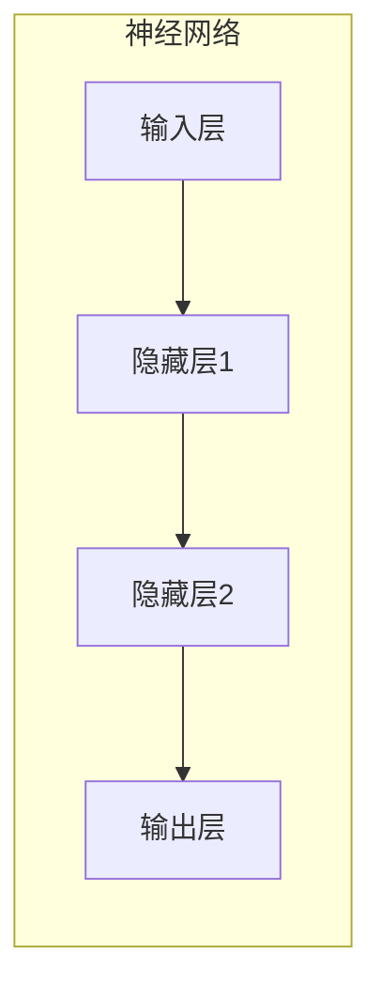
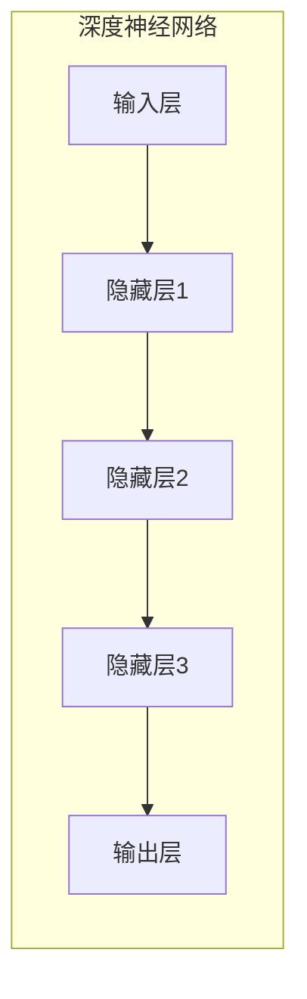
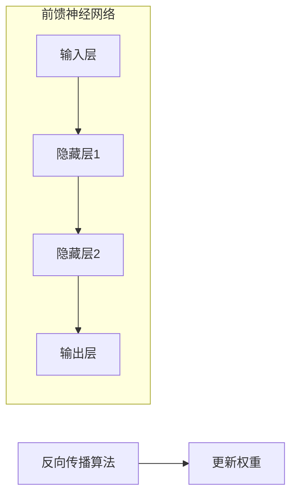
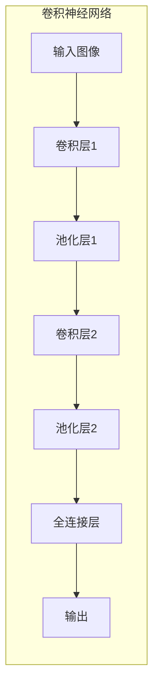
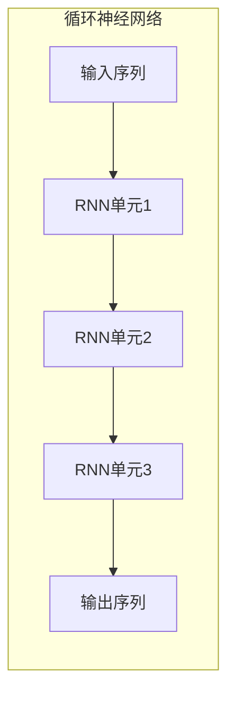
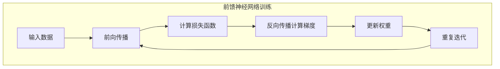
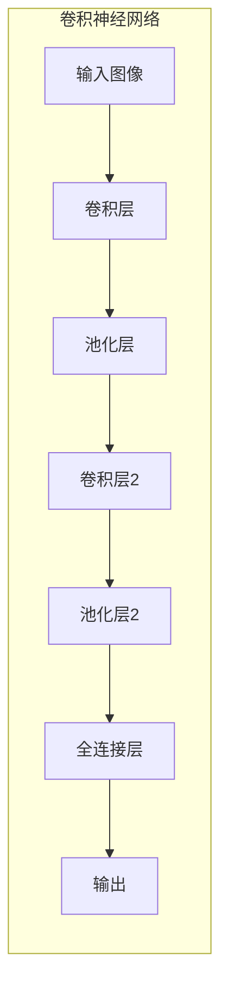
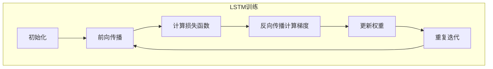
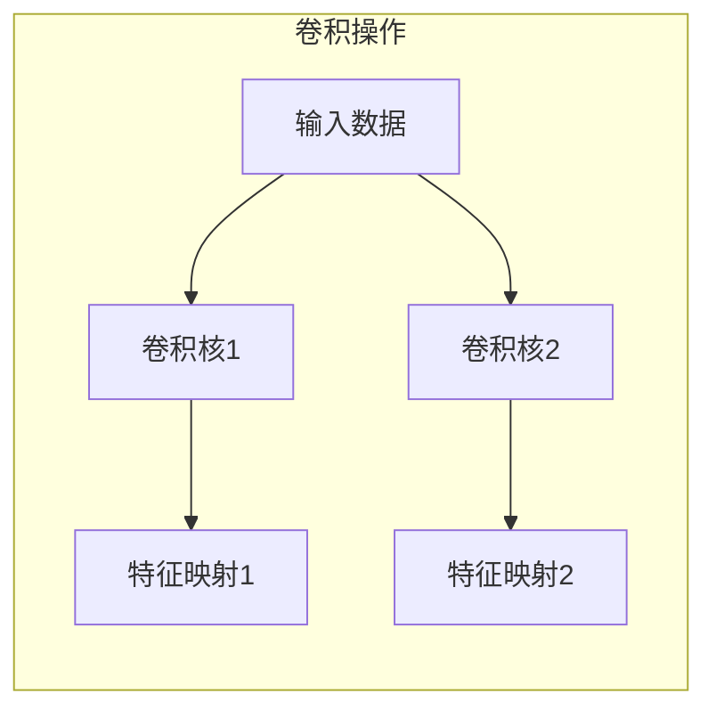

# 深度学习 原理与代码实例讲解

## 1. 背景介绍

### 1.1 什么是深度学习?

深度学习(Deep Learning)是机器学习的一个新的研究热点,它是一种受人脑结构和功能启发而产生的一种机器学习方法。深度学习的动机在于构建、模拟人脑进行分析学习的神经网络,它模仿人脑的机制来解释数据,例如图像、声音和文本。

深度学习通过对数据的表示学习特征,使计算机能够组合低层次特征形成更加复杂的判断,可以应对更加复杂、高维度的问题。与传统的机器学习方法不同,深度学习可以自动从数据中学习特征,无需人工设计特征。

### 1.2 深度学习的发展历程

深度学习的理论基础可以追溯到20世纪60年代提出的人工神经网络,但由于计算能力的限制,直到21世纪初期才得到了重大突破。近年来,由于大数据时代的到来、硬件计算能力的飞速提升以及一些新算法的涌现,深度学习取得了令人瞩目的进展,在计算机视觉、自然语言处理、语音识别等领域展现出卓越的性能。

## 2. 核心概念与联系

### 2.1 神经网络

神经网络是深度学习的核心基础,它是一种按照人工神经元网络结构进行分布式并行信息处理的算法模型。神经网络由大量的节点(神经元)和连接这些节点的加权边组成,每个节点都对输入信号进行加权求和,然后通过激活函数得到输出信号。



### 2.2 深度神经网络

深度神经网络是指包含多个隐藏层的神经网络。增加隐藏层的数量可以提高神经网络对复杂模式的表达能力,但也会增加训练的难度和计算量。深度学习的核心思想就是利用深度神经网络来自动从数据中学习层次化的特征表示。



### 2.3 前馈神经网络与反向传播算法

前馈神经网络是一种基本的神经网络结构,信号只从输入层向输出层传播,没有反馈连接。反向传播算法(Back Propagation)是训练前馈神经网络的核心算法,它通过计算误差函数对网络权重的梯度,并沿着梯度的反方向更新权重,从而最小化网络的误差。



### 2.4 卷积神经网络

卷积神经网络(Convolutional Neural Network, CNN)是一种专门用于处理网格结构数据(如图像)的深度神经网络。它包含卷积层、池化层和全连接层,能够自动学习数据的空间局部相关特征,在计算机视觉等领域表现出色。



### 2.5 循环神经网络

循环神经网络(Recurrent Neural Network, RNN)是一种专门用于处理序列数据(如文本、语音)的深度神经网络。它通过引入循环连接,使网络具有记忆能力,能够捕捉序列数据中的长期依赖关系,在自然语言处理等领域表现优异。



## 3. 核心算法原理具体操作步骤

### 3.1 前馈神经网络和反向传播算法

前馈神经网络的训练过程主要包括以下步骤:

1. **前向传播**:输入数据通过网络层层传递,每个节点根据上一层的输出计算加权和,并通过激活函数得到自身的输出。
2. **计算损失函数**:将网络的最终输出与期望输出进行比较,计算损失函数(如均方误差)。
3. **反向传播**:根据链式法则,计算损失函数对每个权重的梯度。
4. **权重更新**:沿着梯度的反方向,使用优化算法(如梯度下降)更新网络的权重。
5. **重复迭代**:重复上述步骤,直到网络收敛或达到预设的迭代次数。



### 3.2 卷积神经网络

卷积神经网络的核心操作包括卷积和池化:

1. **卷积层**:使用多个小尺寸的卷积核在输入数据上滑动,对局部区域进行特征提取,得到多个特征映射。
2. **池化层**:对特征映射进行下采样,减小数据量,提取主要特征,保留空间关系。
3. **全连接层**:将卷积层和池化层的输出拼接成一维向量,送入全连接层进行分类或回归。

卷积神经网络的训练过程与普通神经网络类似,使用反向传播算法对卷积核和全连接层的权重进行更新。



### 3.3 循环神经网络

循环神经网络的核心在于引入了状态向量,用于捕捉序列数据中的长期依赖关系。常见的RNN单元包括简单RNN、长短期记忆网络(LSTM)和门控循环单元(GRU)等。

以LSTM为例,其训练过程包括以下步骤:

1. **初始化**:初始化LSTM单元的状态向量和输出向量。
2. **前向传播**:对于每个时间步,根据当前输入和上一时间步的状态,计算LSTM单元的门控信号、状态向量和输出向量。
3. **计算损失函数**:将最后一个时间步的输出与期望输出进行比较,计算损失函数。
4. **反向传播**:根据链式法则,计算损失函数对每个权重的梯度。
5. **权重更新**:使用优化算法更新LSTM单元中的权重。
6. **重复迭代**:重复上述步骤,直到网络收敛或达到预设的迭代次数。



## 4. 数学模型和公式详细讲解举例说明

### 4.1 神经网络中的激活函数

激活函数是神经网络中的一个重要组成部分,它决定了神经元的输出。常见的激活函数包括:

1. **Sigmoid函数**:

$$
\sigma(x) = \frac{1}{1 + e^{-x}}
$$

Sigmoid函数的输出范围在(0,1)之间,常用于二分类问题的输出层。但它存在梯度消失的问题,在深层网络中表现不佳。

2. **Tanh函数**:

$$
\tanh(x) = \frac{e^x - e^{-x}}{e^x + e^{-x}}
$$

Tanh函数的输出范围在(-1,1)之间,相比Sigmoid函数梯度更大,收敛速度更快。但同样存在梯度消失的问题。

3. **ReLU函数**:

$$
\text{ReLU}(x) = \max(0, x)
$$

ReLU函数是目前最常用的激活函数,它在正半区线性,在负半区为0,计算简单且不存在梯度消失问题。但是ReLU函数存在"死亡神经元"的问题,即某些神经元永远不会被激活。

4. **Leaky ReLU函数**:

$$
\text{LeakyReLU}(x) = \begin{cases}
x, & \text{if } x > 0 \\
\alpha x, & \text{if } x \leq 0
\end{cases}
$$

Leaky ReLU函数在负半区有一个很小的斜率$\alpha$,避免了"死亡神经元"的问题,通常取$\alpha=0.01$。

不同的激活函数适用于不同的场景,选择合适的激活函数对网络的性能有重要影响。

### 4.2 卷积神经网络中的卷积操作

卷积操作是卷积神经网络的核心,它通过在输入数据上滑动卷积核,提取局部特征。设输入数据为$X$,卷积核为$K$,步长为$s$,填充为$p$,则卷积操作可以表示为:

$$
Y_{i,j} = \sum_{m,n} X_{s \times i + m, s \times j + n} \cdot K_{m,n} + b
$$

其中,$Y_{i,j}$表示输出特征映射的第$(i,j)$个元素,$X_{s \times i + m, s \times j + n}$表示输入数据的局部区域,$K_{m,n}$表示卷积核的权重,$ b$表示偏置项。

通过设置不同的卷积核大小、步长和填充,可以捕捉不同尺度的特征。多个卷积核并行操作,可以提取不同的特征映射。



### 4.3 循环神经网络中的LSTM单元

长短期记忆网络(LSTM)是一种常用的RNN单元,它通过设计特殊的门控机制,能够有效捕捉长期依赖关系。LSTM单元包括遗忘门、输入门和输出门,它们共同控制状态向量的更新和输出。

设$x_t$为当前时间步的输入,$h_{t-1}$和$c_{t-1}$分别为上一时间步的隐藏状态和细胞状态,则LSTM单元的计算过程如下:

1. 遗忘门:

$$
f_t = \sigma(W_f \cdot [h_{t-1}, x_t] + b_f)
$$

2. 输入门:

$$
i_t = \sigma(W_i \cdot [h_{t-1}, x_t] + b_i)
$$

$$
\tilde{c}_t = \tanh(W_c \cdot [h_{t-1}, x_t] + b_c)
$$

3. 更新细胞状态:

$$
c_t = f_t \odot c_{t-1} + i_t \odot \tilde{c}_t
$$

4. 输出门:

$$
o_t = \sigma(W_o \cdot [h_{t-1}, x_t] + b_o)
$$

$$
h_t = o_t \odot \tanh(c_t)
$$

其中,$\sigma$为Sigmoid函数,$\odot$表示元素wise乘积,$ W$和$b$为权重和偏置项。通过这种门控机制,LSTM能够有选择地保留或遗忘历史信息,从而捕捉长期依赖关系。

```mermaid
graph LR
    subgraph LSTM单元
        输入 --> 遗忘门
        输入 --> 输入门
        输入门 --> 细