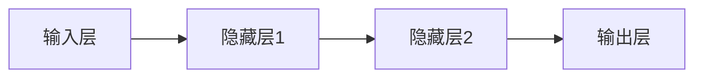
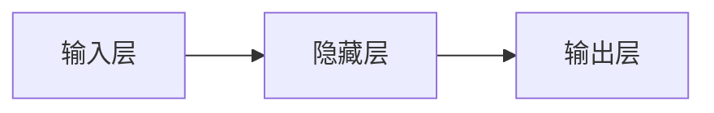
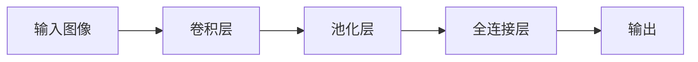
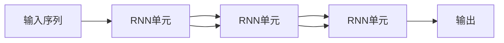
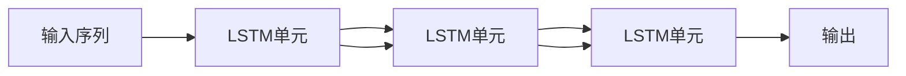
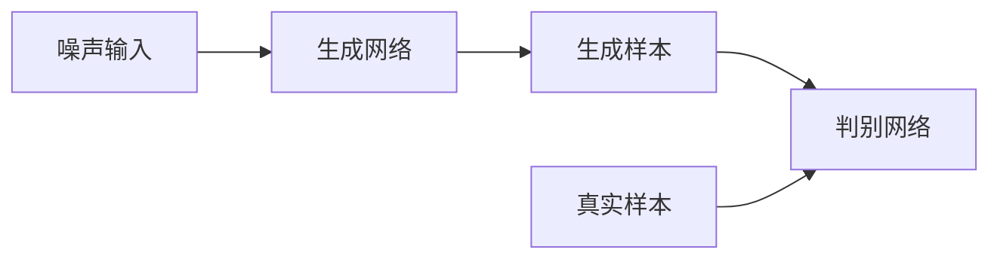

# 深度学习原理与代码实例讲解

## 1. 背景介绍

### 1.1 什么是深度学习?

深度学习(Deep Learning)是机器学习的一个新的研究领域,它模仿人脑的机制来解释数据,例如图像、声音和文本。深度学习是基于一种称为神经网络的算法架构,这种架构会逐层提取数据的高层次特征,从而使计算机能够学习和解决更加复杂的认知任务。

### 1.2 深度学习的发展历程

深度学习的概念可以追溯到20世纪80年代,当时的神经网络研究为深度学习奠定了基础。但是由于计算能力的限制和训练数据的缺乏,神经网络一直无法得到广泛应用。直到2006年,由于算力的提升、大规模标注数据的出现和一些关键算法的突破,深度学习才开始蓬勃发展。2012年,深度学习在图像识别任务上取得了巨大成功,从此在计算机视觉、自然语言处理、语音识别等领域掀起了新的浪潮。

### 1.3 深度学习的重要性

深度学习已经成为人工智能领域最重要和最具影响力的技术之一。它在解决复杂的现实问题方面展现出了强大的能力,例如计算机视觉、自然语言处理、语音识别、推荐系统等。深度学习还被广泛应用于医疗诊断、无人驾驶、机器翻译、金融分析等诸多领域,极大地推动了人工智能技术的发展和应用。

## 2. 核心概念与联系

### 2.1 神经网络

神经网络是深度学习的核心算法架构,它是一种模仿生物神经网络的数学模型。神经网络由多层神经元组成,每一层都会对输入数据进行特征提取和转换,最终输出所需要的结果。

### 2.2 前馈神经网络

前馈神经网络(Feedforward Neural Network)是最基本的神经网络结构,信息只会从输入层单向传递到输出层,中间没有反馈连接。这种结构简单但是能力有限,只能解决一些较为简单的问题。

### 2.3 卷积神经网络

卷积神经网络(Convolutional Neural Network, CNN)是一种专门用于处理网格数据(如图像)的神经网络结构。它通过卷积操作来提取局部特征,并使用池化操作来降低数据维度,从而能够高效地学习图像的层次模式。CNN在计算机视觉领域取得了巨大的成功。

### 2.4 循环神经网络

循环神经网络(Recurrent Neural Network, RNN)是一种专门用于处理序列数据(如文本、语音)的神经网络结构。它通过内部循环连接来捕获序列数据中的长期依赖关系,从而能够更好地学习和处理序列模式。RNN在自然语言处理和语音识别领域有着广泛的应用。

### 2.5 长短期记忆网络

长短期记忆网络(Long Short-Term Memory, LSTM)是一种特殊的RNN结构,它通过引入门控机制来解决传统RNN存在的长期依赖问题。LSTM能够更好地捕获长期依赖关系,在处理长序列数据时表现出色。

### 2.6 生成对抗网络

生成对抗网络(Generative Adversarial Network, GAN)是一种特殊的神经网络架构,由生成网络和判别网络组成。生成网络负责生成新的数据样本,而判别网络则判断这些样本是真实的还是生成的。两个网络相互对抗,最终达到生成高质量样本的目的。GAN在图像生成、语音合成等领域有着广泛的应用。

### 2.7 迁移学习

迁移学习(Transfer Learning)是一种通过利用在源领域学习到的知识来改善在目标领域的学习效果的技术。在深度学习中,我们可以将在大型数据集上预训练的模型作为起点,然后在目标任务的数据上进行微调,从而提高模型的性能和训练效率。

### 2.8 强化学习

强化学习(Reinforcement Learning)是一种基于对环境进行交互来学习的范式。智能体通过在环境中采取行动并观察结果,不断优化自身的策略,最终达到最大化累积奖励的目标。强化学习在机器人控制、游戏AI等领域有着广泛的应用。

## 3. 核心算法原理具体操作步骤

### 3.1 神经网络的前向传播

前向传播是神经网络的基本运算过程,它将输入数据通过网络层层传递,最终得到输出结果。每一层的神经元会对上一层的输出进行加权求和,然后通过激活函数进行非线性转换。

1. 输入层接收原始输入数据。
2. 隐藏层对上一层的输出进行加权求和,并通过激活函数进行非线性转换。
3. 输出层根据最后一个隐藏层的输出,计算最终的输出结果。

### 3.2 神经网络的反向传播

反向传播是神经网络训练的核心算法,它通过计算损失函数对参数的梯度,并使用优化算法(如梯度下降)来更新网络参数,从而最小化损失函数。

1. 计算输出层的损失函数。
2. 根据链式法则,计算损失函数对每一层参数的梯度。
3. 使用优化算法(如梯度下降)更新网络参数。
4. 重复上述步骤,直到损失函数收敛或达到预设的迭代次数。

### 3.3 卷积神经网络的卷积操作

卷积操作是CNN的核心操作,它通过在输入数据上滑动卷积核来提取局部特征。卷积操作的步骤如下:

1. 初始化卷积核的权重参数。
2. 将卷积核在输入数据上滑动,对每个局部区域进行加权求和操作。
3. 对求和结果应用激活函数,得到该位置的特征映射值。
4. 重复上述步骤,直到完成整个输入数据的卷积操作。

### 3.4 卷积神经网络的池化操作

池化操作是CNN中用于降低数据维度的操作,它通过在特征映射上滑动窗口,并对窗口内的值进行下采样操作(如取最大值或平均值)。池化操作的步骤如下:

1. 设置池化窗口的大小和步长。
2. 在特征映射上滑动池化窗口,对每个窗口内的值进行下采样操作。
3. 重复上述步骤,直到完成整个特征映射的池化操作。

### 3.5 循环神经网络的时间反向传播

时间反向传播(Backpropagation Through Time, BPTT)是训练RNN的核心算法,它将反向传播算法应用于序列数据,通过计算损失函数对每个时间步的参数的梯度,并使用优化算法更新网络参数。

1. 在正向传播过程中,计算每个时间步的隐藏状态和输出。
2. 计算最后一个时间步的损失函数。
3. 根据链式法则,反向计算每个时间步的损失函数对参数的梯度。
4. 使用优化算法更新网络参数。

### 3.6 长短期记忆网络的门控机制

LSTM通过引入门控机制来控制信息的流动,从而解决了传统RNN存在的长期依赖问题。LSTM的门控机制包括:

1. 遗忘门(Forget Gate):决定丢弃或保留上一时间步的状态信息。
2. 输入门(Input Gate):决定更新多少新的状态信息。
3. 输出门(Output Gate):决定输出多少状态信息。

通过这些门控机制,LSTM能够更好地捕获长期依赖关系,从而在处理长序列数据时表现出色。

### 3.7 生成对抗网络的训练过程

GAN的训练过程是一个对抗性的过程,生成网络和判别网络相互对抗,最终达到生成高质量样本的目的。训练过程如下:

1. 生成网络从噪声输入中生成假样本。
2. 判别网络接收真实样本和生成的假样本,并对它们进行分类。
3. 根据判别网络的输出,计算生成网络和判别网络的损失函数。
4. 使用优化算法分别更新生成网络和判别网络的参数。
5. 重复上述步骤,直到生成样本足够逼真。

### 3.8 迁移学习的微调过程

在迁移学习中,我们通过微调预训练模型的参数来适应目标任务。微调过程如下:

1. 加载在源领域预训练的模型。
2. 根据目标任务的需求,可能需要修改模型的输出层。
3. 在目标任务的数据上训练模型,同时冻结部分底层参数。
4. 使用较小的学习率进行微调,避免破坏预训练的特征。
5. 根据验证集的性能,调整微调的超参数。

## 4. 数学模型和公式详细讲解举例说明

### 4.1 神经元模型

神经元是神经网络的基本计算单元,它接收多个输入,对它们进行加权求和,并通过激活函数进行非线性转换。神经元的数学模型如下:

$$
y = \phi\left(\sum_{i=1}^{n}w_ix_i + b\right)
$$

其中:
- $x_i$是第$i$个输入
- $w_i$是第$i$个输入的权重
- $b$是偏置项
- $\phi$是激活函数,如sigmoid函数、ReLU函数等

### 4.2 损失函数

损失函数是用于评估模型预测与真实值之间的差异,它是训练过程中需要最小化的目标函数。常用的损失函数包括:

1. 均方误差(Mean Squared Error, MSE):

$$
\text{MSE} = \frac{1}{n}\sum_{i=1}^{n}(y_i - \hat{y}_i)^2
$$

2. 交叉熵损失(Cross-Entropy Loss):

$$
\text{CE} = -\frac{1}{n}\sum_{i=1}^{n}\left[y_i\log(\hat{y}_i) + (1 - y_i)\log(1 - \hat{y}_i)\right]
$$

其中$y_i$是真实标签,$\hat{y}_i$是模型预测值。

### 4.3 梯度下降

梯度下降是一种常用的优化算法,它通过计算损失函数对参数的梯度,并沿着梯度的反方向更新参数,从而最小化损失函数。梯度下降的更新规则如下:

$$
\theta_{t+1} = \theta_t - \eta\nabla_\theta J(\theta_t)
$$

其中:
- $\theta_t$是当前的参数值
- $\eta$是学习率
- $\nabla_\theta J(\theta_t)$是损失函数$J$对参数$\theta$的梯度

### 4.4 卷积操作

卷积操作是CNN中的核心操作,它通过在输入数据上滑动卷积核来提取局部特征。卷积操作的数学表示如下:

$$
(I * K)(i, j) = \sum_{m}\sum_{n}I(i+m, j+n)K(m, n)
$$

其中:
- $I$是输入数据
- $K$是卷积核
- $i$和$j$是输出特征映射的坐标
- $m$和$n$是卷积核的坐标

### 4.5 池化操作