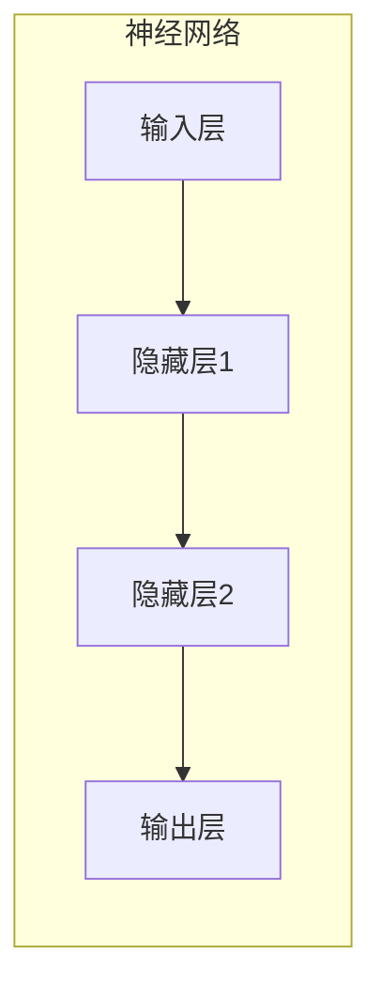

# 深度学习：神经网络的魔力

## 1.背景介绍

### 1.1 人工智能的崛起

人工智能(AI)是当代最具变革性的技术之一,它已经渗透到我们生活的方方面面。从语音助手到自动驾驶汽车,从个性化推荐系统到医疗诊断,AI无处不在。而深度学习作为人工智能的核心驱动力,正在推动着这场技术革命。

### 1.2 深度学习的兴起

深度学习是机器学习的一个新兴热点领域,它源于对生物神经网络的模拟,旨在构建可以自主学习的算法模型。近年来,由于算力的飞速提升、大数据的积累以及算法突破,深度学习取得了令人瞩目的成就,在计算机视觉、自然语言处理、语音识别等领域屡获佳绩。

## 2.核心概念与联系

### 2.1 神经网络

神经网络是深度学习的核心模型,它模拟了生物神经元的工作原理。一个神经网络由多层神经元组成,每个神经元接收来自前一层的输入信号,经过加权求和和非线性激活函数的处理,产生输出传递给下一层。



### 2.2 深度学习与传统机器学习

传统的机器学习算法需要人工设计特征,而深度学习则可以自动从原始数据中学习特征表示。这使得深度学习在处理原始数据(如图像、语音等)时表现出色。另一方面,深度学习模型通常需要大量数据和计算资源进行训练。

## 3.核心算法原理具体操作步骤  

### 3.1 前向传播

前向传播是神经网络的核心计算过程。输入数据经过一系列线性和非线性变换,最终得到输出结果。具体步骤如下:

1. 输入层接收原始数据
2. 隐藏层进行特征提取和转换,每层神经元接收上一层的输出作为输入,经过加权求和和激活函数的处理
3. 输出层产生最终输出结果

### 3.2 反向传播

反向传播是训练神经网络的关键算法,它通过计算损失函数对参数的梯度,并使用优化算法(如梯度下降)不断调整参数,从而减小损失函数值。具体步骤如下:

1. 计算输出层与真实标签之间的损失
2. 根据链式法则,计算损失对每层参数的梯度
3. 使用优化算法(如梯度下降)更新参数
4. 重复以上步骤,直到模型收敛

## 4.数学模型和公式详细讲解举例说明

### 4.1 神经元模型

神经元是神经网络的基本计算单元,它接收多个输入信号,经过加权求和和非线性激活函数的处理,产生输出信号。数学表示如下:

$$
y = \phi\left(\sum_{i=1}^{n}w_ix_i+b\right)
$$

其中:
- $x_i$是第$i$个输入
- $w_i$是对应的权重参数
- $b$是偏置参数
- $\phi$是非线性激活函数,如Sigmoid、ReLU等

### 4.2 损失函数

损失函数用于衡量模型输出与真实标签之间的差异,是训练神经网络的驱动力。常用的损失函数包括均方误差、交叉熵等。

均方误差(MSE)损失函数:

$$
L(y, \hat{y}) = \frac{1}{n}\sum_{i=1}^{n}(y_i - \hat{y}_i)^2
$$

其中:
- $y_i$是真实标签
- $\hat{y}_i$是模型输出
- $n$是样本数量

### 4.3 梯度下降

梯度下降是深度学习中常用的优化算法,它通过计算损失函数对参数的梯度,并沿着梯度的反方向更新参数,从而最小化损失函数。

$$
\theta_{t+1} = \theta_t - \eta \cdot \nabla_\theta L(y, \hat{y})
$$

其中:
- $\theta$是参数向量
- $\eta$是学习率,控制更新步长
- $\nabla_\theta L(y, \hat{y})$是损失函数对参数的梯度

## 5.项目实践：代码实例和详细解释说明

为了帮助读者更好地理解深度学习的原理和实现,我们将通过一个简单的手写数字识别项目来进行实践。我们将使用Python和PyTorch框架构建一个基于卷积神经网络(CNN)的模型。

### 5.1 导入必要的库

```python
import torch
import torchvision
import torchvision.transforms as transforms
import matplotlib.pyplot as plt
import numpy as np
```

### 5.2 加载和预处理数据

```python
# 下载并加载MNIST数据集
train_dataset = torchvision.datasets.MNIST(root='./data', train=True, transform=transforms.ToTensor(), download=True)
test_dataset = torchvision.datasets.MNIST(root='./data', train=False, transform=transforms.ToTensor())

# 创建数据加载器
train_loader = torch.utils.data.DataLoader(dataset=train_dataset, batch_size=64, shuffle=True)
test_loader = torch.utils.data.DataLoader(dataset=test_dataset, batch_size=64, shuffle=False)
```

### 5.3 定义CNN模型

```python
import torch.nn as nn
import torch.nn.functional as F

class Net(nn.Module):
    def __init__(self):
        super(Net, self).__init__()
        self.conv1 = nn.Conv2d(1, 10, kernel_size=5)
        self.conv2 = nn.Conv2d(10, 20, kernel_size=5)
        self.conv2_drop = nn.Dropout2d()
        self.fc1 = nn.Linear(320, 50)
        self.fc2 = nn.Linear(50, 10)

    def forward(self, x):
        x = F.relu(F.max_pool2d(self.conv1(x), 2))
        x = F.relu(F.max_pool2d(self.conv2_drop(self.conv2(x)), 2))
        x = x.view(-1, 320)
        x = F.relu(self.fc1(x))
        x = F.dropout(x, training=self.training)
        x = self.fc2(x)
        return F.log_softmax(x, dim=1)
```

### 5.4 训练和测试模型

```python
# 实例化模型
model = Net()

# 定义损失函数和优化器
criterion = nn.CrossEntropyLoss()
optimizer = torch.optim.SGD(model.parameters(), lr=0.01, momentum=0.5)

# 训练模型
for epoch in range(10):
    running_loss = 0.0
    for i, data in enumerate(train_loader, 0):
        inputs, labels = data
        optimizer.zero_grad()
        outputs = model(inputs)
        loss = criterion(outputs, labels)
        loss.backward()
        optimizer.step()
        running_loss += loss.item()
    print(f'Epoch {epoch+1}, Loss: {running_loss/len(train_loader):.6f}')

# 测试模型
correct = 0
total = 0
with torch.no_grad():
    for data in test_loader:
        images, labels = data
        outputs = model(images)
        _, predicted = torch.max(outputs.data, 1)
        total += labels.size(0)
        correct += (predicted == labels).sum().item()

print(f'Accuracy on test set: {100 * correct / total}%')
```

上述代码展示了如何使用PyTorch构建、训练和测试一个CNN模型。我们首先定义了一个包含卷积层和全连接层的CNN模型,然后使用交叉熵损失函数和随机梯度下降优化器进行训练。最后,我们在测试集上评估模型的准确率。

## 6.实际应用场景

深度学习在现实世界中有着广泛的应用,包括但不限于以下几个领域:

### 6.1 计算机视觉

深度学习在图像分类、目标检测、语义分割等计算机视觉任务中表现出色。例如,基于CNN的模型可以准确识别图像中的物体,并在自动驾驶汽车、安防监控等领域发挥重要作用。

### 6.2 自然语言处理

深度学习在机器翻译、文本生成、情感分析等自然语言处理任务中也有出色表现。例如,基于Transformer的模型可以实现高质量的机器翻译,而GPT等大型语言模型可以生成逼真的文本内容。

### 6.3 语音识别

深度学习在语音识别领域取得了巨大成功,使得人机交互变得更加自然和便捷。基于循环神经网络(RNN)和注意力机制的模型可以实现高精度的语音转文本功能。

### 6.4 推荐系统

深度学习在个性化推荐系统中发挥着关键作用。通过分析用户的历史行为和偏好,深度学习模型可以为用户推荐感兴趣的商品、内容或服务,提高用户体验和商业转化率。

### 6.5 医疗健康

深度学习在医疗影像分析、疾病诊断、药物发现等领域展现出巨大潜力。例如,基于CNN的模型可以从X光、CT或MRI图像中准确检测出疾病,为医生提供辅助诊断。

## 7.工具和资源推荐

深度学习是一个快速发展的领域,有许多优秀的工具和资源可供学习和实践。以下是一些推荐:

### 7.1 深度学习框架

- **PyTorch**:由Facebook开发的Python深度学习框架,拥有动态计算图和良好的可扩展性,广受欢迎。
- **TensorFlow**:由Google开发的开源深度学习框架,具有强大的功能和良好的可移植性。
- **Keras**:基于TensorFlow或Theano的高级深度学习框架,提供了简洁的API和快速原型设计能力。

### 7.2 在线课程和教程

- **深度学习专业化课程(deeplearning.ai)**:由Andrew Ng教授主讲的经典深度学习课程,内容全面且实践性强。
- **fast.ai课程**:由Jeremy Howard和Rachel Thomas创建的实用深度学习课程,注重实践和应用。
- **斯坦福大学深度学习教程**:由斯坦福大学提供的优质深度学习教程,涵盖理论和实践。

### 7.3 书籍和论文

- **《深度学习》(Goodfellow等著)**:深度学习领域的经典教材,全面系统地介绍了深度学习的理论和实践。
- **《模式识别与机器学习》(Christopher Bishop著)**:机器学习经典教材,对深度学习的基础理论有深入探讨。
- **最新深度学习论文**:持续关注顶级会议(如NeurIPS、ICML、ICLR等)和期刊(如Nature、Science等)上发表的最新深度学习论文。

### 7.4 开源项目和社区

- **GitHub**:许多优秀的开源深度学习项目都托管在GitHub上,如PyTorch、TensorFlow等。
- **Papers with Code**:一个集成了论文、代码和评测结果的深度学习资源网站。
- **Kaggle**:一个著名的数据科学竞赛平台,提供了丰富的数据集和深度学习实践机会。

## 8.总结:未来发展趋势与挑战

### 8.1 发展趋势

深度学习正在快速发展,未来可能会有以下几个趋势:

1. **模型规模持续增长**:随着计算能力的提高,更大规模的深度学习模型将变得可行,有望在各种任务上取得更好的性能。
2. **自监督学习**:减少对大量标注数据的依赖,利用自监督学习从未标注数据中学习有用的表示。
3. **多模态学习**:融合多种模态(如视觉、语音、文本等)的信息,实现更智能的人工智能系统。
4. **可解释性**:提高深度学习模型的可解释性,使其决策过程更加透明和可信。
5. **联邦学习**:在保护隐私的前提下,利用分布式数据进行协同训练,扩大数据覆盖面。

### 8.2 挑战

尽管深度学习取得了巨大成功,但仍面临一些挑战:

1. **可解释性**:深度学习模型通常被视为"黑箱",其决策过程缺乏透明度,需要提高可解释性。
2. **鲁棒性**:深度学习模型容易受到对抗性攻击,需要提高模型的鲁棒性和安全性。