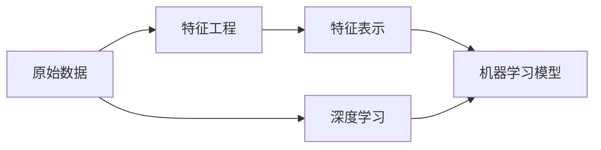

# 特征工程的未来：深度学习与自动化

## 1.背景介绍
### 1.1 特征工程的重要性
特征工程是机器学习和数据挖掘中的关键步骤,它直接影响着模型的性能。好的特征可以让算法更容易学习,从而提高模型的准确性和泛化能力。相反,糟糕的特征会导致模型表现不佳,甚至无法收敛。

### 1.2 传统特征工程面临的挑战
传统的特征工程主要依赖人工设计和提取特征,这是一个耗时耗力的过程。工程师需要对领域知识有深入理解,并进行大量的数据探索和分析,才能找出有效的特征。此外,人工设计的特征往往是特定于某个任务的,缺乏通用性和迁移能力。

### 1.3 深度学习的兴起 
近年来,深度学习的快速发展为特征工程带来了新的契机。深度神经网络可以自动学习数据中的高层特征,减少了对人工特征工程的依赖。尤其是在计算机视觉、自然语言处理等领域,深度学习模型展现出了远超传统方法的性能。

## 2.核心概念与联系
### 2.1 特征工程
特征工程是将原始数据转化为适合机器学习算法的特征表示的过程。它包括特征提取、特征选择、特征构建等多个步骤。目标是找到能够很好地刻画数据内在模式,并与任务目标相关的特征。

### 2.2 深度学习
深度学习是机器学习的一个分支,它利用多层神经网络来学习数据的层次化特征表示。与浅层模型不同,深度学习可以自动发现和提取数据中的高层抽象特征,减少了对人工特征工程的需求。

### 2.3 自动化特征工程
自动化特征工程是指利用机器学习算法自动地发现、选择和构建特征的过程。它可以大大减轻人工特征工程的工作量,提高特征质量和模型性能。深度学习是实现自动化特征工程的重要手段之一。

### 2.4 特征工程与深度学习的关系

如上图所示,传统的机器学习流程需要先通过特征工程将原始数据转化为特征表示,再输入到机器学习模型中。而深度学习可以直接从原始数据中端到端地学习特征表示和任务目标,实现了自动化特征工程。

## 3.核心算法原理具体操作步骤
### 3.1 自动特征提取
#### 3.1.1 卷积神经网络(CNN)
卷积神经网络通过局部连接和权值共享,可以自动提取图像数据的空间特征。其主要步骤包括:
1. 卷积层:对输入图像进行卷积操作,提取局部特征
2. 池化层:对卷积输出进行下采样,增加特征的平移不变性
3. 全连接层:将提取的特征映射到输出空间

#### 3.1.2 循环神经网络(RNN) 
循环神经网络通过引入循环连接,可以处理序列数据并提取时序特征。其主要步骤包括:
1. 输入层:将序列数据逐个输入到网络中
2. 隐藏层:通过循环连接,将当前时刻的输入与之前时刻的隐藏状态结合,提取时序特征
3. 输出层:将最后一个时刻的隐藏状态映射到输出空间

#### 3.1.3 自编码器(Autoencoder)
自编码器通过无监督学习,可以自动提取数据的低维特征表示。其主要步骤包括:  
1. 编码器:将输入数据映射到低维隐空间
2. 解码器:将隐空间表示重构为原始输入
3. 重构损失:最小化输入与重构输出之间的差异,使隐空间能够很好地表示原始数据

### 3.2 自动特征选择
#### 3.2.1 L1正则化
L1正则化可以使部分特征的权重变为0,从而实现特征选择的效果。其主要步骤包括:
1. 在损失函数中加入L1正则项,即特征权重的绝对值之和
2. 通过梯度下降等优化算法最小化正则化后的损失函数
3. 将权重为0的特征剔除,得到选择后的特征子集

#### 3.2.2 树模型特征重要性
决策树、随机森林等树模型可以评估特征的重要性,进而进行特征选择。其主要步骤包括:
1. 训练树模型,得到每个特征在分裂节点时的信息增益或基尼指数
2. 对所有树的特征重要性进行平均,得到每个特征的总体重要性评分
3. 根据评分排序,选择重要性最高的特征子集

### 3.3 自动特征构建
#### 3.3.1 特征交叉(Feature Crossing)
特征交叉是将两个或多个特征组合生成新特征的方法。深度学习可以自动发现有效的交叉特征。其主要步骤包括:
1. 将特征两两组合,构建高阶交互项
2. 将原始特征与交互项一起输入到深度神经网络中
3. 通过端到端训练,让网络自动发现有效的交叉特征

#### 3.3.2 深度特征合成(Deep Feature Synthesis)
深度特征合成是利用深度学习自动构建高阶非线性特征的方法。其主要步骤包括:
1. 将原始特征输入到多层神经网络中
2. 在网络的中间层引入特征合成单元,如乘法、加法等
3. 通过端到端训练,让网络自动学习合成有效的高阶特征

## 4.数学模型和公式详细讲解举例说明
### 4.1 卷积神经网络
卷积神经网络的数学模型可以表示为:
$$
\begin{aligned}
h_j^l &= f(\sum_i w_{ij}^l * x_i^{l-1} + b_j^l) \\
x_j^l &= \text{pool}(h_j^l)
\end{aligned}
$$
其中,$h_j^l$表示第$l$层第$j$个特征图的卷积输出,$w_{ij}^l$为卷积核的权重,$x_i^{l-1}$为上一层的输入特征图,$b_j^l$为偏置项,$f$为激活函数,如ReLU: $f(x)=max(0,x)$。$\text{pool}$表示池化操作,如最大池化。

举例说明:假设输入图像大小为$28\times28$,第一层卷积核大小为$5\times5$,步长为1,共有32个卷积核。则第一层卷积输出的特征图大小为$24\times24\times32$。再经过$2\times2$的最大池化,输出大小变为$12\times12\times32$。这样就得到了图像的局部特征表示。

### 4.2 循环神经网络
循环神经网络的数学模型可以表示为:
$$
\begin{aligned}
h_t &= f(W_{xh}x_t + W_{hh}h_{t-1} + b_h) \\
y_t &= \text{softmax}(W_{hy}h_t + b_y)
\end{aligned}
$$
其中,$h_t$表示第$t$个时刻的隐藏状态,$x_t$为第$t$个时刻的输入,$W_{xh},W_{hh},W_{hy}$分别为输入到隐藏层、隐藏层到隐藏层、隐藏层到输出层的权重矩阵,$b_h,b_y$为偏置项。$f$为激活函数,如tanh: $f(x)=\frac{e^x-e^{-x}}{e^x+e^{-x}}$。$\text{softmax}$函数将隐藏状态映射为概率分布。

举例说明:假设输入序列为"hello",词典大小为27(26个字母+空格)。可以将每个字符one-hot编码为27维向量,然后依次输入到RNN中。假设隐藏层维度为100,则在最后一个时刻,我们得到一个100维的隐藏状态,再通过softmax映射为27维的概率分布,表示下一个字符的预测概率。

### 4.3 L1正则化
L1正则化的数学模型可以表示为:
$$
\min_w \sum_i^n L(y_i, f(x_i, w)) + \lambda \sum_j^d |w_j|
$$
其中,$L$为损失函数,如均方误差: $L(y,\hat{y})=\frac{1}{2}(y-\hat{y})^2$。$f(x_i,w)$为模型的预测输出,$\lambda$为正则化系数,$w_j$为第$j$个特征的权重。L1正则项$\sum_j^d |w_j|$促使部分权重变为0,从而实现特征选择。

举例说明:假设有10个特征$x_1,\dots,x_{10}$,对应的权重为$w_1,\dots,w_{10}$。初始时权重都不为0。加入L1正则化后,通过优化算法最小化正则化损失,会使一些权重变为0,如$w_2=0,w_5=0,w_9=0$。这意味着特征$x_2,x_5,x_9$被剔除,我们选择了特征子集$\{x_1,x_3,x_4,x_6,x_7,x_8,x_{10}\}$。

## 5.项目实践：代码实例和详细解释说明
下面以Python和Keras库为例,演示如何用卷积神经网络进行图像分类的自动特征提取。

```python
from keras.datasets import mnist
from keras.models import Sequential
from keras.layers import Conv2D, MaxPooling2D, Flatten, Dense

# 加载MNIST数据集
(x_train, y_train), (x_test, y_test) = mnist.load_data()

# 数据预处理
x_train = x_train.reshape(x_train.shape[0], 28, 28, 1) / 255.0
x_test = x_test.reshape(x_test.shape[0], 28, 28, 1) / 255.0
y_train = keras.utils.to_categorical(y_train, 10)
y_test = keras.utils.to_categorical(y_test, 10)

# 构建卷积神经网络
model = Sequential()
model.add(Conv2D(32, (3, 3), activation='relu', input_shape=(28, 28, 1)))
model.add(MaxPooling2D((2, 2)))
model.add(Conv2D(64, (3, 3), activation='relu'))
model.add(MaxPooling2D((2, 2)))
model.add(Conv2D(64, (3, 3), activation='relu'))
model.add(Flatten())
model.add(Dense(64, activation='relu'))
model.add(Dense(10, activation='softmax'))

# 编译模型
model.compile(optimizer='adam',
              loss='categorical_crossentropy',
              metrics=['accuracy'])

# 训练模型
model.fit(x_train, y_train, epochs=5, batch_size=64, validation_data=(x_test, y_test))

# 评估模型
score = model.evaluate(x_test, y_test)
print('Test loss:', score[0])
print('Test accuracy:', score[1])
```

代码解释:
1. 首先加载MNIST手写数字数据集,并进行预处理,如归一化和one-hot编码。
2. 然后构建一个卷积神经网络,包含3个卷积层、2个池化层和2个全连接层。卷积层用于提取局部特征,池化层用于特征下采样,全连接层用于分类。
3. 接着编译模型,指定优化器、损失函数和评估指标。这里使用Adam优化器,交叉熵损失函数和准确率指标。
4. 然后训练模型,设置训练轮数、批大小和验证集。模型会自动学习提取图像的特征表示。
5. 最后在测试集上评估模型性能,输出损失和准确率。

这个例子展示了如何用深度学习自动提取图像特征,无需人工设计特征。卷积神经网络可以端到端地学习特征表示和分类任务,大大简化了特征工程的流程。

## 6.实际应用场景
自动化特征工程和深度学习在许多实际场景中得到了广泛应用,例如:

### 6.1 计算机视觉
在图像识别、目标检测、语义分割等任务中,卷积神经网络可以自动提取图像的多层次特征,如边缘、纹理、部件等,显著提高了性能。如ResNet