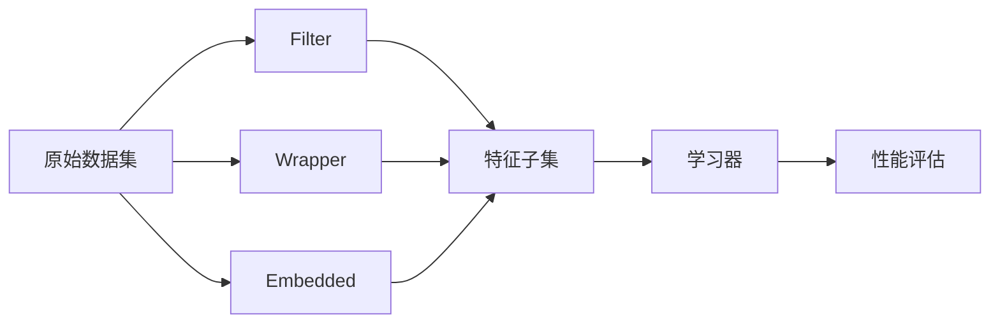

# 特征选择 (Feature Selection) 原理与代码实例讲解

## 1. 背景介绍

在机器学习和数据挖掘领域,特征选择(Feature Selection)是一个非常重要且常用的数据预处理技术。随着大数据时代的到来,我们面临的数据集维度越来越高,特征数量急剧增加。高维数据不仅会增加模型训练的时间和空间复杂度,还可能因为包含了许多无关、冗余的特征而降低模型的泛化能力,造成过拟合。因此,如何从原有的特征集合中选择一个最优特征子集,构建精简高效的学习模型,是一个亟待解决的问题。

特征选择就是要从原始的特征空间中选择一个特征子集,使得子集能够尽可能准确地代表原始特征空间的内在信息,从而达到降维的目的。一个优秀的特征选择算法不仅能够去除不相关的特征降低数据维度,还能够保留数据的代表性特征,最大程度地发掘数据中蕴含的有用信息。

### 1.1 特征选择的目的

特征选择主要有以下几个目的:

1. 降低数据维度,减少特征数量,从而降低模型复杂度,缓解过拟合,提高模型泛化能力。
2. 去除不相关、冗余的特征,减少数据噪声,提高数据质量。  
3. 加快模型训练和预测的速度,降低计算开销。
4. 增强模型的可解释性,找出对目标影响最大的关键特征,加深对数据的理解。
5. 降低数据采集和存储的成本。

### 1.2 特征选择面临的挑战

特征选择虽然很有必要,但实施起来也面临诸多挑战:

1. 子集搜索空间巨大。对 n 个特征进行选择,就有 $2^n$ 个可能的子集,呈指数级增长。当 n 较大时,遍历所有子集在计算上是不可行的。
2. 特征间可能存在复杂的交互和依赖关系,单个特征的重要性评估并不足以发现最优子集。
3. 缺乏先验知识,难以设计出一个普适的特征重要性度量指标。不同的问题,不同的算法,对特征重要性的定义各不相同。
4. 和具体学习任务耦合紧密。脱离了具体的学习器,无法真正评估一个特征子集的有效性。
5. 缺乏统一的理论框架。目前的特征选择方法多是启发式的,缺乏统一的理论支撑和指导。

## 2. 核心概念与联系

在讨论特征选择算法之前,我们先来了解几个核心概念。 

### 2.1 特征相关性和冗余性

特征相关性是指一个特征与学习任务目标之间的相关程度。通常可以用特征与类别标签之间的互信息、相关系数等来度量。相关性高的特征对学习任务的贡献大,应当优先被选择。

特征冗余性是指多个特征之间的相关性。如果两个特征高度相关,那么其中一个特征就是冗余的,可以被另一个特征所替代。冗余特征的存在会增加计算开销,有时还会降低学习性能。

一个好的特征选择算法应当能够选出与任务目标高度相关但又相互独立的特征子集。

### 2.2 特征选择的一般过程

特征选择通常包括4个主要步骤:

1. 子集搜索。在所有可能的特征子集空间中,根据某种搜索策略,选取一个特征子集。
2. 子集评估。构造一个评估函数来衡量选取的特征子集的优劣。 
3. 停止条件。设定算法停止迭代的条件,如子集性能达到阈值,迭代次数达到上限等。
4. 结果验证。用选出的特征子集训练模型,并在独立测试集上进行性能评估,验证选择结果的有效性。

其中,子集搜索和评估是特征选择的核心,两者相互配合,迭代进行,直到找到最优子集或满足停止条件为止。不同的特征选择算法在这两个步骤上的实现各不相同。

### 2.3 特征选择的分类

根据特征选择过程中是否利用学习器,可将特征选择方法分为3类:

1. Filter(过滤式)。Filter 方法根据数据的统计特性来评估特征的重要性,与具体的学习器无关。常见的有 Relief,信息增益,卡方检验等。Filter 的计算复杂度低,可扩展性好,但忽略了特征之间的交互,泛化能力较弱。  

2. Wrapper(包裹式)。Wrapper 方法将学习器的性能作为特征子集评估的标准。对每个候选子集,Wrapper 都训练一个模型,并在验证集上评估其性能,性能最优者即为选定的特征子集。Wrapper 考虑了特征之间的交互,选择结果与学习器高度相关,但计算开销大。

3. Embedded(嵌入式)。Embedded 方法在学习器训练的过程中自动进行特征选择。许多规则化的学习模型如 L1 正则化的线性模型,决策树,神经网络等都具有这种特性。Embedded 方法的计算开销介于 Filter 和 Wrapper 之间,但缺乏灵活性,难以调控选择的特征数量。

下图展示了这三类方法的联系和区别:

## 3. 核心算法原理与具体步骤

下面我们重点介绍几种经典的特征选择算法。

### 3.1 Relief

Relief 是一种著名的 Filter 特征选择算法,由 Kira 和 Rendell 在 1992 年提出。它的基本思想是:好的特征应该使得同类样本的特征值相近,而不同类样本的特征值差别大。

Relief 的具体步骤如下:

1. 从训练集中随机选择一个样本 $R_i$,找出与其最近的同类样本 $H_i$ (Hit) 和不同类样本 $M_i$ (Miss)。
   
2. 对每个特征 $f$,根据 $R_i,H_i,M_i$ 在 $f$ 上的值更新其重要性权重 $W[f]$:

   $$
   W[f] = W[f] - \frac{|R_i[f] - H_i[f]|}{m} + \frac{|R_i[f] - M_i[f]|}{m}
   $$
   
   其中 $m$ 为随机选取的样本数。
   
3. 重复步骤 1,2 若干次,累计更新各特征的权重。
  
4. 根据权重 $W$ 对特征排序,取 top-k 个权重最大的特征作为选定的特征子集。

可以看出,对同类样本而言,若某特征取值差别小,则该特征权重增加得少。对不同类样本而言,若某特征取值差别大,则该特征权重增加得多。因此 Relief 有利于选出区分度高的关键特征。

Relief 的一个缺陷是它假设所有特征都是独立的,未考虑特征间的关联。后续的 ReliefF,RReliefF 等算法对此做了改进。

### 3.2 最小冗余最大相关性(mRMR)

mRMR 由 Peng 等人于 2005 年提出,是一种基于互信息的特征选择算法。它考虑了特征与类别标签的相关性,以及特征之间的冗余性,试图选出与类别高度相关又相互独立的一组特征。

mRMR 的目标函数定义为:

$$
\max_{S \subset X} \left( \frac{1}{|S|} \sum_{x_i \in S} I(x_i;y) - \frac{1}{|S|^2} \sum_{x_i,x_j \in S} I(x_i;x_j) \right)
$$

其中 $I(x;y)$ 表示变量 $x$ 和 $y$ 的互信息,定义为:

$$
I(x;y) = \sum_{i,j} p(x_i,y_j) \log \frac{p(x_i,y_j)}{p(x_i)p(y_j)}
$$

mRMR 采用了一种贪心的递增搜索策略,每次从未选入的特征中找出一个满足目标函数的特征加入子集,直到达到预设的特征数量。

具体步骤为:

1. 初始化特征集合 $S=\emptyset$。

2. 计算每个特征 $x_i$ 与类别 $y$ 的互信息 $I(x_i;y)$,选出互信息最大的特征 $x^*$ 加入 $S$。 

3. 重复如下步骤,直到 $|S|$ 达到预设值:
   
   a) 对 $\forall x_i \notin S$,计算 $x_i$ 与 $S$ 中每个特征的互信息 $I(x_i;x_j)$,并取平均值 $\bar{I}(x_i;S)$。
   
   b) 在剩余的特征中,选择如下的 $x^*$ 加入 $S$:

      $$
      x^* = \arg \max_{x_i} \left( I(x_i;y) - \frac{1}{|S|} \sum_{x_j \in S} I(x_i;x_j) \right)
      $$

mRMR 能够有效地平衡相关性和冗余性,实现高效稳定的特征选择。但它的缺点是只考虑了成对特征间的交互,忽略了高阶交互的影响。

### 3.3 递归特征消除(RFE)

RFE 是一种 Wrapper 特征选择方法,常与支持向量机(SVM)分类器结合使用。RFE 的思路是反复构建 SVM 模型来筛选特征,每次训练后,消除若干权重系数最小的特征,直到达到所需的特征数量。

RFE 的主要步骤如下:

1. 利用所有特征训练一个 SVM 模型。

2. 根据 SVM 的权重系数 $\mathbf{w} = (w_1,\dots,w_n)$ 计算每个特征的排序准则:

   $$
   c_i = (w_i)^2, \quad i=1,\dots,n
   $$

3. 根据 $\mathbf{c} = (c_1,\dots,c_n)$ 消除若干排序靠后的特征。

4. 利用剩余的特征重复步骤 1-3,直到达到预设的特征数量。

5. 输出最终选定的特征子集。

可以证明,特征 $i$ 的排序准则 $c_i$ 近似反映了该特征的重要程度。直观上,$|w_i|$ 越大,说明特征 $i$ 对分类边界的位置影响越大,重要性越高。

RFE 充分利用了 SVM 的优良性能,可以捕捉特征间的非线性关系。但它需要反复训练模型,计算开销较大。此外,RFE 依赖于模型参数的选择,稳定性和鲁棒性有待提高。

### 3.4 基于 L1 正则化的特征选择

L1 正则化(Lasso)是一种常用的嵌入式特征选择方法。它在学习模型的目标函数中引入 L1 范数作为正则化项,倾向于学习出稀疏的权重向量,自动地实现了特征选择。

以线性回归为例,带 L1 正则化的目标函数为:

$$
\min_{\mathbf{w}} \frac{1}{2} ||\mathbf{X} \mathbf{w} - \mathbf{y}||_2^2 + \lambda ||\mathbf{w}||_1
$$

其中 $\mathbf{X} \in \mathbb{R}^{n \times p}$ 为设计矩阵,$\mathbf{y} \in \mathbb{R}^n$ 为响应向量,$\mathbf{w} \in \mathbb{R}^p$ 为权重向量,$\lambda > 0$ 为正则化系数。

L1 正则化的特点是当 $\lambda$ 足够大时,部分权重 $w_i$ 会被压缩到 0,从而自动筛除了对应的特征。剩余的非零权重对应的特征即为选定的特征子集。

L1 正则化可以灵活地嵌入到各种学习器中