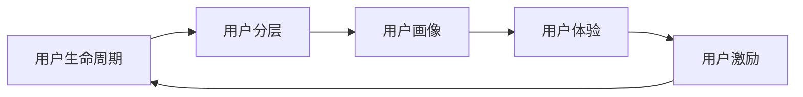

# 用户运营：提升用户粘性，打造忠实用户群体

## 1.背景介绍
在互联网时代，用户是一切业务的核心。如何留住用户、提高用户粘性、打造忠实用户群体，是每个互联网企业都必须思考和面对的重要课题。优秀的用户运营不仅能够提升用户体验、增加用户粘性，还能为企业带来更多的收益和价值。

### 1.1 用户运营的重要性
- 用户是互联网企业生存和发展的基石
- 用户运营是实现企业商业价值的关键
- 用户运营能够提升产品竞争力和品牌影响力

### 1.2 用户运营面临的挑战
- 用户需求日益多样化和个性化
- 用户注意力被多种信息和服务分散
- 用户忠诚度下降，流失率居高不下

### 1.3 用户运营的目标
- 提高用户活跃度和留存率
- 增强用户粘性和忠诚度
- 实现用户价值的最大化

## 2.核心概念与联系

### 2.1 用户生命周期
- 用户生命周期是指用户从接触产品到离开产品的整个过程
- 用户生命周期管理是运营的核心工作之一
- 不同阶段用户的需求和行为特征不同，需要采取针对性的运营策略

### 2.2 用户分层
- 将用户划分为不同的层级，如新用户、活跃用户、核心用户等
- 不同层级的用户对产品的认知、使用频率和忠诚度不同
- 针对不同层级用户制定差异化的运营方案

### 2.3 用户画像
- 用户画像是对用户信息和行为数据进行分析和归纳，形成用户的多维度特征描述
- 用户画像能够帮助企业更加全面和深入地了解用户
- 基于用户画像开展精准化运营，提升用户体验和转化率

### 2.4 用户体验
- 用户体验是用户在使用产品过程中的主观感受和评价
- 优秀的用户体验是提升用户粘性和忠诚度的关键因素
- 关注用户体验，持续优化产品功能和设计，提供更加便捷、高效、个性化的服务

### 2.5 用户激励
- 用户激励是指通过一定的手段和机制，鼓励和引导用户更加积极主动地使用产品
- 常见的激励方式包括积分、等级、成就、排行榜等
- 建立完善的用户激励体系，满足用户的成就感和社交需求，提高用户活跃度和留存率

以下是用户运营核心概念之间的联系 Mermaid 流程图：



## 3.核心算法原理具体操作步骤

### 3.1 用户分层算法
- 收集用户的基本信息、行为数据、交易数据等
- 选择合适的分层维度，如活跃度、消费能力、忠诚度等
- 采用RFM模型、K-means聚类等算法对用户进行分层
- 根据分层结果，制定针对性的运营策略

### 3.2 用户画像算法
- 采集用户的人口统计学信息、行为偏好、社交关系等多维度数据
- 对数据进行清洗、转换、集成，构建用户特征向量
- 使用机器学习算法如决策树、逻辑回归等建立用户画像模型
- 基于用户画像，开展个性化推荐、精准营销等运营活动

### 3.3 用户流失预警算法
- 定义用户流失的标准，如N天未登录、N天未消费等
- 提取用户特征，如登录频率、消费金额、互动行为等
- 采用生存分析、决策树等算法建立用户流失预测模型
- 识别高流失风险用户，及时开展挽留措施

### 3.4 用户激励算法
- 设计多元化的激励规则和玩法，如签到、打卡、完成任务等
- 根据用户的行为数据，计算用户的贡献度和活跃度
- 采用排行榜、积分等级等算法，对用户进行排名和分级
- 给予用户相应的奖励和认可，增强用户粘性

## 4.数学模型和公式详细讲解举例说明

### 4.1 RFM模型
RFM模型是一种常用的用户分层方法，其中：
- R（Recency）：最近一次消费时间距离现在的时间
- F（Frequency）：一定时间内消费的频率
- M（Monetary）：一定时间内消费的金额

计算每个用户的R、F、M值，然后进行加权求和，得到用户价值得分：

$Score = \alpha \times R + \beta \times F + \gamma \times M$

其中，$\alpha$、$\beta$、$\gamma$为权重系数，可根据业务特点进行调整。

根据用户价值得分，可将用户划分为高价值用户、中等价值用户、低价值用户等不同的层级，制定差异化的运营策略。

例如，某电商平台对用户的RFM值进行了计算，得到的结果如下：

| 用户ID | R（天） | F（次） | M（元） | 得分 |
| ------ | ------- | ------- | ------- | ---- |
| 001    | 10      | 5       | 1000    | 85   |
| 002    | 20      | 3       | 500     | 70   |
| 003    | 5       | 10      | 2000    | 95   |

假设权重系数取值为：$\alpha=0.2, \beta=0.3, \gamma=0.5$，则用户的价值得分为：

$Score_{001} = 0.2 \times 10 + 0.3 \times 5 + 0.5 \times 1000 = 503.5$
$Score_{002} = 0.2 \times 20 + 0.3 \times 3 + 0.5 \times 500 = 254.9$
$Score_{003} = 0.2 \times 5 + 0.3 \times 10 + 0.5 \times 2000 = 1004$

根据得分高低，可将用户001和003划分为高价值用户，用户002划分为中等价值用户。对高价值用户可给予更多的优惠和服务，提高其满意度和忠诚度；对中等价值用户可加大促销力度，引导其提升消费；对低价值用户可减少营销投入，控制成本。

### 4.2 生存分析
生存分析是一种分析事件发生时间的统计学方法，常用于研究用户生命周期、流失预测等问题。

生存分析中的重要概念包括：
- 生存时间：从观察开始到事件发生所经历的时间
- 删失：观察期结束但事件尚未发生的情况

常用的生存分析模型有：
- Kaplan-Meier生存曲线：估计生存概率随时间变化的趋势
- Cox比例风险回归：分析影响生存时间的因素

以用户流失预测为例，假设我们从用户注册开始观察，以30天未登录为流失标准，得到一组用户的生存数据：

| 用户ID | 生存时间（天） | 是否流失 |
| ------ | -------------- | -------- |
| 001    | 60             | 0        |
| 002    | 20             | 1        |
| 003    | 80             | 0        |
| 004    | 35             | 0        |
| 005    | 10             | 1        |

利用Kaplan-Meier估计法，可得到用户的生存曲线：

$$\hat{S}(t) = \prod_{i=1}^{n} \frac{n_i - d_i}{n_i}$$

其中，$\hat{S}(t)$为t时刻的生存概率估计值，$n_i$为t时刻的用户数量，$d_i$为t时刻流失的用户数量。

根据生存曲线，可以分析不同时间段内用户的流失情况，预测未来的流失趋势，为运营决策提供参考。

同时，可使用Cox回归分析影响用户生存时间的因素，得到各因素的风险系数：

$$h(t|X) = h_0(t) \cdot exp(\beta_1x_1 + \beta_2x_2 + ... + \beta_kx_k)$$

其中，$h(t|X)$为用户的流失风险函数，$h_0(t)$为基准风险函数，$\beta_i$为各影响因素的回归系数，$x_i$为影响因素的取值。

通过Cox回归，可识别出对用户流失影响较大的因素，有针对性地制定挽留策略，提高用户留存率。

## 5.项目实践：代码实例和详细解释说明

下面以Python为例，演示用户分层和生存分析的代码实现。

### 5.1 用户分层

```python
import pandas as pd
from sklearn.cluster import KMeans

# 读取用户数据
data = pd.read_csv('user_data.csv')

# 选择分层维度
features = ['recency', 'frequency', 'monetary']

# 数据标准化
data_norm = (data[features] - data[features].mean()) / data[features].std()

# K-means聚类
kmeans = KMeans(n_clusters=3, random_state=0).fit(data_norm)

# 聚类结果
data['cluster'] = kmeans.labels_

# 按聚类结果分组
grouped = data.groupby('cluster')

# 查看各组的均值
print(grouped[features].mean())
```

代码说明：
- 读取用户数据，选择RFM三个维度作为分层特征
- 对数据进行标准化处理，消除量纲影响
- 使用K-means算法进行聚类，设置聚类数为3
- 将聚类结果添加到原始数据中
- 按照聚类结果进行分组，查看各组用户在RFM维度上的均值

### 5.2 生存分析

```python
import pandas as pd
from lifelines import KaplanMeierFitter, CoxPHFitter

# 读取用户生存数据
data = pd.read_csv('user_survival.csv')

# 生存曲线估计
kmf = KaplanMeierFitter()
kmf.fit(data['survival_time'], event_observed=data['churn'])
kmf.plot()

# Cox回归
cph = CoxPHFitter()
cph.fit(data[['feature1', 'feature2', 'feature3', 'survival_time', 'churn']], duration_col='survival_time', event_col='churn')
cph.print_summary()
```

代码说明：
- 读取用户生存数据，包括生存时间和是否流失
- 使用KaplanMeierFitter估计生存曲线，并绘制生存曲线图
- 使用CoxPHFitter进行Cox回归，分析影响用户生存时间的特征因素
- 输出Cox回归的结果，包括各特征的风险系数和显著性检验

通过上述代码，我们可以实现用户分层和生存分析的基本流程，为用户运营提供数据支持和决策依据。

## 6.实际应用场景

用户运营在各个领域都有广泛的应用，下面列举几个典型的场景。

### 6.1 电商平台
- 根据用户的购买频率、消费金额等指标进行用户分层，识别高价值用户
- 分析用户的购买行为和偏好，构建用户画像，实现个性化推荐
- 预测用户的流失风险，针对高风险用户开展营销活动，提高留存率
- 设计多样化的会员体系和积分机制，激励用户消费和互动

### 6.2 社交平台
- 根据用户的活跃度、社交关系等指标进行用户分层，识别核心用户和意见领袖
- 分析用户的兴趣爱好和互动行为，构建用户画像，推荐相关内容和好友
- 预测用户的沉默和流失风险，针对不同用户采取差异化的激活策略
- 设计成长体系和成就系统，鼓励用户创作内容和参与互动

### 6.3 在线教育平台
- 根据用户的学习进度、完课率等指标进行用户分层，识别优秀学员和学习困难者
- 分析用户的学习行为和偏好，构建用户画像，推荐适合的课程和学习路径
- 预测用户的退课风险，针对高风险用户提供学习辅导和干预措施
- 设计积分排行榜和奖励机制，激发用户的学习动力和竞争意识

### 6.4 金融理财平台
- 根据用户