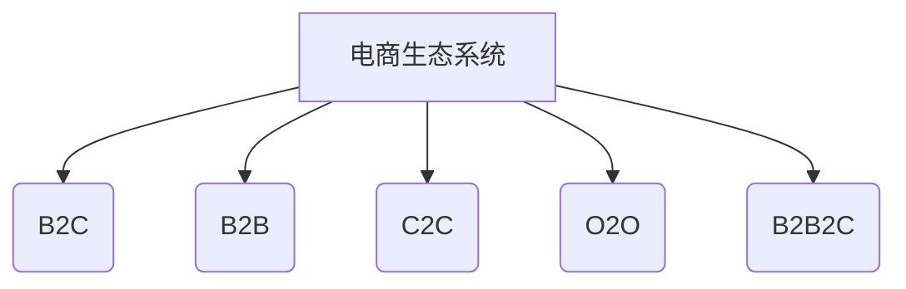
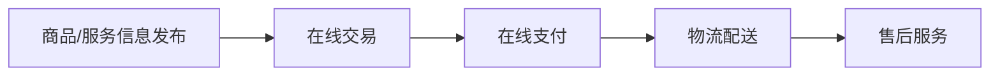

# 电商人才培养：应对行业发展需求，培养专业人才

## 1. 背景介绍

### 1.1 电子商务的兴起与发展

随着互联网技术的不断进步和普及,电子商务(Electronic Commerce,简称电商)作为一种全新的商业模式逐渐崛起并蓬勃发展。电商是指通过互联网及其他信息通信网络进行商品交易活动及相关服务活动的一种新型商业运营模式。

电商的兴起,极大地改变了传统商业运营方式,为人们的生活带来了极大的便利。消费者可以足不出户便可购买所需商品;企业可以通过网上销售,拓展更广阔的市场;制造商可以直接面对终端消费者,减少中间环节。电商的发展也推动了物流配送、在线支付等相关产业的发展。

### 1.2 电商行业现状及发展趋势

近年来,随着移动互联网、大数据、云计算等新兴技术的发展,电商行业呈现出蓬勃发展的态势。根据中国互联网络信息中心(CNNIC)的数据,截至2022年12月,中国网民规模达10.67亿,互联网普及率为73.4%;网上零售额达到13.09万亿元,同比增长6.9%。

未来,电商行业将呈现出以下发展趋势:

1. 移动电商持续升温
2. 人工智能、大数据等新技术深度融合
3. 新零售模式不断涌现
4. 供应链体系日趋完善
5. 跨境电商蓬勃发展

## 2. 核心概念与联系

### 2.1 电商业务模式

电商业务模式主要包括以下几种类型:

1. B2C(Business to Customer,企业对个人)
2. B2B(Business to Business,企业对企业)
3. C2C(Customer to Customer,个人对个人)
4. O2O(Online to Offline,线上线下结合)
5. B2B2C(Brand to Business to Customer,品牌商对企业对个人)

这些模式相互关联,构成了电商生态系统。



### 2.2 电商核心环节

电商的核心环节包括:

1. 商品/服务信息发布
2. 在线交易
3. 在线支付
4. 物流配送
5. 售后服务

这些环节有机衔接,构成完整的电商业务流程。



## 3. 核心算法原理具体操作步骤

### 3.1 推荐系统算法

推荐系统是电商平台的核心算法之一,其作用是为用户推荐感兴趣的商品或服务。常用的推荐算法包括:

1. 协同过滤算法(Collaborative Filtering)
2. 基于内容的推荐算法(Content-based Recommendation)
3. 基于知识的推荐算法(Knowledge-based Recommendation)
4. 混合推荐算法(Hybrid Recommendation)

以协同过滤算法为例,其基本原理是利用用户之间的相似性或商品之间的相似性进行推荐。具体步骤如下:

1. 构建用户-商品评分矩阵
2. 计算用户之间的相似度
3. 找到与目标用户最相似的K个用户(K-Nearest Neighbors)
4. 根据这K个用户对其他商品的评分,预测目标用户对未评分商品的兴趣程度
5. 将兴趣程度较高的商品推荐给目标用户

### 3.2 在线支付算法

在线支付是电商交易的关键环节,涉及资金安全等重要问题。常用的在线支付算法包括:

1. 数字签名算法
2. 对称加密算法(如DES、AES等)
3. 非对称加密算法(如RSA等)
4. 哈希算法(如MD5、SHA等)

以RSA算法为例,其基本原理是利用两个大质数的乘积作为模数,选取一个与模数的欧拉函数互质的公钥指数,计算出私钥指数,从而实现加密和解密。具体步骤如下:

1. 选取两个不同的大质数p和q
2. 计算模数N=p*q
3. 计算欧拉函数φ(N)=(p-1)*(q-1)
4. 选取一个与φ(N)互质的公钥指数e
5. 计算出私钥指数d,使得(d*e)%φ(N)=1
6. 公钥为(e,N),私钥为(d,N)
7. 加密:将明文M加密为密文C=M^e(mod N)
8. 解密:将密文C解密为明文M=C^d(mod N)

## 4. 数学模型和公式详细讲解举例说明

### 4.1 协同过滤算法数学模型

协同过滤算法的核心是计算用户之间或商品之间的相似度。常用的相似度计算方法有:

1. 欧氏距离
2. 皮尔逊相关系数
3. 余弦相似度
4. 调整余弦相似度

以余弦相似度为例,设有m个用户,n个商品,构建用户-商品评分矩阵R(m×n)。对于用户u和v,其余弦相似度计算公式为:

$$\text{sim}(u,v)=\cos(\vec{R_u},\vec{R_v})=\frac{\vec{R_u}\cdot\vec{R_v}}{||\vec{R_u}||\times||\vec{R_v}||}=\frac{\sum\limits_{i\in I}R_{ui}R_{vi}}{\sqrt{\sum\limits_{i\in I}R_{ui}^2}\sqrt{\sum\limits_{i\in I}R_{vi}^2}}$$

其中,I为用户u和v都评分过的商品集合。

### 4.2 RSA算法数学原理

RSA算法的数学原理基于一个简单的事实:将两个大质数相乘所得的积作为模数,找到与其欧拉函数互质的指数作为加密指数,是相对容易的;但是想从模数和加密指数出发,求出原先的那两个质数,则是一个很困难的数论问题。

设有两个不同的大质数p和q,模数N=p*q。根据欧拉定理,对任意整数M,如果M与N互质,则有:

$$M^{\phi(N)}\equiv1(\text{mod}\ N)$$

其中,φ(N)为N的欧拉函数,表示小于N且与N互质的正整数的个数。当N是两个不同质数的乘积时,φ(N)=(p-1)*(q-1)。

选取一个与φ(N)互质的整数e作为公钥指数,则存在唯一的整数d,使得:

$$(e\times d)\equiv1(\text{mod}\ \phi(N))$$

d就是私钥指数。加密和解密的计算公式为:

$$\begin{aligned}
\text{加密:}&&C&=M^e(\text{mod}\ N)\\
\text{解密:}&&M&=C^d(\text{mod}\ N)
\end{aligned}$$

RSA算法的安全性依赖于分解大整数的困难性。已知模数N和公钥指数e,想要求出私钥指数d,就需要先从N出发分解出p和q,这是一个极其困难的数论问题。

## 5. 项目实践:代码实例和详细解释说明 

### 5.1 协同过滤算法Python实现

```python
import numpy as np

# 用户-商品评分矩阵
ratings = np.array([[5, 3, 0, 1],
                    [4, 0, 0, 1],
                    [1, 1, 0, 5],
                    [1, 0, 0, 4],
                    [0, 1, 5, 4]])

# 计算用户之间的余弦相似度
def cosine_similarity(ratings, user1, user2):
    common = [i for i in range(len(ratings[user1])) if ratings[user1][i] > 0 and ratings[user2][i] > 0]
    if len(common) == 0:
        return 0
    
    sum1 = sum([ratings[user1][i] for i in common])
    sum2 = sum([ratings[user2][i] for i in common])
    
    sum_square1 = sum([ratings[user1][i]**2 for i in common])
    sum_square2 = sum([ratings[user2][i]**2 for i in common])
    
    sum_product = sum([ratings[user1][i] * ratings[user2][i] for i in common])
    
    numerator = sum_product
    denominator = np.sqrt(sum_square1) * np.sqrt(sum_square2)
    
    if denominator == 0:
        return 0
    else:
        return numerator / denominator

# 找到与目标用户最相似的K个用户
def k_nearest_neighbors(ratings, user, k):
    similarities = [(cosine_similarity(ratings, user, other), other) for other in range(len(ratings)) if other != user]
    similarities.sort(reverse=True)
    return [other for sim, other in similarities[:k]]

# 为目标用户推荐商品
def recommend(ratings, user, k):
    knn = k_nearest_neighbors(ratings, user, k)
    recommendations = np.zeros(len(ratings[user]))
    
    for neighbor in knn:
        for i in range(len(ratings[neighbor])):
            if ratings[neighbor][i] > 0:
                if ratings[user][i] == 0:
                    similarity = cosine_similarity(ratings, user, neighbor)
                    recommendations[i] += ratings[neighbor][i] * similarity
    
    sorted_recommendations = sorted([(recommendations[i], i) for i in range(len(recommendations))], reverse=True)
    
    return [i for score, i in sorted_recommendations if score > 0]

# 示例用法
user = 0
k = 2
recommended_items = recommend(ratings, user, k)
print(f"为用户{user}推荐的商品编号为: {recommended_items}")
```

上述代码实现了基于用户的协同过滤算法,包括计算用户之间的余弦相似度、找到最相似的K个邻居用户,以及根据这K个邻居用户的评分预测目标用户对未评分商品的兴趣程度,从而为目标用户推荐感兴趣的商品。

### 5.2 RSA算法Python实现

```python
import random

# 生成大质数
def generate_prime(bits):
    while True:
        p = random.randrange(2**(bits-1), 2**bits)
        if is_prime(p):
            return p

# 判断是否为质数
def is_prime(n):
    if n < 2:
        return False
    for i in range(2, int(n**0.5) + 1):
        if n % i == 0:
            return False
    return True

# 扩展欧几里得算法求模反元素
def extended_gcd(a, b):
    if b == 0:
        return a, 1, 0
    else:
        gcd, x, y = extended_gcd(b, a % b)
        return gcd, y, x - (a // b) * y

# 生成RSA密钥对
def generate_key(bits):
    p = generate_prime(bits // 2)
    q = generate_prime(bits // 2)
    n = p * q
    phi = (p - 1) * (q - 1)
    
    while True:
        e = random.randrange(2, phi)
        if gcd(e, phi) == 1:
            break
    
    gcd, d, _ = extended_gcd(e, phi)
    
    return (e, n), (d, n)

# 计算最大公约数
def gcd(a, b):
    while b != 0:
        a, b = b, a % b
    return a

# RSA加密
def encrypt(plaintext, public_key):
    e, n = public_key
    ciphertext = [pow(ord(char), e, n) for char in plaintext]
    return ciphertext

# RSA解密
def decrypt(ciphertext, private_key):
    d, n = private_key
    plaintext = ''.join([chr(pow(char, d, n)) for char in ciphertext])
    return plaintext

# 示例用法
message = "Hello, World!"
public_key, private_key = generate_key(512)
ciphertext = encrypt(message, public_key)
decrypted_message = decrypt(ciphertext, private_key)

print(f"原始消息: {message}")
print(f"加密后的密文: {ciphertext}")
print(f"解密后的消息: {decrypted_message}")
```

上述代码实现了RSA算法的密钥生成、加密和解密功能。首先生成两个大质数p和q,计算模数N和欧拉函数φ(N),选取一个与φ(N)互质的公钥指数e,并计算出私钥指数d。加密时,将明文字符转换为对应的ASCII码值,并使用公钥(e,N)进行模幂运算加密;解密时,使用私钥(d,N)进行模幂运算解密,得到原始明