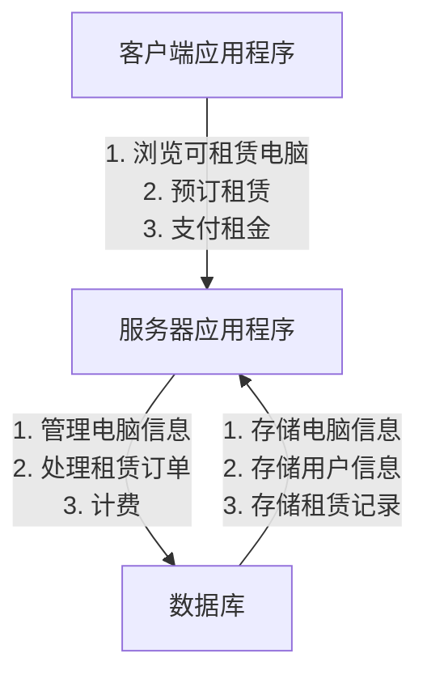
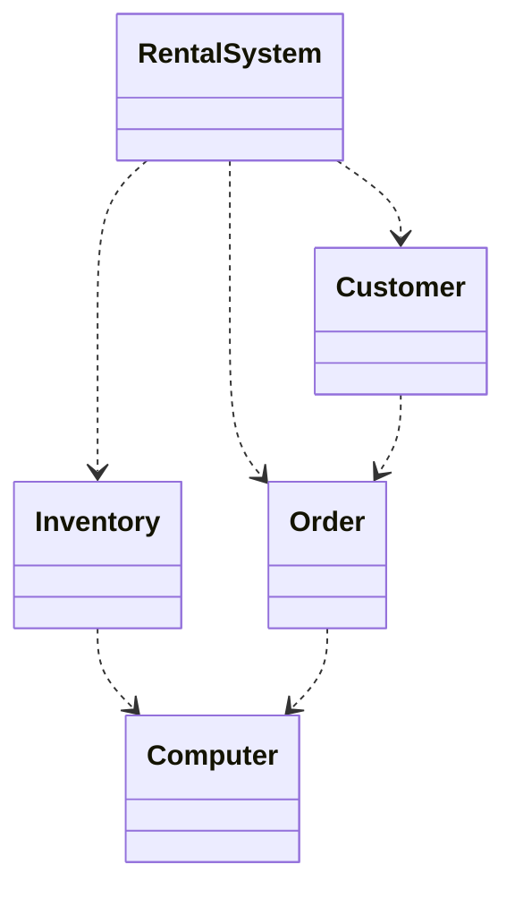

# 电脑租赁系统详细设计与具体代码实现

## 1. 背景介绍

### 1.1 电脑租赁系统概述

在当今科技飞速发展的时代,电脑无疑已成为人们工作和生活中不可或缺的重要工具。然而,由于经济条件或其他原因,并非所有人都能够购买自己的电脑。这就催生了电脑租赁服务的需求。电脑租赁系统为用户提供了按需租用电脑的灵活选择,无需承担高昂的购买成本,也能享受先进设备带来的便利。

### 1.2 电脑租赁系统的优势

相比传统的电脑购买模式,电脑租赁系统具有以下优势:

- **经济实惠**: 租赁电脑的成本通常低于购买,尤其适合临时性或短期使用需求。
- **设备更新**: 租赁公司会定期更新租赁设备,确保用户使用的是较新型号。
- **灵活性**: 用户可根据实际需求选择不同配置和租赁时长的电脑。
- **无后顾之忧**: 租赁期满后,用户无需操心设备维护和处理问题。

### 1.3 电脑租赁系统的应用场景

电脑租赁系统在以下场景中发挥着重要作用:

- **企业临时项目**: 企业可根据项目需求短期租赁所需配置的电脑,避免采购成本。
- **学校教学**: 学校可为学生租赁电脑,满足教学和实验室的需求。
- **个人临时使用**: 个人用户可在出差、旅游等情况下短期租赁电脑,方便携带。
- **活动现场**: 各类会议、展会等活动可租赁电脑,为与会人员提供便利。

## 2. 核心概念与联系

### 2.1 系统架构概览

电脑租赁系统通常采用客户端-服务器架构,包括以下核心组件:

- **客户端应用程序**: 提供用户界面,允许用户浏览可租赁电脑、预订租赁、支付租金等。
- **服务器应用程序**: 管理电脑租赁信息、处理租赁订单、计费等核心业务逻辑。
- **数据库**: 存储电脑信息、用户信息、租赁记录等系统数据。



### 2.2 用户角色

电脑租赁系统通常包括以下用户角色:

- **客户**: 浏览可租赁电脑、预订租赁、支付租金。
- **管理员**: 管理电脑信息、处理租赁订单、管理用户账户等。

### 2.3 核心业务流程

1. **电脑管理**: 管理员添加、编辑和删除可租赁的电脑信息,包括型号、配置、库存数量等。
2. **用户注册和认证**: 用户注册账户,进行身份认证,以使用系统服务。
3. **浏览和预订**: 客户浏览可租赁电脑的详细信息,选择所需配置和租赁时长,提交预订请求。
4. **订单处理**: 系统处理客户的租赁订单,检查库存,计算租金等。
5. **支付租金**: 客户通过在线支付或其他方式支付租金。
6. **发货和取货**: 系统安排发货或客户到指定地点取货。
7. **归还和结算**: 客户在租赁期满后归还电脑,系统进行结算。

## 3. 核心算法原理具体操作步骤

### 3.1 电脑库存管理算法

电脑库存管理是电脑租赁系统的核心功能之一。它需要实时跟踪每种型号电脑的库存数量,以确保可以满足客户的租赁需求。以下是一种常见的库存管理算法:

1. 初始化一个字典或哈希表,用于存储每种型号电脑的库存数量。
2. 当有新的电脑型号添加到系统时,在字典中创建一个新的键值对,将该型号的初始库存数量设置为相应的值。
3. 当有客户预订租赁某种型号的电脑时,从字典中获取该型号的当前库存数量。
   - 如果库存足够,则减去所需数量,更新字典中的库存数量。
   - 如果库存不足,则拒绝该租赁请求。
4. 当有客户归还电脑时,将相应型号的库存数量增加。

以下是一个使用Python字典实现库存管理的示例代码:

```python
# 初始化库存字典
inventory = {'Dell Latitude': 10, 'Lenovo ThinkPad': 5, 'HP EliteBook': 8}

def rent_computer(model, quantity):
    if model in inventory:
        if inventory[model] >= quantity:
            inventory[model] -= quantity
            print(f"Successfully rented {quantity} {model} computers.")
        else:
            print(f"Sorry, not enough {model} computers in stock.")
    else:
        print(f"Sorry, {model} is not available for rent.")

def return_computer(model, quantity):
    if model in inventory:
        inventory[model] += quantity
        print(f"Successfully returned {quantity} {model} computers.")
    else:
        print(f"Sorry, {model} is not in our inventory.")
```

### 3.2 订单处理算法

订单处理是电脑租赁系统的另一个核心功能。它需要处理客户的租赁请求,检查库存,计算租金,并生成订单记录。以下是一种常见的订单处理算法:

1. 接收客户的租赁请求,包括所需电脑型号、数量和租赁时长。
2. 调用库存管理算法,检查所需型号的库存是否足够。
3. 如果库存足够,则计算租金。租金通常基于电脑型号、配置和租赁时长计算。
4. 生成订单记录,包括订单号、客户信息、租赁详情和租金金额。
5. 将订单记录存储在数据库中。
6. 通知客户订单详情和支付方式。

以下是一个使用Python实现订单处理的示例代码:

```python
# 电脑型号及其每日租金
rental_rates = {'Dell Latitude': 10, 'Lenovo ThinkPad': 15, 'HP EliteBook': 12}

def process_order(customer, model, quantity, duration):
    # 检查库存
    if model in inventory and inventory[model] >= quantity:
        # 计算租金
        rate = rental_rates[model]
        total_rent = rate * quantity * duration
        
        # 生成订单记录
        order_id = generate_order_id()
        order = {
            'order_id': order_id,
            'customer': customer,
            'model': model,
            'quantity': quantity,
            'duration': duration,
            'total_rent': total_rent
        }
        
        # 存储订单记录
        save_order(order)
        
        # 更新库存
        inventory[model] -= quantity
        
        # 通知客户
        notify_customer(customer, order)
        
        print(f"Order {order_id} processed successfully.")
    else:
        print(f"Sorry, not enough {model} computers in stock.")
```

### 3.3 支付处理算法

支付处理是电脑租赁系统的另一个重要功能。它需要处理客户的租金支付,确保支付金额正确,并更新订单状态。以下是一种常见的支付处理算法:

1. 接收客户的支付请求,包括订单号和支付金额。
2. 从数据库中检索该订单记录。
3. 比较支付金额与订单租金是否相等。
   - 如果相等,则标记订单为已付款状态。
   - 如果支付金额不足,则拒绝支付请求,并通知客户缺额金额。
   - 如果支付金额超出,则接受支付,并将多余金额记录为客户余额。
4. 更新订单记录的支付状态和客户余额(如果有)。
5. 通知客户支付结果。

以下是一个使用Python实现支付处理的示例代码:

```python
def process_payment(order_id, amount):
    # 检索订单记录
    order = get_order(order_id)
    if order:
        total_rent = order['total_rent']
        if amount == total_rent:
            # 标记订单为已付款
            mark_order_paid(order_id)
            print(f"Payment for order {order_id} processed successfully.")
        elif amount < total_rent:
            # 支付金额不足
            balance_due = total_rent - amount
            print(f"Insufficient payment for order {order_id}. Balance due: ${balance_due}")
        else:
            # 支付金额超出
            balance = amount - total_rent
            mark_order_paid(order_id)
            update_customer_balance(order['customer'], balance)
            print(f"Payment for order {order_id} processed successfully. Remaining balance: ${balance}")
    else:
        print(f"Order {order_id} not found.")
```

## 4. 数学模型和公式详细讲解举例说明

在电脑租赁系统中,数学模型和公式主要用于计算租金。租金通常基于电脑型号、配置和租赁时长计算。以下是一种常见的租金计算模型:

$$
租金 = 基本租金率 \times 租赁时长 \times 数量
$$

其中:

- 基本租金率: 每台电脑每天的租金,通常由电脑型号和配置决定。
- 租赁时长: 租赁的天数。
- 数量: 租赁电脑的数量。

例如,假设租赁一台Dell Latitude电脑的基本租金率为10美元/天,租赁时长为5天,租赁数量为2台。则租金计算如下:

$$
租金 = 10 \times 5 \times 2 = 100 (美元)
$$

在实际应用中,租金计算可能会更加复杂,需要考虑其他因素,如:

- 长期租赁折扣: 对于长期租赁,可能会提供折扣率。
- 附加服务费用: 如果提供额外的服务(如软件安装、技术支持等),可能会收取附加费用。
- 保险费用: 为防止损坏或丢失,可能会收取保险费用。

在这种情况下,租金计算公式可能如下:

$$
租金 = (基本租金率 \times 租赁时长 \times 数量) \times (1 - 折扣率) + 附加服务费用 + 保险费用
$$

例如,假设基本租金率为10美元/天,租赁时长为30天,租赁数量为3台,长期租赁折扣率为20%,附加服务费用为50美元,保险费用为30美元。则租金计算如下:

$$
租金 = (10 \times 30 \times 3) \times (1 - 0.2) + 50 + 30 = 810 (美元)
$$

通过建立适当的数学模型和公式,电脑租赁系统可以准确计算租金,为客户提供透明和公平的定价。

## 5. 项目实践: 代码实例和详细解释说明

在本节中,我们将提供一个基于Python的电脑租赁系统示例代码,并对其进行详细解释。

### 5.1 系统架构

我们将采用基于对象的设计方法,将系统划分为以下几个核心类:

- `Computer`: 表示可租赁的电脑,包含型号、配置和价格信息。
- `Inventory`: 管理电脑库存,提供租赁和归还操作。
- `Customer`: 表示系统用户,包含用户信息和租赁记录。
- `Order`: 表示租赁订单,包含租赁详情和租金计算。
- `RentalSystem`: 系统入口,协调各个组件的交互。



### 5.2 代码实现

#### 5.2.1 `Computer` 类

```python
class Computer:
    def __init__(self, model, specs, daily_rate):
        self.model = model
        self.specs = specs
        self.daily_rate = daily_rate

    def __str__(self):
        return f"{self.model} ({self.specs}), Daily Rate: ${self.daily_rate}"
```

`Computer` 类表示一种可租赁的电脑型号,包含以下属性:

- `model`: 电脑型号名称。
- `specs`: 电脑配置详情。
- `daily_rate`: 每日租金。

#### 5.2.2 `Inventory