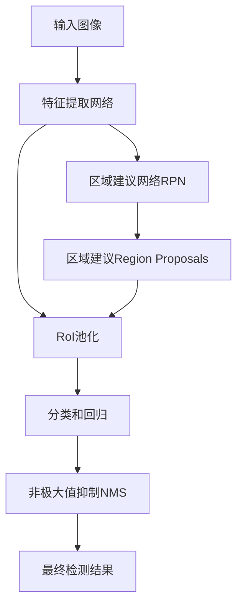
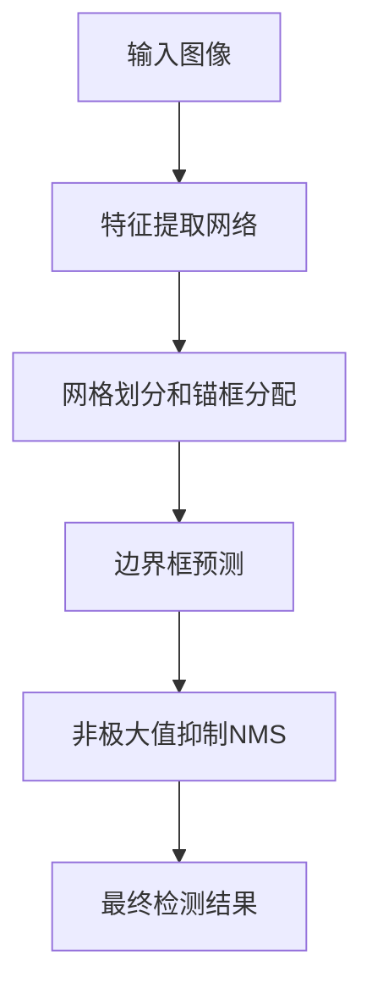

# 目标检测(Object Detection)原理与代码实战案例讲解

## 1.背景介绍

在计算机视觉领域,目标检测(Object Detection)是一项非常重要和具有挑战性的任务。它旨在从给定的图像或视频中自动定位并识别出感兴趣的目标对象。目标检测在许多领域都有广泛的应用,例如安全监控、自动驾驶、机器人视觉、人脸识别等。

随着深度学习技术的不断发展,基于卷积神经网络(CNN)的目标检测算法取得了长足的进步,在准确率和速度上都有了显著的提升。目前,主流的目标检测算法主要分为两大类:基于区域建议的两阶段算法(Two-Stage)和基于回归的一阶段算法(One-Stage)。

### 1.1 两阶段目标检测算法

两阶段目标检测算法的代表有R-CNN系列算法,包括R-CNN、Fast R-CNN、Faster R-CNN等。这类算法首先使用专门的网络(如选择性搜索(Selective Search)或区域建议网络(Region Proposal Network,RPN))生成一组区域建议(Region Proposals),然后对每个区域建议进行分类和精细化边界框回归,最终输出目标类别和精确的边界框位置。

### 1.2 一阶段目标检测算法

一阶段目标检测算法的代表有YOLO(You Only Look Once)系列、SSD(Single Shot MultiBox Detector)等。这类算法将目标检测任务看作一个回归问题,直接从图像像素预测目标边界框和相应的类别,无需先生成区域建议。一阶段算法通常速度更快,但在小目标检测上往往表现不如两阶段算法。

## 2.核心概念与联系

目标检测算法涉及到一些核心概念,理解这些概念对于掌握算法原理非常重要。

### 2.1 边界框(Bounding Box)

边界框是目标检测算法的基本输出形式,用一个矩形框来描述目标在图像中的位置和大小。边界框通常用一个四元组(x,y,w,h)来表示,分别代表矩形框的中心坐标(x,y)、宽度w和高度h。

### 2.2 锚框(Anchor Box)

锚框是目标检测算法中的一个重要概念,尤其在一阶段算法中扮演着关键作用。锚框是一组预先设定的不同形状和大小的参考框,算法会在图像不同位置对这些锚框进行分类和回归,从而预测出最终的目标边界框。合理设置锚框的形状、大小和数量,对算法的性能有很大影响。

### 2.3 非极大值抑制(Non-Maximum Suppression, NMS)

由于目标检测算法会对同一目标生成多个重叠的边界框,需要使用非极大值抑制(NMS)来去除这些冗余的框。NMS根据每个边界框的置信度分数,保留分数最高的框,去除与之重叠程度较高的其他框。

### 2.4 IoU(Intersection over Union)

IoU是评估目标检测算法性能的一个重要指标。它描述了预测边界框与真实边界框之间的重叠程度,通常用作确定正样本和负样本的阈值。IoU的取值范围在0到1之间,值越大表示重叠程度越高。

### 2.5 mAP(mean Average Precision)

mAP是目标检测算法中常用的评估指标,用于综合考虑算法的精确率(Precision)和召回率(Recall)。mAP通过在不同IoU阈值下计算AP(Average Precision),然后对所有类别的AP取平均得到。

## 3.核心算法原理具体操作步骤

接下来,我们将介绍两种广为人知的目标检测算法:Faster R-CNN(两阶段)和YOLO(一阶段)的核心原理和具体操作步骤。

### 3.1 Faster R-CNN

Faster R-CNN是R-CNN系列算法的最新版本,它在精度和速度上都有很大提升。Faster R-CNN的核心步骤如下:

1. **特征提取网络**:使用预训练的卷积神经网络(如VGG、ResNet等)从输入图像中提取特征图(feature maps)。

2. **区域建议网络(RPN)**:在特征图上滑动窗口,对每个位置的锚框进行二分类(是否为目标)和边界框回归,从而生成一组区域建议。

3. **区域of Interest(RoI)池化**:根据区域建议从特征图中提取对应的特征,并使用RoI池化层对这些特征进行归一化处理。

4. **分类和回归**:将归一化后的特征输入到全连接层,进行目标分类和精细边界框回归。

5. **非极大值抑制(NMS)**:对分类和回归的结果进行NMS,去除冗余的边界框。

Faster R-CNN的核心创新在于引入了RPN网络,可以高效地生成高质量的区域建议,从而大大提高了算法的速度和准确率。



### 3.2 YOLO

YOLO(You Only Look Once)是一种一阶段目标检测算法,它将目标检测看作一个回归问题,直接从图像像素预测目标边界框和类别。YOLO的核心步骤如下:

1. **特征提取网络**:使用卷积神经网络(如DarkNet、ResNet等)从输入图像中提取特征图。

2. **网格划分和锚框分配**:将特征图划分成S×S个网格,每个网格负责预测B个锚框以及对应的置信度和类别概率。

3. **边界框预测**:对每个锚框,网络会预测出其包含目标的置信度、目标类别概率以及相对于锚框的边界框坐标偏移量。

4. **非极大值抑制(NMS)**:对所有预测的边界框进行NMS,去除冗余的框。

YOLO的优点在于结构简单、速度快,但对于小目标的检测效果一般。后续的YOLOv2、YOLOv3等版本在检测精度和实时性上都有了进一步的提升。



## 4.数学模型和公式详细讲解举例说明

在目标检测算法中,常常会涉及到一些数学模型和公式,下面我们将详细讲解其中的几个重要公式。

### 4.1 IoU(Intersection over Union)

IoU用于衡量两个边界框之间的重叠程度,公式如下:

$$
\text{IoU}(b_1, b_2) = \frac{\text{Area}(b_1 \cap b_2)}{\text{Area}(b_1 \cup b_2)}
$$

其中,$ b_1 $和$ b_2 $分别表示两个边界框,$ \cap $表示交集,$ \cup $表示并集。IoU的取值范围在0到1之间,值越大表示重叠程度越高。

在目标检测中,IoU常被用作确定正样本和负样本的阈值。例如,在训练RPN时,如果一个锚框与真实边界框的IoU大于0.7,则视为正样本;如果IoU小于0.3,则视为负样本。

### 4.2 边界框回归(Bounding Box Regression)

边界框回归是指根据一个参考框(如锚框或先验框)和真实边界框之间的偏移量,来精细调整预测框的位置和大小。常用的边界框回归公式如下:

$$
\begin{aligned}
t_x &= (x - x_a) / w_a \\
t_y &= (y - y_a) / h_a \\
t_w &= \log(w / w_a) \\
t_h &= \log(h / h_a)
\end{aligned}
$$

其中,$(x, y, w, h)$表示真实边界框的中心坐标、宽度和高度,$(x_a, y_a, w_a, h_a)$表示参考框的相应参数。$t_x, t_y, t_w, t_h$是需要预测的偏移量。

在预测时,可以根据参考框和预测的偏移量,恢复出精细的边界框坐标:

$$
\begin{aligned}
x &= x_a + t_x \cdot w_a \\
y &= y_a + t_y \cdot h_a \\
w &= w_a \cdot \exp(t_w) \\
h &= h_a \cdot \exp(t_h)
\end{aligned}
$$

边界框回归可以有效地解决目标检测中的几何变换问题,提高预测的准确性。

### 4.3 多标签分类损失(Multi-label Classification Loss)

在目标检测任务中,每个边界框不仅需要预测目标的类别,还需要预测是否包含目标(前景或背景)。因此,需要使用多标签分类损失函数来同时优化分类和检测任务。

常用的多标签分类损失函数是交叉熵损失(Cross Entropy Loss),公式如下:

$$
\text{Loss} = -\sum_{i=1}^{N} \sum_{j=1}^{M} y_{ij} \log(p_{ij})
$$

其中,$ N $表示样本数量,$ M $表示类别数量(包括背景类),$ y_{ij} $是一个二值指示变量,表示第$ i $个样本是否属于第$ j $类,$ p_{ij} $是模型预测的第$ i $个样本属于第$ j $类的概率。

在目标检测中,通常将背景类作为一个单独的类别,并且每个边界框都需要预测是否包含目标(前景或背景)。因此,对于每个边界框,需要计算$ M+1 $个类别的交叉熵损失,其中包括$ M $个目标类别和1个背景类。

## 5.项目实践：代码实例和详细解释说明

为了更好地理解目标检测算法的实现细节,我们将通过一个基于PyTorch的YOLO实例代码,来详细解释关键步骤和核心代码。

### 5.1 YOLO网络结构

YOLO网络的输入是一张图像,输出是一个包含边界框、置信度和类别概率的张量。网络的主体由卷积层和池化层组成,用于从图像中提取特征。最后一层是一个全卷积层,它将特征图划分为S×S个网格,每个网格预测B个锚框以及对应的置信度和类别概率。

```python
import torch
import torch.nn as nn

class YOLOv1(nn.Module):
    def __init__(self, num_classes=20, num_boxes=2):
        super(YOLOv1, self).__init__()
        # 定义网络层
        ...
        
    def forward(self, x):
        # 前向传播
        ...
        # 输出张量的形状: (batch_size, S, S, B * (5 + num_classes))
        return output
```

### 5.2 锚框分配

在YOLO中,每个网格都会预测B个锚框。我们需要预先设置这些锚框的形状和大小,通常根据训练数据集中目标框的分布来设置。

```python
# 设置锚框的形状和大小
anchors = [(1.0, 1.0), (1.5, 2.0), ...]

# 在每个网格上分配锚框
stride = img_size // S
anchors_per_grid = len(anchors) // num_boxes
for i in range(S):
    for j in range(S):
        for k in range(anchors_per_grid):
            anchor = anchors[k * num_boxes:(k + 1) * num_boxes]
            cx = (j + 0.5) * stride
            cy = (i + 0.5) * stride
            # 计算锚框的实际坐标
            ...
```

### 5.3 边界框解码

YOLO网络输出的是相对于锚框的偏移量,我们需要将这些偏移量解码为实际的边界框坐标。

```python
def decode_boxes(output, anchors, img_size):
    batch_size = output.size(0)
    num_anchors = len(anchors)
    
    # 解码边界框坐标
    boxes = torch.zeros(batch_size, num_anchors, 4)
    for b in range(batch_size):
        for i in range(num_anchors):
            cx, cy, w, h = output[b, :, i * 5:i * 5