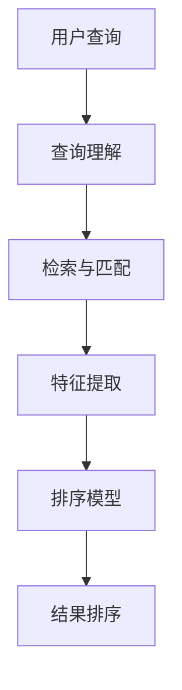

# 相关性排序：打造精准搜索体验

## 1.背景介绍

在当今信息爆炸的时代,搜索引擎已经成为我们获取所需信息的重要工具。然而,仅仅返回与查询相关的结果是不够的,更重要的是如何对这些结果进行排序,使最相关的内容优先显示。这就是相关性排序的作用所在。相关性排序旨在根据查询和文档之间的相关程度对搜索结果进行排序,从而提高用户的搜索体验。

### 1.1 搜索引擎的核心任务

搜索引擎的核心任务可以概括为三个步骤:

1. **爬虫抓取(Crawling)**: 通过网络爬虫自动浏览网页,下载并存储网页内容。
2. **索引构建(Indexing)**: 对下载的网页内容进行分词、去重、计算词频等预处理,并构建反向索引,方便快速查找。
3. **排序与展示(Ranking)**: 当用户输入查询时,搜索引擎根据查询与文档的相关性对结果进行排序,并将排序后的结果展示给用户。

其中,相关性排序是搜索引擎的核心,直接决定了搜索结果的质量和用户体验。一个好的相关性排序算法能够将最相关的结果置于搜索结果的首位,提高用户的满意度。

### 1.2 相关性排序的重要性

相关性排序对于搜索引擎的重要性不言而喻:

1. **提高用户体验**: 高质量的搜索结果能够让用户快速找到所需信息,提升用户体验。
2. **增强竞争力**: 在搜索引擎市场中,相关性排序算法的优劣直接影响着搜索引擎的竞争力。
3. **挖掘商业价值**: 精准的搜索结果可以为相关广告投放提供依据,从而实现商业价值。

因此,相关性排序算法一直是搜索引擎公司的核心技术,也是学术界和工业界持续研究的热点课题。

## 2.核心概念与联系

### 2.1 相关性排序的核心概念

相关性排序涉及以下几个核心概念:

1. **查询(Query)**: 用户输入的搜索词或搜索语句,表达了用户的搜索需求。
2. **文档(Document)**: 被索引和搜索的基本单位,通常指网页、文章、图片等。
3. **相关性(Relevance)**: 查询与文档之间的关联程度,用于衡量文档对查询的匹配程度。
4. **特征(Feature)**: 用于计算相关性分数的因素,包括词频、位置信息、链接信息等。
5. **排序模型(Ranking Model)**: 将多个特征综合考虑,计算文档对查询的最终相关性分数。

### 2.2 相关性排序的核心流程

相关性排序的核心流程包括以下几个步骤:

1. **用户查询**: 用户输入查询,表达搜索需求。
2. **查询理解**: 对查询进行分词、词性标注等预处理,理解查询的语义。
3. **检索与匹配**: 根据查询从索引中快速检索出相关文档。
4. **特征提取**: 从查询和文档中提取用于计算相关性的特征。
5. **排序模型**: 将多个特征综合考虑,计算文档对查询的最终相关性分数。
6. **结果排序**: 根据相关性分数对文档进行排序,输出排序后的搜索结果。

## 3.核心算法原理具体操作步骤

### 3.1 布尔模型与向量空间模型

相关性排序最初采用的是布尔模型(Boolean Model)和向量空间模型(Vector Space Model)。

#### 3.1.1 布尔模型

布尔模型将查询看作是一个布尔表达式,文档要么完全匹配查询(相关性为1),要么完全不匹配(相关性为0)。例如,对于查询 `"机器学习" AND "深度学习"`,只有同时包含这两个词的文档才会被检索出来。

布尔模型的优点是查询语义明确,但缺点是相关性计算过于简单,无法很好地满足用户需求。

#### 3.1.2 向量空间模型

向量空间模型将查询和文档都表示为向量,相关性则由两个向量的夹角或余弦值来衡量。具体来说,假设查询 $q$ 和文档 $d$ 都用词频向量表示,则它们的相关性分数可以用余弦相似度来计算:

$$\text{score}(q, d) = \cos(\theta) = \frac{\vec{q} \cdot \vec{d}}{|\vec{q}||\vec{d}|}$$

其中 $\theta$ 为两个向量的夹角。

向量空间模型能够较好地捕捉查询和文档之间的语义相关性,但仍然存在一些缺陷,例如无法处理同义词、近义词等语义关系,也没有考虑词的位置信息等其他重要特征。

### 3.2 概率模型

为了更好地捕捉查询和文档之间的相关性,后来提出了概率模型(Probabilistic Model)。概率模型的核心思想是,将相关性排序看作是一个概率估计问题:给定一个查询 $q$ 和一个文档 $d$,我们需要估计 $d$ 是相关文档的概率 $P(R=1|q, d)$。

#### 3.2.1 二值相关性模型(Binary Relevance Model)

二值相关性模型假设文档对查询要么相关,要么不相关,因此需要估计的是:

$$P(R=1|q, d) = \frac{P(d|R=1, q)P(R=1|q)}{P(d|q)}$$

其中:

- $P(d|R=1, q)$ 表示在已知查询 $q$ 和文档 $d$ 相关的情况下,观测到文档 $d$ 的概率。
- $P(R=1|q)$ 表示查询 $q$ 的一个文档是相关文档的先验概率。
- $P(d|q)$ 是一个归一化因子,使概率之和为1。

在实际应用中,通常假设 $P(R=1|q)$ 是一个常数,重点在于估计 $P(d|R=1, q)$。

#### 3.2.2 BM25 模型

BM25 模型是一种常用的概率模型,它将文档 $d$ 对查询 $q$ 的相关性分数定义为:

$$\text{score}(d, q) = \sum_{i=1}^{n} \text{IDF}(q_i) \cdot \frac{f(q_i, d) \cdot (k_1 + 1)}{f(q_i, d) + k_1 \cdot (1 - b + b \cdot \frac{|d|}{avgdl})}$$

其中:

- $q_i$ 是查询 $q$ 中的第 $i$ 个词项。
- $f(q_i, d)$ 是词项 $q_i$ 在文档 $d$ 中出现的词频。
- $|d|$ 是文档 $d$ 的长度(按字数或词数计算)。
- $avgdl$ 是文档集合的平均文档长度。
- $k_1$ 和 $b$ 是调节因子,用于控制词频和文档长度的影响程度。
- $\text{IDF}(q_i)$ 是词项 $q_i$ 的逆向文档频率,用于度量词项的重要性。

BM25 模型综合考虑了词频、文档长度和词项重要性等多个因素,能够给出较为合理的相关性分数。

### 3.3 学习排序模型

虽然概率模型在相关性排序中取得了不错的效果,但它们仍然存在一些缺陷,例如无法很好地处理查询语义、同义词、近义词等语义关系。为了解决这些问题,后来提出了学习排序模型(Learning to Rank)。

学习排序模型的核心思想是,将相关性排序看作是一个机器学习问题:给定一个包含查询、文档及相关性标注的训练集,我们可以学习一个模型,对新的查询和文档进行相关性预测和排序。

#### 3.3.1 特征工程

学习排序模型的第一步是特征工程,即从查询和文档中提取用于训练模型的特征。常用的特征包括:

1. **词频特征**: 查询词在文档中的词频、逆向文档频率等。
2. **位置特征**: 查询词在文档中出现的位置信息。
3. **语义特征**: 查询和文档的主题分布、词向量相似度等。
4. **链接特征**: 文档的入链接数、出链接数等链接信息。
5. **用户行为特征**: 用户点击、停留时间等用户行为数据。

特征工程对模型的性能有着重要影响,选择合适的特征是学习排序模型的关键。

#### 3.3.2 排序模型

在获得特征之后,我们可以使用各种机器学习模型进行训练,包括传统的模型(如LambdaMART、RankSVM等)和深度学习模型(如神经网络排序模型)。

以LambdaMART为例,它是一种基于梯度提升决策树(GBDT)的排序模型。LambdaMART将排序问题转化为一个成对的排序问题,即对于每个查询,我们需要学习一个模型,使得相关文档的分数高于不相关文档。具体来说,对于一个查询 $q$,文档对 $(d_i, d_j)$,如果 $d_i$ 比 $d_j$ 更相关,则我们希望模型满足:

$$f(x_i) \geq f(x_j) + \Delta_{ij}$$

其中 $x_i$ 和 $x_j$ 分别是文档 $d_i$ 和 $d_j$ 的特征向量, $\Delta_{ij}$ 是一个超参数,表示我们希望相关文档的分数比不相关文档高出多少。

LambdaMART使用GBDT作为基学习器,通过不断添加新的树来拟合上述不等式约束,从而学习出一个排序模型。

除了传统的模型,近年来深度学习在相关性排序领域也取得了卓越的成绩。例如,我们可以使用神经网络对查询和文档的语义进行建模,并将语义特征与其他特征相结合,训练出强大的排序模型。

#### 3.3.3 在线学习

上述模型都是基于离线数据进行训练的,但是在实际应用中,我们还需要考虑在线学习的问题。由于用户的搜索需求和偏好是动态变化的,我们需要不断地使用新的用户反馈数据(如点击、停留时间等)来更新排序模型,使其适应最新的用户需求。

常见的在线学习方法包括:

1. **多臂老虎机(Multi-Armed Bandit)**: 将不同的排序策略看作是不同的臂,通过探索与利用的方式来动态调整排序策略。
2. **在线学习到排序(Online Learning to Rank)**: 直接在线更新排序模型的参数,使其能够适应新的用户反馈数据。

在线学习能够有效地提高排序模型的鲁棒性和适应性,是现代搜索引擎不可或缺的一个环节。

## 4.数学模型和公式详细讲解举例说明

在上一节中,我们介绍了相关性排序的一些核心算法原理,其中涉及到了一些数学模型和公式。在这一节,我们将对其中的一些重要公式进行详细讲解和举例说明。

### 4.1 向量空间模型中的余弦相似度

在向量空间模型中,我们使用余弦相似度来衡量查询和文档之间的相关性。具体来说,假设查询 $q$ 和文档 $d$ 都用词频向量表示,则它们的相关性分数可以用余弦相似度来计算:

$$\text{score}(q, d) = \cos(\theta) = \frac{\vec{q} \cdot \vec{d}}{|\vec{q}||\vec{d}|}$$

其中 $\theta$ 为两个向量的夹角。

余弦相似度的取值范围是 $[0, 1]$,当两个向量完全相同时,余弦相似度为1;当两个向量正交时,余弦相似度为0。