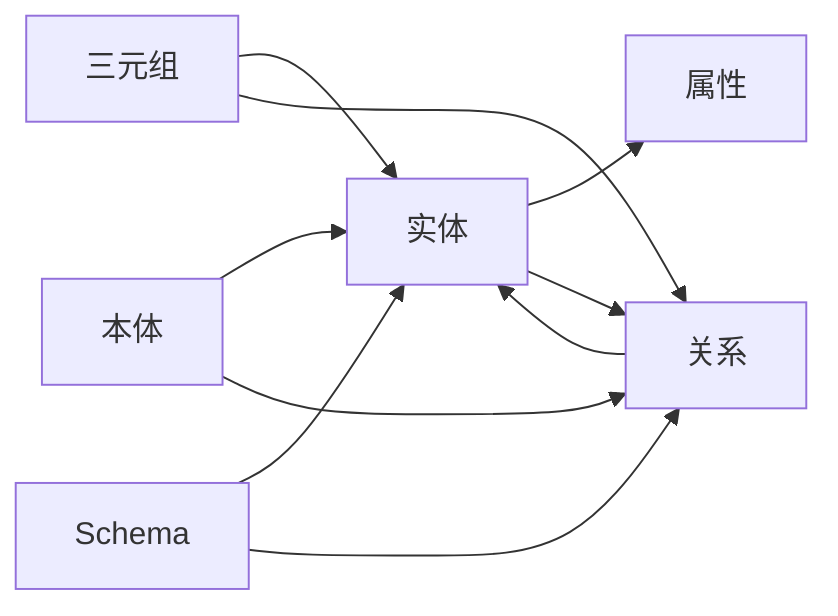

# 知识图谱 原理与代码实例讲解

## 1. 背景介绍
### 1.1 知识图谱的定义与发展历程
知识图谱（Knowledge Graph）是一种结构化的知识库，它以图的形式表示实体及实体之间的关系。知识图谱起源于2012年Google提出的Knowledge Graph概念，目的是提升搜索引擎的智能化水平。随后，知识图谱迅速成为人工智能、自然语言处理、知识管理等领域的研究热点。

### 1.2 知识图谱的应用价值
知识图谱具有广泛的应用价值，主要体现在以下几个方面：

1. 智能搜索：通过构建知识图谱，可以实现基于语义的智能搜索，提升搜索的准确性和用户体验。
2. 智能问答：利用知识图谱，可以实现自动问答系统，根据用户的自然语言问题给出准确的答案。  
3. 知识推理：基于知识图谱，可以进行知识推理，发现隐含的实体关系，挖掘新的知识。
4. 个性化推荐：利用知识图谱表示用户画像，可以实现个性化的信息推荐和服务。

### 1.3 知识图谱的技术挑战
构建高质量的知识图谱面临诸多技术挑战，主要包括：

1. 知识抽取：如何从非结构化数据（如文本、图像等）中准确抽取实体、关系等知识要素。
2. 知识融合：如何解决不同数据源之间的知识冲突问题，实现知识的自动对齐和融合。
3. 知识推理：如何基于知识图谱进行高效、可解释的知识推理。
4. 知识更新：如何实现知识图谱的持续更新与维护，保持与实际世界的同步。

## 2. 核心概念与联系
### 2.1 实体（Entity） 
实体是知识图谱中的核心对象，通常指现实世界中的事物，如人物、地点、组织等。每个实体都有自己的属性，如人物实体的姓名、出生日期等。

### 2.2 关系（Relation）
关系表示实体之间的联系，如人物之间的社交关系（朋友、师生等），组织与人物的隶属关系等。关系可以是有向的，也可以是无向的。

### 2.3 三元组（Triple）
三元组是知识图谱的基本单元，由主语（Subject）、谓语（Predicate）和宾语（Object）组成，表示两个实体之间的一种关系。例如，"姚明 身高 2.26米"就是一个典型的三元组。

### 2.4 本体（Ontology）
本体定义了知识图谱中的概念、关系以及概念之间的层次结构。本体为知识图谱提供了一致的语义表示，有助于知识的组织、共享和推理。

### 2.5 Schema
Schema定义了知识图谱的数据模型，规定了实体的类型、属性以及关系的类型。Schema为知识图谱的构建提供了规范和指导。

### 2.6 核心概念之间的联系
下图展示了知识图谱核心概念之间的联系：



从图中可以看出，实体通过属性来刻画自身特征，通过关系与其他实体发生联系。三元组是实体和关系的具体表示形式。本体和Schema为实体和关系提供了语义层面的定义和约束。

## 3. 核心算法原理具体操作步骤
知识图谱的构建通常包括以下几个核心步骤：

### 3.1 知识抽取
知识抽取旨在从非结构化数据中识别出实体、关系和属性。主要方法包括：

1. 命名实体识别：利用条件随机场（CRF）、循环神经网络（RNN）等模型识别文本中的实体。
2. 关系抽取：使用基于规则、监督学习、远程监督等方法从文本中抽取实体间的关系。
3. 属性抽取：通过模板匹配、序列标注等技术从文本中抽取实体的属性值。

### 3.2 知识融合
知识融合解决了不同数据源之间的冲突问题，实现知识的自动对齐和链接。主要方法包括：

1. 实体链接：通过实体消歧和实体对齐技术，将不同数据源中的实体映射到统一的实体标识符上。
2. 知识对齐：利用本体匹配、图匹配等技术，发现不同知识库之间的等价关系和映射关系。

### 3.3 知识存储
知识图谱的存储需要支持高效的图数据管理和查询。主要的存储方案包括：

1. RDF存储：使用RDF（Resource Description Framework）作为知识表示的标准格式，采用三元组存储。代表性的RDF存储有Jena、Virtuoso等。
2. 图数据库：使用原生的图数据库（如Neo4j、JanusGraph）存储知识图谱，支持高效的图遍历和模式匹配。

### 3.4 知识推理
知识推理基于已有的知识，推导出新的隐含知识。常用的推理方法包括：

1. 基于规则的推理：使用一阶逻辑、描述逻辑等形式化规则，通过演绎推理发现新的知识。
2. 基于表示学习的推理：利用知识图谱嵌入（如TransE、ComplEx）将实体和关系映射到低维向量空间，通过向量运算实现链接预测和知识补全。

## 4. 数学模型和公式详细讲解举例说明
知识图谱的构建涉及多个数学模型，这里重点介绍TransE模型。

### 4.1 TransE模型
TransE（Translating Embedding）是一种知识图谱表示学习模型，它将实体和关系嵌入到同一个低维向量空间中。TransE的核心思想是：对于一个三元组$(h,r,t)$，实体$h$经过关系$r$的翻译应该接近实体$t$，即$\mathbf{h} + \mathbf{r} \approx \mathbf{t}$。

TransE的目标函数定义为：

$$\mathcal{L} = \sum_{(h,r,t) \in S} \sum_{(h',r,t') \in S'} \max(0, \gamma + d(\mathbf{h} + \mathbf{r}, \mathbf{t}) - d(\mathbf{h'} + \mathbf{r}, \mathbf{t'}))$$

其中，$S$为正例三元组集合，$S'$为负例三元组集合（通过替换正例三元组中的头实体或尾实体构造），$\gamma$为超参数，$d$为距离函数（通常选用L1或L2范数）。

TransE通过最小化正负例三元组的距离差，学习实体和关系的低维向量表示。学习到的向量可用于链接预测和实体分类等下游任务。

### 4.2 数值例子
假设有以下三元组：
- (北京, 首都, 中国)
- (华盛顿, 首都, 美国)

我们希望学习这两个三元组中实体和关系的向量表示，向量维度设为3。初始化实体和关系向量如下：

$\mathbf{北京} = [0.1, 0.2, 0.3]$  
$\mathbf{中国} = [0.4, 0.5, 0.6]$
$\mathbf{首都} = [0.7, 0.8, 0.9]$
$\mathbf{华盛顿} = [1.0, 1.1, 1.2]$
$\mathbf{美国} = [1.3, 1.4, 1.5]$

对于三元组(北京, 首都, 中国)，我们计算$\mathbf{北京} + \mathbf{首都}$与$\mathbf{中国}$的L2距离：

$$d(\mathbf{北京} + \mathbf{首都}, \mathbf{中国}) = \sqrt{(0.1+0.7-0.4)^2 + (0.2+0.8-0.5)^2 + (0.3+0.9-0.6)^2} \approx 1.12$$

类似地，对于负例三元组(北京, 首都, 美国)，计算距离：

$$d(\mathbf{北京} + \mathbf{首都}, \mathbf{美国}) \approx 1.80$$

TransE的目标是最小化正例三元组的距离，同时最大化正例与负例的距离差。通过反向传播算法不断更新实体和关系的向量表示，使其满足$\mathbf{h} + \mathbf{r} \approx \mathbf{t}$。

## 5. 项目实践：代码实例和详细解释说明
下面通过Python代码演示如何使用TransE模型进行知识图谱表示学习。

### 5.1 数据准备
首先，我们准备训练数据集，每行表示一个三元组，格式为`头实体 关系 尾实体`。

```python
# 训练数据集
train_data = [
    ['北京', '首都', '中国'],
    ['华盛顿', '首都', '美国'],
    ['伦敦', '首都', '英国'],
    ['巴黎', '首都', '法国'],
    ['东京', '首都', '日本']
]
```

### 5.2 数据预处理
对训练数据进行预处理，将实体和关系映射为唯一的整数编号。

```python
# 实体和关系编号映射
entity2id = {}
relation2id = {}

for triple in train_data:
    for entity in [triple[0], triple[2]]:
        if entity not in entity2id:
            entity2id[entity] = len(entity2id)
    
    relation = triple[1]
    if relation not in relation2id:
        relation2id[relation] = len(relation2id)
        
# 将训练数据转换为编号表示
train_data_id = [(entity2id[triple[0]], relation2id[triple[1]], entity2id[triple[2]]) for triple in train_data]
```

### 5.3 模型定义
使用PyTorch定义TransE模型。

```python
import torch
import torch.nn as nn

class TransE(nn.Module):
    def __init__(self, num_entities, num_relations, embedding_dim):
        super(TransE, self).__init__()
        self.num_entities = num_entities
        self.num_relations = num_relations
        self.embedding_dim = embedding_dim
        
        self.entity_embeddings = nn.Embedding(num_entities, embedding_dim)
        self.relation_embeddings = nn.Embedding(num_relations, embedding_dim)
        
    def forward(self, head, relation, tail):
        head_embedding = self.entity_embeddings(head)
        relation_embedding = self.relation_embeddings(relation)
        tail_embedding = self.entity_embeddings(tail)
        
        score = torch.norm(head_embedding + relation_embedding - tail_embedding, p=1, dim=1)
        
        return score
```

### 5.4 模型训练
定义损失函数和优化器，开始训练TransE模型。

```python
# 超参数设置
embedding_dim = 50
learning_rate = 0.01
num_epochs = 100
batch_size = 32

# 创建TransE模型
model = TransE(len(entity2id), len(relation2id), embedding_dim)

# 定义损失函数和优化器
criterion = nn.MarginRankingLoss(margin=1.0)
optimizer = torch.optim.SGD(model.parameters(), lr=learning_rate)

# 训练模型
for epoch in range(num_epochs):
    total_loss = 0
    
    for batch_start in range(0, len(train_data_id), batch_size):
        batch_data = train_data_id[batch_start:batch_start+batch_size]
        
        heads = torch.LongTensor([triple[0] for triple in batch_data])
        relations = torch.LongTensor([triple[1] for triple in batch_data])
        tails = torch.LongTensor([triple[2] for triple in batch_data])
        
        # 生成负样本
        corrupt_heads = torch.randint(0, len(entity2id), (len(batch_data),))
        corrupt_tails = torch.randint(0, len(entity2id), (len(batch_data),))
        
        # 计算正样本和负样本的分数
        positive_score = model(heads, relations, tails)
        negative_score_heads = model(corrupt_heads, relations, tails)
        negative_score_tails = model(heads, relations, corrupt_tails)
        
        # 计算损失
        loss = criterion(positive_score, negative_score_heads, torch.ones_like(positive_score)) + \
               criterion(positive_score, negative_score_tails, torch.ones_like(positive_score))
        
        total_loss += loss.item()
        
        # 反向传播和优化
        optimizer.zero_grad()
        loss.backward()
        optimizer.step()
    
    print(f"Epoch {epoch+1}, Loss: {total_loss:.4f}")
```