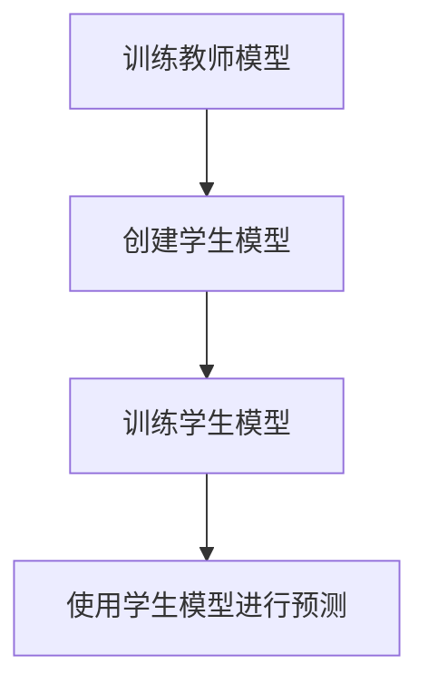

## 1.背景介绍

在深度学习的世界里，我们经常遇到一个问题，那就是模型的大小。大型模型在训练时可以达到很高的精度，但在部署时却面临着限制，尤其是在资源受限的环境中，如移动设备或嵌入式系统。这就需要我们进行模型压缩，以减少模型的大小和复杂性，同时尽量保持其性能。而知识蒸馏就是一种有效的模型压缩技术。

## 2.核心概念与联系

知识蒸馏是一种模型压缩技术，它通过训练一个小模型（学生模型）来模仿大模型（教师模型）的行为。这个过程中，小模型不仅学习到了教师模型的知识，还学习到了教师模型的决策过程。这种方法可以大大减小模型的大小，同时保持相近的性能。

## 3.核心算法原理具体操作步骤

知识蒸馏的过程可以分为以下几个步骤：

1. 首先，我们需要一个预先训练好的大模型，即教师模型。这个模型通常是在大量数据上训练得到的，具有很高的精度。

2. 然后，我们创建一个小模型，即学生模型。这个模型的结构通常比教师模型简单，参数数量少。

3. 在训练学生模型时，我们不仅使用原始的标签，还使用教师模型的预测结果作为软标签。这样，学生模型可以学习到教师模型的知识和决策过程。

4. 最后，我们可以使用学生模型进行预测。由于其结构简单，参数数量少，因此在实际部署时会更加高效。

这个过程可以用下面的 Mermaid 流程图来表示：



## 4.数学模型和公式详细讲解举例说明

在知识蒸馏中，我们通常使用以下的损失函数来训练学生模型：

$$
L = L_{CE} + \alpha L_{KD}
$$

其中，$L_{CE}$ 是对原始标签的交叉熵损失，$L_{KD}$ 是对教师模型预测结果的损失，$\alpha$ 是一个权重参数，用来控制两者的重要性。$L_{KD}$ 通常使用以下的形式：

$$
L_{KD} = T^2 \cdot KL(P_{T}, P_{S})
$$

其中，$P_{T}$ 是教师模型的预测结果，$P_{S}$ 是学生模型的预测结果，$T$ 是一个温度参数，用来控制软标签的“软度”，$KL$ 是Kullback-Leibler散度，用来度量两个概率分布的差异。

## 5.项目实践：代码实例和详细解释说明

下面是一个使用PyTorch实现知识蒸馏的简单例子：

```python
import torch
import torch.nn.functional as F

def distillation_loss(y, labels, teacher_scores, T, alpha):
    return F.cross_entropy(y, labels) * (1. - alpha) + alpha * (T**2) * F.kl_div(F.log_softmax(y/T), F.softmax(teacher_scores/T))

teacher_model = ...  # a pre-trained model
student_model = ...  # a smaller model

optimizer = torch.optim.Adam(student_model.parameters())
alpha = 0.5
T = 2.0

for images, labels in dataloader:
    teacher_scores = teacher_model(images)
    student_scores = student_model(images)
    
    loss = distillation_loss(student_scores, labels, teacher_scores, T, alpha)
    
    optimizer.zero_grad()
    loss.backward()
    optimizer.step()
```

在这个例子中，我们首先定义了一个损失函数`distillation_loss`，它包含了对原始标签的交叉熵损失和对教师模型预测结果的损失。然后，我们在每个训练步骤中，都会计算教师模型和学生模型的预测结果，然后使用这两个结果来计算损失，并进行反向传播和优化。

## 6.实际应用场景

知识蒸馏在许多实际应用中都得到了广泛的使用，例如：

1. 在移动设备和嵌入式系统上部署深度学习模型。这些设备的计算能力和存储空间都非常有限，因此需要使用小型的模型。

2. 在云端进行模型推理。使用小型模型可以减少计算资源的使用，从而降低成本。

3. 在大型模型和小型模型之间进行迁移学习。知识蒸馏可以帮助小型模型学习到大型模型的知识，从而提高其性能。

## 7.工具和资源推荐

以下是一些相关的工具和资源：

1. [Distiller](https://github.com/IntelLabs/distiller)：一个用于神经网络压缩研究的Python库。

2. [TensorFlow Model Optimization Toolkit](https://www.tensorflow.org/model_optimization)：一个包含了各种模型优化技术的TensorFlow插件，包括知识蒸馏。

3. [PyTorch Distillation](https://github.com/cehsu/PyTorchDistillation)：一个使用PyTorch实现的知识蒸馏库。

## 8.总结：未来发展趋势与挑战

知识蒸馏是一种有效的模型压缩技术，它可以帮助我们在保持模型性能的同时，减小模型的大小和复杂性。然而，它也面临着一些挑战，例如如何选择合适的教师模型，如何设置合适的参数，以及如何处理大规模的数据集等。

未来，我们期望看到更多的研究工作来解决这些问题，以及开发更有效的模型压缩技术。

## 9.附录：常见问题与解答

Q: 为什么知识蒸馏可以工作？

A: 知识蒸馏的基本思想是让小模型模仿大模型的行为。大模型由于其复杂性，可以学习到数据的更多信息。通过知识蒸馏，这些信息可以被传递给小模型，从而提高其性能。

Q: 我应该如何选择教师模型？

A: 教师模型通常是一个预先训练好的大模型，它在训练数据上有很高的精度。你可以选择任何满足这些条件的模型作为教师模型。

Q: 我应该如何设置温度参数T和权重参数alpha？

A: 这两个参数都会影响知识蒸馏的效果，你可以通过交叉验证来选择最好的参数。

作者：禅与计算机程序设计艺术 / Zen and the Art of Computer Programming