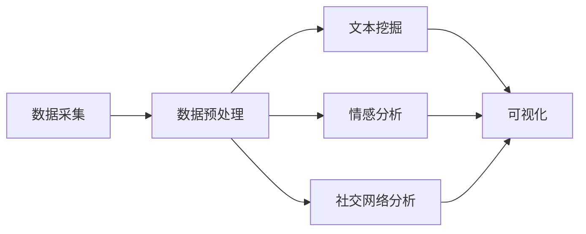

# 社交媒体分析和舆情监测的研究

## 1.背景介绍
### 1.1 社交媒体的兴起与发展
#### 1.1.1 社交媒体的定义与特点
#### 1.1.2 社交媒体的发展历程
#### 1.1.3 社交媒体的影响力与普及率

### 1.2 舆情监测的重要性
#### 1.2.1 舆情监测的定义与内涵  
#### 1.2.2 舆情监测对企业、政府等组织的意义
#### 1.2.3 舆情监测在危机管理中的作用

### 1.3 社交媒体分析与舆情监测的结合
#### 1.3.1 社交媒体数据的价值
#### 1.3.2 社交媒体分析在舆情监测中的应用
#### 1.3.3 社交媒体分析与舆情监测的发展趋势

## 2.核心概念与联系
### 2.1 数据采集
#### 2.1.1 数据采集的定义与方法
#### 2.1.2 社交媒体数据采集的特点与挑战
#### 2.1.3 常用的数据采集工具与平台

### 2.2 数据预处理
#### 2.2.1 数据清洗
#### 2.2.2 数据集成
#### 2.2.3 数据转换

### 2.3 文本挖掘
#### 2.3.1 文本挖掘的定义与流程
#### 2.3.2 文本分类
#### 2.3.3 文本聚类
#### 2.3.4 主题模型

### 2.4 情感分析 
#### 2.4.1 情感分析的定义与分类
#### 2.4.2 基于词典的情感分析
#### 2.4.3 基于机器学习的情感分析
#### 2.4.4 深度学习在情感分析中的应用

### 2.5 社交网络分析
#### 2.5.1 社交网络分析的定义与特点
#### 2.5.2 社交网络结构分析
#### 2.5.3 影响力分析
#### 2.5.4 社区发现

### 2.6 可视化
#### 2.6.1 可视化的重要性
#### 2.6.2 常用的可视化技术与工具
#### 2.6.3 社交媒体数据可视化的案例



## 3.核心算法原理具体操作步骤
### 3.1 文本分类算法
#### 3.1.1 朴素贝叶斯分类器
##### 3.1.1.1 算法原理
##### 3.1.1.2 优缺点分析
##### 3.1.1.3 实现步骤

#### 3.1.2 支持向量机（SVM）
##### 3.1.2.1 算法原理
##### 3.1.2.2 优缺点分析  
##### 3.1.2.3 实现步骤

#### 3.1.3 决策树
##### 3.1.3.1 算法原理
##### 3.1.3.2 优缺点分析
##### 3.1.3.3 实现步骤

### 3.2 文本聚类算法
#### 3.2.1 K-means聚类
##### 3.2.1.1 算法原理
##### 3.2.1.2 优缺点分析
##### 3.2.1.3 实现步骤

#### 3.2.2 层次聚类
##### 3.2.2.1 算法原理  
##### 3.2.2.2 优缺点分析
##### 3.2.2.3 实现步骤

### 3.3 主题模型算法
#### 3.3.1 潜在语义分析（LSA）
##### 3.3.1.1 算法原理
##### 3.3.1.2 优缺点分析
##### 3.3.1.3 实现步骤

#### 3.3.2 潜在狄利克雷分配（LDA）  
##### 3.3.2.1 算法原理
##### 3.3.2.2 优缺点分析
##### 3.3.2.3 实现步骤

### 3.4 情感分析算法
#### 3.4.1 基于词典的情感分析
##### 3.4.1.1 算法原理
##### 3.4.1.2 优缺点分析
##### 3.4.1.3 实现步骤

#### 3.4.2 基于机器学习的情感分析
##### 3.4.2.1 算法原理
##### 3.4.2.2 优缺点分析
##### 3.4.2.3 实现步骤

#### 3.4.3 基于深度学习的情感分析
##### 3.4.3.1 算法原理
##### 3.4.3.2 优缺点分析
##### 3.4.3.3 实现步骤

### 3.5 社交网络分析算法 
#### 3.5.1 PageRank算法
##### 3.5.1.1 算法原理
##### 3.5.1.2 优缺点分析
##### 3.5.1.3 实现步骤

#### 3.5.2 HITS算法
##### 3.5.2.1 算法原理
##### 3.5.2.2 优缺点分析
##### 3.5.2.3 实现步骤

#### 3.5.3 社区发现算法
##### 3.5.3.1 算法原理
##### 3.5.3.2 优缺点分析
##### 3.5.3.3 实现步骤

## 4.数学模型和公式详细讲解举例说明
### 4.1 文本表示模型
#### 4.1.1 向量空间模型（VSM）
$$
\vec{d_j} = (w_{1j},w_{2j},...,w_{nj})
$$
其中，$\vec{d_j}$表示第$j$个文档，$w_{ij}$表示第$i$个词项在第$j$个文档中的权重。

#### 4.1.2 TF-IDF模型
$$
w_{ij} = tf_{ij} \times \log(\frac{N}{df_i})
$$
其中，$tf_{ij}$表示第$i$个词项在第$j$个文档中出现的频率，$df_i$表示包含第$i$个词项的文档数，$N$为文档总数。

### 4.2 分类模型
#### 4.2.1 朴素贝叶斯分类器
$$
P(c|d) = \frac{P(c)P(d|c)}{P(d)} \propto P(c)\prod_{i=1}^nP(w_i|c)
$$
其中，$P(c|d)$表示在给定文档$d$的条件下，类别$c$的后验概率，$P(c)$表示类别$c$的先验概率，$P(w_i|c)$表示在给定类别$c$的条件下，词项$w_i$出现的概率。

#### 4.2.2 支持向量机（SVM）
$$
\min_{w,b,\xi} \frac{1}{2}||w||^2 + C\sum_{i=1}^n\xi_i \\
s.t. \quad y_i(w^Tx_i+b) \geq 1-\xi_i, \quad \xi_i \geq 0, \quad i=1,2,...,n
$$
其中，$w$为超平面的法向量，$b$为偏置项，$\xi_i$为松弛变量，$C$为惩罚因子，$x_i$为第$i$个样本，$y_i$为第$i$个样本的类别标签。

### 4.3 聚类模型
#### 4.3.1 K-means聚类
$$
J = \sum_{i=1}^k\sum_{x \in C_i}||x-\mu_i||^2
$$
其中，$J$为目标函数，$k$为聚类数，$C_i$为第$i$个聚类，$\mu_i$为第$i$个聚类的中心点。

### 4.4 主题模型
#### 4.4.1 潜在狄利克雷分配（LDA）
$$
P(\theta,z,w|\alpha,\beta) = P(\theta|\alpha)\prod_{n=1}^NP(z_n|\theta)P(w_n|z_n,\beta)
$$
其中，$\theta$为文档主题分布，$z$为主题分配，$w$为观察到的词项，$\alpha$和$\beta$为先验参数。

### 4.5 PageRank算法
$$
PR(p_i) = \frac{1-d}{N} + d \sum_{p_j \in M(p_i)}\frac{PR(p_j)}{L(p_j)}
$$
其中，$PR(p_i)$表示网页$p_i$的PageRank值，$d$为阻尼因子，$N$为网页总数，$M(p_i)$为指向网页$p_i$的网页集合，$L(p_j)$为网页$p_j$的出链数。

## 5.项目实践：代码实例和详细解释说明
### 5.1 数据采集与预处理
```python
import tweepy

consumer_key = "your_consumer_key"
consumer_secret = "your_consumer_secret"
access_token = "your_access_token"
access_token_secret = "your_access_token_secret"

auth = tweepy.OAuthHandler(consumer_key, consumer_secret)
auth.set_access_token(access_token, access_token_secret)

api = tweepy.API(auth)

query = "data science"
tweets = api.search(q=query, lang="en", count=100)

for tweet in tweets:
    print(tweet.text)
```
上述代码使用Python的Tweepy库，通过Twitter API采集与"data science"相关的100条英文推文。

### 5.2 文本分类
```python
from sklearn.feature_extraction.text import TfidfVectorizer
from sklearn.naive_bayes import MultinomialNB
from sklearn.pipeline import Pipeline

text_clf = Pipeline([
    ('tfidf', TfidfVectorizer()),
    ('clf', MultinomialNB())
])

text_clf.fit(X_train, y_train)

predicted = text_clf.predict(X_test)
```
上述代码使用scikit-learn库，构建了一个由TF-IDF特征提取和朴素贝叶斯分类器组成的文本分类管道。通过`fit`方法在训练集上训练模型，并使用`predict`方法在测试集上进行预测。

### 5.3 情感分析
```python
from textblob import TextBlob

def get_sentiment(text):
    blob = TextBlob(text)
    sentiment = blob.sentiment.polarity
    if sentiment > 0:
        return "Positive"
    elif sentiment < 0:
        return "Negative"
    else:
        return "Neutral"

text = "I love this movie!"
sentiment = get_sentiment(text)
print(sentiment)  # Output: Positive
```
上述代码使用TextBlob库，通过计算文本的情感极性得分，判断文本的情感倾向。当极性得分大于0时，文本为积极情感；小于0时，文本为消极情感；等于0时，文本为中性情感。

### 5.4 社交网络分析
```python
import networkx as nx

G = nx.Graph()

G.add_edge('A', 'B')
G.add_edge('A', 'C')
G.add_edge('B', 'C')
G.add_edge('C', 'D')

pagerank = nx.pagerank(G)

print(pagerank)
# Output: {'A': 0.2564, 'B': 0.2564, 'C': 0.3396, 'D': 0.1475}
```
上述代码使用NetworkX库，构建了一个简单的无向图，并计算了每个节点的PageRank值。PageRank算法可以用于评估社交网络中节点的重要性和影响力。

## 6.实际应用场景
### 6.1 品牌声誉管理
通过对社交媒体上与品牌相关的用户评论、反馈等数据进行分析，及时发现和处理负面舆情，维护品牌形象。

### 6.2 产品口碑分析
分析社交媒体上关于产品的用户评价和讨论，了解用户对产品的满意度和改进意见，为产品优化提供参考。

### 6.3 热点事件监测
实时监测社交媒体上的热点话题和事件，分析舆情走向，预测事件发展趋势，为决策提供支持。

### 6.4 选举舆情分析
分析社交媒体上关于候选人的评论和讨论，了解民意倾向，预测选举结果。

### 6.5 公共安全预警
通过对社交媒体数据的分析，及时发现潜在的安全隐患和风险，为公共安全管理提供预警。

## 7.工具和资源推荐
### 7.1 数据采集工具
- Tweepy：Python的Twitter API库
- Scrapy：Python的网页爬虫框架
- Selenium：Web自动化测试工具

### 7.2 文本挖掘工具
- NLTK：Python的自然语言处理工具包
- spaCy：Python的工业级自然语言处理库
- Gensim：Python的主题模型库

### 7.3 机器学习工具
- scikit