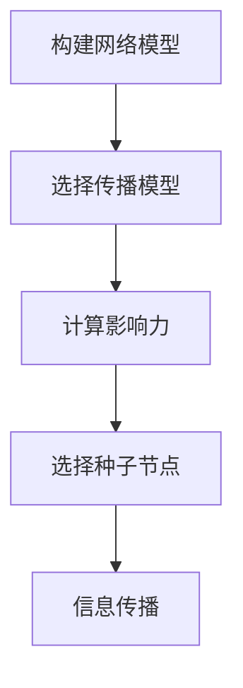
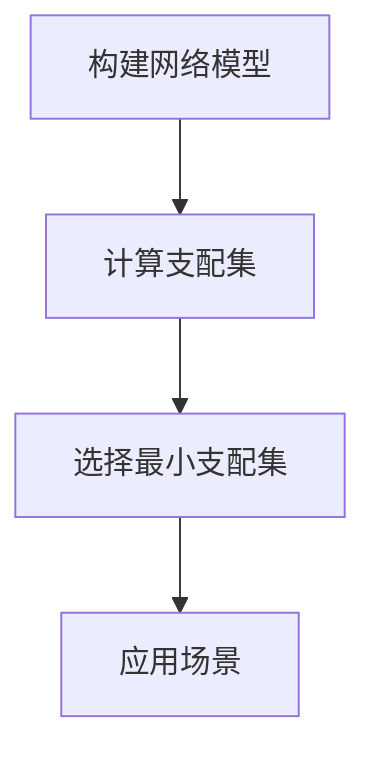
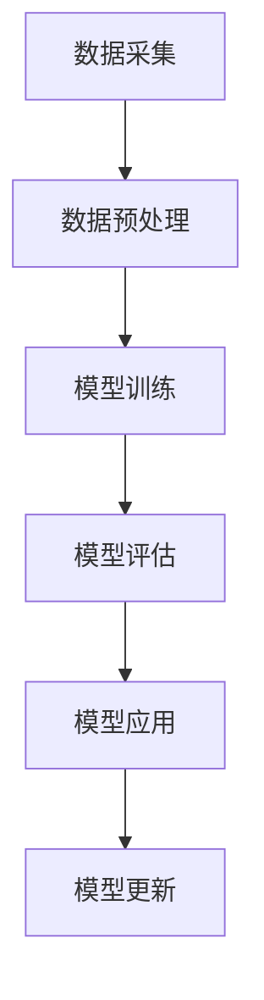

# 社会网络下算法博弈的研究与实现

## 1.背景介绍

### 1.1 社会网络的兴起

随着互联网和移动通信技术的快速发展,社会网络应用程序(如Facebook、Twitter、微信等)已经深深融入到人们的日常生活中。社会网络为人们提供了一个虚拟的交流平台,使得人与人之间的联系更加紧密。在这种背景下,社会网络数据的规模和复杂性也在不断增加,对于如何高效地处理和分析这些海量数据成为了一个巨大的挑战。

### 1.2 算法博弈的重要性

算法博弈理论是一种研究多个理性决策主体在互相影响下如何做出决策的数学理论。在社会网络环境下,不同的个体(如用户、企业等)都有自己的目标和策略,他们的行为会相互影响,形成一种复杂的博弈关系。因此,算法博弈在社会网络中具有重要的应用价值,可以用于分析和预测不同个体的行为,从而优化决策,实现多方利益的最大化。

## 2.核心概念与联系

### 2.1 社会网络分析

社会网络分析(Social Network Analysis, SNA)是一种研究社会网络结构和网络中个体行为的方法。它通过对网络数据进行建模和分析,揭示网络中的模式和规律,从而更好地理解网络中的个体行为和网络动态演化过程。

在算法博弈中,社会网络分析可以帮助我们了解网络拓扑结构、节点重要性、社区发现等信息,为制定有效的算法策略提供依据。

### 2.2 博弈论基础

博弈论是研究理性决策者在相互影响下如何做出决策的数学理论。它包括以下几个核心概念:

1. **博弈**:指两个或多个决策者之间的互动行为。
2. **策略**:每个决策者可选择的行动方案。
3. **收益函数**:衡量每个决策者在不同策略组合下获得的收益或损失。
4. **纳什均衡**:在这种策略组合下,任何一个决策者单方面改变策略都无法获得更高的收益。

在社会网络中,不同的个体可以看作是博弈的参与者,他们的行为会相互影响,形成一种复杂的博弈关系。算法博弈的目标是设计出能够达到纳什均衡的最优策略。

### 2.3 算法博弈在社会网络中的应用

算法博弈在社会网络中有广泛的应用,包括但不限于:

- 影响力最大化:在社会网络中识别出具有最大影响力的节点,以实现信息的快速传播。
- 竞争对手分析:分析竞争对手在社会网络中的行为策略,制定有效的应对措施。
- 社交推荐系统:根据用户在社会网络中的行为,为其推荐感兴趣的内容或好友。
- 网络犯罪分析:发现社会网络中的犯罪活动,预测和防范网络犯罪。

## 3.核心算法原理具体操作步骤

在社会网络中,算法博弈的核心问题是如何设计出能够达到纳什均衡的最优策略。下面介绍几种常见的算法原理和具体操作步骤。

### 3.1 影响力最大化算法

影响力最大化算法旨在识别出社会网络中具有最大影响力的节点集合,以实现信息的快速传播。其核心思想是通过选择合适的种子节点集合,使得在给定的传播模型下,被影响的节点数量达到最大。

#### 3.1.1 算法流程

1. **构建网络模型**:根据社会网络数据构建网络模型,包括节点和边的信息。
2. **选择传播模型**:选择合适的信息传播模型,如独立级联模型(Independent Cascade Model, ICM)或线性阈值模型(Linear Threshold Model, LTM)。
3. **计算影响力**:对于每个节点,计算其在给定传播模型下的影响力,即被影响的节点数量。
4. **选择种子节点**:根据影响力大小,选择出 k 个具有最大影响力的节点作为种子节点集合。
5. **信息传播**:从种子节点集合出发,在给定的传播模型下进行信息传播。

#### 3.1.2 算法示意图

### 3.2 最小支配集算法

最小支配集算法旨在找到一个最小的节点集合,使得网络中的所有节点都被这个集合支配(即与集合中至少有一个节点相连)。这个算法在社会网络中有多种应用,如病毒营销、社区发现等。

#### 3.2.1 算法流程

1. **构建网络模型**:根据社会网络数据构建网络模型。
2. **计算支配集**:对于每个节点,计算其支配集,即与该节点相连的所有节点集合。
3. **选择最小支配集**:从所有支配集中选择出节点数量最少的支配集作为最小支配集。
4. **应用场景**:根据具体需求,利用最小支配集进行相应的应用,如病毒营销、社区发现等。

#### 3.2.2 算法示意图

### 3.3 网络犯罪分析算法

网络犯罪分析算法旨在发现社会网络中的犯罪活动,并预测和防范网络犯罪。其核心思想是利用机器学习和数据挖掘技术,从社会网络数据中提取特征,训练分类模型,对潜在的犯罪活动进行识别和预测。

#### 3.3.1 算法流程

1. **数据采集**:从社会网络中采集相关数据,包括用户信息、交互记录等。
2. **数据预处理**:对采集的数据进行清洗、标注和特征提取。
3. **模型训练**:使用机器学习算法(如决策树、支持向量机等)训练犯罪分类模型。
4. **模型评估**:在测试集上评估模型的性能,如准确率、召回率等指标。
5. **模型应用**:将训练好的模型应用于实际场景,对潜在的犯罪活动进行识别和预测。
6. **模型更新**:定期更新模型,以适应社会网络环境的变化。

#### 3.3.2 算法示意图

## 4.数学模型和公式详细讲解举例说明

在算法博弈中,数学模型和公式扮演着重要的角色,为算法设计和分析提供了理论基础。下面介绍几种常见的数学模型和公式。

### 4.1 独立级联模型(ICM)

独立级联模型是一种常用的信息传播模型,用于描述社会网络中的病毒式营销。在该模型中,每个节点要么被激活,要么未被激活。被激活的节点在下一时刻会以一定的概率去激活其未被激活的邻居节点。

设 $G=(V, E)$ 为一个社会网络,其中 $V$ 为节点集合, $E$ 为边集合。对于每条边 $(u, v) \in E$,定义一个传播概率 $p_{u,v}$,表示节点 $u$ 被激活后,能够激活节点 $v$ 的概率。

令 $S \subseteq V$ 为初始的种子节点集合,即被激活的节点集合。在时刻 $t=0$,只有 $S$ 中的节点被激活。在时刻 $t \geq 1$,对于每个未被激活的节点 $v$,如果它至少有一个已被激活的邻居节点 $u$,那么 $v$ 将以概率 $p_{u,v}$ 被激活。该过程持续进行,直到没有新的节点被激活为止。

令 $\sigma(S)$ 表示在独立级联模型下,由种子节点集合 $S$ 激活的最终节点集合的期望大小。影响力最大化问题可以形式化为:

$$
\max_{S \subseteq V, |S| \leq k} \sigma(S)
$$

其中 $k$ 为预设的种子节点数量上限。

### 4.2 线性阈值模型(LTM)

线性阈值模型是另一种常用的信息传播模型,用于描述社会网络中的观点形成和传播。在该模型中,每个节点被赋予一个阈值,只有当其邻居节点的影响力之和超过该阈值时,该节点才会被激活。

设 $G=(V, E)$ 为一个社会网络,对于每条边 $(u, v) \in E$,定义一个影响权重 $w_{u,v}$,表示节点 $u$ 对节点 $v$ 的影响程度。对于每个节点 $v$,定义一个阈值 $\theta_v \in [0, 1]$,表示 $v$ 被激活所需的最小影响力。

令 $S \subseteq V$ 为初始的种子节点集合,即被激活的节点集合。在时刻 $t=0$,只有 $S$ 中的节点被激活。在时刻 $t \geq 1$,对于每个未被激活的节点 $v$,如果其邻居节点的影响力之和超过了阈值 $\theta_v$,即:

$$
\sum_{u \in N(v)} w_{u,v} \geq \theta_v
$$

其中 $N(v)$ 表示 $v$ 的邻居节点集合,那么 $v$ 将被激活。该过程持续进行,直到没有新的节点被激活为止。

线性阈值模型的影响力最大化问题与独立级联模型类似,目标是找到一个最优的种子节点集合 $S$,使得被激活的节点数量达到最大。

### 4.3 支配集覆盖问题

支配集覆盖问题是一个经典的组合优化问题,在社会网络中有多种应用,如病毒营销、社区发现等。

设 $G=(V, E)$ 为一个无向图,表示社会网络。对于每个节点 $v \in V$,定义其支配集 $D(v)$ 为与 $v$ 相连的所有节点集合,包括 $v$ 自身。支配集覆盖问题旨在找到一个最小的节点集合 $C \subseteq V$,使得每个节点 $v \in V$ 都至少被 $C$ 中的一个节点支配,即:

$$
\forall v \in V, \exists u \in C, v \in D(u)
$$

该问题可以形式化为:

$$
\min_{C \subseteq V} |C|, \text{ s.t. } \bigcup_{u \in C} D(u) = V
$$

支配集覆盖问题是一个 NP-hard 问题,可以使用近似算法或启发式算法来求解。

### 4.4 网络中心性指标

在社会网络分析中,中心性指标用于衡量网络中节点的重要性和影响力。常见的中心性指标包括:

1. **度中心性**:一个节点的度中心性等于该节点的度数,即与该节点相连的边的数量。度中心性反映了节点在网络中的直接影响力。

2. **介数中心性**:一个节点的介数中心性等于该节点所在的最短路径的数量。介数中心性反映了节点在网络中的中介作用。

3. **特征向量中心性**:特征向量中心性是基于谷歌的 PageRank 算法,它将网络中每个节点的重要性定义为其邻居节点重要性的加权和。特征向量中心性反映了节点在整个网络中的全局重要性。

4. **K-核分解**:K-核分解是一种基于节点度数的分层方法,它将网络划分为不同的层次结构,每个层次对应一个 K 值。K-核分解可以用于识别网络中的核心节点和边缘节点。

这些中心性指标在算法博弈中有重要应用,如影响力最大化、关键节点识别等