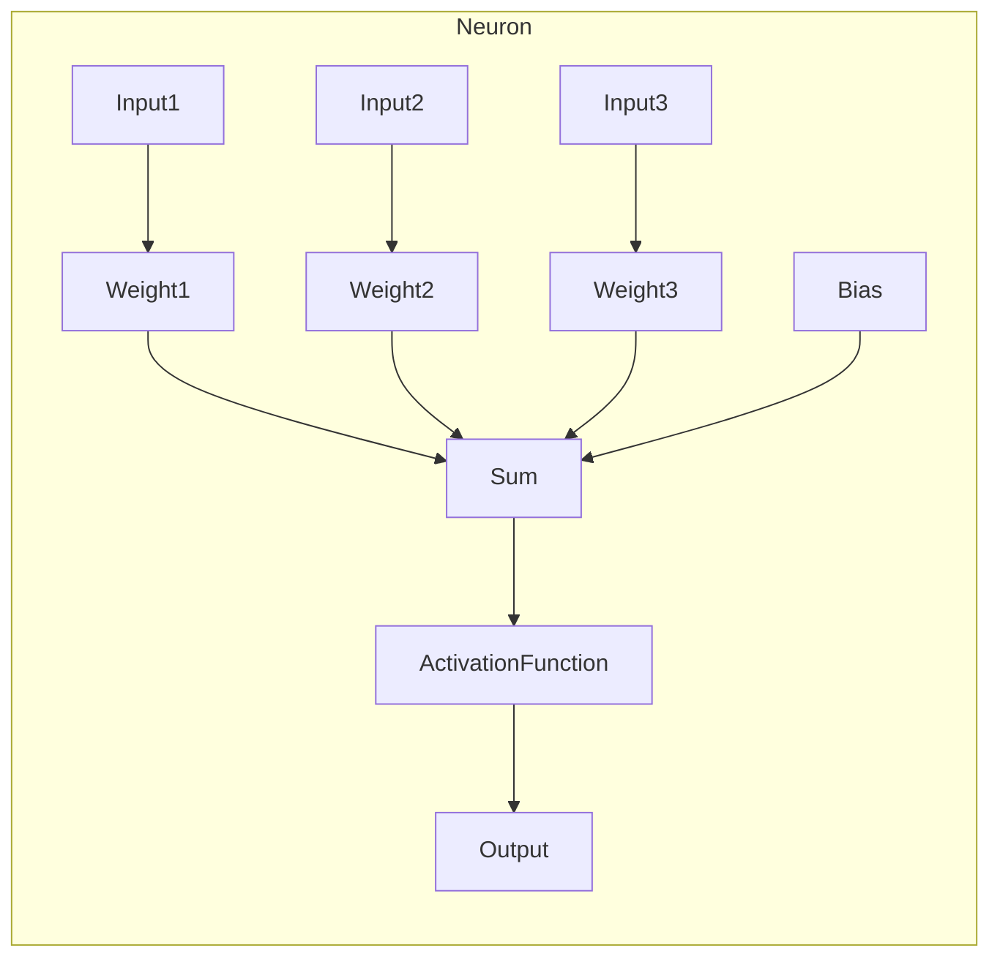
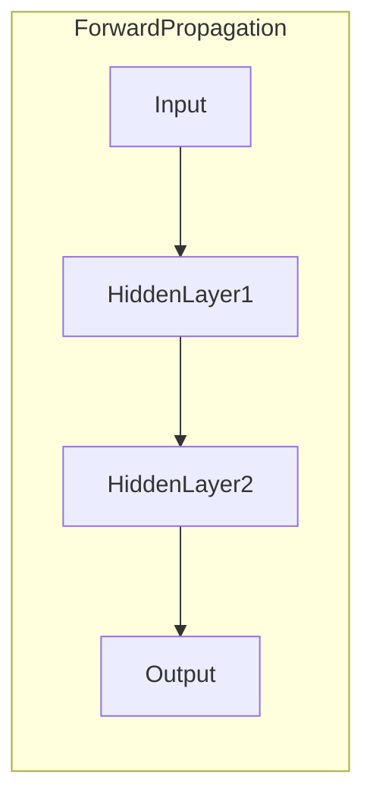
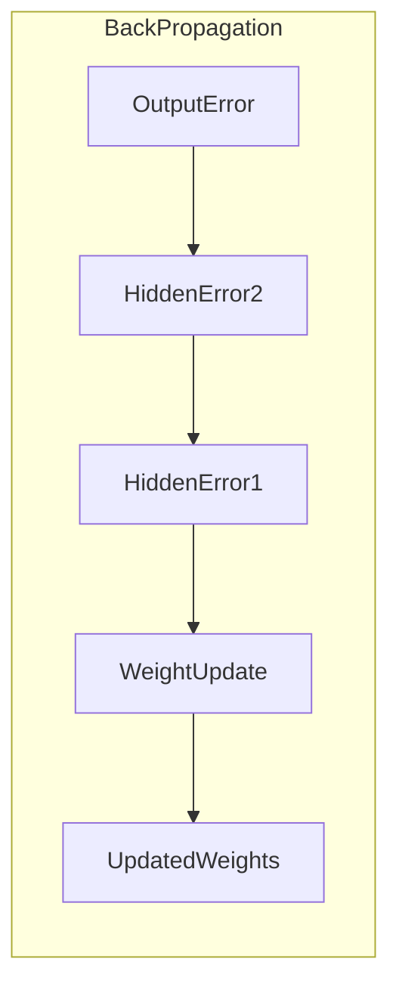

# 神经网络原理与代码实例讲解

## 1.背景介绍

### 1.1 神经网络的起源

神经网络的概念源于对生物神经系统的研究和模拟。人脑由数十亿个神经元组成,这些神经元通过突触连接形成了复杂的网络。神经元接收来自其他神经元的输入信号,进行加权求和运算,并通过激活函数产生输出信号传递给下一层神经元。这种分层结构和信号传递方式启发了人工神经网络的设计。

### 1.2 神经网络的发展历程

早期的神经网络模型包括感知器(Perceptron)和自适应线性单元(Adaline),但由于只能解决线性可分问题,应用受到限制。1986年,Hinton等人提出反向传播(Backpropagation)算法,使得多层神经网络能够有效训练,从而推动了神经网络的发展。近年来,硬件计算能力的提升、大数据的积累以及新算法的涌现,使得深度神经网络在计算机视觉、自然语言处理等领域取得了突破性进展。

### 1.3 神经网络的应用前景

神经网络展现出强大的模式识别和泛化能力,在图像识别、语音识别、自然语言处理等领域有广泛应用。随着算力的不断提高和算法的优化,神经网络在更多领域将大放异彩,如智能驾驶、智能医疗诊断等,为人类社会带来巨大变革。

## 2.核心概念与联系

### 2.1 神经元模型

神经元是神经网络的基本计算单元,由输入、权重、偏置、激活函数等组成。输入可以是数据特征或上一层神经元的输出,权重体现了输入的重要程度,偏置用于调节神经元的激活阈值,激活函数则决定了神经元的输出。常用的激活函数包括Sigmoid、ReLU、Tanh等。



### 2.2 网络结构

神经网络由多层神经元组成,常见的结构有前馈神经网络、卷积神经网络和循环神经网络。

- 前馈神经网络:信号只从输入层单向传播到输出层,每层神经元与上一层全部连接,是最基本的结构。
- 卷积神经网络:在输入数据(如图像)上应用卷积操作提取特征,具有平移不变性,在计算机视觉领域表现卓越。
- 循环神经网络:通过内部循环连接来处理序列数据,在自然语言处理等领域有广泛应用。

### 2.3 训练算法

训练算法的目标是通过调整网络权重和偏置,使神经网络能够学习到从输入映射到期望输出的规律。常用的训练算法包括:

- 反向传播(Backpropagation):利用链式法则计算损失函数对权重的梯度,沿梯度反向传播更新权重,是训练多层神经网络的关键算法。
- 优化算法:如梯度下降、动量优化、RMSProp、Adam等,用于加速训练收敛。
- 正则化:通过L1、L2正则项等方式,防止过拟合。

## 3.核心算法原理具体操作步骤

### 3.1 前向传播

给定输入数据$\mathbf{x}$,神经网络通过前向传播计算输出$\hat{\mathbf{y}}$的过程如下:

1. 输入层:$\mathbf{a}^{(0)} = \mathbf{x}$
2. 隐藏层:
$$\mathbf{z}^{(l)} = \mathbf{W}^{(l)}\mathbf{a}^{(l-1)} + \mathbf{b}^{(l)}$$
$$\mathbf{a}^{(l)} = \sigma(\mathbf{z}^{(l)})$$
其中$\mathbf{W}^{(l)}$为权重矩阵,$\mathbf{b}^{(l)}$为偏置向量,$\sigma$为激活函数。
3. 输出层:$\hat{\mathbf{y}} = \mathbf{a}^{(L)}$



### 3.2 反向传播

反向传播的目标是计算损失函数$\mathcal{L}(\hat{\mathbf{y}}, \mathbf{y})$对权重和偏置的梯度,并沿梯度方向更新参数。具体步骤如下:

1. 输出层误差:$\delta^{(L)} = \nabla_{\mathbf{a}^{(L)}} \mathcal{L} \odot \sigma'(\mathbf{z}^{(L)})$
2. 隐藏层误差(自后向前):
$$\delta^{(l)} = \big((\mathbf{W}^{(l+1)})^T \delta^{(l+1)}\big) \odot \sigma'(\mathbf{z}^{(l)})$$
3. 梯度计算:
$$\frac{\partial \mathcal{L}}{\partial \mathbf{W}^{(l)}} = \delta^{(l+1)}(\mathbf{a}^{(l)})^T$$
$$\frac{\partial \mathcal{L}}{\partial \mathbf{b}^{(l)}} = \delta^{(l+1)}$$
4. 权重更新:$\mathbf{W}^{(l)} \leftarrow \mathbf{W}^{(l)} - \eta \frac{\partial \mathcal{L}}{\partial \mathbf{W}^{(l)}}$



### 3.3 优化算法

为加速训练收敛,常采用动量优化、RMSProp、Adam等优化算法更新权重:

$$\begin{align*}
\mathbf{v}_t &= \gamma \mathbf{v}_{t-1} + \eta\nabla_\theta J(\theta) \\
\theta_t &= \theta_{t-1} - \mathbf{v}_t
\end{align*}$$

其中$\mathbf{v}_t$为动量向量,$\gamma$为动量系数。RMSProp和Adam在此基础上引入了对梯度的指数加权平均,进一步提高了收敛速度。

## 4.数学模型和公式详细讲解举例说明

### 4.1 损失函数

损失函数$\mathcal{L}(\hat{\mathbf{y}}, \mathbf{y})$用于衡量神经网络输出$\hat{\mathbf{y}}$与真实标签$\mathbf{y}$之间的差异,是训练的驱动力。常用的损失函数包括:

- 均方误差(MSE): $\mathcal{L}_{MSE}(\hat{\mathbf{y}}, \mathbf{y}) = \frac{1}{2}\sum_i (\hat{y}_i - y_i)^2$
- 交叉熵(Cross-Entropy): $\mathcal{L}_{CE}(\hat{\mathbf{y}}, \mathbf{y}) = -\sum_i y_i \log \hat{y}_i$

对于二分类问题,交叉熵可进一步简化为:

$$\mathcal{L}_{BCE}(\hat{y}, y) = -[y \log \hat{y} + (1 - y) \log (1 - \hat{y})]$$

### 4.2 正则化

为防止过拟合,常在损失函数中加入正则化项,如L1正则化:

$$\Omega(\mathbf{W}) = \lambda \sum_{i,j} |W_{i,j}|$$

或L2正则化:

$$\Omega(\mathbf{W}) = \lambda \sum_{i,j} W_{i,j}^2$$

其中$\lambda$为正则化系数,控制了正则化强度。加入正则化项后,损失函数变为:

$$\mathcal{L}_{reg}(\hat{\mathbf{y}}, \mathbf{y}, \mathbf{W}) = \mathcal{L}(\hat{\mathbf{y}}, \mathbf{y}) + \Omega(\mathbf{W})$$

### 4.3 激活函数

激活函数决定了神经元的输出特性,常用的激活函数包括:

- Sigmoid: $\sigma(x) = \frac{1}{1 + e^{-x}}$
- Tanh: $\tanh(x) = \frac{e^x - e^{-x}}{e^x + e^{-x}}$
- ReLU: $\text{ReLU}(x) = \max(0, x)$

Sigmoid和Tanh函数的导数易于计算,常用于传统神经网络。ReLU函数在正半轴线性,在负半轴为0,有助于缓解梯度消失问题,在深层网络中表现优异。

## 5.项目实践:代码实例和详细解释说明

### 5.1 构建神经网络

以Python的Numpy库为例,我们可以构建一个简单的全连接神经网络:

```python
import numpy as np

class NeuralNetwork:
    def __init__(self, layers):
        # 初始化权重和偏置
        self.weights = [np.random.randn(y, x) for x, y in zip(layers[:-1], layers[1:])]
        self.biases = [np.zeros((y, 1)) for y in layers[1:]]
        
    def forward(self, X):
        # 前向传播
        activations = X
        for W, b in zip(self.weights, self.biases):
            z = np.dot(W, activations) + b
            activations = sigmoid(z)
        return activations
        
    def backprop(self, X, y, learning_rate):
        # 反向传播
        activations = [X]
        ...
        
def sigmoid(z):
    return 1 / (1 + np.exp(-z))
```

其中`layers`为神经网络各层神经元数量的列表,如`[2, 4, 1]`表示输入层2个神经元,隐藏层4个神经元,输出层1个神经元。

### 5.2 训练神经网络

我们使用一些示例数据训练上述神经网络:

```python
import numpy as np

# 生成示例数据
X = np.array([[0, 0], [0, 1], [1, 0], [1, 1]])
y = np.array([[0], [1], [1], [0]]) # XOR问题

# 创建神经网络
nn = NeuralNetwork([2, 2, 1])

# 训练
for epoch in range(10000):
    output = nn.forward(X)
    nn.backprop(X, y, 0.1)
    
# 测试
for x, target in zip(X, y):
    prediction = nn.forward(x)
    print(f"Input: {x}, Target: {target}, Prediction: {prediction}")
```

上述代码训练了一个2-2-1的神经网络,用于解决XOR问题。经过足够的迭代,神经网络应能够正确预测XOR的输出。

## 6.实际应用场景

神经网络在以下领域有广泛应用:

### 6.1 计算机视觉

卷积神经网络在图像分类、目标检测、语义分割等计算机视觉任务中表现卓越,如ImageNet挑战赛冠军模型VGGNet、ResNet等。

### 6.2 自然语言处理

循环神经网络及其变体(如LSTM、GRU)擅长处理序列数据,在机器翻译、文本生成、情感分析等NLP任务中发挥重要作用。Transformer模型更是在多项NLP任务上刷新纪录。

### 6.3 推荐系统

神经网络可以从海量历史数据中学习用户兴趣,为其推荐感兴趣的商品、新闻、视频等,在电商、社交媒体等领域被广泛应用。

### 6.4 游戏AI

结合强化学习算法,神经网络可以直接从环境中学习最优策略,在国际象棋、围棋、Atari游戏等领域展现出超人的表现。

### 6.5 其他领域

神经网络在语音识别、机器人控制、生物信息学、金融等诸多领域也有应用。随着算法和硬件的发展,神经网络的应用领域将不断扩大。

## 7.工具和资源推荐

### 7.1 深度学习框架

- TensorFlow: Google开源的端到端深度学习框架
- PyTorch: Facebook开源的Python深度学习库,界面简洁
- Keras:基于TensorFlow的高级神经网络API
- MXNet: AWS开源的深度学习框架,支持多种语言

### 7.2 数据集

- MNIST: 手写数字数据集,常用于入门练习
- ImageNet: 大规模图像数据集,推动了