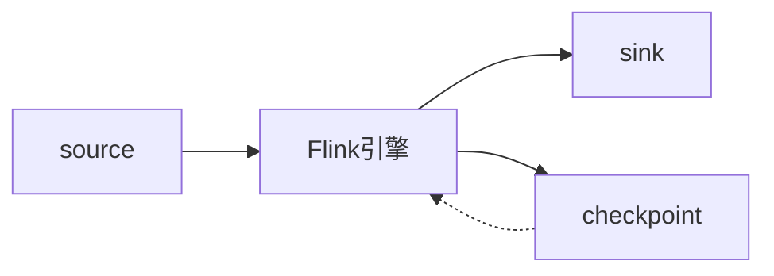

# 第一章：exactly-once语义入门

## 1. 背景介绍

在分布式系统和流处理领域,数据一致性和正确性至关重要。然而,由于网络延迟、节点故障等因素,保证数据处理的 exactly-once 语义一直是个难题。本文将深入探讨 exactly-once 语义的概念、实现原理以及在实际系统中的应用。

### 1.1 分布式系统中的数据一致性问题

#### 1.1.1 网络延迟和分区

#### 1.1.2 节点故障和重启

#### 1.1.3 数据重复和丢失

### 1.2 流处理框架面临的挑战  

#### 1.2.1 无边界的数据流

#### 1.2.2 状态管理和容错

#### 1.2.3 处理语义的权衡

## 2. 核心概念与联系

### 2.1 数据交付语义

#### 2.1.1 at-most-once

#### 2.1.2 at-least-once 

#### 2.1.3 exactly-once

### 2.2 状态一致性

#### 2.2.1 checkpoint机制

#### 2.2.2 WAL(Write Ahead Log) 

#### 2.2.3 两阶段提交(2PC)

### 2.3 端到端exactly-once

#### 2.3.1 source端

#### 2.3.2 处理引擎  

#### 2.3.3 sink端

## 3. 核心算法原理具体操作步骤

### 3.1 幂等写入

#### 3.1.1 去重表

#### 3.1.2 MVCC多版本并发控制

### 3.2 事务性写入

#### 3.2.1 预写日志

#### 3.2.2 两阶段提交协议

### 3.3 Chandy-Lamport分布式快照算法

#### 3.3.1 marker标记

#### 3.3.2 全局快照

## 4. 数学模型和公式详细讲解举例说明

### 4.1 Chandy-Lamport算法数学模型

分布式系统可以抽象为一个无向连通图$G=(V,E)$,其中$V$表示节点集合,$E$表示通信信道集合。令$c_{ij}$表示从节点$i$到$j$的信道。每个节点$i$有本地状态$s_i$。

全局状态$S$定义为所有节点状态的集合:

$$S=\{s_1,s_2,...,s_n\}$$

信道状态$c_S(i,j)$定义为:

$$
c_S(i,j)=
\begin{cases}
 消息m & 当消息m在转发过程中\\
 空集\emptyset & 其他情况
\end{cases}
$$

一个全局快照$S$包含所有节点状态和信道状态:

$$S=(\{s_1,s_2,...,s_n\},\{c_S(i,j)|1\leq i,j \leq n\})$$

### 4.2 两阶段提交协议形式化定义

我们用$C$表示协调者,$P_i$表示参与者。令$v_i$表示$P_i$的投票,$d_i$表示$P_i$的决策。 

两阶段提交可以形式化为:

**阶段1:**
$$
\forall P_i \in 参与者集合:\\
P_i 向C发送v_i \in \{yes,no\}
$$

**阶段2:**
$$
\begin{aligned}
如果(\forall i,v_i=yes):\\
&C向所有P_i发送commit消息\\
&\forall P_i:d_i=commit\\
否则:\\
&C向所有P_i发送abort消息\\
&\forall P_i:d_i=abort
\end{aligned}
$$

## 5. 项目实践：代码实例和详细解释说明

下面我们以Flink为例,展示如何在代码层面实现端到端的exactly-once语义。

### 5.1 Flink中的checkpoint机制

```java
StreamExecutionEnvironment env = StreamExecutionEnvironment.getExecutionEnvironment();

// 启用checkpoint,每1000ms触发一次
env.enableCheckpointing(1000);

// 设置checkpoint的一致性语义为EXACTLY_ONCE
env.getCheckpointConfig().setCheckpointingMode(CheckpointingMode.EXACTLY_ONCE);

// 设置checkpoint的超时时间为60s  
env.getCheckpointConfig().setCheckpointTimeout(60000);
```

Flink的checkpoint机制通过周期性地持久化算子的状态,在发生故障时能够恢复到之前的一致性状态,从而实现exactly-once。

### 5.2 端到端的状态一致性

```java
// 定义Kafka source
FlinkKafkaConsumer<String> kafkaSource = new FlinkKafkaConsumer<>(...);

// 设置Kafka consumer的隔离级别为read_committed
kafkaSource.setStartFromGroupOffsets();
kafkaSource.setCommitOffsetsOnCheckpoints(true);

// 定义Kafka sink  
FlinkKafkaProducer<String> kafkaSink = new FlinkKafkaProducer<>(...);

// 设置Kafka producer的事务超时时间
kafkaSink.setTransactionTimeout(3600 * 1000);

// 将sink的语义设置为EXACTLY_ONCE  
kafkaSink.setDeliverGuarantee(DeliveryGuarantee.EXACTLY_ONCE);
```

通过将source的消费位点与checkpoint对齐,将sink的输出通过事务的方式写入,再加上Flink内部的一致性语义保证,就实现了真正的端到端exactly-once。

## 6. 实际应用场景

### 6.1 金融领域的对账系统

在金融领域,对账是一个非常重要的环节,它要求数据必须准确无误。传统的对账系统通常采用事后对账的方式,存在较大的延迟和风险。

使用支持exactly-once语义的流处理引擎,可以实现实时准确的流式对账,大大降低风险,提高效率。

### 6.2 电商场景的订单处理 

电商订单处理涉及到订单创建、支付、配送、收货等多个环节,每个环节都不能有差错,否则就会带来经济损失和客户体验问题。

利用exactly-once语义,能够保证订单状态变更的原子性,即使在故障恢复的情况下,也不会出现订单状态不一致的情况。

### 6.3 物联网数据处理

在物联网场景中,海量的传感器数据需要实时处理和分析。exactly-once语义能够确保数据处理过程中不会引入重复或丢失,保证分析结果的准确性。

## 7. 工具和资源推荐

- [Flink官方文档:端到端的exactly-once](https://nightlies.apache.org/flink/flink-docs-release-1.14/docs/learn-flink/fault_tolerance/#end-to-end-exactly-once)
- [Kafka官方文档:Exactly-once语义](https://kafka.apache.org/documentation/#semantics)
- [Spark Structured Streaming官方文档:Fault Tolerance Semantics](https://spark.apache.org/docs/latest/structured-streaming-programming-guide.html#fault-tolerance-semantics)
- [一致性算法导论(分布式、共识、exactly-once)](https://vonng.gitbooks.io/consistency/content/)

## 8. 总结：未来发展趋势与挑战

### 8.1 新硬件带来的机遇

#### 8.1.1 RDMA和持久内存

#### 8.1.2 智能网卡

### 8.2 一致性协议的创新

#### 8.2.1 Raft及其变种

#### 8.2.2 Paxos家族

### 8.3 大规模应用的挑战

#### 8.3.1 性能和延迟

#### 8.3.2 状态膨胀  

#### 8.3.3 复杂的故障场景

## 9. 附录：常见问题与解答

**Q**: 实现exactly-once需要付出哪些代价？  
**A**: 通常实现exactly-once需要引入额外的机制,如checkpoint、事务、重试等,会带来一定的性能开销。但是对于许多关键场景,数据一致性和正确性是首要考虑的,这些代价是值得的。

**Q**: 流处理和批处理在exactly-once方面有何异同？  
**A**: 流处理比批处理更加复杂,因为流处理面对的是无边界的数据,状态可能一直在变化。而批处理的输入数据是有界的,容错恢复相对简单。但它们的原理是相通的,都是通过某种方式记录状态,发生故障时恢复到一致性的状态。

**Q**: 目前的exactly-once实现方案还有哪些不足？  
**A**: 现有的exactly-once实现大多基于checkpoint,在某些极端情况下还是有可能发生数据不一致。未来我们还需要在容错性、性能、易用性等方面进行更多的探索和优化。

## 结语

exactly-once语义作为流处理领域的重要话题,本文从概念原理到工程实践进行了详尽的讨论。我们看到,exactly-once的实现需要协调数据源、处理引擎、数据汇的多个环节,还需要权衡一致性和性能。

展望未来,随着新硬件和新协议层出不穷,exactly-once值得持续关注。同时我们也要看到,exactly-once并非银弹,在实际系统设计中,还是要根据业务场景权衡利弊,选择合适的语义级别。



作者：禅与计算机程序设计艺术 / Zen and the Art of Computer Programming