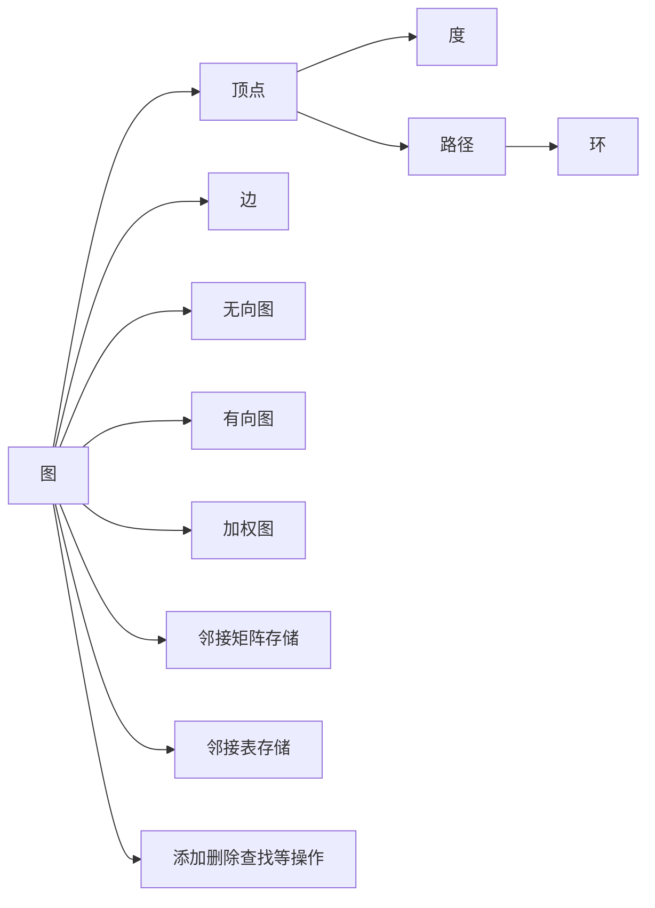
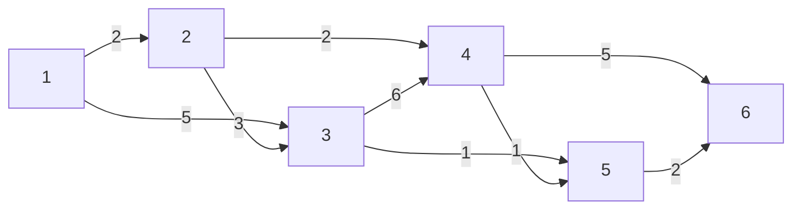

# 第三章图算法原理与实现

## 1.背景介绍

图(Graph)是一种由节点(Node)和边(Edge)组成的数据结构,广泛应用于计算机科学、数学、物理学、生物学、社会学等多个领域。图算法是对图这种数据结构进行分析和处理的各种算法的统称。

近年来,随着大数据、人工智能、区块链等技术的蓬勃发展,图算法在现实世界中的应用越来越广泛。比如在社交网络分析、推荐系统、金融风控、知识图谱等场景中,都需要用到图算法来解决复杂的关联分析问题。可以说,掌握图算法已经成为计算机从业者的必备技能之一。

本章将全面系统地介绍图算法的基本原理和常见实现,帮助读者深入理解和灵活运用图算法。内容涵盖图的基本概念与表示、图的遍历与搜索、最短路径算法、最小生成树算法、拓扑排序、关键路径等经典算法,并辅以代码实例和应用场景分析,是学习和应用图算法不可多得的参考资料。

### 1.1 为什么要学习图算法
#### 1.1.1 图无处不在
#### 1.1.2 算法之美
#### 1.1.3 就业面试必备

### 1.2 图算法应用领域
#### 1.2.1 社交网络分析 
#### 1.2.2 推荐系统
#### 1.2.3 金融风控
#### 1.2.4 知识图谱
#### 1.2.5 区块链

## 2.核心概念与联系

要学习图算法,首先需要了解图的一些基本概念和性质。

### 2.1 图的基本概念
#### 2.1.1 顶点
图由一些小圆圈或矩形表示,称为图的顶点(Vertex)或节点(Node)。
#### 2.1.2 边
顶点之间的连线称为边(Edge),边分为有向边和无向边。
#### 2.1.3 度
一个顶点的度(Degree)是指与该顶点相连的边的条数,入度是以该顶点为终点的边数,出度是以该顶点为起点的边数。
#### 2.1.4 路径
顶点 $v_1$ 到 $v_n$ 的一条路径定义为一个顶点序列 $v_1,v_2,...v_n$,其中 $v_i$ 和 $v_{i+1}$ 之间有边相连。
#### 2.1.5 环
如果一条路径的起点和终点是同一个顶点,则称这条路径为一个环(Cycle)。

### 2.2 图的分类
#### 2.2.1 无向图和有向图
边没有方向的图称为无向图,边有方向的图称为有向图。
#### 2.2.2 加权图
边带有权值的图称为加权图或网络。

### 2.3 图的存储结构
#### 2.3.1 邻接矩阵
邻接矩阵是一个二维数组,用 $G[i][j]$ 表示顶点 $i$ 和顶点 $j$ 的关系。对于无向图,邻接矩阵是一个对称矩阵。
#### 2.3.2 邻接表
邻接表由数组与链表组成,对于图中的每个顶点,用一个链表存储与其相连的所有顶点。

### 2.4 图的基本操作
#### 2.4.1 添加顶点
#### 2.4.2 添加边
#### 2.4.3 删除顶点
#### 2.4.4 删除边
#### 2.4.5 查找顶点
#### 2.4.6 查找边

下面是图的核心概念之间的联系:



## 3.核心算法原理具体操作步骤

图算法种类繁多,本节选取几种在实际应用中最常用的算法进行重点讲解,包括图的遍历与搜索、最短路径、最小生成树、拓扑排序、关键路径等。

### 3.1 图的遍历与搜索
#### 3.1.1 DFS深度优先搜索
DFS 从图中某个顶点 $v$ 出发,首先访问该顶点,然后选择一个与其相连的未被访问过的顶点 $w$ 进行访问,再从 $w$ 出发找与 $w$ 相连的顶点访问,重复上述过程,直到所有顶点都被访问到。若此时还有未被访问的顶点,则再选择一个未被访问的顶点作为起始点,重复上述过程,直到图中所有顶点都被访问到。

DFS 算法步骤:
1. 访问起始顶点 $v$,并标记 $v$ 为已访问。 
2. 选择一个与 $v$ 相连的未被访问的顶点 $w$,从 $w$ 出发进行深度优先搜索。
3. 重复步骤 2,直到与 $v$ 相连的所有顶点都被访问过。
4. 若此时图中还有未被访问的顶点,则选择一个未被访问的顶点作为起始点,重复步骤 1-3。

#### 3.1.2 BFS广度优先搜索 
BFS 从图中某个顶点 $v$ 出发,访问 $v$ 之后依次访问 $v$ 的各个未曾访问过的邻接点,然后分别从这些邻接点出发依次访问它们的邻接点,并使得先被访问的顶点的邻接点先于后被访问的顶点的邻接点被访问,直至图中所有已被访问的顶点的邻接点都被访问到。 若此时图中尚有顶点未被访问,则需要另选一个未曾被访问过的顶点作为新的起始点,重复上述过程,直至图中所有顶点都被访问到为止。

BFS 算法步骤:
1. 访问起始顶点 $v$,并标记 $v$ 为已访问,将 $v$ 入队列。
2. 当队列非空时,重复步骤 3-4,否则算法结束。
3. 出队列取得顶点 $v$,访问 $v$ 的所有未被访问过的邻接点 $w_1,w_2,...w_n$,将它们标记为已访问,并将它们依次入队列。
4. 回到步骤 2。

### 3.2 最短路径算法
#### 3.2.1 Dijkstra算法
Dijkstra 算法用于计算从一个顶点到其他所有顶点的最短路径,适用于边权值非负的加权图。

算法步骤:
1. 初始化: 创建一个距离数组 $d$,存储源点 $s$ 到图中每个顶点的距离。将 $d[s]$ 初始化为0,其他顶点的距离初始化为无穷大。创建一个访问数组 $visited$,标记顶点是否被访问过。
2. 选择距离最小的未访问顶点: 从未访问的顶点中选择 $d$ 值最小的顶点 $u$,标记 $u$ 为已访问。
3. 更新距离: 遍历 $u$ 的所有邻接点 $v$,如果 $d[u] + w(u,v) < d[v]$,则更新 $d[v] = d[u] + w(u,v)$。
4. 重复步骤 2-3,直到所有顶点都被访问过。

#### 3.2.2 Floyd算法
Floyd 算法用于计算图中任意两个顶点之间的最短路径,适用于没有负权回路的加权图。

算法步骤:
1. 初始化距离矩阵 $d$,若 $i$ 和 $j$ 之间有边相连,则 $d[i][j]$ 等于边的权值,否则 $d[i][j] = \infty$。
2. 三重循环更新距离矩阵,设中间顶点为 $k$,起点为 $i$,终点为 $j$:
```
for k = 1 to n
    for i = 1 to n  
        for j = 1 to n
            if d[i][k] + d[k][j] < d[i][j] 
                d[i][j] = d[i][k] + d[k][j]
```
3. 最终 $d[i][j]$ 即为顶点 $i$ 到顶点 $j$ 的最短距离。

### 3.3 最小生成树算法  
最小生成树是一棵包含图中所有顶点的无环连通子图,且边的权值之和最小。常用的构造最小生成树的算法有 Prim 算法和 Kruskal 算法。

#### 3.3.1 Prim算法
Prim 算法每次选择距离最小生成树最近的顶点,逐步扩大最小生成树,直到所有顶点都被加入。

算法步骤:
1. 初始化: 选择任意一个顶点加入集合 $U$,其他顶点属于集合 $V-U$。
2. 选择最短边: 从连接 $U$ 和 $V-U$ 的边中选择权值最小的边 $(u,v)$,将顶点 $v$ 加入集合 $U$。
3. 更新距离: 更新 $v$ 的邻接点到集合 $U$ 的距离。
4. 重复步骤 2-3,直到所有顶点都加入集合 $U$。

#### 3.3.2 Kruskal算法
Kruskal 算法每次选择权值最小的边,如果该边的两个顶点不在同一个连通分量中,则将这条边加入最小生成树。

算法步骤:
1. 初始化: 将图中的所有边按权值从小到大排序。初始时每个顶点自成一个连通分量。
2. 选择最短边: 从权值最小的边开始,如果该边连接的两个顶点不在同一个连通分量中,则将该边加入最小生成树,合并这两个连通分量。
3. 重复步骤 2,直到所有顶点都在同一个连通分量中。

### 3.4 拓扑排序
拓扑排序是对有向无环图(DAG)的顶点进行排序,使得对于图中的每一条有向边 $(u,v)$,在排序中顶点 $u$ 都在顶点 $v$ 的前面。

算法步骤:
1. 初始化: 计算所有顶点的入度,并将入度为 0 的顶点加入队列。
2. 拓扑排序: 重复以下步骤,直到队列为空:
   - 取出队首顶点 $u$,将 $u$ 加入拓扑序列。
   - 遍历 $u$ 的所有邻接点 $v$,将 $v$ 的入度减 1,如果减 1 后入度为 0,则将 $v$ 加入队列。
3. 如果拓扑序列中包含图中所有顶点,则拓扑排序成功,否则图中有环,拓扑排序失败。

### 3.5 关键路径
关键路径是加权有向无环图中从起点到终点的最长路径,这条路径上的活动称为关键活动。

算法步骤:
1. 正向拓扑排序: 计算每个顶点的最早开始时间 $ve$。
2. 逆向拓扑排序: 计算每个顶点的最晚开始时间 $vl$。
3. 计算关键路径: 对于每条边 $(u,v)$,如果满足 $ve[u] + w(u,v) = vl[v]$,则该边是关键活动。将所有关键活动连接起来形成关键路径。

## 4.数学模型和公式详细讲解举例说明

本节我们通过几个具体的例子来加深对图算法中数学模型和公式的理解。

### 4.1 最短路径问题
考虑下图所示的加权有向图,求从顶点 1 到其他各个顶点的最短路径。



我们用 Dijkstra 算法来求解。设 $d[i]$ 表示从顶点 1 到顶点 $i$ 的最短距离。初始时 $d[1]=0$,其他顶点的 $d$ 值为无穷大。

第一步