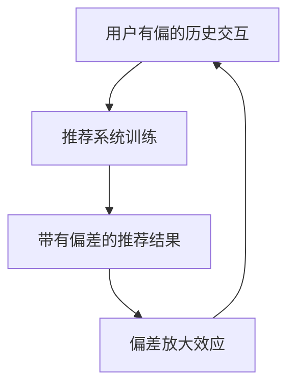
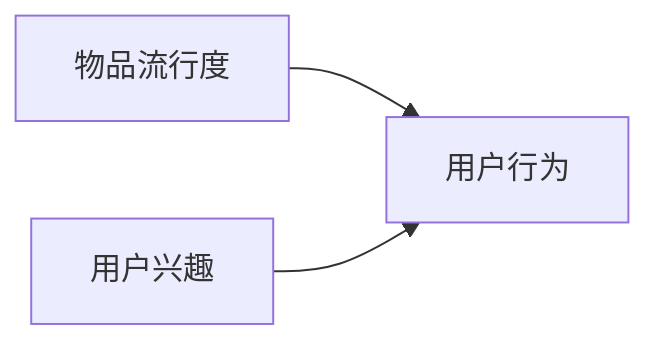

# 第九篇：推荐系统中的偏差：如何避免不公平推荐？

## 1.背景介绍
### 1.1 推荐系统的普及与影响力
在当今互联网时代,推荐系统已经渗透到我们生活的方方面面。从电商平台的商品推荐,到社交媒体的信息流推荐,再到视频网站的个性化推荐,推荐系统正在悄然改变着我们获取信息、做出决策的方式。一个优秀的推荐系统能够极大提升用户体验,增加用户粘性,为平台创造巨大的商业价值。

### 1.2 推荐系统偏差问题的提出
然而,随着推荐系统的日益强大,人们逐渐意识到推荐系统中存在的偏差问题。推荐系统可能会放大社会中原有的不平等,加剧信息茧房效应,导致算法歧视等问题。这些偏差不仅影响用户体验,更可能带来严重的社会问题。因此,如何避免推荐系统中的不公平偏差,成为学术界和工业界共同关注的重要课题。

## 2.核心概念与联系
### 2.1 推荐系统偏差的定义
推荐系统偏差是指推荐结果与理想公平结果之间存在系统性差异。这种差异可能源于训练数据、模型结构、优化目标等多个环节。偏差可能导致特定用户群体被过度推荐或欠推荐,特定类型的内容被过度曝光或压制。

### 2.2 常见的推荐系统偏差类型
- 选择性偏差(Selection Bias):由于用户反馈数据的收集过程不完全随机而产生的偏差。
- 流行度偏差(Popularity Bias):推荐系统倾向于推荐热门内容而忽视长尾内容。  
- 展示偏差(Exposure Bias):已被推荐的物品更容易收到用户反馈,进一步强化其推荐优先级。
- 归因偏差(Conformity Bias):推荐系统倾向于强化主流群体的兴趣,弱化小众群体的需求。

### 2.3 推荐系统偏差的成因分析
推荐系统偏差的根源可归结为以下几点:

- 用户交互数据的有偏性:用户并非随机接触物品,而是基于自身偏好、社交影响等因素,使得反馈数据天然带有偏差。
- 模型优化目标的局限性:推荐系统通常以提升整体的预测准确性为优化目标,忽视了推荐结果的多样性和公平性。
- 算法放大效应:推荐系统通过正反馈机制,将原有数据中的偏差进一步放大,形成马太效应。

下图展示了推荐系统偏差的形成机制:



## 3.核心算法原理具体操作步骤
### 3.1 数据层面的去偏方法
- 数据采样:通过欠采样多数类样本,过采样少数类样本,平衡数据集的类别分布。
- 样本重加权:根据样本的代表性对其赋予不同权重,削弱有偏样本的影响。
- 反事实学习:通过构造反事实样本,学习无偏的因果关系。

### 3.2 模型层面的去偏方法  
- 多样性正则化:在目标函数中引入多样性正则项,鼓励推荐结果的多样性。
- 对抗学习:引入对抗样本,使模型学习到无偏表征。
- 因果推断:通过因果图建模推断物品流行度对用户行为的影响,进行去偏。

### 3.3 再排序层面的去偏方法
- 结果加权:对推荐列表进行加权,提升长尾物品的排序。
- 结果过滤:对推荐列表进行过滤,去除过于热门的物品。
- 结果插入:在推荐列表中插入长尾物品,提升多样性。

## 4.数学模型和公式详细讲解举例说明
### 4.1 多样性正则化
在传统的推荐系统优化目标中引入多样性正则项,鼓励推荐结果的多样性。以Top-N推荐为例,优化目标可表示为:

$$
\mathcal{L} = \sum_{u=1}^{M} \sum_{i=1}^{N} y_{ui} \log \hat{y}_{ui} + (1 - y_{ui}) \log (1 - \hat{y}_{ui}) + \lambda \sum_{i=1}^{N} \sum_{j=1}^{N} S_{ij} \hat{y}_{ui} \hat{y}_{uj}
$$

其中$\hat{y}_{ui}$表示用户$u$对物品$i$的预测评分,$y_{ui}$为真实评分,$S_{ij}$为物品$i$和$j$的相似度,$\lambda$为多样性正则化系数。第一项为传统的预测误差,第二项为多样性正则化项,用于惩罚相似物品同时被推荐的情况。

### 4.2 因果推断
利用因果图建模物品流行度对用户行为的影响,从而进行去偏。假设因果图如下:



其中物品流行度和用户兴趣都会影响用户行为。我们的目标是估计在没有流行度影响下,用户的真实兴趣。可以使用反事实推断:

$$
P(y|do(x)) = \sum_z P(y|x,z)P(z)
$$

其中$y$为用户行为,$x$为物品流行度,$z$为用户兴趣。$P(y|do(x))$表示在物品流行度为$x$的干预下,用户行为$y$的概率。通过估计不同流行度下的用户行为分布,可以推断出用户的真实兴趣。

## 5.项目实践：代码实例和详细解释说明
下面以多样性正则化为例,给出在推荐系统中去偏的Python代码实现:

```python
import numpy as np

def diversity_regularization(y_true, y_pred, item_similarity, lambda_):
    """多样性正则化
    
    Args:
        y_true (numpy.ndarray): 真实评分矩阵,shape为(n_users, n_items)。
        y_pred (numpy.ndarray): 预测评分矩阵,shape为(n_users, n_items)。
        item_similarity (numpy.ndarray): 物品相似度矩阵,shape为(n_items, n_items)。
        lambda_ (float): 正则化系数。
        
    Returns:
        float: 正则化后的损失函数值。
    """
    # 预测误差
    mse = np.mean(np.square(y_true - y_pred))
    
    # 多样性正则化项
    diversity_reg = lambda_ * np.sum(np.dot(y_pred.T, item_similarity) * y_pred)
    
    loss = mse + diversity_reg
    return loss
```

以上代码实现了多样性正则化的损失函数。其中`y_true`为真实评分矩阵,`y_pred`为预测评分矩阵,`item_similarity`为物品相似度矩阵,`lambda_`为正则化系数。函数返回正则化后的损失函数值,可以将其作为模型训练的优化目标。

在推荐系统训练过程中,可以将该损失函数嵌入到主流的优化框架中,如SGD、Adam等。每次迭代更新模型参数时,都同时优化预测误差和多样性正则化项,从而得到兼顾准确性和多样性的推荐模型。

## 6.实际应用场景
推荐系统去偏技术在以下场景中有广泛的应用前景:

- 电商平台:通过去除热门商品偏差,为用户推荐小众但高质量的长尾商品,提升用户的购物体验。
- 新闻推荐:纠正信息茧房效应,为用户推荐多元化的新闻内容,促进不同观点的交流。
- 招聘平台:消除算法偏差,为求职者推荐更加公平的职位机会,促进就业市场的平等。  
- 教育平台:去除流行课程的偏差,为学习者推荐个性化的优质课程,提升学习效果。

## 7.工具和资源推荐
以下是一些推荐系统去偏领域常用的工具和资源:

- Tensorflow Recommenders:Tensorflow的推荐系统库,提供了多种去偏方法的实现。
- Surprise:基于Python的推荐系统库,支持多种经典的协同过滤算法。
- Causal Recommender Systems:专注于因果推断的推荐系统资源集合。
- FairRank:一个用于搜索和推荐系统公平性评估的Python库。
- CSDN博客:包含推荐系统去偏领域的优质技术文章。

## 8.总结：未来发展趋势与挑战
推荐系统去偏领域目前仍处于快速发展阶段,未来的研究趋势和挑战主要包括:

- 因果推断与反事实学习:利用因果推断揭示数据中的偏差机制,通过反事实学习得到无偏的推荐模型。
- 面向个体的公平性:在群体公平的基础上,关注推荐系统对每个用户的公平性,提供更加个性化的无偏推荐。
- 多任务学习:同时优化推荐准确性、多样性、公平性等多个目标,平衡不同的需求。
- 用户反馈去偏:利用用户的主动反馈,动态调整推荐结果,实现交互式去偏。
- 推荐可解释性:为推荐系统的去偏过程提供可解释性,增强系统的透明度和用户信任。

## 9.附录：常见问题与解答
### 9.1 推荐系统偏差和模型过拟合有何区别?
推荐系统偏差强调的是系统性偏差,即推荐结果整体上偏离了理想的公平结果。而模型过拟合是指模型过度拟合训练数据,导致泛化性能下降。两者都会导致推荐质量下降,但侧重点不同。

### 9.2 如何权衡推荐系统的准确性和多样性?
可以通过引入多样性正则化项,在损失函数中同时优化准确性和多样性。也可以在推荐结果排序时,综合考虑相关性和多样性,选取Top-N。权衡准确性和多样性需要根据具体场景和用户需求而定。

### 9.3 推荐系统去偏是否会降低用户体验?
推荐系统去偏的目的是提供更加公平、多元的推荐结果,从长期来看有利于提升用户体验。但在短期内,去偏可能会推荐一些用户不太熟悉的内容,需要引导用户适应。平台应该给予用户一定的控制权,允许用户自主调节推荐偏好。

### 9.4 如何评测推荐系统的偏差?
可以使用以下指标评估推荐系统的偏差:

- 统计均衡性:比较不同用户群体、物品类别的推荐频次分布是否均衡。
- 信息茧房指数:度量推荐结果与用户历史兴趣的重合度,值越高说明偏差越大。  
- 群体公平指数:度量不同群体获得推荐的机会是否均等,值越接近1说明越公平。

需要根据具体的偏差类型选取合适的评测指标。同时,人工评审也是必不可少的。

作者：禅与计算机程序设计艺术 / Zen and the Art of Computer Programming