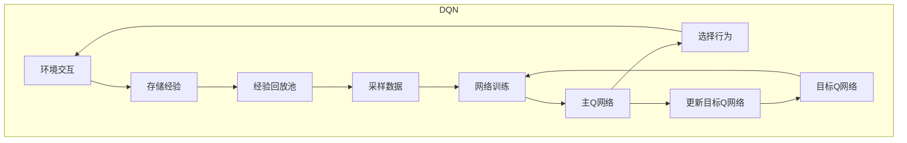

# 第八章：DeepQ-Learning的实际应用

## 1. 背景介绍

深度强化学习(Deep Reinforcement Learning, DRL)是近年来人工智能领域中一个备受关注的热门研究方向。它将深度神经网络与强化学习相结合,使智能体能够直接从环境中学习最优策略,而无需人工设计复杂的特征工程。其中,Deep Q-Network(DQN)作为DRL的一个主要算法,在许多领域取得了卓越的成绩。

DQN的核心思想是使用深度神经网络来估计状态-行为值函数(Q函数),并通过与环境交互不断优化网络参数。与传统的Q-Learning算法相比,DQN能够处理高维观测数据,并在连续状态空间中学习更加复杂的策略。这使得DQN在计算机视觉、自然语言处理、机器人控制等领域都有着广泛的应用前景。

## 2. 核心概念与联系

### 2.1 Q-Learning

Q-Learning是一种基于时序差分(Temporal Difference, TD)的无模型强化学习算法。它旨在直接学习最优的状态-行为值函数Q(s,a),而无需先获得环境的转移概率模型。Q(s,a)表示在状态s下选择行为a之后,能够获得的期望累计奖励。通过不断更新Q值,智能体可以逐步优化其策略,最终收敛到最优策略。

### 2.2 Deep Q-Network (DQN)

Deep Q-Network将Q-Learning与深度神经网络相结合。它使用一个深度神经网络来拟合Q函数,网络的输入是当前状态s,输出是所有可能行为a对应的Q(s,a)值。在训练过程中,智能体与环境交互并记录下状态转移和奖励,然后使用这些数据对神经网络进行监督式训练,使得网络输出的Q值逼近真实的Q值。

为了提高训练的稳定性和效率,DQN还引入了以下几个关键技术:

1. **Experience Replay**: 将智能体与环境交互时获得的经验存储在经验回放池中,并从中随机采样数据进行训练,打破经验数据间的相关性。
2. **Target Network**: 使用一个目标网络来生成训练时需要的目标Q值,目标网络的参数是主网络参数的指数平滑更新,增加了训练的稳定性。
3. **$\epsilon$-greedy探索策略**: 在选择行为时,以一定的概率$\epsilon$随机选择行为,保证探索过程的充分性。

### 2.3 Mermaid流程图



## 3. 核心算法原理具体操作步骤

DQN算法的核心步骤如下:

1. **初始化**: 初始化主Q网络和目标Q网络,两个网络的参数相同。初始化经验回放池D为空集。

2. **与环境交互**: 对于当前状态$s_t$,根据$\epsilon$-greedy策略选择行为$a_t$。将状态$s_t$、行为$a_t$、奖励$r_t$和下一状态$s_{t+1}$存储到经验回放池D中。

3. **采样数据**: 从经验回放池D中随机采样一个批次的经验数据$(s, a, r, s')$。

4. **计算目标Q值**: 对于每个采样的经验$(s, a, r, s')$,计算其目标Q值:

$$
y = r + \gamma \max_{a'} Q(s', a'; \theta^-)
$$

其中$\gamma$是折扣因子,$\theta^-$是目标Q网络的参数。

5. **网络训练**: 使用采样数据$(s, a, y)$对主Q网络进行监督式训练,最小化损失函数:

$$
L(\theta) = \mathbb{E}_{(s, a, y) \sim D}\left[(y - Q(s, a; \theta))^2\right]
$$

其中$\theta$是主Q网络的参数。

6. **更新目标Q网络**: 每隔一定步数,使用主Q网络的参数对目标Q网络进行软更新:

$$
\theta^- \leftarrow \rho \theta^- + (1 - \rho) \theta
$$

其中$\rho$是一个小于1的平滑系数。

7. **重复步骤2-6**: 直到智能体达到预期的性能或者训练步数达到上限。

## 4. 数学模型和公式详细讲解举例说明

### 4.1 Bellman方程

强化学习的核心思想是基于Bellman方程,通过估计状态值函数或者状态-行为值函数,来求解最优策略。对于状态-行为值函数Q(s,a),其Bellman方程为:

$$
Q(s, a) = \mathbb{E}_{s' \sim P(s'|s, a)}\left[r(s, a) + \gamma \max_{a'} Q(s', a')\right]
$$

其中,P(s'|s,a)是状态转移概率,r(s,a)是立即奖励函数,$\gamma$是折扣因子。该方程表示,在状态s下执行行为a所获得的期望累计奖励,等于立即奖励加上下一状态s'下最大的Q值的折扣和。

在DQN中,我们使用一个深度神经网络来拟合Q函数,网络的输出就是对应状态-行为对的Q值估计。通过不断优化网络参数,使得网络输出的Q值逼近真实的Q值,从而求解最优策略。

### 4.2 经验回放

在训练DQN时,我们使用经验回放(Experience Replay)的技术。具体来说,我们将智能体与环境交互时获得的经验$(s_t, a_t, r_t, s_{t+1})$存储在一个经验回放池D中。在每一步训练时,我们从D中随机采样一个批次的经验数据,用于更新神经网络的参数。

经验回放的主要优点是:

1. **打破经验数据间的相关性**: 由于强化学习任务中,相邻的状态转移是高度相关的,直接使用这些相关数据进行训练会导致网络过拟合。而经验回放通过随机采样,打破了数据间的相关性,提高了训练的稳定性。

2. **数据利用率高**: 每个经验都可以被重复使用多次,提高了数据的利用效率。

3. **离线训练**: 经验回放使得我们可以在离线的情况下,使用之前收集的经验数据进行训练,而无需与环境进行在线交互。

### 4.3 目标网络

在DQN的训练过程中,我们使用两个神经网络:主Q网络和目标Q网络。主Q网络用于选择行为和进行参数更新,而目标Q网络用于生成训练时需要的目标Q值。

具体来说,对于每个采样的经验$(s, a, r, s')$,我们使用目标Q网络计算其目标Q值:

$$
y = r + \gamma \max_{a'} Q(s', a'; \theta^-)
$$

其中$\theta^-$是目标Q网络的参数。然后,我们使用这个目标Q值,对主Q网络的参数$\theta$进行优化:

$$
L(\theta) = \mathbb{E}_{(s, a, y) \sim D}\left[(y - Q(s, a; \theta))^2\right]
$$

目标Q网络的参数$\theta^-$是主Q网络参数$\theta$的指数平滑更新:

$$
\theta^- \leftarrow \rho \theta^- + (1 - \rho) \theta
$$

其中$\rho$是一个小于1的平滑系数,通常取0.99或0.995。

使用目标网络的主要原因是,在训练过程中,如果直接使用主Q网络来生成目标Q值,会导致目标值的不稳定,影响训练的收敛性。而使用一个相对稳定的目标网络,可以提高训练的稳定性和效率。

### 4.4 $\epsilon$-greedy探索策略

在强化学习中,探索(Exploration)和利用(Exploitation)是一对矛盾统一的重要概念。探索是指智能体尝试新的行为,以发现更好的策略;而利用是指智能体根据已有的知识选择当前最优的行为。

$\epsilon$-greedy策略就是一种权衡探索和利用的经典方法。具体来说,对于当前状态s,以概率$\epsilon$随机选择一个行为(探索),以概率1-$\epsilon$选择当前最优行为(利用)。$\epsilon$的值通常会随着训练的进行而逐渐减小,以保证在后期训练时,智能体有足够的利用过程。

在DQN中,$\epsilon$-greedy策略可以表示为:

$$
a =
\begin{cases}
\operatorname{argmax}_a Q(s, a; \theta) & \text{with probability } 1 - \epsilon\\
\operatorname{random} & \text{with probability } \epsilon
\end{cases}
$$

其中,$\theta$是主Q网络的参数。

$\epsilon$-greedy策略能够很好地权衡探索和利用,保证了训练过程的充分探索,同时也确保了在后期能够利用已学习的知识。

## 5. 项目实践: 代码实例和详细解释说明

以下是一个使用PyTorch实现的简单DQN代码示例,用于解决经典的CartPole问题。

### 5.1 环境和工具导入

```python
import gym
import torch
import torch.nn as nn
import torch.optim as optim
import numpy as np
from collections import deque
```

我们首先导入必要的库和模块,包括OpenAI Gym环境、PyTorch深度学习框架,以及一些辅助模块。

### 5.2 深度Q网络

```python
class DQN(nn.Module):
    def __init__(self, state_dim, action_dim):
        super(DQN, self).__init__()
        self.fc1 = nn.Linear(state_dim, 64)
        self.fc2 = nn.Linear(64, action_dim)

    def forward(self, x):
        x = torch.relu(self.fc1(x))
        return self.fc2(x)
```

这是一个简单的全连接深度Q网络,输入是当前状态,输出是每个行为对应的Q值。我们使用ReLU作为激活函数。

### 5.3 经验回放池

```python
class ReplayBuffer:
    def __init__(self, capacity):
        self.buffer = deque(maxlen=capacity)

    def push(self, state, action, reward, next_state, done):
        self.buffer.append((state, action, reward, next_state, done))

    def sample(self, batch_size):
        batch = random.sample(self.buffer, batch_size)
        state, action, reward, next_state, done = map(np.stack, zip(*batch))
        return state, action, reward, next_state, done

    def __len__(self):
        return len(self.buffer)
```

这是一个简单的经验回放池实现,使用双端队列(deque)存储经验,支持固定容量、先进先出。我们提供了push和sample方法,用于存储和采样经验数据。

### 5.4 DQN算法实现

```python
def train(env, buffer, net, target_net, optimizer, batch_size=64, gamma=0.99, epsilon=1.0, epsilon_decay=0.995, update_target=100):
    step = 0
    for episode in range(1000):
        state = env.reset()
        done = False
        total_reward = 0
        while not done:
            if np.random.rand() < epsilon:
                action = env.action_space.sample()
            else:
                state_tensor = torch.tensor(state, dtype=torch.float32).unsqueeze(0)
                q_values = net(state_tensor)
                action = torch.argmax(q_values).item()

            next_state, reward, done, _ = env.step(action)
            buffer.push(state, action, reward, next_state, done)
            state = next_state
            total_reward += reward

            if len(buffer) >= batch_size:
                optimize_model(buffer, net, target_net, optimizer, batch_size, gamma)
                if step % update_target == 0:
                    target_net.load_state_dict(net.state_dict())
                step += 1

        epsilon *= epsilon_decay
        print(f"Episode: {episode}, Total Reward: {total_reward}, Epsilon: {epsilon}")

def optimize_model(buffer, net, target_net, optimizer, batch_size, gamma):
    state, action, reward, next_state, done = buffer.sample(batch_size)

    state_tensor = torch.tensor(state, dtype=torch.float32)
    next_state_tensor = torch.tensor(next_state, dtype=torch.float32)
    action_tensor = torch.tensor(action, dtype=torch.int64)
    reward_tensor = torch