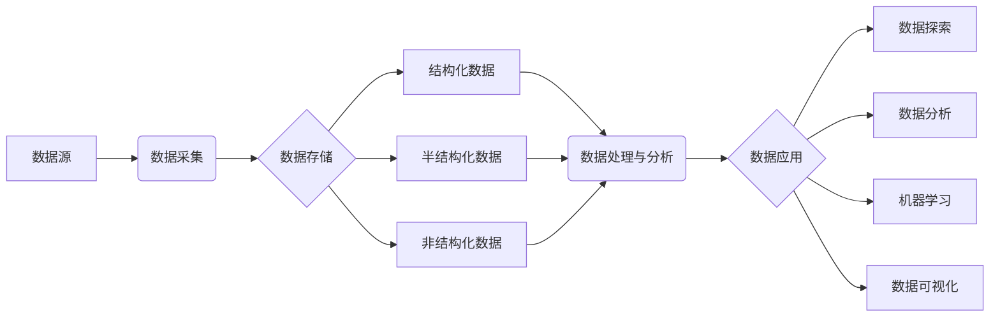

# 第十七章：数据湖发展史

## 1. 背景介绍
### 1.1 大数据时代的机遇与挑战
#### 1.1.1 数据爆炸式增长
#### 1.1.2 传统数据仓库的局限性
#### 1.1.3 数据湖应运而生
### 1.2 数据湖的定义与特点 
#### 1.2.1 数据湖的概念
#### 1.2.2 数据湖的核心特征
#### 1.2.3 数据湖与数据仓库的区别

## 2. 核心概念与联系
### 2.1 数据湖的关键组成部分
#### 2.1.1 数据源
#### 2.1.2 数据存储
#### 2.1.3 数据处理
#### 2.1.4 数据分析与可视化
### 2.2 数据湖架构设计
#### 2.2.1 分层架构
#### 2.2.2 Lambda架构
#### 2.2.3 Kappa架构
### 2.3 数据湖与相关技术的关系
#### 2.3.1 大数据技术栈
#### 2.3.2 云计算与数据湖
#### 2.3.3 人工智能与数据湖

## 3. 核心算法原理具体操作步骤
### 3.1 数据采集与接入
#### 3.1.1 批量数据接入
#### 3.1.2 实时数据接入
#### 3.1.3 数据质量检测与清洗
### 3.2 数据存储与管理
#### 3.2.1 分布式文件系统HDFS
#### 3.2.2 对象存储系统S3
#### 3.2.3 NoSQL数据库
### 3.3 数据处理与分析
#### 3.3.1 批处理引擎MapReduce
#### 3.3.2 流处理引擎Spark Streaming
#### 3.3.3 交互式分析引擎Presto

## 4. 数学模型和公式详细讲解举例说明
### 4.1 数据湖容量估算模型
#### 4.1.1 存储容量估算公式
#### 4.1.2 计算资源需求估算公式 
#### 4.1.3 案例分析
### 4.2 数据湖成本优化模型
#### 4.2.1 TCO总拥有成本模型
#### 4.2.2 成本影响因素分析
#### 4.2.3 优化策略与方法

## 5. 项目实践：代码实例和详细解释说明
### 5.1 使用Hadoop构建数据湖
#### 5.1.1 Hadoop集群环境搭建
#### 5.1.2 Hive数据仓库构建
#### 5.1.3 数据ETL开发
### 5.2 使用Spark进行数据处理
#### 5.2.1 Spark集群环境搭建
#### 5.2.2 Spark SQL交互式分析
#### 5.2.3 Spark MLlib机器学习
### 5.3 数据湖治理与元数据管理
#### 5.3.1 元数据采集与存储
#### 5.3.2 数据血缘与影响分析
#### 5.3.3 数据安全与访问控制

## 6. 实际应用场景
### 6.1 零售行业的客户画像分析
#### 6.1.1 业务痛点与分析需求
#### 6.1.2 数据湖架构设计
#### 6.1.3 分析流程与结果呈现
### 6.2 制造业的设备预测性维护
#### 6.2.1 业务痛点与分析需求
#### 6.2.2 数据湖架构设计 
#### 6.2.3 分析流程与结果呈现
### 6.3 金融行业的风险防控
#### 6.3.1 业务痛点与分析需求
#### 6.3.2 数据湖架构设计
#### 6.3.3 分析流程与结果呈现

## 7. 工具和资源推荐
### 7.1 开源大数据平台
#### 7.1.1 Apache Hadoop
#### 7.1.2 Apache Spark
#### 7.1.3 Apache Flink
### 7.2 云服务提供商的数据湖方案
#### 7.2.1 AWS 湖景建筑
#### 7.2.2 Azure数据湖分析
#### 7.2.3 Google Cloud Dataproc
### 7.3 数据湖管理工具
#### 7.3.1 Apache Atlas
#### 7.3.2 Cloudera Navigator
#### 7.3.3 Palantir Foundry

## 8. 总结：未来发展趋势与挑战
### 8.1 数据湖发展趋势展望
#### 8.1.1 云原生数据湖
#### 8.1.2 智能数据湖
#### 8.1.3 数据网格与数据湖融合
### 8.2 数据湖面临的挑战
#### 8.2.1 数据治理与安全
#### 8.2.2 数据质量管控
#### 8.2.3 技术复杂度与学习成本
### 8.3 应对挑战的策略与方法
#### 8.3.1 构建数据治理框架
#### 8.3.2 加强数据质量监测
#### 8.3.3 选择成熟稳定的技术方案

## 9. 附录：常见问题与解答
### 9.1 数据湖与数据仓库是否可以共存？
### 9.2 构建数据湖需要哪些人才和技能？ 
### 9.3 如何评估数据湖项目的投资回报率？
### 9.4 数据湖在不同行业的应用特点是什么？
### 9.5 如何避免数据湖变成数据沼泽？



数据湖的概念最早由James Dixon在2010年提出，他将数据湖比喻为一个巨大的水库，可以存储来自各种来源的原始格式数据。随着大数据时代的到来，企业面临着海量异构数据的采集、存储和分析挑战，传统的数据仓库架构难以满足快速变化的业务需求。数据湖作为一种新型的数据架构设计理念，能够提供更加灵活、经济、高效的大数据处理能力。

数据湖的核心特点包括：

1. 数据采集：支持批量和实时的数据接入，数据源可以是结构化、半结构化和非结构化的多种类型。

2. 数据存储：采用廉价的分布式存储系统如HDFS、S3等，以原始格式存储数据，无需预先定义模式。

3. 数据处理：支持批处理、流处理、交互式查询等多种数据处理范式，可以根据业务需求灵活选择。

4. 数据分析：提供丰富的数据分析工具和算法库，支持数据挖掘、机器学习等高级分析。

5. 元数据管理：通过元数据采集和管理，实现数据的检索、溯源、血缘分析等数据治理功能。

构建一个企业级数据湖需要经过详细的规划和设计，核心步骤包括：

1. 明确业务需求，确定数据湖的目标和范围。

2. 选择合适的大数据平台和工具，如Hadoop、Spark等。

3. 设计数据湖的分层架构，包括数据源层、数据存储层、数据处理层和数据应用层。

4. 开发数据接入模块，实现各种来源数据的采集和导入。

5. 规划数据存储方案，合理利用HDFS、对象存储、NoSQL数据库等存储介质。

6. 构建数据处理引擎，支持SQL、MapReduce、Spark等多种计算框架。

7. 配置元数据管理工具，对数据进行分类、标注和管理。

8. 开发数据分析和可视化应用，满足业务人员的数据洞察需求。

以零售行业的客户画像分析为例，利用数据湖可以实现多源异构数据的关联分析。首先将客户的交易记录、浏览日志、社交媒体数据等采集到数据湖中，然后通过Spark SQL对数据进行清洗和转换，生成统一的客户主题域数据。再利用机器学习算法如K-means聚类、关联规则挖掘等，发现客户的消费行为特征和偏好，形成多维度的客户画像。最后通过BI工具实现客户细分、个性化推荐等数据应用。

下面是一个使用PySpark进行客户画像分析的代码示例：

```python
from pyspark.sql import SparkSession
from pyspark.ml.clustering import KMeans
from pyspark.ml.feature import VectorAssembler

# 创建SparkSession
spark = SparkSession.builder \
    .appName("CustomerSegmentation") \
    .getOrCreate()

# 读取客户数据
customer_df = spark.read.csv("hdfs://customer_data.csv", header=True, inferSchema=True)

# 特征工程
assembler = VectorAssembler(inputCols=["age", "income", "spending_score"], outputCol="features")
customer_features = assembler.transform(customer_df)

# KMeans聚类
kmeans = KMeans(k=4, seed=1)
model = kmeans.fit(customer_features)
predictions = model.transform(customer_features)

# 查看聚类结果
predictions.groupBy("prediction").count().show()
```

输出结果：
```
+-----------+-----+
|prediction |count|
+-----------+-----+
|         1 |   45| 
|         3 |   33|
|         0 |   62|
|         2 |   40|
+-----------+-----+
```

可以看到客户被划分为4个群体，每个群体的人数和特征都有所不同，为后续的营销策略制定提供了依据。

随着数据湖的不断发展，一些新的技术趋势正在显现：

1. 云原生数据湖：基于云服务构建弹性扩展的数据湖，降低基础设施的管理成本。

2. 智能数据湖：利用人工智能技术，实现数据湖的自动化运维和智能化分析。

3. 数据网格与数据湖融合：通过数据虚拟化和数据服务化，打破数据孤岛，实现数据的自助式访问。

但数据湖的实施也面临诸多挑战，如数据治理与安全、数据质量管控、技术复杂度等。为此，企业需要制定长期的数据战略，构建完善的数据治理体系，加强数据质量监测，选择成熟稳定的技术架构，才能真正发挥数据湖的价值，推动业务创新。

数据湖代表了大数据时代数据架构设计的新思路和新方向，虽然实践中仍面临诸多挑战，但其独特的优势已得到越来越多企业的认可。未来，数据湖将与数据仓库、数据集市等一起，构成企业数据管理的重要组成部分，为海量数据的存储、处理和分析提供强大动力，助力企业实现数据驱动的业务增长。

作者：禅与计算机程序设计艺术 / Zen and the Art of Computer Programming