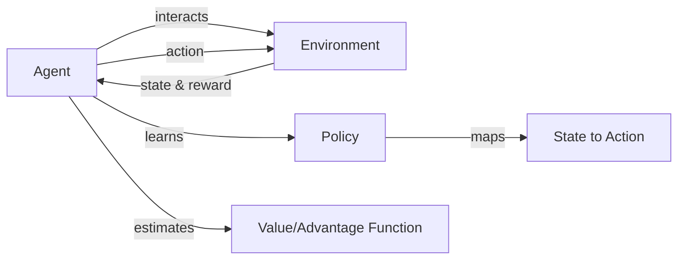

# 策略梯度(Policy Gradient)原理与代码实战案例讲解

## 1.背景介绍
### 1.1 强化学习概述
### 1.2 策略梯度在强化学习中的地位
### 1.3 本文的主要内容与目标

## 2.核心概念与联系
### 2.1 智能体(Agent)与环境(Environment)
### 2.2 状态(State)、动作(Action)和奖励(Reward)
### 2.3 策略(Policy)、价值函数(Value Function)与优势函数(Advantage Function)
### 2.4 探索(Exploration)与利用(Exploitation)
### 2.5 核心概念之间的关系

## 3.核心算法原理具体操作步骤
### 3.1 策略梯度定理(Policy Gradient Theorem) 
#### 3.1.1 目标函数与梯度
#### 3.1.2 数学推导
#### 3.1.3 蒙特卡洛采样近似
### 3.2 REINFORCE算法
#### 3.2.1 算法流程
#### 3.2.2 伪代码
#### 3.2.3 优缺点分析
### 3.3 Actor-Critic算法
#### 3.3.1 Actor与Critic的分工
#### 3.3.2 优势函数的引入
#### 3.3.3 算法流程与伪代码

## 4.数学模型和公式详细讲解举例说明
### 4.1 马尔可夫决策过程(Markov Decision Process, MDP)
### 4.2 策略、状态值函数与动作值函数的数学定义
#### 4.2.1 策略 $\pi(a|s)$
#### 4.2.2 状态值函数 $V^{\pi}(s)$
#### 4.2.3 动作值函数 $Q^{\pi}(s,a)$
### 4.3 贝尔曼方程(Bellman Equation)
#### 4.3.1 状态值贝尔曼方程
$$V^{\pi}(s)=\sum_{a}\pi(a|s)\sum_{s',r}p(s',r|s,a)[r+\gamma V^{\pi}(s')]$$
#### 4.3.2 动作值贝尔曼方程 
$$Q^{\pi}(s,a)=\sum_{s',r}p(s',r|s,a)[r+\gamma\sum_{a'}\pi(a'|s')Q^{\pi}(s',a')]$$
### 4.4 策略梯度定理推导
#### 4.4.1 期望累积奖励(Expected Cumulative Reward)
$$J(\theta)=\sum_{s}d^{\pi}(s)V^{\pi}(s)=\sum_{s}d^{\pi}(s)\sum_{a}\pi_{\theta}(a|s)Q^{\pi}(s,a)$$
#### 4.4.2 求导
$$\nabla_{\theta}J(\theta)=\sum_{s}d^{\pi}(s)\sum_{a}Q^{\pi}(s,a)\nabla_{\theta}\pi_{\theta}(a|s)$$

## 5.项目实践：代码实例和详细解释说明
### 5.1 基于OpenAI Gym的环境搭建
### 5.2 REINFORCE算法实现
#### 5.2.1 策略网络(Policy Network)设计
#### 5.2.2 训练流程
#### 5.2.3 代码实现与注释
### 5.3 Actor-Critic算法实现 
#### 5.3.1 Actor网络与Critic网络设计
#### 5.3.2 训练流程
#### 5.3.3 代码实现与注释
### 5.4 实验结果分析与可视化

## 6.实际应用场景
### 6.1 智能体游戏中的应用
#### 6.1.1 Atari游戏
#### 6.1.2 Go、象棋等棋类游戏
### 6.2 机器人控制中的应用
#### 6.2.1 机器人运动规划
#### 6.2.2 机器人操纵与抓取
### 6.3 推荐系统与广告投放中的应用
### 6.4 自然语言处理中的应用
#### 6.4.1 对话系统
#### 6.4.2 文本生成

## 7.工具和资源推荐
### 7.1 OpenAI Gym环境
### 7.2 TensorFlow与PyTorch深度学习框架
### 7.3 主流强化学习算法库：Stable Baselines等
### 7.4 相关论文与学习资源

## 8.总结：未来发展趋势与挑战
### 8.1 策略梯度算法的优势与局限性
### 8.2 结合深度学习的深度强化学习发展
### 8.3 样本效率与探索问题
### 8.4 多智能体强化学习
### 8.5 强化学习的可解释性与安全性

## 9.附录：常见问题与解答
### 9.1 如何平衡探索与利用？
### 9.2 如何加速策略梯度算法的训练？
### 9.3 如何处理连续动作空间？
### 9.4 如何解决稀疏奖励问题？
### 9.5 策略梯度算法能否处理部分可观察马尔可夫决策过程(POMDP)？

作者：禅与计算机程序设计艺术 / Zen and the Art of Computer Programming