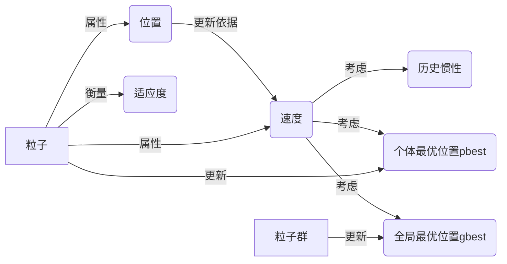

# 粒子群算法(Particle Swarm Optimization) - 原理与代码实例讲解

## 1.背景介绍

### 1.1 粒子群算法的起源与发展

粒子群优化算法(Particle Swarm Optimization, PSO)是一种基于群体智能的随机搜索算法,由 Kennedy 和 Eberhart 于1995年提出。该算法源于对鸟群觅食行为的研究,受到人工生命研究领域中鸟群觅食和鱼群觅食行为的启发而提出。经过近30年的发展,PSO已经成为智能优化领域的重要分支,在许多实际问题中得到了广泛应用。

### 1.2 粒子群算法的优势

与其他智能优化算法相比,PSO具有概念简单、参数少、易于实现、收敛速度快等优点。PSO通过个体之间的信息交互来引导搜索方向,在算法执行过程中自适应地调整,体现了一定的社会学特性。PSO 不需要像遗传算法那样对问题进行编码,也不需要像模拟退火算法那样引入随机扰动。这些特点使得PSO在求解许多复杂优化问题时表现出色。

### 1.3 粒子群算法的应用领域

PSO在以下领域得到了广泛应用:

- 函数优化:PSO可用于求解复杂非线性函数的全局最优解。
- 组合优化:如旅行商问题(TSP)、车间调度等。
- 神经网络训练:PSO可用于优化神经网络的权重和结构。
- 模式识别与分类:如数据聚类、特征选择等。
- 信号处理:如系统辨识、滤波器设计等。
- 控制优化:如PID控制器参数整定、模糊控制器优化等。

## 2.核心概念与联系

### 2.1 粒子(Particle) 

在PSO算法中,每个候选解被看作是一个"粒子",具有位置和速度两个属性。所有粒子在一个 D 维搜索空间中移动,根据自身经验和群体经验调整运动方向,朝着最优解前进。

### 2.2 群体(Swarm)

粒子群由多个粒子组成,通过粒子之间的合作与竞争,不断更新群体的最优位置,引导算法的搜索方向。群体中的所有粒子共享彼此的信息,从而实现了群体智能。

### 2.3 适应度(Fitness) 

适应度用于衡量每个粒子的优劣程度。在优化问题中,适应度通常就是目标函数值。PSO算法以提高群体适应度为目标,不断改进每个粒子的位置。

### 2.4 个体最优位置(Personal Best,pbest)

每个粒子迄今为止搜索到的最优位置,用 pbest 表示。粒子在运动过程中,会将当前位置与 pbest 进行比较,如果当前适应度更优,则更新 pbest。

### 2.5 全局最优位置(Global Best,gbest) 

整个粒子群迄今为止搜索到的最优位置,用 gbest 表示。在每次迭代中,算法会比较所有粒子的 pbest,将其中最优的作为 gbest。gbest 代表了整个粒子群的优化方向。

### 2.6 速度(Velocity)

粒子的速度反映了其移动的方向和步长。速度由粒子的惯性、个体认知和社会认知三部分组成。通过动态调整速度,粒子可在解空间中高效搜索。

### 2.7 概念之间的联系

在PSO优化过程中,粒子根据自身经验(pbest)和群体经验(gbest)来更新速度和位置。速度的更新考虑了粒子的历史惯性、向着个体最优位置的认知以及向着全局最优位置的认知。通过速度更新,粒子不断调整运动方向,在解空间中搜索最优解。随着迭代的进行,粒子将逐渐聚集在全局最优解附近。

下图展示了PSO算法中各核心概念之间的关系:



## 3.核心算法原理具体操作步骤

### 3.1 粒子群初始化

在D维搜索空间中随机初始化一群粒子,为每个粒子随机指定位置和速度。同时将粒子的当前位置作为其个体最优位置 pbest。

### 3.2 适应度评价 

计算每个粒子的适应度,即目标函数值。将粒子群中适应度最优的位置作为全局最优位置 gbest。

### 3.3 速度更新

根据下列公式更新每个粒子的速度:

$v_i^{k+1}=\omega v_i^k+c_1 r_1 (pbest_i-x_i^k)+c_2 r_2 (gbest-x_i^k)$

其中,$v_i^k$ 和 $x_i^k$ 分别表示第 $i$ 个粒子在第 $k$ 次迭代时的速度和位置;$\omega$ 为惯性权重;$c_1$ 和 $c_2$ 为加速常数;$r_1$ 和 $r_2$ 为[0,1]之间的随机数;$pbest_i$ 为第 $i$ 个粒子的个体最优位置;$gbest$ 为粒子群的全局最优位置。

### 3.4 位置更新

根据下列公式更新每个粒子的位置:

$x_i^{k+1}=x_i^k+v_i^{k+1}$

### 3.5 个体最优位置更新

比较每个粒子当前适应度与其个体最优位置 pbest 的适应度,如果当前更优,则将当前位置作为新的 pbest。

### 3.6 全局最优位置更新

比较粒子群中所有粒子的 pbest,将其中最优的作为新的全局最优位置 gbest。

### 3.7 终止条件判断

如果满足终止条件(如达到最大迭代次数或找到满意解),则输出 gbest 作为问题的解,算法终止;否则,回到步骤3.3,继续迭代。

## 4.数学模型和公式详细讲解举例说明

### 4.1 数学模型

设在一个 D 维搜索空间中有 m 个粒子,第 i 个粒子的位置和速度分别为:

$$
X_i=(x_{i1},x_{i2},...,x_{iD}) 
$$
$$
V_i=(v_{i1},v_{i2},...,v_{iD})
$$

其中,i=1,2,...,m。粒子根据自身经验和群体经验调整速度和位置,更新公式为:

$$
v_{id}^{k+1}=\omega v_{id}^k+c_1 r_1 (p_{id}-x_{id}^k)+c_2 r_2 (p_{gd}-x_{id}^k)
$$
$$
x_{id}^{k+1}=x_{id}^k+v_{id}^{k+1}
$$

其中,d=1,2,...,D;k为迭代次数;$p_{id}$ 为第 i 个粒子的个体最优位置在第 d 维的分量;$p_{gd}$ 为粒子群全局最优位置在第 d 维的分量;$\omega$, $c_1$, $c_2$, $r_1$, $r_2$ 的含义同步骤3.3。

### 4.2 公式讲解

- 速度更新公式

$v_{id}^{k+1}=\omega v_{id}^k+c_1 r_1 (p_{id}-x_{id}^k)+c_2 r_2 (p_{gd}-x_{id}^k)$

该公式由三部分组成:

(1) $\omega v_{id}^k$ 表示粒子的惯性,反映了粒子保持当前速度沿原方向运动的趋势。$\omega$ 称为惯性权重,用于控制算法的全局和局部搜索能力。

(2) $c_1 r_1 (p_{id}-x_{id}^k)$ 表示粒子的个体认知,反映了粒子向自身历史最优位置学习的趋势。$c_1$ 称为个体学习因子,$r_1$ 为[0,1]的随机数。

(3) $c_2 r_2 (p_{gd}-x_{id}^k)$ 表示粒子的社会认知,反映了粒子向群体历史最优位置学习的趋势。$c_2$ 称为社会学习因子,$r_2$ 为[0,1]的随机数。

通过这三部分的叠加,粒子可在解空间中高效搜索,平衡了探索和利用。

- 位置更新公式

$x_{id}^{k+1}=x_{id}^k+v_{id}^{k+1}$

粒子的新位置由其当前位置和更新后的速度决定。这反映了粒子在解空间中的移动轨迹。

### 4.3 算法举例说明

以求解函数 $f(x)=x_1^2+x_2^2$ 的最小值为例,说明PSO算法的执行过程。假设搜索空间为 $[-10,10]^2$,粒子数为4,最大迭代次数为100。

(1) 初始化粒子群,随机生成4个粒子的位置和速度:

|粒子编号|位置$(x_1,x_2)$|速度$(v_1,v_2)$|适应度$f(x)$|
|:---:|:---:|:---:|:---:|
|1|(-1.5,2.0)|(0.2,-0.3)|6.25|
|2|(3.2,-4.1)|(0.1,0.5)|26.45|
|3|(-2.7,1.8)|(-0.4,0.2)|10.53|
|4|(1.2,3.6)|(-0.3,-0.1)|14.16|

初始化 pbest 和 gbest:

$pbest_1=(-1.5,2.0), pbest_2=(3.2,-4.1), pbest_3=(-2.7,1.8), pbest_4=(1.2,3.6)$
$gbest=(-1.5,2.0)$

(2) 迭代搜索,重复以下步骤,直至满足终止条件:

- 更新速度和位置。以粒子1为例,假设 $\omega=0.8$, $c_1=c_2=2$, $r_1=0.3$, $r_2=0.6$,则:

$$
\begin{aligned}
v_{11}^{k+1}&=0.8 \times 0.2+2 \times 0.3 \times (-1.5-(-1.5))+2 \times 0.6 \times (-1.5-(-1.5))\\
&=0.16+0+0=0.16\\
v_{12}^{k+1}&=0.8 \times (-0.3)+2 \times 0.3 \times (2.0-2.0)+2 \times 0.6 \times (2.0-2.0)\\
&=-0.24+0+0=-0.24
\end{aligned}
$$

$$
\begin{aligned}
x_{11}^{k+1}&=-1.5+0.16=-1.34\\  
x_{12}^{k+1}&=2.0+(-0.24)=1.76
\end{aligned}
$$

- 评价适应度,更新 pbest 和 gbest。粒子1新位置的适应度为:

$f(-1.34,1.76)=1.80+3.10=4.90$

优于原 pbest 适应度6.25,故更新 $pbest_1=(-1.34,1.76)$。
同理更新其他粒子的 pbest,再从所有 pbest 中选出最优的更新 gbest。

(3) 迭代达到最大次数后,输出 gbest 作为问题的解。

## 5.项目实践：代码实例和详细解释说明

下面给出了用Python实现的PSO算法代码,并对其进行详细解释:

```python
import numpy as np

class PSO:
    def __init__(self, func, dim, pop=40, max_iter=150, lb=None, ub=None, w=0.8, c1=2, c2=2):
        self.func = func                      # 目标函数
        self.w = w                            # 惯性权重
        self.c1 = c1                          # 个体学习因子
        self.c2 = c2                          # 社会学习因子
        self.r1 = None                        # 更新速度时的随机数
        self.r2 = None                        # 更新速度时的随机数