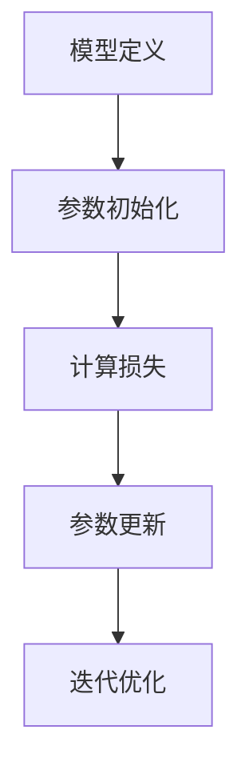

## 1.背景介绍

线性回归是一种预测分析，它研究的是因变量（目标）和自变量（特征）之间的关系。这种方法在统计学和机器学习领域都有广泛应用，被广泛用于预测分析，例如股票价格预测、房价预测等。

线性回归的主要优点是简单易懂，可以清晰地解释每个变量对结果的影响。而其主要缺点是对数据和模型的假设较多，例如数据的线性关系、误差项的独立性等，这在一定程度上限制了其应用范围。

## 2.核心概念与联系

线性回归的核心概念主要包括线性关系、最小二乘法、梯度下降等。下面我们分别进行介绍。

- **线性关系**：线性回归假设因变量和自变量之间存在线性关系，即结果可以表示为自变量的线性组合。

- **最小二乘法**：最小二乘法是线性回归中常用的参数估计方法。它通过最小化预测值与实际值之间的差距来求解参数。

- **梯度下降**：梯度下降是一种求解最小二乘问题的优化算法。通过迭代更新参数来最小化损失函数。


## 3.核心算法原理具体操作步骤

线性回归的核心算法原理可以分为以下几个步骤：

1. **模型定义**：定义线性回归模型，即确定因变量与自变量之间的线性关系。

2. **参数初始化**：对模型参数进行初始化。可以使用零初始化、随机初始化等方法。

3. **计算损失**：通过损失函数计算预测值与实际值之间的差距。

4. **参数更新**：使用梯度下降法更新模型参数，以最小化损失函数。

5. **迭代优化**：重复上述步骤，直到模型参数收敛，或达到预设的迭代次数。



## 4.数学模型和公式详细讲解举例说明

线性回归的数学模型可以表示为：

$$ y = X\beta + \epsilon $$

其中，$y$ 是因变量，$X$ 是自变量，$\beta$ 是模型参数，$\epsilon$ 是误差项。

最小二乘法的目标是最小化预测值与实际值之间的差距，即最小化损失函数：

$$ L(\beta) = \frac{1}{2n} \sum_{i=1}^{n} (y_i - x_i^T\beta)^2 $$

其中，$n$ 是样本数量，$y_i$ 是第 $i$ 个样本的因变量，$x_i^T$ 是第 $i$ 个样本的自变量。

梯度下降法通过迭代更新参数来最小化损失函数。参数更新公式为：

$$ \beta := \beta - \alpha \frac{\partial L(\beta)}{\partial \beta} $$

其中，$\alpha$ 是学习率，$\frac{\partial L(\beta)}{\partial \beta}$ 是损失函数对参数的梯度。

## 5.项目实践：代码实例和详细解释说明

接下来，我们以 Python 为例，展示如何实现线性回归。

首先，我们需要导入必要的库，并生成一些模拟数据：

```python
import numpy as np
import matplotlib.pyplot as plt

# 生成模拟数据
np.random.seed(0)
X = np.random.rand(100, 1)
y = 2 + 3 * X + np.random.rand(100, 1)

plt.scatter(X, y)
plt.show()
```

然后，我们定义线性回归模型，并初始化参数：

```python
class LinearRegression:
    def __init__(self, learning_rate=0.01, iterations=1000):
        self.learning_rate = learning_rate
        self.iterations = iterations
        self.theta = None

    def fit(self, X, y):
        n = X.shape[0]
        X = np.hstack((np.ones((n, 1)), X))
        self.theta = np.zeros((X.shape[1], 1))

        for _ in range(self.iterations):
            gradient = 1 / n * X.T @ (X @ self.theta - y)
            self.theta -= self.learning_rate * gradient
```

最后，我们可以使用这个模型进行训练和预测：

```python
model = LinearRegression()
model.fit(X, y)

plt.scatter(X, y)
plt.plot(X, model.predict(X), color='red')
plt.show()
```

## 6.实际应用场景

线性回归在实际应用中有广泛的应用，例如：

- **经济学**：经济学家常常使用线性回归分析各种经济指标之间的关系，例如GDP和失业率、通货膨胀和利率等。

- **医学**：在医学研究中，线性回归可以用来分析影响疾病发生的各种因素，例如吸烟和肺癌、饮食和心脏病等。

- **金融**：在金融领域，线性回归可以用来预测股票价格、分析市场趋势等。

## 7.工具和资源推荐

线性回归的实现并不复杂，但如果你想要快速地在实际项目中使用线性回归，可以使用以下工具和资源：

- **Python**：Python 是一种流行的编程语言，其提供了丰富的机器学习库，如 scikit-learn、statsmodels 等。

- **R**：R 语言是统计学和数据分析的常用工具，其提供了许多用于线性回归的函数和包。

- **在线课程**：Coursera、edX 等在线教育平台提供了许多关于线性回归和机器学习的课程，可以帮助你深入理解这一主题。

## 8.总结：未来发展趋势与挑战

虽然线性回归是一种简单的模型，但它在实际应用中仍然有广泛的应用。随着大数据和人工智能的发展，我们可以预见，线性回归将会与其他机器学习方法相结合，形成更强大的预测模型。

然而，线性回归也面临一些挑战，例如如何处理非线性数据、如何解决高维数据的问题等。这些问题需要我们在未来的研究中进一步探讨。

## 9.附录：常见问题与解答

- **线性回归有哪些假设？**

线性回归主要有以下几个假设：线性关系、误差项的独立性、误差项的正态性、误差项的同方差性。

- **如何解决线性回归的过拟合问题？**

过拟合问题可以通过正则化、增加数据量、降低模型复杂度等方法来解决。

- **线性回归与逻辑回归有什么区别？**

线性回归是一种用于预测连续变量的方法，而逻辑回归是一种用于预测二元变量的方法。

作者：禅与计算机程序设计艺术 / Zen and the Art of Computer Programming