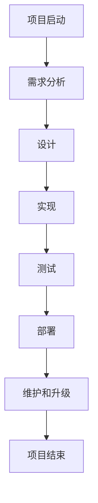
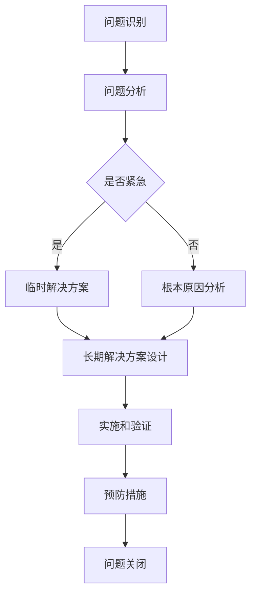
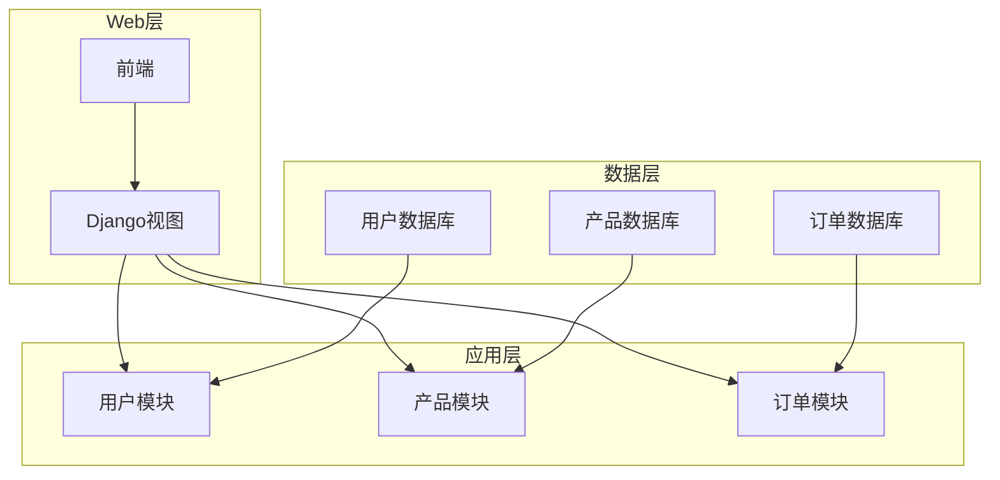

# 组织和指导项目的开发、测试、维护、升级、更新，解决开发中的技术问题

## 1.背景介绍

### 1.1 项目开发生命周期概述

软件项目的开发是一个循环迭代的过程,包括需求分析、设计、实现、测试、部署、维护和升级等阶段。每个阶段都有其独特的挑战和需求,需要项目经理和开发团队密切协作,确保项目按计划顺利推进。

### 1.2 项目管理的重要性

有效的项目管理对于确保项目成功至关重要。它涉及规划、组织、监控和控制项目活动,以实现既定的目标。良好的项目管理可以提高效率、降低风险、控制成本并确保高质量的交付。

### 1.3 技术问题及其影响

在项目开发过程中,技术问题是不可避免的。这些问题可能源于复杂的系统架构、新技术的采用、代码质量问题、集成挑战或性能瓶颈等。如果不及时解决,技术问题可能会导致延期、超支或甚至项目失败。

## 2.核心概念与联系

### 2.1 项目生命周期管理

项目生命周期管理是一种结构化的方法,用于管理项目从启动到交付的整个过程。它包括以下关键阶段:

1. **需求分析**: 收集和分析客户需求,确定项目目标和范围。
2. **设计**: 根据需求创建系统架构和详细设计。
3. **实现**: 编写代码并实现设计。
4. **测试**: 执行单元测试、集成测试和系统测试,以验证系统的功能和质量。
5. **部署**: 将系统部署到生产环境中。
6. **维护**: 解决生产环境中的问题,并根据需要进行升级和增强。

### 2.2 项目管理知识领域

项目管理知识领域包括以下几个方面:

1. **整合管理**: 确保项目活动的协调一致。
2. **范围管理**: 确保项目只包括所需的工作。
3. **时间管理**: 确保项目按时完成。
4. **成本管理**: 确保项目在预算范围内。
5. **质量管理**: 确保项目满足质量标准。
6. **人力资源管理**: 有效利用项目团队。
7. **沟通管理**: 确保项目信息得到适当的收集、分发和存储。
8. **风险管理**: 识别、分析和应对项目风险。
9. **采购管理**: 获取项目所需的产品和服务。
10. **利益相关者管理**: 识别并管理利益相关者的期望和需求。

### 2.3 技术问题管理

技术问题管理是指识别、分析、解决和预防技术问题的过程。它包括以下关键步骤:

1. **问题识别**: 通过代码审查、测试和监控等方式发现技术问题。
2. **问题分析**: 确定问题的根本原因和影响。
3. **解决方案设计**: 设计并评估潜在的解决方案。
4. **实施和验证**: 实施解决方案并验证其有效性。
5. **预防措施**: 采取措施防止类似问题再次发生。

## 3.核心算法原理具体操作步骤

### 3.1 项目生命周期管理流程

项目生命周期管理流程可以用以下 Mermaid 流程图表示:



1. **项目启动**: 确定项目目标、范围和约束条件。
2. **需求分析**: 收集和分析客户需求,定义系统功能和非功能需求。
3. **设计**: 根据需求创建系统架构和详细设计,包括数据库设计、接口设计和UI设计等。
4. **实现**: 根据设计编写代码,实现系统功能。
5. **测试**: 执行单元测试、集成测试和系统测试,确保系统满足需求和质量标准。
6. **部署**: 将系统部署到生产环境中,并进行用户培训和文档编写。
7. **维护和升级**: 解决生产环境中的问题,并根据需要进行升级和增强。
8. **项目结束**: 完成项目,进行总结和评审。

### 3.2 技术问题管理流程

技术问题管理流程可以用以下 Mermaid 流程图表示:



1. **问题识别**: 通过代码审查、测试和监控等方式发现技术问题。
2. **问题分析**: 收集相关信息,确定问题的症状和影响。
3. **紧急性评估**: 评估问题的紧急程度,决定是否需要临时解决方案。
4. **临时解决方案**: 如果问题紧急,采取临时措施缓解影响。
5. **根本原因分析**: 对非紧急问题进行深入分析,确定根本原因。
6. **长期解决方案设计**: 设计并评估潜在的长期解决方案。
7. **实施和验证**: 实施解决方案并验证其有效性。
8. **预防措施**: 采取措施防止类似问题再次发生,如代码审查、测试改进或流程优化。
9. **问题关闭**: 确认问题已得到解决,并记录相关信息以供将来参考。

## 4.数学模型和公式详细讲解举例说明

在项目管理和技术问题管理中,有几个常用的数学模型和公式:

### 4.1 项目进度估算

估算项目进度是项目管理的一个重要方面。常用的进度估算技术包括:

1. **PERT (Program Evaluation and Review Technique)**: PERT 是一种基于网络的技术,用于计算项目活动的最早开始时间和最晚完成时间。它使用以下公式计算活动的预期持续时间:

$$
t_e = \frac{t_o + 4t_m + t_p}{6}
$$

其中 $t_e$ 是预期持续时间, $t_o$ 是最乐观时间, $t_m$ 是最可能时间, $t_p$ 是最悲观时间。

2. **关键路径法 (Critical Path Method, CPM)**: CPM 是另一种基于网络的技术,用于确定项目的关键路径和完成时间。关键路径是决定项目总体持续时间的一系列活动。

### 4.2 资源分配优化

在项目中,资源分配是一个常见的优化问题。目标是最大化资源利用率,同时满足约束条件。这可以用线性规划模型来表示:

$$
\begin{aligned}
\max &\quad \sum_{i=1}^{n} c_i x_i \\
\text{s.t.} &\quad \sum_{i=1}^{n} a_{ij} x_i \leq b_j, \quad j=1,2,\ldots,m \\
&\quad x_i \geq 0, \quad i=1,2,\ldots,n
\end{aligned}
$$

其中 $c_i$ 是资源 $i$ 的收益, $x_i$ 是资源 $i$ 的分配量, $a_{ij}$ 是资源 $i$ 对约束 $j$ 的影响系数, $b_j$ 是约束 $j$ 的上限。

### 4.3 缺陷预测模型

在软件测试中,缺陷预测模型可以帮助估计剩余缺陷数量。常用的模型之一是指数模型:

$$
y = N(1 - e^{-\phi t})
$$

其中 $y$ 是在时间 $t$ 发现的缺陷数量, $N$ 是总缺陷数量, $\phi$ 是缺陷发现率。通过拟合历史数据,可以估计 $N$ 和 $\phi$ 的值,进而预测剩余缺陷数量。

## 5.项目实践:代码实例和详细解释说明

在本节中,我们将提供一些代码示例,展示如何在实际项目中应用上述概念和技术。

### 5.1 项目生命周期管理示例

以下是一个使用 Python 和 Django 框架开发 Web 应用程序的示例项目。我们将展示如何在不同的生命周期阶段进行管理。

#### 5.1.1 需求分析

在需求分析阶段,我们收集和分析客户需求,定义系统功能和非功能需求。以下是一个简化的需求文档示例:

```markdown
# 在线商店需求文档

## 功能需求

1. 用户注册和登录
2. 浏览和搜索产品
3. 添加产品到购物车
4. 下单和支付
5. 查看订单历史

## 非功能需求

1. 响应时间 < 2 秒
2. 可用性 > 99.9%
3. 支持多语言
4. 符合 PCI DSS 支付卡行业数据安全标准
```

#### 5.1.2 设计

在设计阶段,我们根据需求创建系统架构和详细设计。以下是一个简化的系统架构图:



#### 5.1.3 实现

在实现阶段,我们编写代码来实现系统功能。以下是一个简化的 Django 视图示例,用于处理产品列表:

```python
from django.shortcuts import render
from .models import Product

def product_list(request):
    products = Product.objects.all()
    context = {'products': products}
    return render(request, 'store/product_list.html', context)
```

#### 5.1.4 测试

在测试阶段,我们执行各种测试来验证系统的功能和质量。以下是一个简化的单元测试示例,用于测试产品模型:

```python
from django.test import TestCase
from .models import Product

class ProductTestCase(TestCase):
    def setUp(self):
        Product.objects.create(name='Test Product', price=9.99)

    def test_product_name(self):
        product = Product.objects.get(name='Test Product')
        self.assertEqual(product.name, 'Test Product')
```

#### 5.1.5 部署

在部署阶段,我们将系统部署到生产环境中。以下是一个简化的 Nginx 配置示例,用于代理 Django 应用程序:

```nginx
server {
    listen 80;
    server_name example.com;

    location /static/ {
        root /path/to/project/static/;
    }

    location / {
        proxy_pass http://127.0.0.1:8000;
        proxy_set_header Host $host;
        proxy_set_header X-Forwarded-For $proxy_add_x_forwarded_for;
    }
}
```

#### 5.1.6 维护和升级

在维护和升级阶段,我们解决生产环境中的问题,并根据需要进行升级和增强。以下是一个简化的 Django 迁移示例,用于添加新的模型字段:

```python
from django.db import migrations, models

class Migration(migrations.Migration):
    dependencies = [
        ('store', '0001_initial'),
    ]

    operations = [
        migrations.AddField(
            model_name='product',
            name='description',
            field=models.TextField(null=True, blank=True),
        ),
    ]
```

### 5.2 技术问题管理示例

在本节中,我们将展示如何管理一个常见的技术问题:数据库性能问题。

#### 5.2.1 问题识别

通过监控和用户反馈,我们发现了一个数据库性能问题。查询响应时间过长,导致网站响应缓慢。

#### 5.2.2 问题分析

我们分析了问题的症状和影响:

- 症状:查询响应时间超过 5 秒
- 影响:网站响应缓慢,用户体验差

接下来,我们进行了根本原因分析。通过查看数据库日志和执行 `EXPLAIN` 语句,我们发现问题出在一个复杂的连接查询上,缺乏适当的索引。

#### 5.2.3