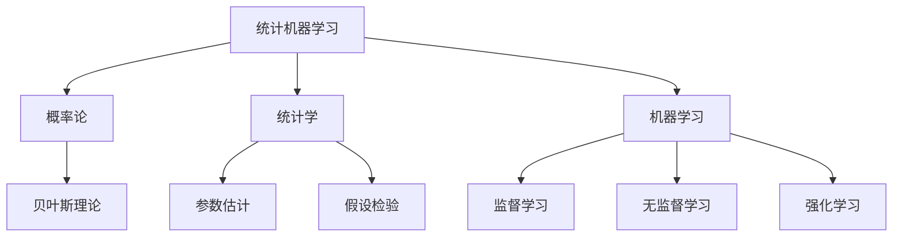

# 统计机器学习 (Statistical Machine Learning) 原理与代码实例讲解

## 1. 背景介绍

### 1.1 机器学习的重要性

在当今数据爆炸的时代,机器学习已经成为各行业不可或缺的核心技术。无论是推荐系统、自然语言处理、计算机视觉还是金融风控等领域,机器学习都发挥着关键作用。随着数据量的不断增长和算力的提升,机器学习正在彻底改变着我们生活和工作的方式。

### 1.2 统计机器学习的地位

统计机器学习是机器学习的一个重要分支,它将统计学原理与机器学习算法相结合,旨在从数据中挖掘有价值的模式和规律。与其他机器学习方法相比,统计机器学习具有更强的理论基础和解释能力,能够更好地处理噪声数据和不确定性问题。

### 1.3 本文内容概览

本文将全面介绍统计机器学习的核心概念、算法原理、数学模型以及实际应用。我们将从基础知识出发,深入探讨统计机器学习的理论基础,并通过实际代码示例帮助读者掌握实现细节。此外,还将分享统计机器学习在各个领域的应用场景,以及未来的发展趋势和挑战。

## 2. 核心概念与联系

统计机器学习融合了统计学和机器学习的理念,涉及多个核心概念,这些概念相互关联、相互影响。让我们先了解这些关键概念及其联系。



### 2.1 概率论

概率论为统计机器学习奠定了数学基础,描述了随机事件发生的可能性。贝叶斯理论是概率论的一个重要分支,在统计机器学习中发挥着关键作用。

### 2.2 统计学

统计学提供了从数据中提取信息和做出推断的方法,包括参数估计、假设检验等技术。这些技术在统计机器学习中被广泛应用。

### 2.3 机器学习

机器学习是人工智能的一个重要分支,旨在从数据中学习模式并进行预测或决策。统计机器学习将统计学原理与机器学习算法相结合,包括监督学习、无监督学习和强化学习等范式。

## 3. 核心算法原理具体操作步骤

统计机器学习涵盖了多种核心算法,这些算法具有不同的原理和适用场景。接下来,我们将详细介绍几种常见的统计机器学习算法的原理和具体操作步骤。

### 3.1 线性回归

线性回归是一种广泛应用的监督学习算法,用于建立自变量和因变量之间的线性关系模型。其核心思想是通过最小化残差平方和来估计模型参数。

算法步骤:

1. 收集数据并进行预处理
2. 将数据分为训练集和测试集
3. 选择合适的特征并进行特征缩放
4. 使用最小二乘法或梯度下降法估计模型参数
5. 在测试集上评估模型性能
6. 根据需要调整超参数并重复上述步骤

### 3.2 逻辑回归

逻辑回归是一种用于分类问题的监督学习算法。它通过建立自变量和因变量之间的对数几率关系,预测实例属于某个类别的概率。

算法步骤:

1. 收集数据并进行预处理
2. 将数据分为训练集和测试集
3. 选择合适的特征并进行特征缩放
4. 使用最大似然估计或梯度下降法估计模型参数
5. 在测试集上评估模型性能
6. 根据需要调整超参数并重复上述步骤

### 3.3 朴素贝叶斯

朴素贝叶斯是一种基于贝叶斯定理的简单而有效的分类算法。它假设特征之间相互独立,从而简化了计算过程。

算法步骤:

1. 收集数据并进行预处理
2. 将数据分为训练集和测试集
3. 从训练数据计算先验概率和条件概率
4. 对于每个测试实例,计算其属于每个类别的后验概率
5. 将实例分配给后验概率最大的类别
6. 在测试集上评估模型性能

### 3.4 K-均值聚类

K-均值聚类是一种常用的无监督学习算法,用于将数据划分为K个簇。它通过迭代优化簇中心和簇分配,最小化簇内样本距离平方和。

算法步骤:

1. 选择K个初始簇中心
2. 将每个样本分配到最近的簇中心所属簇
3. 重新计算每个簇的簇中心
4. 重复步骤2和3,直到簇分配不再发生变化
5. 评估聚类结果的质量

## 4. 数学模型和公式详细讲解举例说明

统计机器学习算法通常基于一些数学模型和公式,理解这些模型和公式对于掌握算法原理至关重要。让我们来详细讲解一些核心的数学模型和公式。

### 4.1 最大似然估计

最大似然估计是一种常用的参数估计方法,它通过选择能够最大化观测数据似然函数值的参数估计值。

设有观测数据 $X = \{x_1, x_2, \dots, x_n\}$,其概率密度函数为 $f(x|\theta)$,其中 $\theta$ 为未知参数。则似然函数为:

$$L(\theta|X) = \prod_{i=1}^{n}f(x_i|\theta)$$

最大似然估计的目标是找到使似然函数取最大值的参数估计值 $\hat{\theta}$:

$$\hat{\theta} = \arg\max_{\theta}L(\theta|X)$$

例如,在正态分布 $N(\mu, \sigma^2)$ 中,我们可以通过最大似然估计得到 $\mu$ 和 $\sigma^2$ 的估计值。

### 4.2 贝叶斯公式

贝叶斯公式是统计机器学习中一个非常重要的公式,它描述了在给定新证据的情况下,如何更新事件发生的概率。

设 $A$ 和 $B$ 是两个事件,则贝叶斯公式为:

$$P(A|B) = \frac{P(B|A)P(A)}{P(B)}$$

其中,
- $P(A)$ 是 $A$ 的先验概率
- $P(B|A)$ 是 $B$ 在 $A$ 发生的条件下的概率(似然函数)
- $P(B)$ 是 $B$ 的边缘概率
- $P(A|B)$ 是 $A$ 在 $B$ 发生的条件下的后验概率

贝叶斯公式在许多统计机器学习算法中都有应用,如朴素贝叶斯分类器、贝叶斯网络等。

### 4.3 信息熵和交叉熵

信息熵和交叉熵是信息论中的两个重要概念,在机器学习中也有广泛应用。

对于一个离散随机变量 $X$,其信息熵定义为:

$$H(X) = -\sum_{x \in \mathcal{X}}P(x)\log P(x)$$

信息熵可以衡量随机变量的不确定性,值越大表示不确定性越高。

交叉熵则用于衡量两个概率分布之间的差异,对于真实分布 $P$ 和模型分布 $Q$,交叉熵定义为:

$$H(P, Q) = -\sum_{x \in \mathcal{X}}P(x)\log Q(x)$$

在机器学习中,我们通常希望模型分布 $Q$ 尽可能接近真实分布 $P$,即最小化交叉熵。交叉熵在逻辑回归、神经网络等算法中被广泛使用作为损失函数。

## 5. 项目实践:代码实例和详细解释说明

理论知识固然重要,但实践操作同样不可或缺。接下来,我们将通过一些代码示例,帮助读者更好地理解统计机器学习算法的实现细节。

### 5.1 线性回归实例

以下是使用Python和scikit-learn库实现线性回归的示例代码:

```python
from sklearn.linear_model import LinearRegression
from sklearn.model_selection import train_test_split
from sklearn.metrics import mean_squared_error

# 加载数据
X, y = load_data()

# 拆分训练集和测试集
X_train, X_test, y_train, y_test = train_test_split(X, y, test_size=0.2, random_state=42)

# 创建线性回归模型
model = LinearRegression()

# 训练模型
model.fit(X_train, y_train)

# 预测测试集
y_pred = model.predict(X_test)

# 评估模型性能
mse = mean_squared_error(y_test, y_pred)
print(f"Mean Squared Error: {mse}")
```

在这个示例中,我们首先加载数据,然后将数据拆分为训练集和测试集。接下来,我们创建一个线性回归模型,并使用训练数据拟合模型。最后,我们在测试集上评估模型的性能,使用均方误差(MSE)作为评估指标。

### 5.2 逻辑回归实例

下面是使用Python和scikit-learn库实现逻辑回归的示例代码:

```python
from sklearn.linear_model import LogisticRegression
from sklearn.model_selection import train_test_split
from sklearn.metrics import accuracy_score

# 加载数据
X, y = load_data()

# 拆分训练集和测试集
X_train, X_test, y_train, y_test = train_test_split(X, y, test_size=0.2, random_state=42)

# 创建逻辑回归模型
model = LogisticRegression()

# 训练模型
model.fit(X_train, y_train)

# 预测测试集
y_pred = model.predict(X_test)

# 评估模型性能
accuracy = accuracy_score(y_test, y_pred)
print(f"Accuracy: {accuracy}")
```

这个示例与线性回归类似,但是我们使用了逻辑回归模型,并使用准确率(accuracy)作为评估指标。在训练过程中,逻辑回归模型会学习特征与类别之间的对数几率关系。

### 5.3 朴素贝叶斯实例

以下是使用Python和scikit-learn库实现朴素贝叶斯分类器的示例代码:

```python
from sklearn.naive_bayes import GaussianNB
from sklearn.model_selection import train_test_split
from sklearn.metrics import accuracy_score

# 加载数据
X, y = load_data()

# 拆分训练集和测试集
X_train, X_test, y_train, y_test = train_test_split(X, y, test_size=0.2, random_state=42)

# 创建朴素贝叶斯分类器
model = GaussianNB()

# 训练模型
model.fit(X_train, y_train)

# 预测测试集
y_pred = model.predict(X_test)

# 评估模型性能
accuracy = accuracy_score(y_test, y_pred)
print(f"Accuracy: {accuracy}")
```

在这个示例中,我们使用了scikit-learn库中的GaussianNB类,它实现了高斯朴素贝叶斯分类器。我们首先加载数据并拆分为训练集和测试集,然后创建一个朴素贝叶斯分类器模型,使用训练数据拟合模型。最后,我们在测试集上评估模型的性能,使用准确率作为评估指标。

### 5.4 K-均值聚类实例

下面是使用Python和scikit-learn库实现K-均值聚类的示例代码:

```python
from sklearn.cluster import KMeans
from sklearn.datasets import make_blobs

# 生成示例数据
X, y = make_blobs(n_samples=1000, centers=3, n_features=2, random_state=42)

# 创建K-均值聚类模型
kmeans = KMeans(n_clusters=3, random_state=42)

# 训练模型
kmeans.fit(X)

# 获取聚类标签
labels = kmeans.labels_

# 获取聚类中心
centers = kmeans.cluster_centers_

# 可视化聚类结果
# ...
```

在这个示例中,我们首先使用scikit-learn库中的make_blobs函数生成一个