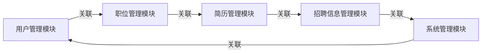

## 1.背景介绍

在当今社会，互联网已经深入到我们生活的方方面面，包括人才招聘。随着技术的发展，人才招聘已经从传统的线下招聘会、报纸广告等方式转移到了线上。网上人才招聘系统，既为企业提供了更广泛的求职者资源，也为求职者提供了更多的就业机会，同时也大大提高了招聘效率。

## 2.核心概念与联系

网上人才招聘系统主要包括以下几个核心模块：用户管理模块、职位管理模块、简历管理模块、招聘信息管理模块以及系统管理模块。这些模块之间有着紧密的联系，共同构成了一个完整的招聘系统。



## 3.核心算法原理具体操作步骤

在网上人才招聘系统中，我们主要使用到了以下几种核心算法：

1. 推荐算法：根据求职者的简历信息和职位的要求，推荐最匹配的职位给求职者。
2. 搜索算法：求职者可以通过关键词搜索来找到自己感兴趣的职位。
3. 匹配算法：通过求职者的简历和职位的要求，计算出匹配度，以此作为推荐的依据。

## 4.数学模型和公式详细讲解举例说明

在推荐算法中，我们使用了余弦相似度来计算求职者的简历和职位的匹配度。余弦相似度的计算公式如下：

$$
similarity = cos(\theta) = \frac{A \cdot B}{||A||_2 \times ||B||_2} = \frac{\sum_{i=1}^{n} A_i \times B_i}{\sqrt{\sum_{i=1}^{n} A_i^2} \times \sqrt{\sum_{i=1}^{n} B_i^2}}
$$

其中，$A$ 和 $B$ 分别代表求职者的简历和职位的要求，$n$ 是特征的数量。

## 5.项目实践：代码实例和详细解释说明

下面我们来看一下如何使用 Python 来实现一个简单的推荐算法。

```python
from sklearn.metrics.pairwise import cosine_similarity

# 求职者的简历
resume = [1, 2, 3, 4, 5]

# 职位的要求
job_requirements = [2, 3, 4, 5, 6]

# 计算余弦相似度
similarity = cosine_similarity([resume], [job_requirements])

print(similarity)
```

## 6.实际应用场景

网上人才招聘系统在各大企业的招聘过程中都有着广泛的应用，例如 LinkedIn、智联招聘、拉勾网等。

## 7.工具和资源推荐

在开发网上人才招聘系统时，我们通常会使用以下几种工具和资源：

1. 开发语言：Python、Java、JavaScript 等。
2. 开发框架：Django、Spring、Vue.js 等。
3. 数据库：MySQL、PostgreSQL、MongoDB 等。

## 8.总结：未来发展趋势与挑战

随着 AI 技术的发展，未来的人才招聘系统将会更加智能化，能够更精准地匹配求职者和职位。但同时，也面临着数据安全、隐私保护等挑战。

## 9.附录：常见问题与解答

1. 问：如何提高推荐算法的准确性？
答：可以通过增加数据量、优化算法、引入更多的特征等方式来提高推荐算法的准确性。

2. 问：如何保护用户的隐私？
答：可以通过加密技术、匿名化处理等方式来保护用户的隐私。

作者：禅与计算机程序设计艺术 / Zen and the Art of Computer Programming