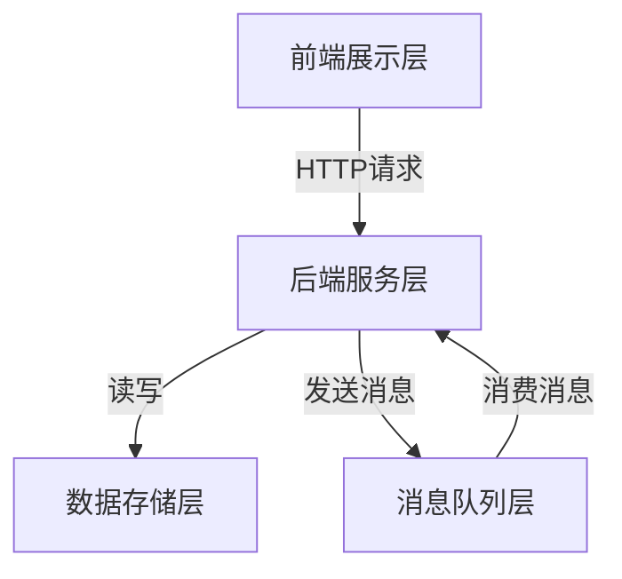

# 网上售房管理系统详细设计与具体代码实现

## 1. 背景介绍

### 1.1 房地产行业的数字化转型

随着互联网技术的不断发展,房地产行业正在经历数字化转型。传统的房地产交易模式面临着诸多挑战,例如信息不对称、效率低下以及缺乏透明度等问题。因此,开发一个高效、安全、透明的网上售房管理系统,不仅可以优化房地产交易流程,还能为买卖双方提供更好的用户体验。

### 1.2 网上售房管理系统的重要性

网上售房管理系统是房地产行业数字化转型的关键一环。它可以实现房源信息的集中管理、在线房屋展示、智能匹配推荐、电子签约等功能,从而提高交易效率,降低运营成本,并增强用户体验。同时,该系统还能够收集和分析大量的交易数据,为房地产决策提供有力支持。

## 2. 核心概念与联系

### 2.1 系统架构概览

网上售房管理系统通常采用分布式架构,包括前端展示层、后端服务层、数据存储层和消息队列层等模块。前端展示层负责与用户交互,提供房源浏览、搜索、预约看房等功能。后端服务层处理业务逻辑,如房源管理、订单处理、支付等。数据存储层存储房源信息、用户信息和交易记录等数据。消息队列层用于异步通信和解耦各个模块。



### 2.2 核心业务流程

网上售房管理系统的核心业务流程包括:

1. 房源发布和管理
2. 房源搜索和推荐
3. 在线预约看房
4. 电子签约和支付
5. 订单和交易管理

其中,房源发布和管理是系统的基础,确保房源信息的准确性和完整性。房源搜索和推荐则为用户提供个性化的房屋匹配服务。在线预约看房和电子签约简化了交易流程,提高了效率。订单和交易管理模块则负责跟踪和管理整个交易过程。

## 3. 核心算法原理具体操作步骤

### 3.1 房源搜索算法

房源搜索是网上售房管理系统的核心功能之一。常见的搜索算法包括:

1. **倒排索引算法**:将房源信息建立倒排索引,加快搜索速度。
2. **向量空间模型**:将房源信息和搜索条件表示为向量,计算相似度进行匹配。
3. **BM25算法**:基于词频-逆文档频率,结合其他因素计算相关性得分。

以倒排索引算法为例,其具体操作步骤如下:

1. **构建正排索引**:遍历所有房源文档,为每个文档中出现的词构建正排索引。
2. **构建倒排索引**:遍历正排索引,为每个词构建倒排索引,记录该词出现的文档ID列表。
3. **查询处理**:对搜索查询进行分词,查找每个词对应的倒排索引,获取文档ID列表。
4. **相关性计算**:基于文档频率、词频等因素计算文档相关性得分,按得分排序输出结果。

### 3.2 房源推荐算法

房源推荐算法旨在为用户提供个性化的房屋推荐,常见算法包括:

1. **协同过滤算法**:基于用户的历史行为,找到兴趣相似的用户群体,推荐该群体喜欢的房源。
2. **内容过滤算法**:基于房源的文本描述和用户的兴趣标签,计算相似度进行推荐。
3. **混合算法**:结合协同过滤和内容过滤,综合考虑用户行为和房源内容进行推荐。

以基于用户的协同过滤算法为例,其具体操作步骤如下:

1. **构建用户行为矩阵**:统计每个用户对各个房源的行为(浏览、收藏等),构建用户-房源矩阵。
2. **计算用户相似度**:基于用户行为矩阵,计算任意两个用户之间的相似度(如余弦相似度)。
3. **找到相似用户集合**:对目标用户,找到与其最相似的 K 个用户作为相似用户集合。
4. **推荐Top-N房源**:在相似用户集合中,统计每个房源的总得分,按得分排序推荐Top-N个房源。

## 4. 数学模型和公式详细讲解举例说明

### 4.1 余弦相似度

余弦相似度是一种常用的相似度计算方法,广泛应用于协同过滤、文本相似度计算等场景。它基于向量空间模型,计算两个向量之间的夹角余弦值,公式如下:

$$\text{sim}(A, B) = \cos(\theta) = \frac{A \cdot B}{\|A\|\|B\|} = \frac{\sum_{i=1}^{n}A_iB_i}{\sqrt{\sum_{i=1}^{n}A_i^2}\sqrt{\sum_{i=1}^{n}B_i^2}}$$

其中 $A$ 和 $B$ 分别表示两个 $n$ 维向量, $A_i$ 和 $B_i$ 表示第 $i$ 个维度上的值。

例如,在用户协同过滤算法中,我们可以将每个用户的行为表示为一个向量,其中每个维度对应一个房源,值表示用户对该房源的行为权重(如浏览次数)。然后,我们可以计算任意两个用户向量之间的余弦相似度,作为该两个用户的相似程度。

### 4.2 BM25 算法

BM25 算法是一种常用的文本相关性算法,广泛应用于搜索引擎、文本匹配等场景。它综合考虑了词频(TF)、逆文档频率(IDF)以及文档长度等因素,计算查询和文档之间的相关性得分,公式如下:

$$\text{score}(D, Q) = \sum_{q \in Q} \text{IDF}(q) \cdot \frac{f(q, D) \cdot (k_1 + 1)}{f(q, D) + k_1 \cdot (1 - b + b \cdot \frac{|D|}{\text{avgdl}})}$$

其中:
- $D$ 表示文档, $Q$ 表示查询
- $f(q, D)$ 表示词 $q$ 在文档 $D$ 中出现的次数
- $\text{IDF}(q) = \log \frac{N - n(q) + 0.5}{n(q) + 0.5}$ 表示词 $q$ 的逆文档频率, $N$ 为总文档数, $n(q)$ 为包含词 $q$ 的文档数
- $|D|$ 表示文档 $D$ 的长度, $\text{avgdl}$ 表示平均文档长度
- $k_1$ 和 $b$ 为调节参数,用于控制词频和文档长度的影响程度

在网上售房管理系统中,我们可以将房源信息视为文档,将用户的搜索条件视为查询,利用 BM25 算法计算每个房源与查询的相关性得分,从而实现高效准确的房源搜索功能。

## 5. 项目实践:代码实例和详细解释说明

### 5.1 房源搜索模块

以 Python 语言为例,我们可以使用 Elasticsearch 作为搜索引擎,实现高效的房源搜索功能。下面是一个简单的示例代码:

```python
from elasticsearch import Elasticsearch

# 连接 Elasticsearch 服务
es = Elasticsearch()

# 定义映射
mapping = {
    "properties": {
        "title": {"type": "text"},
        "description": {"type": "text"},
        "price": {"type": "double"},
        "location": {"type": "geo_point"},
        # 其他字段...
    }
}

# 创建索引
es.indices.create(index="houses", body={"mappings": mapping})

# 插入数据
doc = {
    "title": "精装三室一厅,采光好",
    "description": "位于市中心,交通便利,配套设施齐全",
    "price": 300000.0,
    "location": {"lat": 39.9, "lon": 116.3},
    # 其他字段...
}
es.index(index="houses", body=doc)

# 搜索
query = {
    "query": {
        "multi_match": {
            "query": "三室 市中心",
            "fields": ["title", "description"]
        }
    }
}
results = es.search(index="houses", body=query)

# 输出结果
for hit in results["hits"]["hits"]:
    print(hit["_source"]["title"])
```

在上述示例中,我们首先定义了房源数据的映射,包括标题、描述、价格、地理位置等字段。然后,我们创建了一个名为 "houses" 的索引,并插入了一条房源数据。

接下来,我们构建了一个搜索查询,使用 `multi_match` 查询在标题和描述字段中搜索 "三室" 和 "市中心" 这两个关键词。Elasticsearch 会根据 BM25 算法计算每个文档与查询的相关性得分,并返回得分最高的结果。

最后,我们遍历搜索结果,输出每个匹配房源的标题。

### 5.2 房源推荐模块

下面是一个基于 Python 和 Surprise 库实现的简单用户协同过滤推荐示例:

```python
from surprise import Reader, Dataset, SVD

# 加载数据
reader = Reader(rating_scale=(1, 5))
data = Dataset.load_from_file("ratings.csv", reader=reader)

# 拆分数据集
trainset, testset = data.split(n_folds=3)

# 训练模型
algo = SVD()
algo.fit(trainset)

# 预测用户对房源的评分
uid = 123  # 用户 ID
iid = 456  # 房源 ID
prediction = algo.predict(uid, iid)
print(f"预测用户 {uid} 对房源 {iid} 的评分为 {prediction.est}")

# 为用户推荐房源
uid = 123
recommendations = algo.get_top_n(uid, n=10)
for rec in recommendations:
    iid, rating, details = rec
    print(f"推荐房源 {iid}, 预测评分 {rating}")
```

在这个示例中,我们首先从 "ratings.csv" 文件中加载了用户对房源的评分数据。然后,我们使用 Surprise 库中的 SVD 算法训练了一个协同过滤模型。

接下来,我们可以使用该模型预测特定用户对特定房源的评分。此外,我们还可以为特定用户推荐最匹配的 Top-N 个房源。

需要注意的是,在实际应用中,我们还需要考虑数据预处理、模型调优、在线学习等问题,以提高推荐系统的准确性和实时性。

## 6. 实际应用场景

网上售房管理系统在实际应用中具有广阔的前景,可以为房地产行业带来诸多优势:

1. **提高交易效率**:通过在线房源展示、智能匹配推荐和电子签约等功能,大大缩短了房地产交易周期,提高了效率。

2. **降低运营成本**:系统自动化处理了大量繁琐的工作,如房源信息管理、客户跟踪等,从而降低了人力和运营成本。

3. **优化用户体验**:用户可以在线便捷地浏览房源信息、预约看房、完成交易,获得更好的体验。

4. **数据驱动决策**:系统收集和分析了大量的交易数据,为房地产企业提供了数据支持,有助于做出更明智的决策。

5. **透明公开交易**:所有交易信息都记录在系统中,提高了交易的透明度和公开度,有利于监管和维护市场秩序。

6. **促进行业创新**:系统为房地产行业注入了新的技术和模式,有助于推动行业的创新和发展。

## 7. 工具和资源推荐

在开发网上售房管理系统时,可以使用以下工具和资源:

1. **开发框架**:Python (Django/Flask)、Java (Spring)、Node.js (Express) 等
2. **数据库**:MySQL、PostgreSQL、MongoDB 等
3. **搜索引擎**:Elasticsearch、Solr 等
4. **消息队列**:RabbitMQ、Kafka 等
5. **缓存**:Redis、