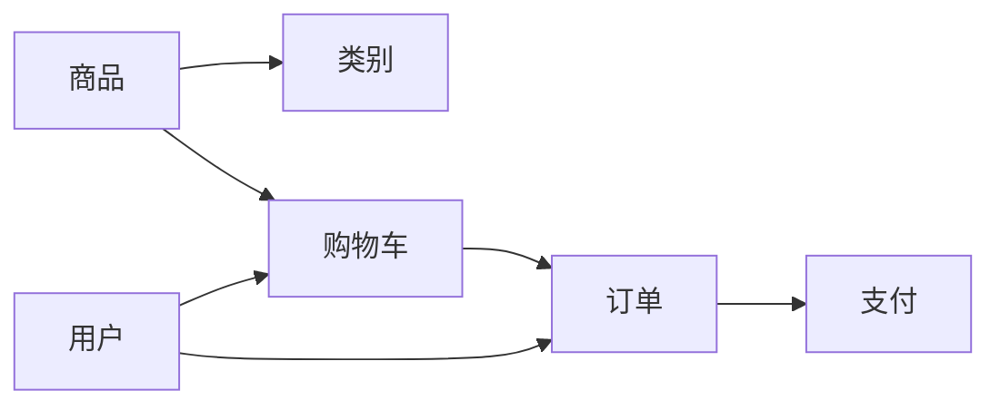
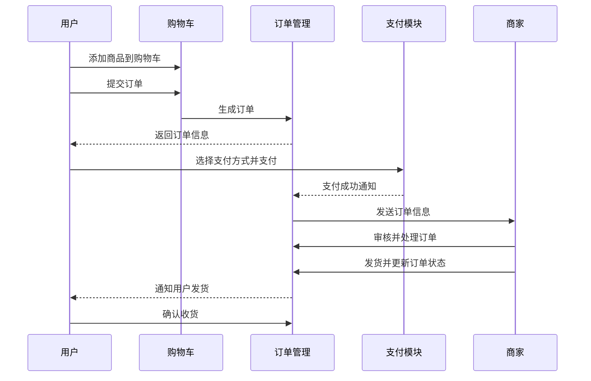

# 网上商店生成系统详细设计与具体代码实现

## 1. 背景介绍

### 1.1 电子商务的发展现状

在互联网时代,电子商务已经成为商业活动的重要组成部分。越来越多的企业和个人选择在网上开设商店,进行商品的销售和推广。然而,对于许多中小企业和个人卖家来说,开发一个功能完善、性能优异的网上商店系统并非易事。这需要较高的技术门槛和开发成本。

### 1.2 网上商店生成系统的意义

为了降低网上商店的开发难度,提高开发效率,网上商店生成系统应运而生。该系统旨在提供一套完整的解决方案,帮助用户快速搭建个性化的网上商店。通过可视化的操作界面和灵活的配置选项,用户无需编写复杂的代码,即可实现商品管理、订单处理、在线支付等核心功能。

### 1.3 本文的主要内容

本文将详细阐述网上商店生成系统的设计思路和关键技术。我们将从需求分析入手,明确系统的功能范围和性能要求。然后,我们将进行系统架构设计,选择合适的技术栈和开发框架。在此基础上,我们将重点讲解系统的核心模块,包括商品管理、购物车、订单处理、在线支付等。同时,我们还将给出具体的代码实现示例,帮助读者深入理解系统的工作原理。最后,我们将总结网上商店生成系统的应用前景和未来发展方向。

## 2. 核心概念与联系

### 2.1 网上商店的核心概念

在设计网上商店生成系统之前,我们需要了解网上商店的一些核心概念:

- 商品(Product):网上商店销售的实物或服务,包括名称、价格、图片、描述等属性。
- 类别(Category):对商品进行分类,方便用户浏览和检索。
- 购物车(Shopping Cart):用户在浏览商品时,可以将感兴趣的商品添加到购物车,并在结算时一并购买。
- 订单(Order):用户提交购物车中的商品形成订单,包含商品信息、收货地址、支付方式等。
- 支付(Payment):用户选择在线支付方式完成订单支付,常见的支付方式有信用卡、第三方支付等。

### 2.2 网上商店生成系统的关键模块

根据网上商店的核心概念,我们可以将网上商店生成系统划分为以下关键模块:

- 商品管理模块:负责商品的添加、编辑、删除等操作,以及商品分类的管理。
- 购物车模块:实现将商品添加到购物车、修改购物车中商品数量、删除购物车商品等功能。
- 订单管理模块:处理用户提交的订单,包括生成订单、修改订单状态、查看订单详情等。
- 支付模块:集成常见的在线支付方式,如信用卡支付、PayPal支付等,实现订单的安全支付。
- 用户管理模块:负责用户注册、登录、个人信息管理等功能,为其他模块提供用户认证和授权服务。

下图展示了网上商店生成系统的核心概念与模块之间的关系:

## 3. 核心算法原理具体操作步骤

### 3.1 商品推荐算法

在网上商店中,为用户推荐感兴趣的商品可以提高用户体验和销售转化率。常见的商品推荐算法有:

- 基于用户的协同过滤(User-based Collaborative Filtering):根据用户的历史行为(如购买、浏览、评分等)计算用户之间的相似度,然后为用户推荐相似用户喜欢的商品。
- 基于物品的协同过滤(Item-based Collaborative Filtering):根据商品之间的相似度(如共同购买、共同浏览等)计算商品之间的关联度,然后为用户推荐与其历史购买商品相似的商品。
- 基于内容的推荐(Content-based Recommendation):根据商品的属性(如名称、描述、类别等)计算商品之间的相似度,然后为用户推荐与其历史感兴趣商品相似的商品。

以基于用户的协同过滤算法为例,具体操作步骤如下:

1. 收集用户的历史行为数据,如购买记录、浏览记录、评分记录等。
2. 计算用户之间的相似度。常见的相似度计算方法有欧几里得距离、皮尔逊相关系数等。例如,使用皮尔逊相关系数计算用户 $u$ 和用户 $v$ 的相似度:

$$
sim(u,v) = \frac{\sum_{i \in I_{uv}}(r_{ui} - \bar{r}_u)(r_{vi} - \bar{r}_v)}{\sqrt{\sum_{i \in I_{uv}}(r_{ui} - \bar{r}_u)^2}\sqrt{\sum_{i \in I_{uv}}(r_{vi} - \bar{r}_v)^2}}
$$

其中,$I_{uv}$ 表示用户 $u$ 和 $v$ 共同评分的商品集合,$r_{ui}$ 和 $r_{vi}$ 分别表示用户 $u$ 和 $v$ 对商品 $i$ 的评分,$\bar{r}_u$ 和 $\bar{r}_v$ 分别表示用户 $u$ 和 $v$ 的平均评分。

3. 根据用户相似度,为目标用户找到 $k$ 个最相似的用户,称为 $k$ 近邻。
4. 对于目标用户未购买或未评分的商品,计算其预测评分。预测评分可以通过 $k$ 近邻用户对该商品的评分加权平均得到:

$$
\hat{r}_{ui} = \bar{r}_u + \frac{\sum_{v \in N_i(u)}sim(u,v)(r_{vi} - \bar{r}_v)}{\sum_{v \in N_i(u)}sim(u,v)}
$$

其中,$\hat{r}_{ui}$ 表示用户 $u$ 对商品 $i$ 的预测评分,$N_i(u)$ 表示用户 $u$ 的 $k$ 近邻中对商品 $i$ 有评分的用户集合。

5. 将预测评分较高的商品推荐给目标用户。

### 3.2 订单处理流程

订单处理是网上商店的核心业务流程,涉及到多个模块的协作。以下是订单处理的具体操作步骤:

1. 用户将商品添加到购物车。
2. 用户在购物车中确认要购买的商品,并提交订单。
3. 系统生成订单,记录订单信息,包括订单号、用户信息、商品信息、收货地址、支付方式等。
4. 用户选择支付方式,进行在线支付。
5. 系统接收到支付成功的通知后,将订单状态更新为"已支付"。
6. 商家收到订单后,对订单进行审核和处理。
7. 商家发货,并将订单状态更新为"已发货"。
8. 用户收到商品后,确认收货,订单完成。

下图展示了订单处理流程的时序图:

## 4. 数学模型和公式详细讲解举例说明

在网上商店生成系统中,我们可以使用数学模型和公式来解决一些问题,例如商品评分预测、用户购买行为预测等。下面我们以商品评分预测为例,详细讲解相关的数学模型和公式。

### 4.1 矩阵分解模型

矩阵分解(Matrix Factorization)是一种常用的评分预测模型。它将用户-商品评分矩阵分解为两个低维矩阵的乘积,一个矩阵表示用户的隐因子,另一个矩阵表示商品的隐因子。通过这种方式,我们可以发现用户和商品之间的潜在关系,从而预测用户对未评分商品的评分。

假设我们有 $m$ 个用户和 $n$ 个商品,用户-商品评分矩阵为 $R \in \mathbb{R}^{m \times n}$。我们希望将 $R$ 分解为两个低维矩阵 $U \in \mathbb{R}^{m \times k}$ 和 $V \in \mathbb{R}^{n \times k}$,其中 $k$ 表示隐因子的维度。矩阵分解模型可以表示为:

$$
R \approx U V^T
$$

其中,$U$ 的第 $i$ 行表示用户 $i$ 的隐因子向量,$V$ 的第 $j$ 行表示商品 $j$ 的隐因子向量。

### 4.2 损失函数和优化目标

为了学习矩阵 $U$ 和 $V$,我们需要定义一个损失函数,用于衡量预测评分与实际评分之间的差异。常用的损失函数是均方误差(Mean Squared Error,MSE):

$$
\mathcal{L}(U,V) = \frac{1}{|R|}\sum_{(i,j) \in R}(r_{ij} - u_i^T v_j)^2 + \lambda(||U||_F^2 + ||V||_F^2)
$$

其中,$r_{ij}$ 表示用户 $i$ 对商品 $j$ 的实际评分,$u_i$ 和 $v_j$ 分别表示用户 $i$ 和商品 $j$ 的隐因子向量。$||U||_F^2$ 和 $||V||_F^2$ 是正则化项,用于防止过拟合,$\lambda$ 是正则化系数。

我们的优化目标是最小化损失函数:

$$
\min_{U,V} \mathcal{L}(U,V)
$$

### 4.3 优化算法

为了求解上述优化问题,我们可以使用梯度下降法。梯度下降法通过不断迭代,沿着损失函数的负梯度方向更新参数,直到达到局部最小值。

对于用户 $i$ 的隐因子向量 $u_i$,其梯度为:

$$
\frac{\partial \mathcal{L}}{\partial u_i} = -2\sum_{j \in R_i}(r_{ij} - u_i^T v_j)v_j + 2\lambda u_i
$$

对于商品 $j$ 的隐因子向量 $v_j$,其梯度为:

$$
\frac{\partial \mathcal{L}}{\partial v_j} = -2\sum_{i \in R_j}(r_{ij} - u_i^T v_j)u_i + 2\lambda v_j
$$

其中,$R_i$ 表示用户 $i$ 评分过的商品集合,$R_j$ 表示对商品 $j$ 评分过的用户集合。

根据梯度下降法,我们可以按照以下公式更新 $u_i$ 和 $v_j$:

$$
u_i \leftarrow u_i - \eta \frac{\partial \mathcal{L}}{\partial u_i}
$$

$$
v_j \leftarrow v_j - \eta \frac{\partial \mathcal{L}}{\partial v_j}
$$

其中,$\eta$ 表示学习率,控制每次更新的步长。

重复上述更新过程,直到损失函数收敛或达到预设的迭代次数。最终,我们可以使用学习到的 $U$ 和 $V$ 对未知的用户-商品评分进行预测:

$$
\hat{r}_{ij} = u_i^T v_j
$$

其中,$\hat{r}_{ij}$ 表示用户 $i$ 对商品 $j$ 的预测评分。

## 5. 项目实践:代码实例和详细解释说明

下面我们通过一个简单的代码实例,演示如何使用Python实现网上商店的核心功能。我们将使用Flask Web框架和SQLite数据库。

### 5.1 项目结