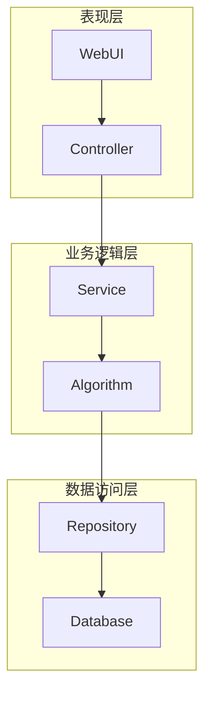

# 网上物流管理系统详细设计与具体代码实现

## 1. 背景介绍

随着电子商务的蓬勃发展,物流配送行业也随之迅猛增长。为了满足日益增长的订单量和提高运营效率,构建一个高效、可靠的网上物流管理系统势在必行。本文将详细介绍网上物流管理系统的设计和实现,包括系统架构、核心算法、数据模型等关键技术,以及具体的代码实现细节。

### 1.1 物流管理的挑战

传统的物流管理方式已经无法满足现代电商的需求,主要面临以下几个挑战:

- **订单量大**:每天需要处理大量订单,高效处理是关键
- **时效性高**:用户对送货时间越来越敏感,需要精准控制
- **配送半径大**:覆盖范围广,需要优化配送路线
- **多方协作**:包括商家、物流公司、快递员等多方需求

### 1.2 系统目标

为了应对上述挑战,我们的网上物流管理系统将实现以下目标:

- 高效处理大量订单
- 优化配送路径,缩短送货时间
- 实时跟踪订单状态
- 多方参与,协同作业
- 可扩展的系统架构

## 2. 核心概念与联系

在深入探讨系统细节前,我们先介绍几个核心概念及其关联。

### 2.1 订单(Order)

订单是整个物流系统的核心,包含了商品信息、收货人地址等关键数据。一个订单对应一次配送任务。

### 2.2 路径规划(Route Planning)

根据订单地址,合理安排快递员的取货和派送路线,是物流系统的核心算法。路径规划直接影响配送效率和成本。

### 2.3 车辆调度(Vehicle Dispatch)

对应一个配送区域内的所有订单,需要根据路径规划合理调度配送车辆,使其负载均衡,避免重复路线。

### 2.4 配送跟踪(Delivery Tracking)

用户可实时查看订单的配送状态和位置,物流公司也可以基于此监控快递员的工作效率。

### 2.5 关系模型

上述几个核心概念的关系如下:


## 3. 核心算法原理具体操作步骤

### 3.1 路径规划算法

路径规划是物流系统的核心算法,其目标是找到一条最优路径,使得总的行驶距离(或时间)最短。这是一个典型的"旅行推销员问题(TSP)"。

我们采用的是蚁群算法(Ant Colony Optimization)求解。蚁群算法是一种基于群体智能的优化算法,模拟蚂蚁觅食行为,通过信息素的正反馈机制,最终收敛到最优解。

算法步骤:

1. 初始化:随机生成一定数量的蚂蚁(解),并为每条路径设置初始信息素浓度
2. 路径选择:每只蚂蚁根据信息素浓度计算出每条路径的选择概率,并按概率选择下一个城市
3. 信息素更新:所有蚂蚁走完一周后,计算每条路径的长度,并根据长度更新路径上的信息素浓度
4. 迭代直至收敛:重复步骤2、3,直到算法收敛为最优解

该算法的优点是可以快速收敛到全局最优解或次优解,适用于规模较大的路径规划问题。

### 3.2 车辆调度算法

车辆调度的目标是使所有订单被高效配送,同时尽量减少车辆数量。我们采用的是基于局部邻域搜索的启发式算法。

算法步骤:

1. 初始解:根据订单地址生成初始调度方案
2. 邻域搜索:对当前解进行局部微调,生成邻域解
3. 接受判断:如果邻域解比当前解更优,则接受;否则以一定概率接受(模拟退火)
4. 迭代直至收敛:重复步骤2、3,直到满足终止条件

该算法的优点是可以快速产生较优解,同时避免陷入局部最优。

## 4. 数学模型和公式详细讲解举例说明

### 4.1 蚁群算法数学模型

设有n个城市,蚂蚁k位于城市i,将前往城市j的概率为:

$$P_{ij}^k(t) = \frac{[\tau_{ij}(t)]^\alpha[\eta_{ij}]^\beta}{\sum\limits_{l\in J_i^k}[\tau_{il}(t)]^\alpha[\eta_{il}]^\beta}$$

其中:
- $\tau_{ij}(t)$是i,j之间路径的信息素浓度
- $\eta_{ij} = 1/d_{ij}$是该路径的启发因子,反映路径长度
- $\alpha,\beta$分别是信息素和启发因子的相对重要性
- $J_i^k$是蚂蚁k在城市i能选择的下一个城市集合

信息素更新公式:

$$\tau_{ij}(t+1) = (1-\rho)\tau_{ij}(t) + \sum\limits_{k=1}^m\Delta\tau_{ij}^k(t)$$

其中:
- $\rho$是信息素挥发因子
- $\Delta\tau_{ij}^k(t)$是蚂蚁k在本次迭代中对路径(i,j)留下的信息素量

$$\Delta\tau_{ij}^k(t) = \begin{cases}\frac{Q}{L_k} & \text{if }(i,j)\in T_k\\ 0 & \text{otherwise}\end{cases}$$

- $Q$是常数,表示一个蚂蚁周游一次后在路径上留下的信息素总量
- $L_k$是蚂蚁k的路径长度
- $T_k$是蚂蚁k的路径

通过上述模型,蚂蚁将逐渐集中在较短路径上,最终收敛到最优解。

### 4.2 车辆调度数学模型

设有n个订单,m辆车,我们的目标是最小化总行驶距离:

$$\min\sum\limits_{k=1}^m\sum\limits_{(i,j)\in R_k}d_{ij}$$

其中$R_k$是第k辆车的路径,$(i,j)$表示路径上相邻两个点。

此外还需满足以下约束条件:

- 每个订单必须被且只被一辆车服务
- 每辆车的载重量不能超过最大载重量
- 每辆车的行程时间不能超过最大服务时间

该问题是一个NP难的组合优化问题,我们采用局部邻域搜索的启发式算法求解。

## 5. 项目实践:代码实例和详细解释说明

### 5.1 系统架构

我们采用经典的三层架构,分为表现层、业务逻辑层和数据访问层。



- 表现层:提供Web UI界面,接收用户请求并调用Controller
- 业务逻辑层:Controller调用Service完成业务逻辑,Service内部调用算法模块
- 数据访问层:Repository访问数据库,为算法模块提供数据支持

### 5.2 核心代码

#### 5.2.1 蚁群算法实现

```python
import math
import random

# 参数设置
ALPHA = 1    # 信息素重要程度
BETA = 5     # 启发因子重要程度 
RHO = 0.5    # 信息素挥发因子
Q = 100      # 总信息素量
MAX_ITER = 500 # 最大迭代次数

# 距离矩阵
distances = [[0,10,15,20],
             [10,0,25,30],  
             [15,25,0,35],
             [20,30,35,0]]

# 计算启发因子
eta = [[0 if i==j else 1/distances[i][j] for j in range(4)] for i in range(4)]

# 信息素矩阵,初始化为相同值
pheromone = [[1/4 for j in range(4)] for i in range(4)]  

def choose_next(curr_node, unvisited):
    """选择下一个节点""" 
    probs = [((pheromone[curr_node][j]**ALPHA) * (eta[curr_node][j]**BETA)) for j in unvisited]
    total = sum(probs)
    probs = [p/total for p in probs]
    # 按概率随机选择
    target = random.choices(unvisited, weights=probs)[0]
    return target

def update_pheromone(tour, dist):
    """更新信息素"""
    for i in range(4):
        for j in range(4):
            pheromone[i][j] *= (1-RHO)
    for i in range(3):
        pheromone[tour[i]][tour[i+1]] += Q/dist
    pheromone[tour[3]][tour[0]] += Q/dist

# 主算法
best_tour = None
best_dist = math.inf
for iter in range(MAX_ITER):
    # 每只蚂蚁的路径
    tours = []
    for k in range(4):
        tour = []
        curr_node = random.randint(0,3)
        unvisited = set([j for j in range(4) if j!=curr_node])
        tour.append(curr_node)
        for i in range(3):
            next_node = choose_next(curr_node, unvisited)
            tour.append(next_node)
            unvisited.remove(next_node)
            curr_node = next_node
        tours.append(tour)
        
    # 找到最短路径
    for tour in tours:
        dist = sum([distances[tour[i]][tour[i+1]] for i in range(3)]) \
             + distances[tour[3]][tour[0]]
        if dist < best_dist:
            best_tour = tour
            best_dist = dist
    
    # 更新信息素        
    for tour in tours:
        dist = sum([distances[tour[i]][tour[i+1]] for i in range(3)]) \
             + distances[tour[3]][tour[0]]
        update_pheromone(tour, dist)
        
print('最短路径:', best_tour)
print('最短距离:', best_dist)
```

上述代码实现了蚁群算法求解TSP问题。首先初始化距离矩阵、信息素矩阵等参数,然后进入主循环。每次迭代中,先让每只蚂蚁按概率选择路径构建解;然后更新最优解;最后根据每只蚂蚁的路径长度更新信息素矩阵。经过多次迭代后,算法收敛到最优解。

#### 5.2.2 车辆调度算法实现

```python
import random

# 订单信息
orders = [
    {'id': 1, 'loc': (2,5), 'weight': 3},
    {'id': 2, 'loc': (8,2), 'weight': 5},
    # ...
]

# 车辆信息 
vehicles = [
    {'id': 1, 'cap': 10, 'max_dist': 50},
    {'id': 2, 'cap': 15, 'max_dist': 80},
    # ...  
]

def init_solution():
    """生成初始解"""
    routes = {v['id']: [] for v in vehicles}
    # 随机分配订单
    for o in orders:
        vid = random.choice([v['id'] for v in vehicles])
        routes[vid].append(o)
    return routes

def get_dist(route):
    """计算路径距离"""
    dist = 0
    last = (0,0)
    for o in route:
        dist += ((last[0]-o['loc'][0])**2 + (last[1]-o['loc'][1])**2)**0.5
        last = o['loc']
    return dist
    
def neighborhood(routes):
    """生成邻域解"""
    a,b = random.sample(vehicles, 2)
    if not routes[a['id']] or not routes[b['id']]:
        return routes
    
    i,j = routes[a['id']][0], routes[b['id']][0]
    routes[a['id']].remove(i)
    routes[b['id']].remove(j)
    routes[b['id']].append(i)
    routes[a['id']].append(j)
    return routes

def is_valid(routes):
    """检查解是否合法"""
    for vid, route in routes.items():
        v = next(v for v in vehicles if v['id'] == vid)
        # 检查载重量
        total_weight = sum(o['weight'] for o in route)
        if total_weight > v['cap']:
            return False
        # 检查路径长度
        dist = get_dist(route)
        if dist > v['max_dist']:
            return False
    return True
        
def solve():
    routes = init_solution()
    best = routes.copy()
    temp = 100
    
    while temp > 1:
        candidate = neighborhood(