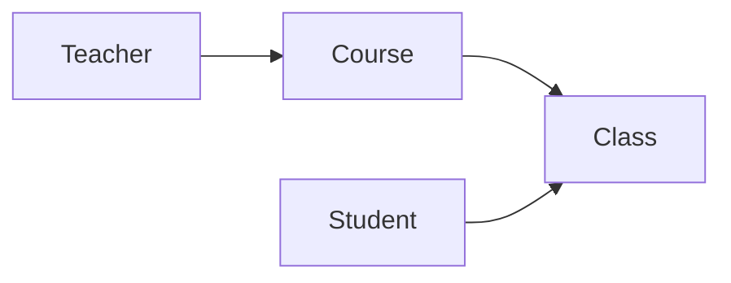

# 网上选排课系统详细设计与具体代码实现

## 1. 背景介绍
在现代化教育体系中,网上选排课系统已成为高校教学管理的重要组成部分。它为学生提供了更加灵活、便捷的选课方式,同时也极大地提高了教务管理的效率。本文将从需求分析、系统设计到代码实现,全面探讨网上选排课系统的开发过程。

### 1.1 选排课系统的必要性
#### 1.1.1 传统选课方式的局限性
#### 1.1.2 信息化时代对教学管理的新要求  
#### 1.1.3 选排课系统带来的优势

### 1.2 系统开发目标
#### 1.2.1 功能目标
#### 1.2.2 性能目标
#### 1.2.3 用户体验目标

## 2. 核心概念与联系
要设计一个完善的选排课系统,首先需要理清其中的核心概念以及它们之间的关系。

### 2.1 核心概念
#### 2.1.1 课程(Course)
课程是选排课系统的基本单元,包含课程号、课程名、学分、授课教师等属性。

#### 2.1.2 教学班(Class) 
教学班是课程在某个学期的具体开设,包含上课时间、地点、容量等信息。一门课程在一个学期内可以开设多个教学班。

#### 2.1.3 学生(Student)
学生作为选课的主体,拥有学号、姓名、专业、年级等属性。学生通过选课获得教学班的学习机会。

#### 2.1.4 教师(Teacher)
教师负责课程的授课,在系统中与课程相关联。教师可以管理自己所授课程的教学班信息。

### 2.2 概念之间的关系


从上图可以看出:
- 课程与教学班之间是一对多的关系,即一门课程可以产生多个教学班
- 学生通过选择教学班来修读课程,学生与教学班之间是多对多的关系
- 教师与课程之间是多对多的关系,一位教师可以教授多门课程,一门课程也可以由多位教师共同教授

## 3. 核心算法原理与操作步骤
选排课系统的核心在于如何根据学生的选课需求,在满足各种约束条件(如课程容量、时间冲突等)的前提下,为每个学生生成一个可行的课表。这个过程可以抽象为一个约束满足问题(CSP)。

### 3.1 将选排课问题建模为CSP
一个CSP由以下三个部分组成:
1. 变量:每个变量表示一个待分配的对象。在选排课问题中,变量是每个学生的选课结果,即 `student_i_schedule`。
2. 域:每个变量的取值范围。在选排课问题中,每个学生的课表可以是所有教学班的组合。
3. 约束:变量取值需要满足的限制条件。在选排课问题中,主要有以下约束:
   - 每个学生选修的课程总学分需要在一定范围内
   - 学生选修的教学班之间不能有时间冲突
   - 每个教学班的选课人数不能超过容量

### 3.2 求解CSP的算法
求解CSP的主要算法有回溯搜索(Backtracking)、局部搜索(Local Search)等。这里我们采用回溯搜索:
1. 将所有变量(学生)按照一定顺序排列,依次为每个变量分配值(即为每个学生选课)。
2. 在为一个变量分配值时,先选择一个可能的值,然后检查是否满足所有约束。
   - 如果满足,则继续为下一个变量分配值;
   - 如果不满足,则回溯,尝试另一个可能的值。
3. 如果所有变量都被成功分配了值,则找到了一个可行解,算法终止。
4. 如果所有可能的值都尝试过了仍无法满足约束,则说明当前状态下无解,需要回溯到上一个变量,改变它的值。

### 3.3 回溯搜索的优化
基本的回溯搜索算法在面对大规模问题时可能会非常耗时。为了提高效率,可以采取以下优化措施:
1. 启发式变量排序:优先为约束最紧的变量分配值,可以更早地发现无解状态,从而减少搜索空间。
2. 前向检查:在为一个变量分配值之前,检查该值是否与已经分配的变量存在冲突,如果存在则直接跳过,避免不必要的递归。
3. 冲突记录与非重复约束:记录搜索过程中遇到的冲突,在之后的搜索中避免重复探索相同的冲突状态。

## 4. 数学模型与公式
在这一节,我们将选排课问题抽象为数学模型,并给出相应的公式。

### 4.1 符号定义
- $S$:学生集合,$S=\{s_1,s_2,...,s_n\}$
- $C$:课程集合,$C=\{c_1,c_2,...,c_m\}$
- $T$:教学班集合,$T=\{t_1,t_2,...,t_k\}$
- $R$:教学班与课程的关系集合,$R\subseteq T\times C$
- $q_j$:教学班$t_j$的容量
- $d_i$:学生$s_i$的总学分下限
- $u_i$:学生$s_i$的总学分上限
- $credit_j$:教学班$t_j$对应课程的学分
- $conflict(t_j,t_k)$:教学班$t_j$和$t_k$是否时间冲突

### 4.2 决策变量
$x_{ij}\in\{0,1\},i=1,2,...,n,j=1,2,...,k$

$x_{ij}=1$表示学生$s_i$选修教学班$t_j$,$x_{ij}=0$表示学生$s_i$没有选修教学班$t_j$。

### 4.3 目标函数
选排课问题可以看作是一个满足问题,因此目标函数为常数1:

$$\max 1$$

### 4.4 约束条件
1. 学分约束:每个学生选修的总学分需要在给定范围内。

$$d_i \leq \sum_{j=1}^{k} x_{ij} \cdot credit_j \leq u_i, \forall i=1,2,...,n$$

2. 容量约束:每个教学班的选课人数不能超过容量。

$$\sum_{i=1}^{n} x_{ij} \leq q_j, \forall j=1,2,...,k$$

3. 时间冲突约束:每个学生选修的教学班之间不能有时间冲突。

$$x_{ij} + x_{il} \leq 1, \forall i=1,2,...,n, \forall j,l \in \{1,2,...,k\} \wedge conflict(t_j,t_l)$$

4. 变量取值约束:决策变量$x_{ij}$为0-1变量。

$$x_{ij} \in \{0,1\}, \forall i=1,2,...,n, \forall j=1,2,...,k$$

## 5. 项目实践:代码实现
在这一节,我们将使用Java语言实现一个简单的选排课系统。为了聚焦核心逻辑,代码中省略了一些细节处理。

### 5.1 核心类设计
#### 5.1.1 `Course` 课程类
```java
public class Course {
    private String id;
    private String name;
    private int credit;
    // 其他属性和方法
}
```

#### 5.1.2 `TeachingClass` 教学班类
```java
public class TeachingClass {
    private String id;
    private Course course;
    private String time;
    private String location;
    private int capacity;
    // 其他属性和方法
}
```

#### 5.1.3 `Student` 学生类
```java
public class Student {
    private String id;
    private String name;
    private String major;
    private int grade;
    private List<TeachingClass> schedule;
    // 其他属性和方法
}
```

#### 5.1.4 `Teacher` 教师类
```java
public class Teacher {
    private String id;
    private String name;
    private List<Course> courses;
    // 其他属性和方法
}
```

### 5.2 约束检查
我们定义一个`ConstraintChecker`类,用于检查一个学生的课表是否满足各种约束。

```java
public class ConstraintChecker {
    // 检查学分约束
    public boolean checkCredit(Student student, int minCredit, int maxCredit) {
        int totalCredit = student.getSchedule().stream()
            .mapToInt(tc -> tc.getCourse().getCredit())
            .sum();
        return totalCredit >= minCredit && totalCredit <= maxCredit;
    }
    
    // 检查容量约束
    public boolean checkCapacity(TeachingClass teachingClass) {
        return teachingClass.getEnrolledStudents().size() < teachingClass.getCapacity();
    }
    
    // 检查时间冲突
    public boolean checkConflict(TeachingClass t1, TeachingClass t2) {
        return !t1.getTime().equals(t2.getTime());
    }
}
```

### 5.3 回溯搜索算法
最后,我们实现回溯搜索算法,为每个学生生成课表。

```java
public class ScheduleGenerator {
    private List<Student> students;
    private List<TeachingClass> teachingClasses;
    private ConstraintChecker checker;
    
    public ScheduleGenerator(List<Student> students, List<TeachingClass> teachingClasses) {
        this.students = students;
        this.teachingClasses = teachingClasses;
        this.checker = new ConstraintChecker();
    }
    
    public void generateSchedule() {
        for (Student student : students) {
            backtrack(student, 0);
        }
    }
    
    private boolean backtrack(Student student, int index) {
        if (index == teachingClasses.size()) {
            return checker.checkCredit(student, 10, 20);  // 假设学分范围为[10,20]
        }
        
        TeachingClass tc = teachingClasses.get(index);
        
        // 选择当前教学班
        if (checker.checkCapacity(tc) && checker.checkConflict(student.getSchedule(), tc)) {
            student.getSchedule().add(tc);
            if (backtrack(student, index + 1)) {
                return true;
            }
            student.getSchedule().remove(tc);
        }
        
        // 不选当前教学班
        if (backtrack(student, index + 1)) {
            return true;
        }
        
        return false;
    }
}
```

## 6. 实际应用场景
网上选排课系统在高校教务管理中有广泛的应用,主要场景包括:

### 6.1 学生选课
学生通过系统浏览课程信息,根据自己的需求和时间安排,在线提交选课申请。系统自动进行冲突检测,确保学生选课的合理性。

### 6.2 教师排课
教师通过系统录入自己所授课程的信息,如上课时间、地点、容量等。系统根据教师的排课信息,自动生成教学班,并与课程关联。

### 6.3 教务管理
教务人员通过系统监控选排课进度,处理特殊情况(如课程调整、学生补退选等)。系统还可以自动生成各种报表,如课表、选课名单等,方便教务管理。

### 6.4 数据分析
选排课系统积累的数据可以用于分析学生选课行为、课程资源使用情况等,为教学改革和资源优化提供依据。

## 7. 工具和资源推荐
在进行选排课系统开发时,以下工具和资源可供参考:
1. 建模工具:UML(如Visio、StarUML)、ER图(如PowerDesigner)
2. 开发环境:IntelliJ IDEA、Eclipse
3. 版本控制:Git
4. 项目管理:Maven、Gradle
5. 数据库:MySQL、Oracle
6. 前端框架:Vue.js、React
7. 后端框架:Spring Boot、MyBatis
8. 约束求解器:Choco、OR-Tools

此外,一些开源项目如CourseSelection、UniversitySelection也可以作为参考。

## 8. 总结与展望
本文从需求分析、系统设计到代码实现,全面探讨了网上选排课系统的开发过程。通过将选排课问题抽象为约束满足问题,并使用回溯搜索算法进行求解,我们实现了系统的核心功能。

未来,网上选排课系统还有许多值得深入研究和优化的方向,例如:
1. 算法优化:探索更高效的约束求解算法,如局部搜索、进化算法等。
2. 用户体验:改进界面设计,提供更加人性化的交互方式。
3. 