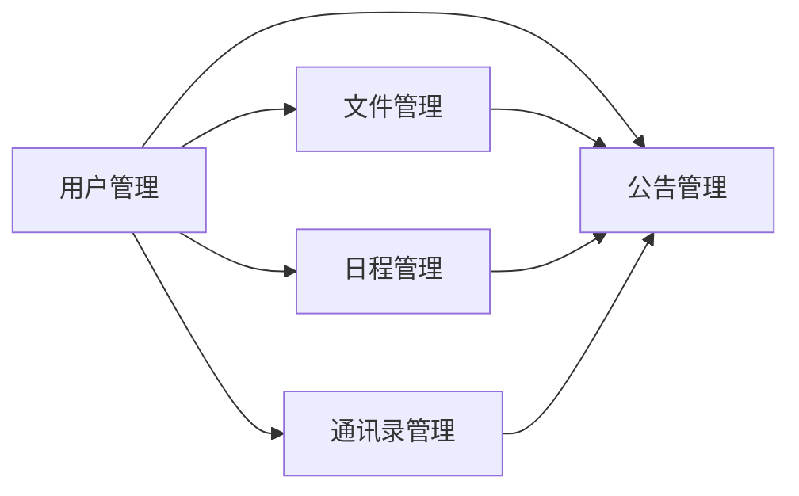

## 1.背景介绍

在互联网高速发展的今天，网络办公系统已经成为企业日常运营不可或缺的一部分。它的出现极大地提高了企业的办公效率，降低了办公成本，同时也为企业的信息化建设提供了强有力的支持。本文将详细介绍网络办公系统的设计与具体代码实现。

## 2.核心概念与联系

网络办公系统主要由用户管理模块、文件管理模块、日程管理模块、通讯录管理模块、公告管理模块等几个核心模块组成。各个模块之间的联系紧密，共同构成了一个完整的网络办公系统。



## 3.核心算法原理具体操作步骤

网络办公系统的设计与实现主要采用了MVC（Model-View-Controller）设计模式。MVC模式将系统分为三个部分：模型（Model），视图（View）和控制器（Controller）。在这个设计模式中，模型负责处理数据和业务逻辑，视图负责展示数据，控制器负责接收用户的输入并调用模型和视图完成用户的请求。

## 4.数学模型和公式详细讲解举例说明

在网络办公系统中，我们经常需要处理一些复杂的数据关系。例如，我们需要计算某个文件的访问权限，这就需要我们使用一些数学模型和公式。这里，我们以访问权限的计算为例，进行详细的讲解。

假设我们有一个文件$f$，用户$u$请求访问这个文件。我们需要判断用户$u$是否有权限访问文件$f$。我们可以使用以下公式来进行计算：

$$
P(u, f) = \begin{cases} 
1, & \text{if } u \in A(f) \\
0, & \text{otherwise }
\end{cases}
$$

其中，$P(u, f)$表示用户$u$是否有权限访问文件$f$，$A(f)$表示有权限访问文件$f$的用户集合。如果用户$u$在$A(f)$中，那么$P(u, f) = 1$，表示用户$u$有权限访问文件$f$；否则，$P(u, f) = 0$，表示用户$u$没有权限访问文件$f$。

## 5.项目实践：代码实例和详细解释说明

在这个部分，我们将详细介绍网络办公系统的具体代码实现。由于篇幅限制，这里只展示了用户管理模块的部分代码。

```java
public class UserController {
    private UserService userService;

    public UserController(UserService userService) {
        this.userService = userService;
    }

    public void addUser(User user) {
        userService.addUser(user);
    }

    public void deleteUser(User user) {
        userService.deleteUser(user);
    }

    public void updateUser(User user) {
        userService.updateUser(user);
    }

    public User getUser(String userId) {
        return userService.getUser(userId);
    }
}
```

这段代码是用户管理模块的控制器部分，主要负责接收和处理用户的请求。控制器中有一个`UserService`对象，这个对象是模型部分，负责处理数据和业务逻辑。控制器中的每一个方法都对应一个用户的请求，例如`addUser`方法对应添加用户的请求，`deleteUser`方法对应删除用户的请求，等等。

## 6.实际应用场景

网络办公系统广泛应用于各种企业和组织。例如，一家大型企业可以使用网络办公系统来管理员工的日常工作，包括任务分配、文件共享、日程安排等。一个小型团队也可以使用网络办公系统来提高工作效率，例如，通过网络办公系统的文件管理模块，团队成员可以方便地共享和查找文件。

## 7.工具和资源推荐

在设计和实现网络办公系统时，我们可以使用一些工具和资源来提高我们的工作效率。例如，我们可以使用IDE（如Eclipse或IntelliJ IDEA）来编写和调试代码，使用Git进行版本控制，使用Maven进行项目管理，使用MySQL作为数据库，使用Tomcat作为服务器，等等。

## 8.总结：未来发展趋势与挑战

随着互联网的发展，网络办公系统的功能也会越来越强大，应用领域也会越来越广泛。但同时，网络办公系统也面临着一些挑战，例如，如何保证系统的安全性，如何提高系统的性能，如何满足用户的个性化需求，等等。这些都是我们在未来需要继续研究和探索的问题。

## 9.附录：常见问题与解答

1. 问：网络办公系统的主要功能是什么？
答：网络办公系统的主要功能包括用户管理、文件管理、日程管理、通讯录管理、公告管理等。

2. 问：如何判断用户是否有权限访问某个文件？
答：我们可以使用一个数学公式来判断用户是否有权限访问某个文件。具体的公式和计算方法请参见本文的“数学模型和公式详细讲解举例说明”部分。

3. 问：我可以使用什么工具来开发网络办公系统？
答：你可以使用IDE（如Eclipse或IntelliJ IDEA）来编写和调试代码，使用Git进行版本控制，使用Maven进行项目管理，使用MySQL作为数据库，使用Tomcat作为服务器，等等。

作者：禅与计算机程序设计艺术 / Zen and the Art of Computer Programming