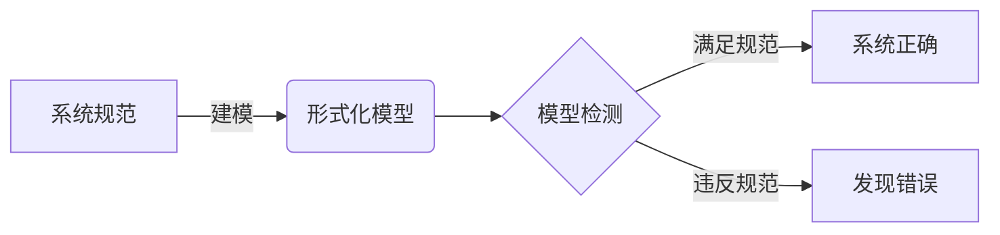
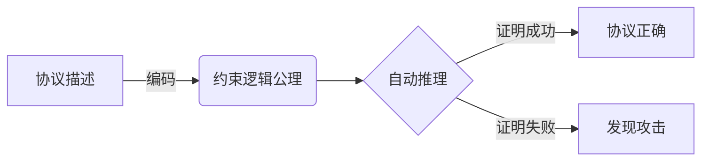
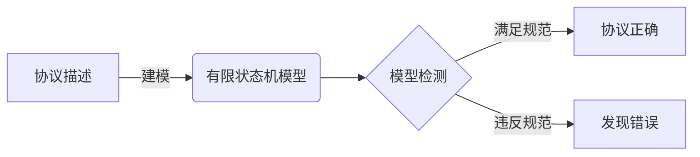
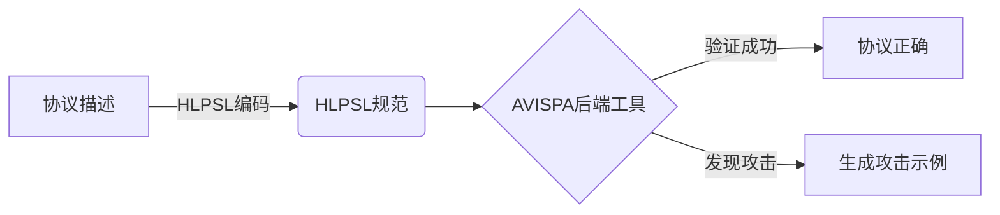
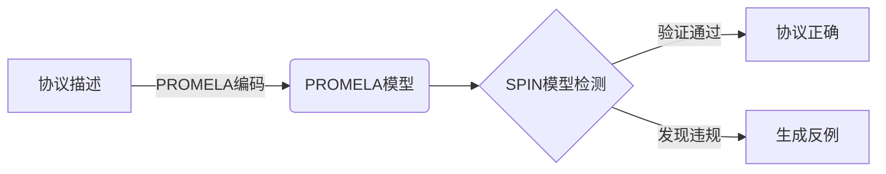

# 网络安全协议的形式化自动验证优化研究

## 1. 背景介绍

### 1.1 网络安全的重要性

在当今互联网时代，网络安全已经成为一个关乎国家安全、社会稳定和个人隐私的重大问题。随着网络技术的不断发展和应用领域的扩展,网络攻击手段也日益复杂和多样化,给网络安全带来了巨大挑战。因此,确保网络通信的安全性和可靠性就显得尤为重要。

### 1.2 网络安全协议的作用

网络安全协议是保障网络通信安全的关键。它们定义了通信双方在建立连接、交换数据和结束会话时应遵循的规则和约定,包括身份认证、数据加密、完整性校验等机制,从而防止窃听、篡改、伪造和重放等攻击。常见的网络安全协议有SSL/TLS、IPSec、SSH等。

### 1.3 形式化验证的必要性

由于网络安全协议的复杂性和安全要求的严格性,手工验证协议设计的正确性和安全性存在诸多困难和局限性。因此,需要借助形式化方法对协议进行严格的数学建模和自动化验证,从而发现潜在的设计缺陷和安全漏洞。

## 2. 核心概念与联系

### 2.1 形式化方法

形式化方法是一种基于数学逻辑和形式语义的系统分析和验证技术。它将系统建模为一个形式化的数学结构,并使用定理证明、模型检测等方法对系统进行严格的分析和验证。

### 2.2 模型检测

模型检测是形式化验证的一种重要技术,它通过构建有限状态模型来描述系统的行为,并对模型进行自动化的状态空间搜索,以检测是否存在违反设计规范的行为。



### 2.3 网络安全协议的形式化建模

网络安全协议的形式化建模是将协议的通信过程、加密算法、认证机制等转化为形式化的数学模型,通常采用过程代数、状态转移系统或逻辑公理等表示方法。

## 3. 核心算法原理具体操作步骤

### 3.1 Dolev-Yao攻击模型

Dolev-Yao攻击模型是网络安全协议形式化验证中常用的威胁模型,它假设攻击者能够完全控制网络,可以监听、阻塞、伪造和重放任何消息。

$$
\begin{aligned}
\mathcal{K} &= \{ K_A, K_B, \ldots \} & \text{初始已知密钥集合} \\
\mathcal{M} &= \{ M_1, M_2, \ldots \} & \text{截获的消息集合} \\
\mathcal{S} &= \mathcal{K} \cup \mathcal{M} & \text{攻击者已知信息集合}
\end{aligned}
$$

攻击者可以执行以下操作:

- 合成: $\forall x, y \in \mathcal{S}$, 攻击者可以构造 $\langle x, y \rangle \in \mathcal{S}$
- 分解: $\forall \langle x, y \rangle \in \mathcal{S}$, 攻击者可以得到 $x \in \mathcal{S}$ 和 $y \in \mathcal{S$
- 加密: $\forall K \in \mathcal{K}, x \in \mathcal{S}$, 攻击者可以计算 $\{x\}_{K} \in \mathcal{S}$
- 解密: $\forall K^{-1} \in \mathcal{K}, \{x\}_{K} \in \mathcal{S}$, 攻击者可以得到 $x \in \mathcal{S}$

### 3.2 约束逻辑编码

约束逻辑是一种用于形式化建模和推理的逻辑系统,它将第一阶逻辑与等式理论相结合,可以有效地描述并推理网络安全协议中的消息传递和加密操作。



约束逻辑编码的核心步骤包括:

1. 定义消息代数和加密函数
2. 建立协议规则和安全目标的公理
3. 使用约束解算器进行自动推理和验证

### 3.3 有限状态模型检测

有限状态模型检测是将协议建模为一个有限状态机,并使用模型检测工具(如SPIN、UPPAAL等)对其进行自动化的状态空间搜索和验证。



有限状态模型检测的主要步骤包括:

1. 将协议建模为有限状态机
2. 形式化安全属性
3. 使用模型检测工具进行状态空间搜索
4. 分析反例并修复协议

## 4. 数学模型和公式详细讲解举例说明

### 4.1 BAN逻辑

BAN逻辑是一种用于推理认证协议的形式逻辑系统,它定义了一组推理规则和公理,用于分析协议参与者对于密钥和消息的信任关系。

BAN逻辑的核心概念包括:

- $P \overset{K}{\leftrightarrow} Q$: $P$ 和 $Q$ 共享密钥 $K$
- $P \,\underline{\hspace{2pt}\smash{\overset{\scriptscriptstyle\rightharpoonup}{K}}\hspace{2pt}\,} Q$: $P$ 认为 $K$ 是新鲜的
- $P \mid\equiv X$: $P$ 相信陈述 $X$
- $P \,\underline{\hspace{2pt}\smash{\overset{\scriptscriptstyle\rightharpoonup}{\#}}\hspace{2pt}\,}\,(X)$: $X$ 是新鲜的
- $\#(X)$: $X$ 是新鲜的

BAN逻辑的推理规则示例:

$$
\frac{P \mid\equiv Q \overset{K}{\leftrightarrow} R, P \,\underline{\hspace{2pt}\smash{\overset{\scriptscriptstyle\rightharpoonup}{K}}\hspace{2pt}\,} Q, P \langle X \rangle_K}{P \mid\equiv Q \,\underline{\hspace{2pt}\smash{\overset{\scriptscriptstyle\rightharpoonup}{\#}}\hspace{2pt}\,}\,(X)}
$$

该规则表示,如果 $P$ 相信 $Q$ 和 $R$ 共享密钥 $K$,并且 $P$ 认为 $K$ 对于 $Q$ 是新鲜的,那么当 $P$ 接收到加密消息 $\langle X \rangle_K$ 时,就可以推断出 $X$ 对于 $Q$ 是新鲜的。

### 4.2 strand空间

strand空间是一种用于描述并行系统行为的数学模型,它将系统中的每个参与者建模为一个strand(线束),每个strand由一系列事件(发送或接收消息)组成。strand空间可以用于对网络安全协议进行形式化建模和分析。

$$
\begin{aligned}
\text{strand} &= \langle \pm m_1, \pm m_2, \ldots, \pm m_n \rangle \\
\text{strand空间} &= \{ \text{strand}_1, \text{strand}_2, \ldots, \text{strand}_k \}
\end{aligned}
$$

其中,正号 $+$ 表示发送事件,负号 $-$ 表示接收事件。strand空间描述了所有可能的交互行为。

例如,一个简单的认证协议可以用以下strand空间表示:

$$
\begin{aligned}
\text{初始化者} &= \langle +m_1, -m_2 \rangle \\
\text{响应者} &= \langle -m_1, +m_2 \rangle \\
\text{strand空间} &= \{ \langle +m_1, -m_2 \rangle, \langle -m_1, +m_2 \rangle \}
\end{aligned}
$$

strand空间模型可以用于分析协议的正确性和安全性,例如检测是否存在不期望的交互行为或者密钥泄露等问题。

## 5. 项目实践:代码实例和详细解释说明

### 5.1 使用AVISPA工具套件进行自动化验证

AVISPA(Automated Validation of Internet Security Protocols and Applications)是一个集成了多种形式化验证工具的工具套件,可以用于自动化验证网络安全协议。



AVISPA的使用步骤:

1. 使用高级协议规范语言HLPSL对协议进行形式化建模
2. 调用AVISPA后端工具(OFMC、CL-AtSe等)进行自动化验证
3. 分析验证结果和生成的攻击示例(如果存在)

以SSL握手协议为例,我们可以使用HLPSL对其进行建模:

```hlpsl
role client(...)
played_by C
...
send_1(C, S, ...) /* 发送ClientHello */
recv_2(S, C, ...) /* 接收ServerHello */
...
end role

role server(...)
played_by S
...
recv_1(C, S, ...) /* 接收ClientHello */
send_2(S, C, ...) /* 发送ServerHello */
...
end role
```

然后使用AVISPA后端工具进行自动化验证,例如:

```
ofmc.exe ssl.hlpsl
```

如果验证通过,则表明协议设计是正确的;否则,AVISPA会生成一个攻击示例,用于分析和修复协议。

### 5.2 使用SPIN模型检测工具进行状态空间搜索

SPIN是一款著名的显式状态模型检测工具,可以用于验证并发系统和网络协议。我们可以使用PROMELA语言对协议进行建模,并使用SPIN进行状态空间搜索和验证。



以Needham-Schroeder公钥认证协议为例,我们可以使用PROMELA对其进行建模:

```promela
mtype = { ... }

chan clientServer = [0] of { mtype };
chan serverClient = [0] of { mtype };
...

proctype Client(...)
{
    clientServer!clientHello(...);
    serverClient?serverHello(...);
    ...
}

proctype Server(...)
{
    clientServer?clientHello(...);
    serverClient!serverHello(...);
    ...
}
```

然后使用SPIN进行模型检测和验证:

```
spin -a ns.pml
gcc -o pan pan.c
./pan -m10000
```

如果验证通过,则表明协议设计是正确的;否则,SPIN会生成一个反例执行序列,用于分析和修复协议。

## 6. 实际应用场景

网络安全协议的形式化自动验证技术在以下领域有着广泛的应用:

### 6.1 安全协议设计和验证

在设计新的网络安全协议时,可以使用形式化建模和自动验证技术来确保协议的正确性和安全性,避免潜在的设计缺陷和漏洞。

### 6.2 现有协议分析和修复

对于已经广泛使用的协议(如SSL/TLS、IPSec等),可以使用形式化验证技术对其进行深入分析,发现潜在的安全漏洞,并提出修复方案。

### 6.3 标准和规范制定

在制定网络安全协议的标准和规范时,可以使用形式化方法对协议进行严格的数学建模和验证,确保标准的一致性和完整性。

### 6.4 安全产品测试和评估

网络安全产品(如防火墙、VPN等)通常需要实现各种安全协议。形式化验证技术可以用于测试和评估这些产品的协议实现是否符合标准规范